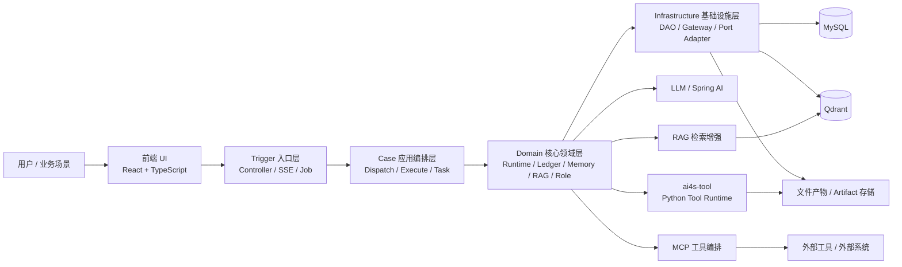
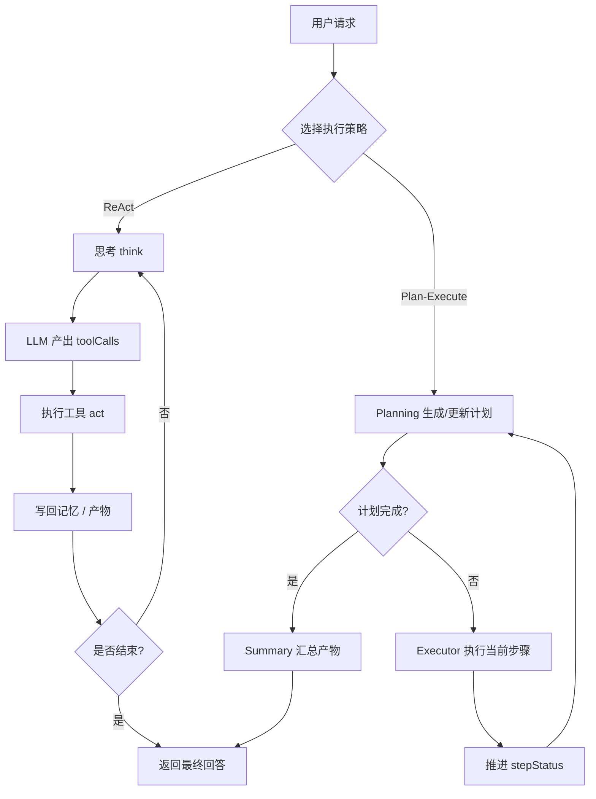
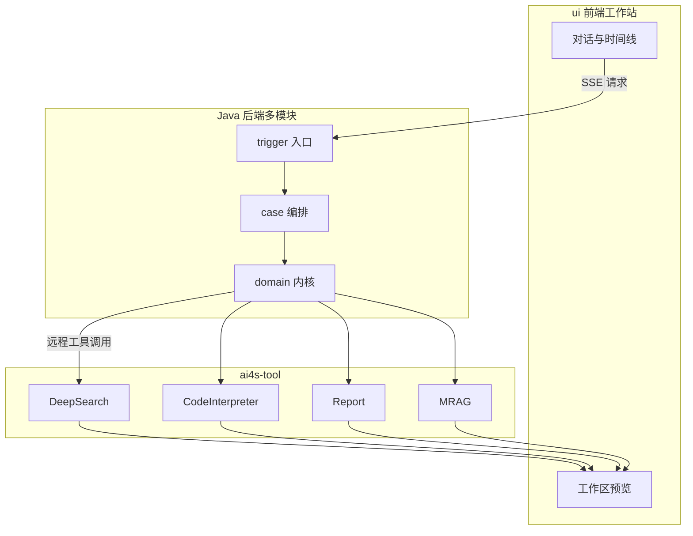

本文是 **AI4S-agent** 文档的入口页。它帮助初学者在动手配置与写代码之前，先建立整体心智模型：这个平台解决什么问题、由哪些部分组成、核心能力在哪里，以及接下来该按什么顺序阅读。

## 平台是什么

**AI4S-agent** 是一个面向复杂任务自动化与 AI 应用工程化落地的 **多智能体协作应用平台**。它不是“单轮对话 + 几次工具调用”的演示 Demo，而是把任务拆解、多 Agent 协作、工具编排、检索增强、会话记忆、执行事实持久化与历史回放串成一条可运行、可追踪、可复用的完整链路。

Sources: [README.md](README.md#L1-L6)

传统对话系统擅长回答问题，但在需要多步拆解、中间产物复用、跨工具协作的任务上往往力不从心。AI4S-agent 的目标，是把这类任务变成可编排、可观察、可扩展的工程系统，而不是一次性 Prompt 临场发挥。

Sources: [README.md](README.md#L3-L6)

## 解决哪些痛点

平台从工程视角直接回应复杂 Agent 场景中的常见短板：

| 痛点 | 平台侧应对思路 |
|------|----------------|
| 单 Agent / 单轮对话难以承接复杂任务 | 任务拆解、多角色协作、结果汇总 |
| 工具调用结果难沉淀、难复用 | 会话工作区 + 产物登记，跨工具传递 |
| 多步骤流程依赖 Prompt 临场发挥 | SOP 语义召回 + Plan-Execute / 混合模式 |
| 会话彼此隔离，经验无法沉淀 | 跨会话经验复用、SOP 自定义 |
| 执行过程难审计、难回放 | 执行账本 + 历史回放 |
| 扩展新能力需要改主工程代码 | 远程子智能体 / MCP / Skill 挂载 |

Sources: [README.md](README.md#L9-L16)

## 目标用户

本项目主要面向三类读者：希望构建 Multi-Agent 平台或复杂工作流的后端工程师；需要把检索、分析、报告、脚本执行串成闭环的业务技术团队；以及希望系统学习 Multi-Agent 协作思路的学生与研究者。

Sources: [README.md](README.md#L18-L22)

前端产品定位上，AI4S 更像“AI Agent 工作站”：面向技术团队、产品经理和研究人员，支持深度研究、数据分析、竞品调研与内容生成，而不是单纯的聊天框克隆。

Sources: [PRODUCT.md](ui/PRODUCT.md#L7-L15)

## 仓库长什么样

仓库采用 **Java 后端多模块 + Python 工具运行时 + React 前端** 的三段式结构。Maven 聚合工程声明了 7 个后端模块，外加独立的 `ai4s-tool`、`ui` 与运行时技能目录。

Sources: [pom.xml](pom.xml#L11-L19)

```text
AI4S-agent/
├── AI4S-agent-api/              # API 契约（DTO / 服务接口）
├── AI4S-agent-types/            # 公共类型、异常、配置常量
├── AI4S-agent-trigger/          # HTTP / SSE / Job 入口适配
├── AI4S-agent-case/             # 应用编排：调度、执行策略、任务
├── AI4S-agent-domain/           # 领域核心：Runtime / Ledger / Memory / RAG
├── AI4S-agent-infrastructure/   # DAO、网关、远端适配、持久化
├── AI4S-agent-app/              # Spring Boot 启动与装配
├── ai4s-tool/                   # Python 工具运行时（DeepSearch / CI / MRAG / Report…）
├── ui/                             # React 前端工作站
├── runtime/skills/                 # 技能脚本与能力扩展
└── assets/                         # 品牌与演示资源
```

Sources: [README.md](README.md#L396-L520)

分层职责可以记成一句话：**trigger 接流量，case 做编排，domain 管语义，infrastructure 管落地，app 负责启动装配**。

Sources: [README.md](README.md#L523-L528)

## 系统架构总览

从用户发起对话到产物落盘，整体数据流如下。前端通过 SSE 与后端保持长连接；后端按策略选择 ReAct / Plan-Execute / Workflow；领域层驱动 LLM、工具、记忆与账本；Python 侧 `ai4s-tool` 承担深度搜索、代码解释、报告生成、混合检索等高成本能力。

Sources: [README.md](README.md#L216-L236)



Sources: [README.md](README.md#L218-L236)

请求进入后，应用层会根据 `agentType` 选择执行策略：Workflow、Plan-Solve 或 ReAct；未指定时默认走 ReAct。

Sources: [AgentDispatchService.java](AI4S-agent-case/src/main/java/org/wwz/ai/application/agent/dispatch/AgentDispatchService.java#L25-L48)

平台内置的智能体类型包括综合、工作流、Plan-Solve、路由与 ReAct，用于覆盖不同复杂度的任务形态。

Sources: [AgentType.java](AI4S-agent-domain/src/main/java/org/wwz/ai/domain/agent/runtime/enums/AgentType.java#L6-L11)

## 核心能力速览

对初学者来说，不必一次读完所有实现细节，先记住下面六组“产品级能力”即可：

| 能力 | 一句话理解 | 典型价值 |
|------|------------|----------|
| **混合执行模式** | Plan-Execute + ReAct，并支持动态 replan | 复杂任务可拆解、可容错 |
| **多工具并发** | 同一轮多个 tool call 可并发调度 | 提升吞吐，状态统一回写 |
| **远程子智能体** | 子能力以 HTTP/SSE 独立部署挂载 | 横向扩展、故障隔离、跨语言接入 |
| **会话工作区** | 搜索/分析/报告等产物统一登记 | 跨工具复用，链路不断裂 |
| **MRAG 混合检索** | 语义 + BM25 + 跨模态 + Rerank | 图文知识库问答更稳 |
| **执行账本回放** | 记录 LLM/工具/产物关键节点 | 可审计、可定位、可演示 |

Sources: [README.md](README.md#L239-L329)

### 执行内核：两种主模式

**ReAct** 强调“思考 → 选工具 → 观察 → 再思考”的循环，适合探索性强、路径不固定的任务。领域层 `ReactImplAgent` 在 `think()` 中调用 LLM 生成 `toolCalls`，在 `act()` 中执行工具并写回记忆。

Sources: [ReactImplAgent.java](AI4S-agent-domain/src/main/java/org/wwz/ai/domain/agent/runtime/agent/ReactImplAgent.java#L102-L199)

**Plan-Execute** 则先生成/更新计划，再按步骤交给执行 Agent，最后由 Summary 收口，适合步骤清晰、需要过程约束的长任务。

Sources: [README.md](README.md#L363-L392)



Sources: [README.md](README.md#L334-L392)

### 工具与扩展生态

Python 运行时 `ai4s-tool` 承载了 DeepSearch、CodeInterpreter、Report、WebFetch、MRAG、SOP、文档读写等能力，Java 编排中枢通过远程协议调度它们，而不是把所有逻辑塞进单体进程。

Sources: [README.md](ai4s-tool/README.md#L1-L18)

工具目录中可直接看到核心能力入口，例如 `deepsearch.py`、`code_interpreter.py`、`report.py`、`web_fetcher.py`、`mrag/`、`plan_sop.py` 等。

Sources: [deepsearch.py](ai4s-tool/ai4s_tool/tool/deepsearch.py)

此外还有 **MCP**（SSE / STDIO / Streamable HTTP）、**Skill 技能库**、**数字员工角色** 等扩展面，用来把“外部生态能力”与“业务人设”接到统一运行时中。

Sources: [README.md](README.md#L239-L277)

## 技术栈一览

| 层级 | 技术选型 |
|------|----------|
| 后端运行时 | Java 17、Spring Boot 3.4.x、Spring AI 1.1.x、MyBatis / MyBatis-Plus |
| 数据与检索 | MySQL、Qdrant；语义 + BM25 + 跨模态混合召回、Rerank、多轮检索 |
| 工具运行时 | Python ≥ 3.11、FastAPI 风格服务（`ai4s-tool`） |
| 前端工作站 | React 19、TypeScript、Vite 6、Ant Design 5 |
| 通信形态 | HTTP + SSE 流式对话 |

Sources: [README.md](README.md#L209-L214)

Sources: [pom.xml](pom.xml#L35-L60)

Sources: [package.json](ui/package.json#L1-L50)

Sources: [README.md](ai4s-tool/README.md#L1-L4)

Spring Boot 启动入口位于 `AI4S-agent-app` 模块，负责装配整个后端运行时。

Sources: [Application.java](AI4S-agent-app/src/main/java/org/wwz/ai/Application.java#L8-L15)

## 典型应用场景

平台已经覆盖研究决策、数据分析、内容生产、知识问答与流程自动化等方向。下表帮助你把“场景”映射到“能力组合”：

| 场景类型 | 示例 | 常用能力组合 |
|----------|------|--------------|
| 研究与决策 | 技术选型报告、竞品分析、行业研究 | DeepSearch + Plan-Execute + Report / SOP |
| 数据分析 | 运营周报、财报解读、销售可视化 | CodeInterpreter + Report + Chart Skill / MRAG |
| 内容生产 | 海报、PPT、技术博客、前端页面 | Search + Image/PPT Skill + MCP 发布 |
| 知识问答 | 企业知识库、手册法规、文献综述 | MRAG 混合检索 + Rerank + 多轮检索 |
| 流程自动化 | GitHub 项目评估、代码审查辅助 | Deep Research / CodeInterpreter + Report |

Sources: [README.md](README.md#L24-L63)

仓库 `assets/readme/` 中提供了主界面、ReAct 链路、Plan-Execute 模式以及多类产物截图，适合在本地阅读时对照理解“用户侧看到什么”。

Sources: [主界面.png](assets/readme/主界面.png)

## 三个子系统如何协作

可以把整个平台理解成三条并行但可组合的“能力管道”：

1. **Java 编排中枢**：会话接入、策略选择、Agent 运行、账本与记忆、工具调度。
2. **Python 工具运行时**：高成本、强生态的工具执行与文件产物生成。
3. **React 工作站**：SSE 流式对话、计划/时间线展示、工作区产物预览。

Sources: [README.md](README.md#L216-L236)



Sources: [README.md](README.md#L396-L520)

对初学者最重要的边界意识是：

- **改交互协议 / 入口** → 优先看 `trigger`
- **改调度与执行策略** → 优先看 `case`
- **改 Agent 内核、记忆、账本** → 优先看 `domain`
- **改搜索/代码/报告/检索实现** → 优先看 `ai4s-tool`
- **改页面与流式渲染** → 优先看 `ui`

Sources: [README.md](README.md#L523-L528)

## 建议阅读路径

按文档目录，推荐初学者采用“先跑通，再理解，后深入”的顺序：

1. **立刻上手**
   - 先读 [快速开始](2-kuai-su-kai-shi)，建立最小可运行路径
   - 再按需阅读环境专题：
     - [技术栈与模块依赖](3-ji-zhu-zhan-yu-mo-kuai-yi-lai)
     - [Java 后端启动与配置](4-java-hou-duan-qi-dong-yu-pei-zhi)
     - [Python 工具运行时启动](5-python-gong-ju-yun-xing-shi-qi-dong)
     - [前端 UI 启动与联调](6-qian-duan-ui-qi-dong-yu-lian-diao)

2. **完成第一次真实体验**
   - [首个复杂任务对话](7-shou-ge-fu-za-ren-wu-dui-hua)
   - [典型场景速览](8-dian-xing-chang-jing-su-lan)

3. **建立架构图景**
   - [分层架构与模块职责](9-fen-ceng-jia-gou-yu-mo-kuai-zhi-ze)
   - [端到端请求流转](10-duan-dao-duan-qing-qiu-liu-zhuan)
   - [子智能体远程挂载设计](11-zi-zhi-neng-ti-yuan-cheng-gua-zai-she-ji)

4. **深入执行内核与工具**
   - 从 [ReAct 执行链路](12-react-zhi-xing-lian-lu) 与 [Plan-Execute 执行链路](13-plan-execute-zhi-xing-lian-lu) 开始
   - 再按兴趣进入工具、记忆检索、前端扩展等 Deep Dive 章节

## 下一步

如果你是第一次接触本仓库，建议现在就进入 [快速开始](2-kuai-su-kai-shi)，先把 Java 后端、Python 工具运行时与前端 UI 三件套拉起来；跑通一次对话后，再回到 [分层架构与模块职责](9-fen-ceng-jia-gou-yu-mo-kuai-zhi-ze) 对照代码理解分层边界。