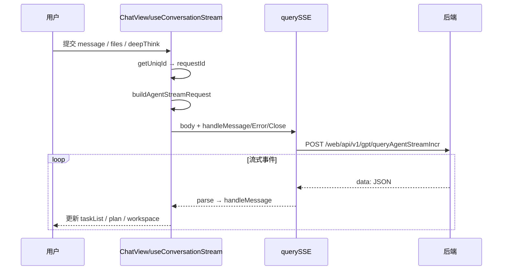
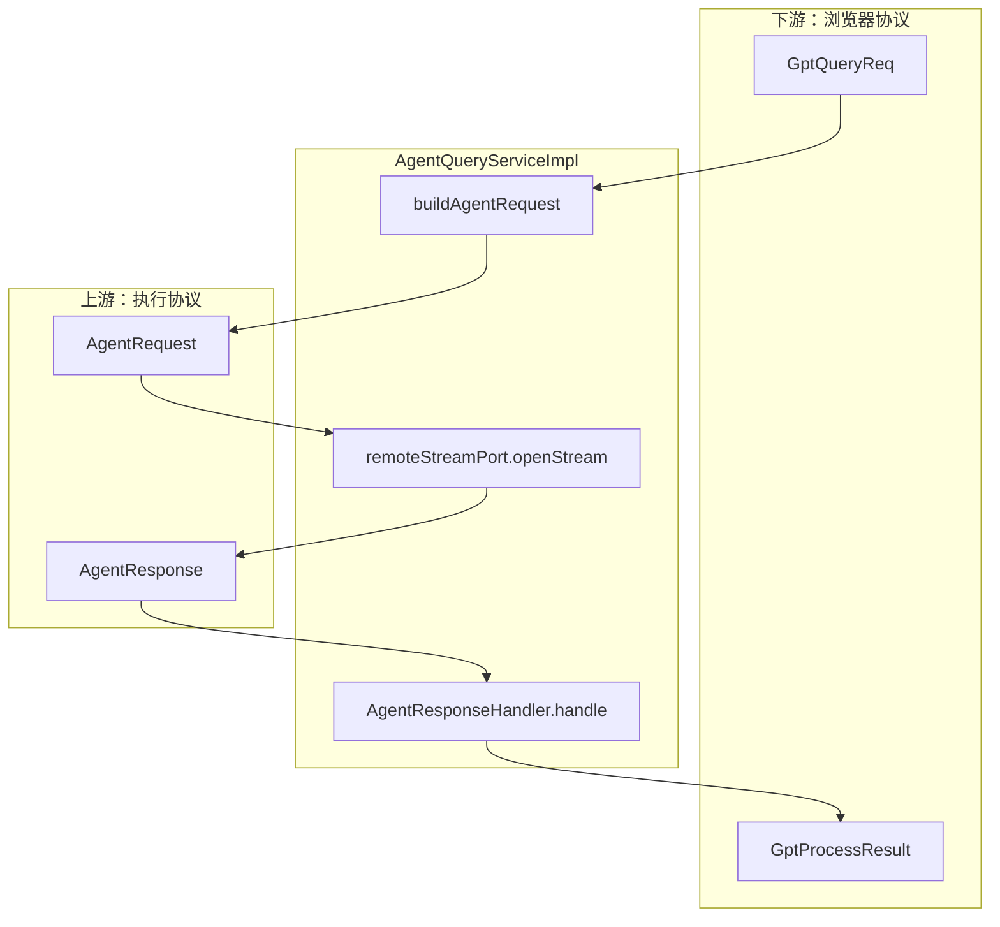
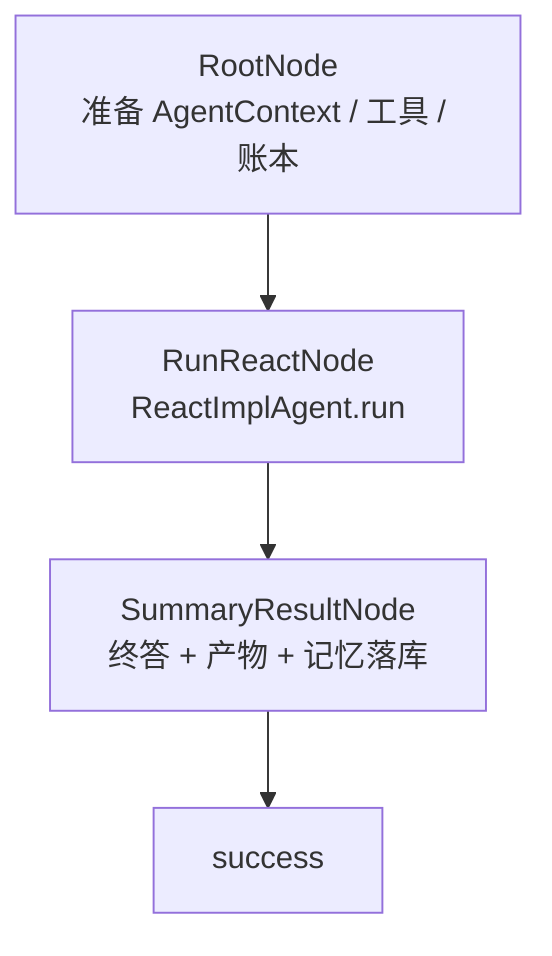
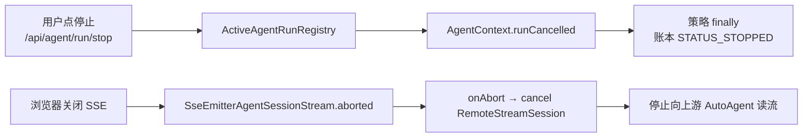
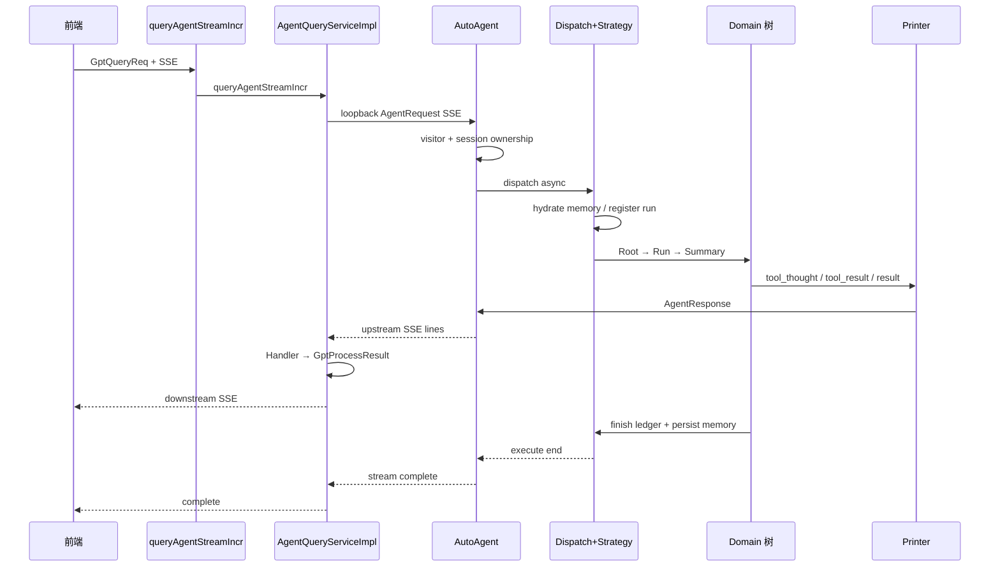

本文聚焦 **一次对话请求从浏览器输入框到 Agent 内核执行、再经 SSE 回流到前端渲染** 的完整路径。范围覆盖入口协议、身份与会话校验、应用层策略调度、领域执行树、流式事件投影，以及停止/断连时的回环取消。更细的分层职责见 [分层架构与模块职责](9-fen-ceng-jia-gou-yu-mo-kuai-zhi-ze)；ReAct / Plan-Execute 内核细节分别见 [ReAct 执行链路](12-react-zhi-xing-lian-lu) 与 [Plan-Execute 执行链路](13-plan-execute-zhi-xing-lian-lu)；SSE 渲染细节见 [SSE 流式对话与结果渲染](27-sse-liu-shi-dui-hua-yu-jie-guo-xuan-ran)。

## 总览：双入口与 loopback 主路径

系统存在两条对外入口，但 **当前前端主聊天统一走增量查询入口**，再在进程内 loopback 到 `AutoAgent` 执行入口。`queryAgentStreamIncr` 负责「前端协议 ↔ 运行时协议」转换与事件投影；`AutoAgent` 负责真正的策略调度与领域内核执行。`AI4SController` 上的同源接口被标注为调试路径，生产前端请求以 `AiAgentController` 为准。

Sources: [querySSE.ts](ui/src/utils/querySSE.ts#L7-L11)、[AiAgentController.java](AI4S-agent-trigger/src/main/java/org/wwz/ai/trigger/http/AiAgentController.java#L85-L180)、[AI4SController.java](AI4S-agent-trigger/src/main/java/org/wwz/ai/trigger/http/ai4s/AI4SController.java#L38-L41)、[AgentQueryServiceImpl.java](AI4S-agent-domain/src/main/java/org/wwz/ai/domain/agent/runtime/AgentQueryServiceImpl.java#L187-L197)

```mermaid
flowchart LR
  UI["前端 ChatView<br/>buildAgentStreamRequest"] --> SSE["POST /web/api/v1/gpt/queryAgentStreamIncr"]
  SSE --> Filter["VisitorIdentityFilter"]
  Filter --> Ctrl["AiAgentController"]
  Ctrl --> AppQ["GptQueryApplicationService"]
  AppQ --> Query["AgentQueryServiceImpl"]
  Query --> Loop["RemoteStreamPort<br/>loopback POST /AutoAgent"]
  Loop --> Auto["AiAgentController.AutoAgent"]
  Auto --> Dispatch["AgentDispatchService"]
  Dispatch --> Strat["IExecuteStrategy<br/>react / planSolve / flow"]
  Strat --> Domain["Domain 执行树<br/>Root → Run → Summary"]
  Domain --> Printer["AgentSessionPrinter"]
  Printer --> UpSSE["上游 AgentResponse SSE"]
  UpSSE --> Handler["AgentResponseHandler"]
  Handler --> DownSSE["下游 GptProcessResult SSE"]
  DownSSE --> UI
```

| 入口 | HTTP 路径 | 请求体 | 职责 |
|---|---|---|---|
| 前端主入口 | `POST /web/api/v1/gpt/queryAgentStreamIncr` | `GptQueryReq` | 访客身份、协议翻译、事件投影、下游 SSE |
| 执行入口 | `POST /AutoAgent` | `AgentRequest` | 会话归属校验、策略调度、内核执行、上游 SSE |
| 停止控制 | `POST /api/agent/run/stop` | `{sessionId?, requestId}` | 取消活跃 run，打断执行与流 |

Sources: [GptQueryReq.java](AI4S-agent-domain/src/main/java/org/wwz/ai/domain/agent/ai4s/model/req/GptQueryReq.java#L15-L31)、[AgentRequest.java](AI4S-agent-domain/src/main/java/org/wwz/ai/domain/agent/ai4s/model/req/AgentRequest.java#L21-L52)、[AgentRunController.java](AI4S-agent-trigger/src/main/java/org/wwz/ai/trigger/http/agent/AgentRunController.java#L19-L48)

## 阶段 1：前端组装请求并发起 SSE

用户在输入区提交后，`useConversationStream` 生成 `sessionId` / `requestId`，调用 `buildAgentStreamRequest` 组装统一载荷：`query`、`deepThink`、`outputStyle`、可选 `sessionFiles` 与 `aiAgentId`。随后 `querySSE` 以 `fetch-event-source` 向默认地址发起 **POST + SSE**，请求头包含 `Accept: text/event-stream`、`X-Device-Id`，并携带 cookie（`credentials: 'include'`）。

Sources: [useConversationStream.ts](ui/src/components/ChatView/useConversationStream.ts#L184-L200)、[agentRequest.ts](ui/src/utils/agentRequest.ts#L54-L80)、[querySSE.ts](ui/src/utils/querySSE.ts#L12-L64)

关键字段约定如下，便于前后端对齐：

| 字段 | 来源 | 含义 |
|---|---|---|
| `sessionId` | 会话上下文 | 多轮复用与工作区隔离键 |
| `requestId` | 前端生成 | 本轮 run 唯一标识，贯穿账本与取消 |
| `query` | 用户输入 | 本轮自然语言任务 |
| `deepThink` | UI 开关 | `0/1`，影响后续 `agentType` 映射 |
| `outputStyle` | 产出模式 | `html` / `docs` / `table` / `chat` 等 |
| `sessionFiles` | 上传附件 | 供工作区物化与工具链消费 |
| `aiAgentId` | 角色选择 | 仅 chat 模式透传固定角色 |

Sources: [agentRequest.ts](ui/src/utils/agentRequest.ts#L14-L80)、[GptQueryReq.java](AI4S-agent-domain/src/main/java/org/wwz/ai/domain/agent/ai4s/model/req/GptQueryReq.java#L15-L31)

## 阶段 2：身份绑定与触发层接入

请求进入后端前，`VisitorIdentityFilter` 对主聊天路径做匿名访客解析：从 cookie 读取 token，必要时创建访客并回写 `Set-Cookie`，再将 `visitorId` 绑定到 `VisitorRequestContext`。过滤器仅覆盖查询流、访客、会话列表与文件相关路径，避免无关接口被强制身份化。

Sources: [VisitorIdentityFilter.java](AI4S-agent-trigger/src/main/java/org/wwz/ai/trigger/http/visitor/VisitorIdentityFilter.java#L34-L61)

`AiAgentController.queryAgentStreamIncr` 创建长超时 `SseEmitter`，注册生命周期回调，然后把 `GptQueryReq` 与 `SseEmitterAgentSessionStream` 交给应用服务。`SseEmitterAgentSessionStream` 是触发层到应用层的 **流端口适配器**：`send/complete/completeWithError` 映射到 SSE，并在客户端断开时标记 `aborted` 且一次性广播 abort handler，供上游取消。

Sources: [AiAgentController.java](AI4S-agent-trigger/src/main/java/org/wwz/ai/trigger/http/AiAgentController.java#L171-L179)、[SseEmitterAgentSessionStream.java](AI4S-agent-trigger/src/main/java/org/wwz/ai/trigger/http/ai4s/support/SseEmitterAgentSessionStream.java#L14-L122)、[GptQueryApplicationService.java](AI4S-agent-case/src/main/java/org/wwz/ai/application/agent/query/GptQueryApplicationService.java#L14-L23)

## 阶段 3：查询服务翻译协议并 loopback 到 AutoAgent

`AgentQueryServiceImpl` 是稳定运行时 seam：补齐 `user/deepThink/traceId`，把 `GptQueryReq` 翻译为 `AgentRequest`，再经 `RemoteStreamPort` 打开到 `http://127.0.0.1:8100/AutoAgent` 的远端 SSE。对上游每一行 `data:` 载荷：

1. 识别 `heartbeat` 并原样向下游保活；
2. 解析 `AgentResponse`；
3. 按 `agentType` 选择 `AgentResponseHandler`（如 `ReactAgentResponseHandler`）；
4. 投影为 `GptProcessResult` 发给浏览器；
5. 若 `finished`，关闭下游流。

当下游浏览器已断开时，会主动 `cancel` 上游 AutoAgent 连接，避免空跑。

Sources: [AgentQueryServiceImpl.java](AI4S-agent-domain/src/main/java/org/wwz/ai/domain/agent/runtime/AgentQueryServiceImpl.java#L47-L197)、[ReactAgentResponseHandler.java](AI4S-agent-domain/src/main/java/org/wwz/ai/domain/agent/runtime/handler/ReactAgentResponseHandler.java#L16-L30)、[AgentQueryService.java](AI4S-agent-domain/src/main/java/org/wwz/ai/domain/agent/runtime/AgentQueryService.java#L7-L19)

## 阶段 4：AutoAgent 入口的会话守卫与异步派发

loopback 到达 `AiAgentController.AutoAgent` 后，流程固定为四步：

1. **解析 visitorId**（优先 `VisitorRequestContext`，否则请求体）；
2. **会话归属校验** `ConversationSessionOwnershipApplicationService.ensureSessionAccessible`；
3. **SSE 生命周期**：创建超长超时 emitter、启动心跳、注册 completion/timeout/error；
4. **线程池派发**：`AgentExecutorSupport.execute(dispatchExecutor, "dispatch", …)` 异步调用 `agentDispatchService.dispatch`，避免阻塞 HTTP 工作线程；池满则抛 `AgentExecutorBusyException`。

`AgentRequest` 在此路径上 **不做 DTO 转换**，直接贯穿应用策略与领域执行树，降低协议漂移。

Sources: [AiAgentController.java](AI4S-agent-trigger/src/main/java/org/wwz/ai/trigger/http/AiAgentController.java#L85-L152)、[AgentRequest.java](AI4S-agent-domain/src/main/java/org/wwz/ai/domain/agent/ai4s/model/req/AgentRequest.java#L21-L52)

## 阶段 5：应用层策略调度

`AgentDispatchService` 根据 `AgentRequest.agentType` 选择执行策略 Bean：

| agentType | 策略 Bean | 说明 |
|---|---|---|
| WORKFLOW | `flowAgentExecuteStrategy` | 工作流/多步节点链 |
| PLAN_SOLVE | `planSolveAgentExecuteStrategy` | Plan-Execute 主路径 |
| REACT | `reactAgentExecuteStrategy` | ReAct 主路径 |
| 缺省/未知 | `reactAgentExecuteStrategy` | 默认回落 ReAct |

策略选择后调用 `IExecuteStrategy.execute(request, stream)`。应用层负责 **记忆注入、输出端口适配、run 注册**；真正的循环逻辑仍在 domain。

Sources: [AgentDispatchService.java](AI4S-agent-case/src/main/java/org/wwz/ai/application/agent/dispatch/AgentDispatchService.java#L25-L49)、[IExecuteStrategy.java](AI4S-agent-case/src/main/java/org/wwz/ai/application/agent/execute/IExecuteStrategy.java#L7-L13)

以 ReAct 为例，`ReactAgentExecuteStrategy` 在进入领域树前：

1. `enrichWorkingMemory`：优先工作记忆投影，冷启动回退 ledger hydrate，并按需压缩；
2. `applyOutputStyle`：把交付格式对应的提示词追加到 `query`；
3. 注册 `ActiveAgentRunRegistry`（begin + bindStream），构造 `AgentSessionPrinter` 作为领域 `Printer`；
4. 调用 `DefaultReactAgentExecuteStrategyFactory.armoryStrategyHandler()` 启动树；
5. finally 中 `end(requestId)`；取消/异常时写入执行账本终态。

Sources: [ReactAgentExecuteStrategy.java](AI4S-agent-case/src/main/java/org/wwz/ai/application/agent/execute/react/ReactAgentExecuteStrategy.java#L51-L131)、[PlanSolveAgentExecuteStrategy.java](AI4S-agent-case/src/main/java/org/wwz/ai/application/agent/execute/planexecute/PlanSolveAgentExecuteStrategy.java#L43-L108)

## 阶段 6：领域执行树（以 ReAct 为例）

领域侧采用 **树形策略节点 + DynamicContext** 同构模式。工厂返回 `RootNode`，节点通过 `router/get` 串联。

**Step1 RootNode**：构建 `AgentContext`（request/session、query、工作区根、工作记忆、recorder 等），物化 `sessionFiles`，hydrate 工作区读状态，初始化执行账本 run，装配 `ToolCollection`，并把 context 写入 `DynamicContext`。

Sources: [RootNode.java](AI4S-agent-domain/src/main/java/org/wwz/ai/domain/agent/service/execute/react/step/RootNode.java#L63-L105)、[DefaultReactAgentExecuteStrategyFactory.java](AI4S-agent-domain/src/main/java/org/wwz/ai/domain/agent/service/execute/react/step/factory/DefaultReactAgentExecuteStrategyFactory.java#L18-L49)

**Step2 RunReactNode**：实例化 `ReactImplAgent`，按需注入 Plan Mode 提示，执行 `executor.run(query)`。终答解析规则严格：**只接受无 tool_calls 的 assistant 纯文本**；不把中间 thought 或 tool observation 当作用户可见终答。

Sources: [RunReactNode.java](AI4S-agent-domain/src/main/java/org/wwz/ai/domain/agent/service/execute/react/step/RunReactNode.java#L39-L78)

**Step3 SummaryResultNode**：解析终答中的产物勾选协议，组装 `taskSummary` + `fileList`，经 `printer.send("result", …)` 发出；标记账本成功；把本轮 working memory delta 持久化。

Sources: [SummaryResultNode.java](AI4S-agent-domain/src/main/java/org/wwz/ai/domain/agent/service/execute/react/step/SummaryResultNode.java#L50-L107)

Plan-Execute 路径在应用层同样注入记忆与 run 注册，但领域树为 SOP 召回准备 + PlanExecute 节点（细节见专页），对外仍通过同一 `Printer → AgentResponse` 协议上行。

Sources: [PlanSolveAgentExecuteStrategy.java](AI4S-agent-case/src/main/java/org/wwz/ai/application/agent/execute/planexecute/PlanSolveAgentExecuteStrategy.java#L43-L55)

## 阶段 7：流式事件协议与回传

领域内核从不直接依赖 SSE。统一出口是 `Printer`；应用层 `AgentSessionPrinter` 把 `(messageType, payload)` 映射为 `AgentResponse`，再 `stream.send(response)`。

常见 `messageType` 与前端语义对应：

| messageType | 主要字段 | 前端用途 |
|---|---|---|
| `tool_thought` | `toolThought` | 思考过程 |
| `plan` / `plan_thought` | `plan` / `planThought` | 计划视图 |
| `tool_result` / `tool_call` | `toolResult` / `resultMap` | 工具时间线 |
| `deep_search` / `data_analysis` / `file` / `html` … | `resultMap` | 工作区面板 |
| `ask_user_question` / `plan_approval` | `resultMap` | 人机协同卡片 |
| `result` | `result` + `resultMap.taskSummary/fileList` | 终答与交付物，`finish=true` |

Sources: [AgentSessionPrinter.java](AI4S-agent-case/src/main/java/org/wwz/ai/application/agent/stream/AgentSessionPrinter.java#L37-L155)

上游 `AgentResponse` 经 `AgentQueryServiceImpl` 的 handler 投影为下游 `GptProcessResult` 后，前端 `querySSE` 解析 JSON，`useConversationStream` 用节流更新 taskList、plan、action panel 与 run presence。停止按钮走 `agentRunApi.stop` → `/api/agent/run/stop`，与 `ActiveAgentRunRegistry` 联动打断本轮。

Sources: [querySSE.ts](ui/src/utils/querySSE.ts#L45-L63)、[agentRun.ts](ui/src/services/agentRun.ts#L1-L8)、[AgentRunController.java](AI4S-agent-trigger/src/main/java/org/wwz/ai/trigger/http/agent/AgentRunController.java#L26-L41)

## 阶段 8：取消、断连与资源回收闭环

端到端具备三层取消语义，保证「浏览器走了，上游不再空转」：

1. **主动停止**：前端 stop API → 应用服务标记活跃 run；策略检测到 `isRunCancelled` 后写 `STATUS_STOPPED`。
2. **被动断连**：SSE completion/timeout/error（非本地 complete）触发 `markAborted`，通知 abort handlers。
3. **上游回收**：`AgentQueryServiceImpl` 在 abort 时取消 loopback 的 `RemoteStreamSession`；AutoAgent 侧 emitter 生命周期结束时停止心跳。

Sources: [SseEmitterAgentSessionStream.java](AI4S-agent-trigger/src/main/java/org/wwz/ai/trigger/http/ai4s/support/SseEmitterAgentSessionStream.java#L82-L122)、[AgentQueryServiceImpl.java](AI4S-agent-domain/src/main/java/org/wwz/ai/domain/agent/runtime/AgentQueryServiceImpl.java#L170-L185)、[ReactAgentExecuteStrategy.java](AI4S-agent-case/src/main/java/org/wwz/ai/application/agent/execute/react/ReactAgentExecuteStrategy.java#L67-L102)

## 关键对象在流转中的角色

| 对象 | 所在层 | 在流转中的作用 |
|---|---|---|
| `GptQueryReq` | 前端协议 | 浏览器可见的精简查询载荷 |
| `AgentRequest` | 运行时统一请求 | 贯穿 AutoAgent、策略、领域树 |
| `AgentContext` | 领域执行态 | 工具、记忆、账本、工作区、取消态的载体 |
| `AgentSessionStream` | 应用流端口 | 隔离 HTTP/SSE 细节 |
| `Printer` / `AgentSessionPrinter` | 领域→应用 | 把内部事件编码为 `AgentResponse` |
| `AgentResponse` | 上游事件 | 执行过程的标准事件信封 |
| `GptProcessResult` | 下游事件 | 面向前端增量渲染的投影结果 |
| `ActiveAgentRunRegistry` | 运行时控制面 | requestId ↔ context/stream 绑定与停止 |

Sources: [AgentRequest.java](AI4S-agent-domain/src/main/java/org/wwz/ai/domain/agent/ai4s/model/req/AgentRequest.java#L17-L52)、[AgentSessionPrinter.java](AI4S-agent-case/src/main/java/org/wwz/ai/application/agent/stream/AgentSessionPrinter.java#L18-L34)、[RootNode.java](AI4S-agent-domain/src/main/java/org/wwz/ai/domain/agent/service/execute/react/step/RootNode.java#L69-L101)

## 一次成功请求的时序浓缩

## 阅读导航

- 若要理解模块边界与依赖方向：继续 [分层架构与模块职责](9-fen-ceng-jia-gou-yu-mo-kuai-zhi-ze)
- 若要深入 ReAct 思考-行动循环：进入 [ReAct 执行链路](12-react-zhi-xing-lian-lu)
- 若要深入计划拆解与执行：进入 [Plan-Execute 执行链路](13-plan-execute-zhi-xing-lian-lu)
- 若要看工具并发与产物登记：进入 [多工具并发调度](15-duo-gong-ju-bing-fa-diao-du) 与 [工具集合与产物登记](16-gong-ju-ji-he-yu-chan-wu-deng-ji)
- 若要看前端如何消费事件流：进入 [SSE 流式对话与结果渲染](27-sse-liu-shi-dui-hua-yu-jie-guo-xuan-ran)
- 若要看执行可观测与回放：进入 [执行账本与历史回放](26-zhi-xing-zhang-ben-yu-li-shi-hui-fang)