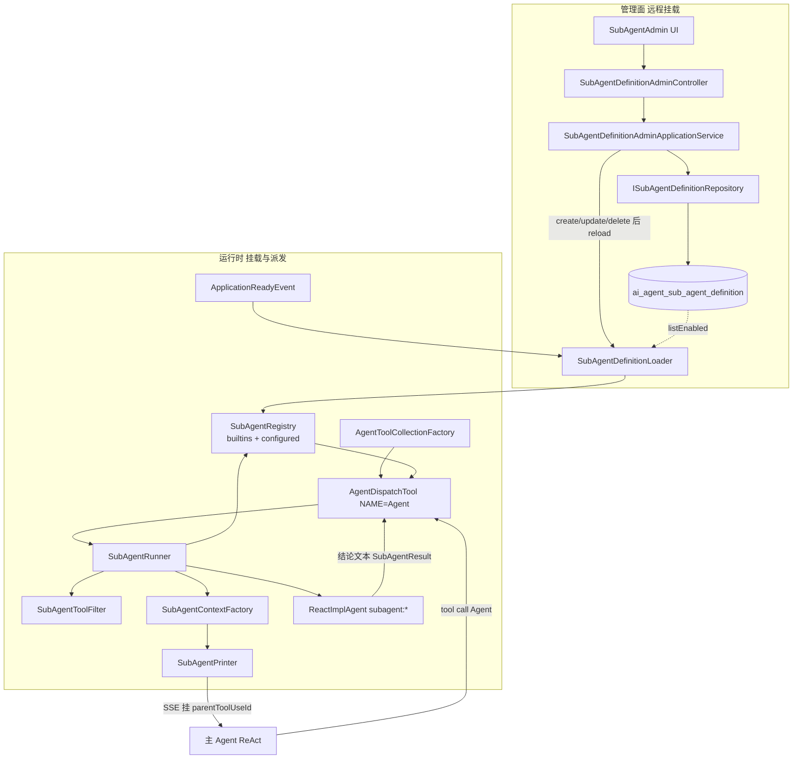
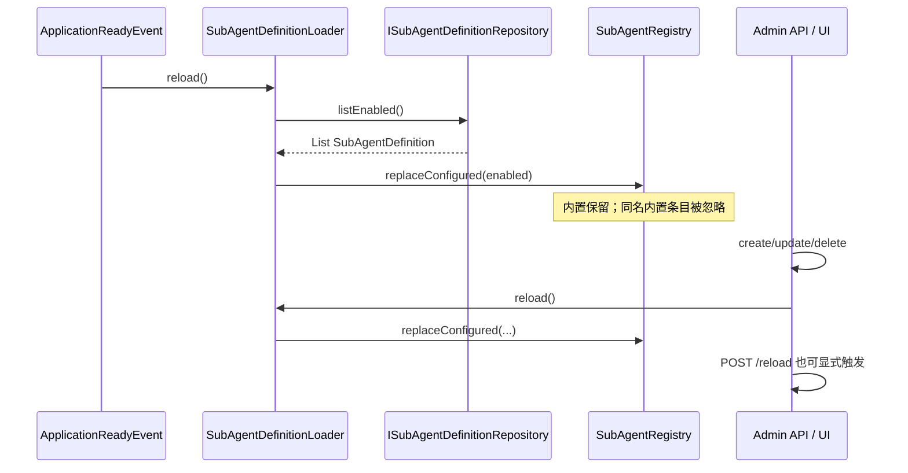
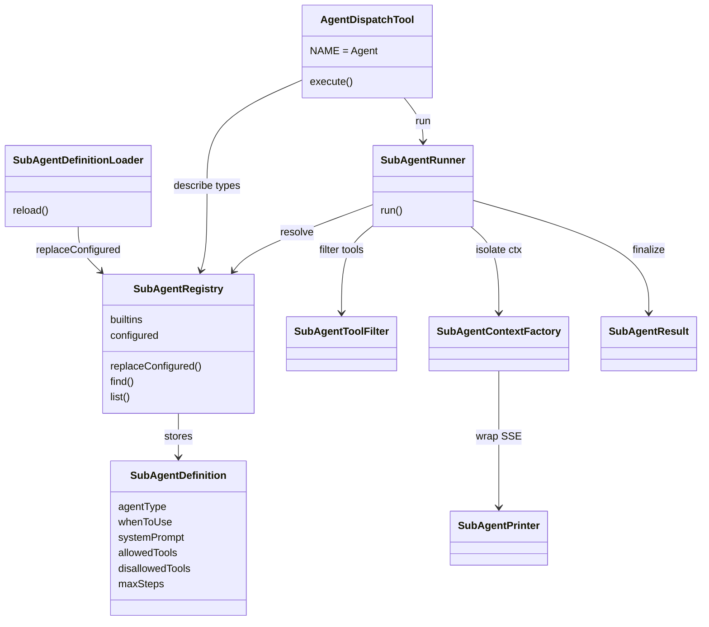

本页解释 AI4S-agent 如何把**可配置子智能体**从外部配置源（数据库）**热挂载**进运行时，并通过主 Agent 的 `Agent` 工具同步派发执行。重点覆盖：定义模型、双层注册表、工具三层过滤、上下文隔离、同步执行与结果回传、管理端 CRUD + reload 链路，以及 SSE 嵌套展示约定。执行内核细节见 [ReAct 执行链路](12-react-zhi-xing-lian-lu)；自定义接入实践见 [自定义工具与子智能体接入](29-zi-ding-yi-gong-ju-yu-zi-zhi-neng-ti-jie-ru)。

## 设计意图与“远程挂载”语义

**远程挂载**在本系统中不是 A2A 跨进程 RPC，而是：**子 Agent 画像（system prompt、工具白/黑名单、步数上限）以装配配置形式外置到 DB，启动与运行时通过 Registry 热加载，对主 Agent 呈现为可调度的 `subagent_type`**。内置类型提供安全基线；可配置类型提供业务扩展，二者合并后通过 `AgentDispatchTool` 暴露给 LLM。

路径清晰：注释与实现均采用子 Agent 定义、同步执行与终结工具路径——主 Agent 阻塞等待子 Agent 跑完，**只把结论文本回主上下文**，中间工具轨迹不污染主对话记忆。

Sources: [SubAgentDefinition.java](AI4S-agent-domain/src/main/java/org/wwz/ai/domain/agent/runtime/subagent/SubAgentDefinition.java#L10-L45)、[AgentDispatchTool.java](AI4S-agent-domain/src/main/java/org/wwz/ai/domain/agent/runtime/tool/common/AgentDispatchTool.java#L22-L25)、[SubAgentRunner.java](AI4S-agent-domain/src/main/java/org/wwz/ai/domain/agent/runtime/subagent/SubAgentRunner.java#L18-L21)

## 总体架构



分层职责可概括为：

| 层 | 组件 | 职责 |
|---|---|---|
| Trigger | `SubAgentDefinitionAdminController` | REST 管理与 tool-catalog |
| Case | `SubAgentDefinitionAdminApplicationService` | 校验、防覆盖内置、写库后 reload |
| Domain | `SubAgentRegistry` / `Runner` / `ToolFilter` / `ContextFactory` | 挂载合并、同步执行、隔离策略 |
| Infrastructure | `SubAgentDefinitionRepository` + MyBatis | 持久化与 JSON 工具集解析 |
| App | `SubAgentDefinitionAutoConfiguration` | 启动完成后首次加载 |
| UI | `SubAgentAdmin` + `subAgentDefinitionAdmin` API | 可视化挂载与热重载 |

Sources: [SubAgentDefinitionAdminController.java](AI4S-agent-trigger/src/main/java/org/wwz/ai/trigger/http/admin/SubAgentDefinitionAdminController.java#L32-L34)、[SubAgentDefinitionAdminApplicationService.java](AI4S-agent-case/src/main/java/org/wwz/ai/application/agent/subagent/SubAgentDefinitionAdminApplicationService.java#L17-L27)、[SubAgentDefinitionAutoConfiguration.java](AI4S-agent-app/src/main/java/org/wwz/ai/config/SubAgentDefinitionAutoConfiguration.java#L12-L29)

## 子 Agent 定义模型

`SubAgentDefinition` 是运行时调度画像，字段刻意精简：

| 字段 | 含义 | 运行时效应 |
|---|---|---|
| `agentType` | 类型名（即 `subagent_type`） | Registry 主键；内置 `Explore` / `general-purpose` |
| `whenToUse` | 何时使用 | 注入 `Agent` 工具 description，指导主 LLM 选型 |
| `systemPrompt` | 子 Agent 专属指令 | 追加到子 `ReactImplAgent.systemPrompt` |
| `allowedTools` | 白名单；`null` / 空 / 含 `*` 表示全开 | `SubAgentToolFilter` 第三层 |
| `disallowedTools` | 额外黑名单 | 叠加全局禁止之上 |
| `maxSteps` | 步数上限；`null` 沿用 React 配置 | `agent.setMaxSteps` |

管理视图另用 `SubAgentDefinitionRecord`（含 `displayName` / `status`）与 `SubAgentDefinitionUpsertCommand`，与执行账本（Execution Ledger）刻意解耦——注释标明“装配配置，非 ledger”。

Sources: [SubAgentDefinition.java](AI4S-agent-domain/src/main/java/org/wwz/ai/domain/agent/runtime/subagent/SubAgentDefinition.java#L14-L45)、[SubAgentDefinitionRecord.java](AI4S-agent-domain/src/main/java/org/wwz/ai/domain/agent/runtime/subagent/SubAgentDefinitionRecord.java#L9-L31)、[ISubAgentDefinitionRepository.java](AI4S-agent-domain/src/main/java/org/wwz/ai/domain/agent/adapter/repository/ISubAgentDefinitionRepository.java#L11-L31)

## 双层注册表：内置不可覆盖 + 可配置热替换

`SubAgentRegistry` 维护两张 Map：

- **builtins**（`LinkedHashMap`）：构造时注册 `Explore`、`general-purpose`
- **configured**（`ConcurrentHashMap`）：DB 启用列表整体替换

解析规则：`find` 先查 configured 再查 builtins；但 `replaceConfigured` **显式跳过与内置同名的条目**，保证内置画像不可被配置覆盖。`list()` / `listTypeNames()` 合并输出：内置在前、可配置在后，供 `AgentDispatchTool.getDescription()` 动态拼装可用类型。

**内置画像要点：**

| 类型 | 定位 | 工具策略 | maxSteps |
|---|---|---|---|
| `Explore` | 只读探索代码库/工作区 | 白名单只读工具；黑名单写工具与重型产物工具 | 8 |
| `general-purpose` | 通用多步骤研究与执行 | `allowedTools=["*"]`；禁止再派发子 Agent（由全局剥离 `Agent` 保证） | 15 |

`resolveOrDefault(null|blank)` 回落到 `general-purpose`。

Sources: [SubAgentRegistry.java](AI4S-agent-domain/src/main/java/org/wwz/ai/domain/agent/runtime/subagent/SubAgentRegistry.java#L14-L190)、[SubAgentRegistryConfiguredTest.java](AI4S-agent-domain/src/test/java/org/wwz/ai/test/domain/subagent/SubAgentRegistryConfiguredTest.java#L15-L50)

## 挂载生命周期：启动加载与热 reload



- **启动**：`SubAgentDefinitionAutoConfiguration` 监听 `ApplicationReadyEvent`，调用 `reload()`；失败只打日志，不影响主链路。
- **仓储缺失**：`repository == null` 时 `replaceConfigured(empty)`，仅保留内置。
- **写路径热加载**：管理应用服务在 insert/update/softDelete **成功后立即** `subAgentDefinitionLoader.reload()`，UI 文案即“已创建并热加载”。
- **显式重载**：`POST /api/v1/admin/sub-agent-definitions/reload` 返回配置条数。

注意：热加载影响**之后**新建会话/工具池描述中的类型列表；已在飞的主 Agent 持有的是当时注入的 `AgentDispatchTool` 与 Registry 引用（Registry 本身是单例 Concurrent 结构，`find` 会看到新配置）。

Sources: [SubAgentDefinitionLoader.java](AI4S-agent-domain/src/main/java/org/wwz/ai/domain/agent/runtime/subagent/SubAgentDefinitionLoader.java#L11-L47)、[SubAgentDefinitionAutoConfiguration.java](AI4S-agent-app/src/main/java/org/wwz/ai/config/SubAgentDefinitionAutoConfiguration.java#L16-L29)、[SubAgentDefinitionAdminApplicationService.java](AI4S-agent-case/src/main/java/org/wwz/ai/application/agent/subagent/SubAgentDefinitionAdminApplicationService.java#L40-L80)

## 持久化与示例挂载

表 `ai_agent_sub_agent_definition` 以 `agent_key` 为业务唯一键（配合 soft-delete 的唯一约束），工具集以 JSON 数组存储。迁移脚本自带示例挂载 **`code-reviewer`**：只读审查画像，白名单 workspace 只读 + 搜索，黑名单写工具与产物工具，`max_steps=10`。

MyBatis `queryEnabled` 条件：`deleted=0 AND status=1`，供运行时挂载；`queryAll` 含禁用项，供管理端列表。

Sources: [migration_sub_agent_definition.sql](AI4S-agent-app/src/main/resources/db/migration_sub_agent_definition.sql#L1-L45)、[sub_agent_definition_mapper.xml](AI4S-agent-app/src/main/resources/mybatis/mapper/sub_agent_definition_mapper.xml#L26-L80)、[SubAgentDefinitionRepository.java](AI4S-agent-infrastructure/src/main/java/org/wwz/ai/infrastructure/adapter/repository/SubAgentDefinitionRepository.java#L24-L104)

## 派发入口：AgentDispatchTool

主 Agent 通过工具名 **`Agent`** 发起同步派发（`AgentDispatchTool.NAME`）。

**入参 schema（required：`description`, `prompt`）：**

| 参数 | 类型 | 说明 |
|---|---|---|
| `description` | string | 3–5 词短描述，日志与 UI 展示 |
| `prompt` | string | **完整任务说明**；子 Agent 零主对话记忆，须自包含背景与交付格式 |
| `subagent_type` | string | 可选；缺省 `general-purpose`；可用类型动态来自 Registry |

**Plan Mode 强制只读：** 当父上下文 `planModeState.isPlanMode()` 时，空白或 `general-purpose` 的类型被强制改写为 `Explore`（Dispatch 与 Runner 两侧均有防护）。

**输出约定：** 成功时 observation 为可读元数据头 + 空行 + 结论文本：

```text
status=completed
agentType=Explore
agentId=...
totalToolUseCount=N
totalDurationMs=M

<content>
```

失败走 `ToolResultPayload.failure`，并附 `errorMsg`。前端 `ui/src/utils/chat/subagent.ts` 按同一约定解析。

工具 description 会枚举 Registry 中全部类型的 `agentType — whenToUse`，因此**远程挂载新类型后，主 LLM 的工具说明会自动包含新入口**（取决于工具定义缓存失效策略，见 LLM 工具定义层）。

Sources: [AgentDispatchTool.java](AI4S-agent-domain/src/main/java/org/wwz/ai/domain/agent/runtime/tool/common/AgentDispatchTool.java#L26-L178)、[subagent.ts](ui/src/utils/chat/subagent.ts#L1-L70)、[AgentToolCollectionFactory.java](AI4S-agent-domain/src/main/java/org/wwz/ai/domain/agent/runtime/tool/factory/AgentToolCollectionFactory.java#L98-L100)

## 同步执行引擎：SubAgentRunner

```mermaid
flowchart LR
  A[parentContext + prompt + type] --> B{PlanMode?}
  B -->|是且 GP/空| C[effectiveType=Explore]
  B -->|否| D[resolveOrDefault]
  C --> D
  D --> E[SubAgentToolFilter.filter]
  E --> F[SubAgentContextFactory.create]
  F --> G[rebindTools → child]
  G --> H[new ReactImplAgent]
  H --> I[追加 systemPrompt / maxSteps]
  I --> J[agent.run prompt 阻塞]
  J --> K[finalizeContent]
  K --> L[SubAgentResult]
  L --> M[finally rebindTools → parent]
```



关键设计决策：

1. **同步阻塞**：父 Agent 工具调用线程等待子 ReAct 跑完，符合“报告式回传”语义。
2. **工具实例共享 + Context rebind**：子工具池持有与父相同的 `BaseTool` 实例引用；执行前反射 `setAgentContext(child)`，`finally` 必须 rebind 回 parent，并恢复父 `ToolCollection.agentContext`，避免串上下文。
3. **结论抽取 `finalizeContent`**：优先 `run` 返回值；否则自 memory 逆序取无 tool_calls 的 ASSISTANT 文本。
4. **失败不抛穿主链路**：异常包装为 `STATUS_FAILED` 的 `SubAgentResult`。

Sources: [SubAgentRunner.java](AI4S-agent-domain/src/main/java/org/wwz/ai/domain/agent/runtime/subagent/SubAgentRunner.java#L29-L191)、[SubAgentResult.java](AI4S-agent-domain/src/main/java/org/wwz/ai/domain/agent/runtime/subagent/SubAgentResult.java#L7-L30)

## 上下文隔离与共享边界

`SubAgentContextFactory` 对标 `createSubagentContext`：

**隔离（不继承）：**

- 主对话记忆 / `historyDialogue` / `workingMemoryMessages`
- `sopPrompt` / `basePrompt`
- 流式标记：`isStream=false`（子过程不直接当主 SSE 流）
- `query` 改为子 prompt；`task` 为 description
- `requestId = parentRequestId + ":sub:" + agentId`

**共享（协作所需）：**

- `sessionId`、`workspaceRoot`、`runtimeDependencies`
- `executionRecorder`、`agentRunState`、`toolArtifactRegistry`
- `sessionTaskList`、`backgroundTasks`、`planModeState`
- `productFiles` 浅拷贝列表；`taskProductFiles` 新建

**SSE 挂载：** 用当前父 `ToolArtifactSource.toolCallId` 作为 `parentToolUseId`，包装 `SubAgentPrinter`。若无法解析 parent tool id，则退回父 printer（不打嵌套标签）。

Sources: [SubAgentContextFactory.java](AI4S-agent-domain/src/main/java/org/wwz/ai/domain/agent/runtime/subagent/SubAgentContextFactory.java#L12-L94)

## 工具三层过滤（防递归与权限画像）

`SubAgentToolFilter` 从父 `ToolCollection` 筛选子池，**共享工具实例**：

1. **全局禁止**：始终剥离 `Agent`（防递归派发）、`TaskStop` / `EnterPlanMode` / `ExitPlanMode` / `AskUserQuestion`
2. **定义黑名单**：`definition.disallowedTools`
3. **Plan Mode 额外剥离写工具集**：`workspace_write/edit`、`file_tool`、`code_interpreter`、`report_tool`、`image_generation`、`data_analysis`、`multimodalagent_tool`
4. **白名单**：非 `allowsAllTools()` 时仅保留 `allowedTools` 中的名字（含 MCP 工具同规则）

单测覆盖：`Explore` 去掉写工具与 `Agent`；`general-purpose` 仍强制去掉 `Agent`。

Sources: [SubAgentToolFilter.java](AI4S-agent-domain/src/main/java/org/wwz/ai/domain/agent/runtime/subagent/SubAgentToolFilter.java#L13-L103)、[SubAgentDispatchTest.java](AI4S-agent-domain/src/test/java/org/wwz/ai/test/domain/subagent/SubAgentDispatchTest.java#L36-L68)

## SSE 嵌套与前端展示

`SubAgentPrinter` 对所有发出事件打标签：

- `parentToolUseId`
- `subAgentId` / `subAgentType` / `subAgentDescription`

并**吞掉** `tool_thought`，避免子思考刷爆主时间线。`BaseAgentResponseHandler` 将 `parentToolUseId` 等字段拷入 resultMap，供前端按父 tool_use 分组渲染。

前端工具：

- `isAgentDispatchTask` / `parseAgentObservation` / `resolveSubAgentDisplay`：解析 Agent 工具输入输出
- `resolveParentToolUseId`：从 resultMap 嵌套结构取父 id

管理 UI `SubAgentAdmin` 提供列表、草稿编辑、工具 catalog 多选、启用开关、删除确认与 **Registry 重载**。

Sources: [SubAgentPrinter.java](AI4S-agent-domain/src/main/java/org/wwz/ai/domain/agent/runtime/subagent/SubAgentPrinter.java#L11-L136)、[subagent.ts](ui/src/utils/chat/subagent.ts#L71-L170)、[SubAgentAdmin/index.tsx](ui/src/pages/SubAgentAdmin/index.tsx#L51-L186)

## 管理 API 与校验规则

基路径：`/api/v1/admin/sub-agent-definitions`

| 方法 | 路径 | 作用 |
|---|---|---|
| GET | `/query-list` | 管理列表（含禁用） |
| GET | `/{agentKey}` | 单条 |
| GET | `/tool-catalog` | 可选工具名目录 |
| POST | `/create` | 创建并 reload |
| PUT | `/update` | 更新并 reload |
| DELETE | `/{agentKey}` 或 `/delete?agentKey=` | 软删并 reload |
| POST | `/reload` | 显式热挂载 |

**校验（应用服务）：**

- `agentKey`：`^[a-zA-Z][a-zA-Z0-9_/-]{1,62}$`
- 禁止覆盖内置：`Explore`、`general-purpose`（大小写敏感与忽略均拦截）
- `whenToUse`、`systemPrompt` 必填；`maxSteps` 为正整数或空
- create 时 key 不得已存在；update 时必须存在

Sources: [SubAgentDefinitionAdminController.java](AI4S-agent-trigger/src/main/java/org/wwz/ai/trigger/http/admin/SubAgentDefinitionAdminController.java#L39-L125)、[SubAgentDefinitionAdminApplicationService.java](AI4S-agent-case/src/main/java/org/wwz/ai/application/agent/subagent/SubAgentDefinitionAdminApplicationService.java#L97-L128)、[subAgentDefinitionAdmin.ts](ui/src/services/subAgentDefinitionAdmin.ts#L25-L62)

## 设计权衡与边界

| 维度 | 选择 | 收益 | 代价 / 边界 |
|---|---|---|---|
| 执行模型 | 同步嵌套 ReAct | 主上下文干净；实现简单 | 长任务阻塞父步；无并行 fan-out |
| 挂载介质 | DB 装配表 + 内存 Registry | 运维可改、热生效 | 非多实例配置中心；需各节点 reload |
| 内置硬保护 | 配置不可覆盖 Explore/GP | 安全基线稳定 | 定制只能新增类型 |
| 工具共享实例 | rebind context | 无双重连接/状态分裂 | finally rebind 必须可靠 |
| 防递归 | 全局剥离 `Agent` | 子树深度恒为 1 | 无法做多层 agent 树 |
| 与远程工具关系 | `MultiModalAgent` 等走 `RemoteStreamPort` | 能力外置 | 那是**工具远程调用**，不是子 Agent 挂载本体 |

**明确非目标（本页不展开）：** 跨服务 A2A Agent 卡片发现、异步后台子 Agent、子 Agent 独立会话持久化。远程 HTTP/SSE 端口（`RemoteHttpPort` / `RemoteStreamPort`）服务于工具层远端调用，与子智能体挂载正交。

Sources: [SubAgentToolFilter.java](AI4S-agent-domain/src/main/java/org/wwz/ai/domain/agent/runtime/subagent/SubAgentToolFilter.java#L55-L60)、[RemoteStreamPort.java](AI4S-agent-domain/src/main/java/org/wwz/ai/domain/agent/adapter/port/RemoteStreamPort.java#L5-L15)、[MultiModalAgent.java](AI4S-agent-domain/src/main/java/org/wwz/ai/domain/agent/runtime/tool/common/MultiModalAgent.java#L38-L76)

## 概念关系小结



## 延伸阅读

- 主执行如何一步步调用工具： [ReAct 执行链路](12-react-zhi-xing-lian-lu)
- Plan Mode 与只读子代理协同： [混合模式与动态 Replan](14-hun-he-mo-shi-yu-dong-tai-replan)
- 工具池装配与产物： [工具集合与产物登记](16-gong-ju-ji-he-yu-chan-wu-deng-ji)
- SSE 事件与前端折叠展示： [SSE 流式对话与结果渲染](27-sse-liu-shi-dui-hua-yu-jie-guo-xuan-ran)
- 实操新增可配置子 Agent： [自定义工具与子智能体接入](29-zi-ding-yi-gong-ju-yu-zi-zhi-neng-ti-jie-ru)
