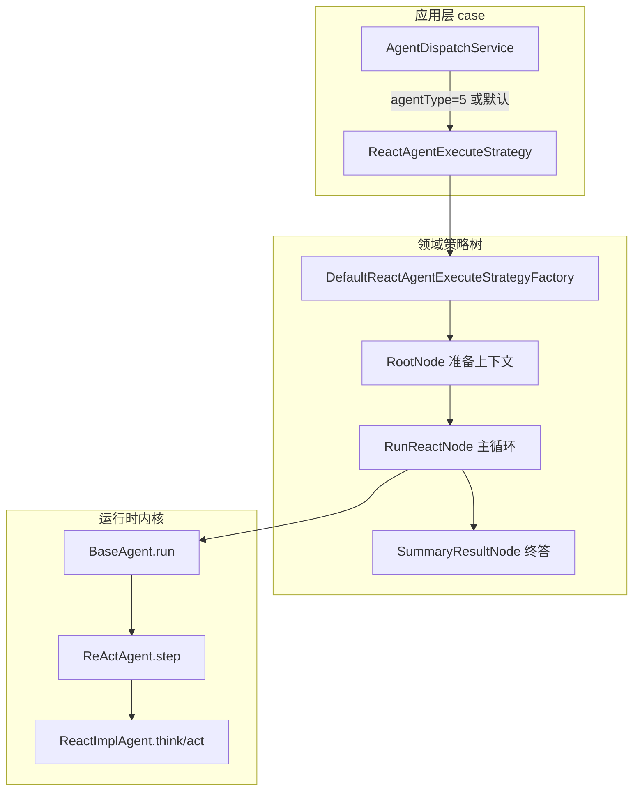
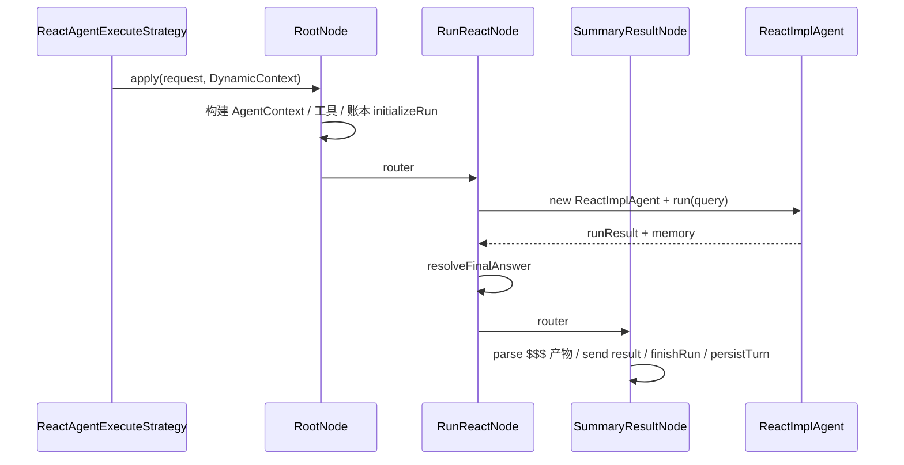
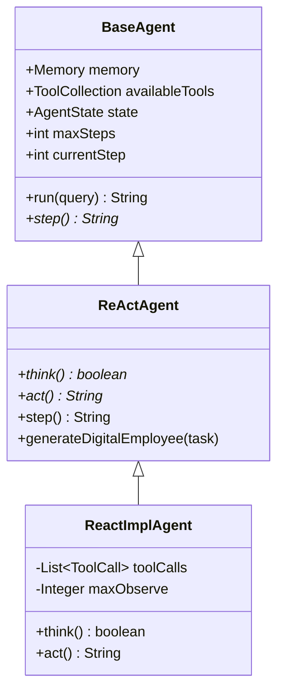
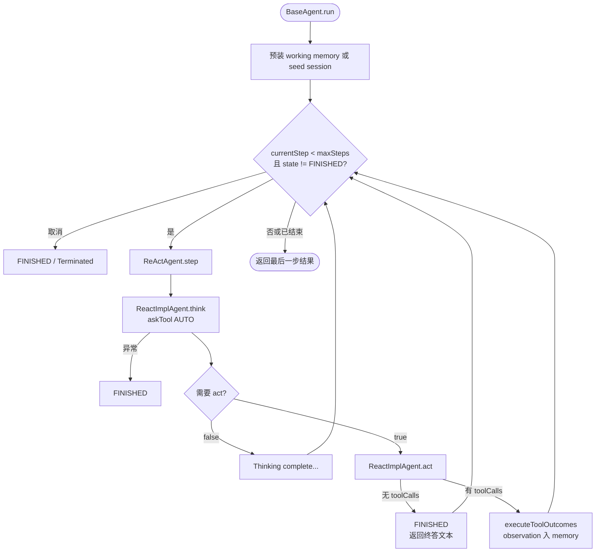

本文说明 AI4S-agent 中 **ReAct（Reason + Act）** 模式的完整执行路径：从应用层策略选择，到 domain 三步策略树，再到 `think → act` 内核循环、终答解析与工作记忆落库。适合需要读通「一次对话如何跑完」的中级开发者。更宏观的请求入口见 [端到端请求流转](10-duan-dao-duan-qing-qiu-liu-zhuan)；Plan-Execute 与混合 Replan 见后续章节。

## 1. 范式定位与分层职责

ReAct 在本仓库被实现为一条**独立执行策略**：按 `AgentType.REACT`（值为 `5`）选中，若请求未指定 `agentType`，调度器也会**默认回落到 ReAct**。这使 ReAct 成为日常工具编排的主路径，而 Plan-Execute 则走另一条工厂与节点树。

Sources: [AgentType.java](AI4S-agent-domain/src/main/java/org/wwz/ai/domain/agent/runtime/enums/AgentType.java#L6-L12)、[AgentDispatchService.java](AI4S-agent-case/src/main/java/org/wwz/ai/application/agent/dispatch/AgentDispatchService.java#L26-L48)

分层上刻意拆成两层：

| 层级 | 核心类型 | 职责边界 |
|------|----------|----------|
| 应用层（case） | `ReactAgentExecuteStrategy` | 会话工作记忆注入、输出样式拼接、SSE 打印器适配、活跃 run 注册、异常时账本收尾 |
| 领域层（domain） | `DefaultReactAgentExecuteStrategyFactory` + 三节点树 | 上下文装配、ReAct 主循环、终答与产物发送、工作记忆增量持久化 |
| 运行时内核 | `BaseAgent` → `ReActAgent` → `ReactImplAgent` | 步数循环、`think/act`、工具执行、记忆与提示词 |

Sources: [ReactAgentExecuteStrategy.java](AI4S-agent-case/src/main/java/org/wwz/ai/application/agent/execute/react/ReactAgentExecuteStrategy.java#L25-L31)、[IExecuteStrategy.java](AI4S-agent-case/src/main/java/org/wwz/ai/application/agent/execute/IExecuteStrategy.java#L7-L13)、[DefaultReactAgentExecuteStrategyFactory.java](AI4S-agent-domain/src/main/java/org/wwz/ai/domain/agent/service/execute/react/step/factory/DefaultReactAgentExecuteStrategyFactory.java#L15-L49)



## 2. 应用层入口：策略选择与前置 enrichment

`AgentDispatchService.dispatch` 根据 `request.agentType` 映射到 Spring Bean 名：`WORKFLOW → flowAgentExecuteStrategy`，`PLAN_SOLVE → planSolveAgentExecuteStrategy`，`REACT → reactAgentExecuteStrategy`；未匹配时固定使用 ReAct。随后调用 `IExecuteStrategy.execute(request, stream)`。

Sources: [AgentDispatchService.java](AI4S-agent-case/src/main/java/org/wwz/ai/application/agent/dispatch/AgentDispatchService.java#L26-L48)

`ReactAgentExecuteStrategy` 在真正进入 domain 树之前完成三件事：

1. **工作记忆预热** `enrichWorkingMemory`：优先 `SessionWorkingMemoryService.loadReadyMessages`；若为空则回退 `SessionContextMemoryService.hydrateWorkingMessages`（冷启动/无投影）；再经 `SessionContextCompactionService.applyIfNeeded` 压缩。结果写入 `request.workingMemoryMessages`，同时将 `historyDialogue` 清空——历史不再拼进 system 文本，而是以 message 列表参与前缀续写。
2. **输出风格** `applyOutputStyle`：若配置了 `outputStyle`，从 `AI4SConfig.outputStylePrompts` 取追加文案拼到 `query`。
3. **执行与收尾** `doExecute`：拿到策略树根节点，构建携带 `AgentSessionPrinter` 的 `DynamicContext`，`ActiveAgentRunRegistry.begin/bindStream`，`apply` 整棵树；用户停止写 `STATUS_STOPPED`，其它异常写 `STATUS_FAILED`（错误码 `REACT_EXECUTE_ERROR`），`finally` 中 `end` 活跃 run。

Sources: [ReactAgentExecuteStrategy.java](AI4S-agent-case/src/main/java/org/wwz/ai/application/agent/execute/react/ReactAgentExecuteStrategy.java#L51-L131)

## 3. Domain 策略树：三步串联

工厂 `DefaultReactAgentExecuteStrategyFactory` 与 auto/flow/plan 同构：暴露 `armoryStrategyHandler()` 返回 `RootNode`，并用专用 `DynamicContext` 在节点间传递 `printer`、`agentContext`、`executor`、`finalAnswer`、`step`。

Sources: [DefaultReactAgentExecuteStrategyFactory.java](AI4S-agent-domain/src/main/java/org/wwz/ai/domain/agent/service/execute/react/step/factory/DefaultReactAgentExecuteStrategyFactory.java#L18-L49)

节点基类 `AbstractExecuteSupport` 继承 `AbstractMultiThreadStrategyRouter`，当前 ReAct 链未启用多线程扩展点。

Sources: [AbstractExecuteSupport.java](AI4S-agent-domain/src/main/java/org/wwz/ai/domain/agent/service/execute/react/step/AbstractExecuteSupport.java#L11-L19)



### 3.1 Step1 RootNode：上下文与工具

`RootNode.doApply` 完成运行前装配：

- 用 `AgentRequest` 字段构建 `AgentContext`（`requestId`、`sessionId`、`query`、会话文件、SOP/base prompt、working memory、流式标记、`executionRecorder`、`runtimeDependencies` 等）。
- 物化会话文件到工作区、hydrate 工作区读状态。
- `ExecutionLedgerRunSupport.initializeRun(..., ENTRY_AGENT_REACT)`，账本入口常量为 `"react"`。
- `AgentToolCollectionFactory.buildForReact` 组装本轮工具集。
- 绑定 `ActiveAgentRunRegistry`，把 `agentContext` 放入 `DynamicContext`，再路由到 `RunReactNode`。

Sources: [RootNode.java](AI4S-agent-domain/src/main/java/org/wwz/ai/domain/agent/service/execute/react/step/RootNode.java#L31-L116)、[ExecutionLedgerConstants.java](AI4S-agent-domain/src/main/java/org/wwz/ai/domain/agent/ledger/model/ExecutionLedgerConstants.java#L25-L25)、[AgentToolCollectionFactory.java](AI4S-agent-domain/src/main/java/org/wwz/ai/domain/agent/runtime/tool/factory/AgentToolCollectionFactory.java#L104-L106)

`buildForReact` 与 Plan-Solve 共用私有 `build`，仅 `SkillAttachScope.REACT` 不同；默认工具清单来自配置 `multiAgentToolListMap.default`（search、web_fetch、code、docgen、dataprep、canvas 等），workspace 启用时暴露 cwd 系工具而非直接暴露 `file_tool` 给模型。

Sources: [AgentToolCollectionFactory.java](AI4S-agent-domain/src/main/java/org/wwz/ai/domain/agent/runtime/tool/factory/AgentToolCollectionFactory.java#L85-L148)

### 3.2 Step2 RunReactNode：启动内核循环

`RunReactNode` 从 `DynamicContext` 取 `agentContext`，构造 `ReactImplAgent`，可选注入 Plan Mode 提示（`PlanModePromptInjector.applyIfPlanMode`），然后：

```text
runResult = executor.run(requestParameter.getQuery())
finalAnswer = resolveFinalAnswer(executor, runResult)
```

终答解析规则是 ReAct 产品契约的核心实现：

| 优先级 | 来源 | 条件 |
|--------|------|------|
| 1 | Memory 中最后一条**无** `toolCalls` 的 ASSISTANT 文本 | 用户向终答 |
| 2 | `run()` 返回值 | 仅当 `state == FINISHED` 且文本「像用户回复」 |
| 3 | 兜底文案 | 中途停在工具轮时的中文提示 |

「不像用户回复」的过滤包括：`Terminated:` 前缀、`No steps executed`、`Thinking complete - no action needed`、以及含 `工具执行结果为:` / `Tool execution` 的工具聚合串。另支持剥离遗留 `Finish[...]` 标记（`sanitizeUserFacingText`）。

Sources: [RunReactNode.java](AI4S-agent-domain/src/main/java/org/wwz/ai/domain/agent/service/execute/react/step/RunReactNode.java#L22-L142)

### 3.3 Step3 SummaryResultNode：结果面与持久化

`SummaryResultNode` 不把 raw 文本直接当气泡，而是：

1. 持久化工作区读状态。
2. `TaskSummaryArtifactProtocol.parse(rawFinalAnswer, visibleArtifactBindings)`：支持终答正文后的 `$$$` + `artifactKey`（`toolCallId::fileName`）勾选交付文件。
3. 若模型未勾选文件，回退全部可见产物列表。
4. `printer.send("result", { taskSummary, fileList })`。
5. `ExecutionLedgerRunSupport.finishRun(..., STATUS_SUCCESS, taskSummary, ...)`。
6. `SessionWorkingMemoryService.persistTurn`，增量来自 `executor.exportWorkingMemoryDelta()`，`entryAgent = ENTRY_AGENT_REACT`。

Sources: [SummaryResultNode.java](AI4S-agent-domain/src/main/java/org/wwz/ai/domain/agent/service/execute/react/step/SummaryResultNode.java#L25-L108)

## 4. 运行时内核：类继承与主循环



### 4.1 BaseAgent.run：固定步数护栏

`BaseAgent` 声明所有 Agent 的主循环与记忆/工具/账本接入点。`run(query)` 关键逻辑：

- **跨轮前缀续写**：若 `context.workingMemoryMessages` 非空，用其 `replaceMessages` 整段替换 memory，再 append 本轮 user query；首轮则 clear + `seedSessionContextMessages` 后 append query。
- **循环条件**：`currentStep < maxSteps && state != FINISHED`。
- **每步前**：检查用户取消 → `markExecutionPosition` → Plan Mode 步级提醒 → `compactWorkingMemoryIfNeeded("step")`。
- **步结果**：`results.add(step())`；达到 maxSteps 且未 FINISHED 时写入终止说明并复位步号。
- **返回值**：最后一步结果字符串（供 `RunReactNode` 作次优终答源）。

Sources: [BaseAgent.java](AI4S-agent-domain/src/main/java/org/wwz/ai/domain/agent/runtime/agent/BaseAgent.java#L40-L145)

状态枚举：`IDLE | RUNNING | FINISHED | ERROR`。ReAct 正常结束依赖 `act()` 在无 tool_calls 时置 `FINISHED`；思考异常也会置 `FINISHED` 并返回 false。

Sources: [AgentState.java](AI4S-agent-domain/src/main/java/org/wwz/ai/domain/agent/runtime/enums/AgentState.java#L6-L11)

### 4.2 ReActAgent.step：Reason 与 Act 的单元

抽象类约定：

- `think()` → 是否需要行动（true 继续 act，false 表示本步无需行动）。
- `act()` → 行动结果字符串。
- `step()` 固定实现为：`shouldAct = think(); if (!shouldAct) return "Thinking complete - no action needed"; return act();`。

另附带「数字员工」生成能力（异步 LLM 产出工具人设 JSON 并 `updateDigitalEmployee`），属扩展能力，不改变主循环结构。

Sources: [ReActAgent.java](AI4S-agent-domain/src/main/java/org/wwz/ai/domain/agent/runtime/agent/ReActAgent.java#L19-L84)

### 4.3 ReactImplAgent：具体 think / act

**构造**（绑定一次 run 的配置）：

- `name = "react"`。
- 从 `AI4SRuntimeDependencies` 取 `AI4SConfig`：系统/下一步提示 map、`reactMaxSteps`、`reactModelName`、数字员工提示。
- `initializePromptsWithHistoryOnlyInSystem(...)`，默认模板来自 `AgentPrompt.SYSTEM_PROMPT` / 空的 `NEXT_STEP_PROMPT`。
- `availableTools = context.getToolCollection()`。

Sources: [ReactImplAgent.java](AI4S-agent-domain/src/main/java/org/wwz/ai/domain/agent/runtime/agent/ReactImplAgent.java#L61-L100)

**think（Reason）**：

1. 记忆为空时用 `context.query` 垫一条 user message（不再每步注入 nextStep user，利于 prompt cache）。
2. `streamMessageType = "tool_thought"`。
3. `llm.askTool(context, memory, systemMessage, availableTools, ToolChoice.AUTO, ..., isStream, timeout=300s)`。
4. 保存 `toolCalls`；非流式且存在 tool_call 时，才 `printer.send("tool_thought", content)`——**无 tool 的纯文本是终答，不推 tool_thought**。
5. 有原生 function call 且存在 toolCalls 时，`Message.fromToolCalls`；否则普通 assistant message；写入 memory。
6. 异常：写错误 assistant message，`state = FINISHED`，返回 false。

Sources: [ReactImplAgent.java](AI4S-agent-domain/src/main/java/org/wwz/ai/domain/agent/runtime/agent/ReactImplAgent.java#L102-L175)

**act（Action）**：

1. **无 toolCalls**：`state = FINISHED`，返回 memory 最后一条 content——这是与产品「无 tool 的 assistant 文本 = 用户终答」一致的结束信号。
2. **有 toolCalls**：`executeToolOutcomes(toolCalls)`（基类统一执行与账本），处理截断（`maxObserve`）、推送 tool 结果、把 observation 写回 memory（兼容 struct_parse 与 function_call 两种形态），聚合结果字符串返回，**循环继续**进入下一步 think。

Sources: [ReactImplAgent.java](AI4S-agent-domain/src/main/java/org/wwz/ai/domain/agent/runtime/agent/ReactImplAgent.java#L177-L199)



## 5. 提示词契约与终答模型

`AgentPrompt` 把 **USER_FACING_REPLY_CONTRACT_V3** 固化进 system：

- 本轮**不调用工具**时，assistant 文本即最终用户回复。
- 禁止把思考过程、工具计划当终答；不要使用 `Finish[...]`。
- 有文件交付时：气泡短摘要 + 可选 `$$$` + artifactKey 列表；禁止重贴大段 tool observation。
- 正式 PDF/DOCX/HTML/PPT 走对应生成工具，而非气泡扛版式。

`ensureUserFacingReplyContract` 保证配置覆盖默认模板时仍合并该契约，并剥离历史 V1/V2 块。

Sources: [AgentPrompt.java](AI4S-agent-domain/src/main/java/org/wwz/ai/domain/agent/runtime/prompt/AgentPrompt.java#L1-L126)

这与 `RunReactNode.resolveFinalAnswer`、`SummaryResultNode` 的 `$$$` 解析形成**提示词 → 内核结束条件 → 结果协议**的闭环，避免把中间 thought 或工具聚合串误当成用户可见回复。

## 6. 关键配置项

| 配置键 / 字段 | 作用 |
|---------------|------|
| `autobots.autoagent.react.system_prompt` | ReAct system 提示 map（可覆盖默认 `AgentPrompt`） |
| `autobots.autoagent.react.next_step_prompt` | 下一步提示 map（实现中 nextStep 已弱化/可空） |
| `autobots.autoagent.react.model_name` | ReAct 专用模型名（默认 `qwen-vl-max`） |
| `reactMaxSteps`（`AI4SConfig`） | 最大 think/act 步数，防止无限循环 |
| `multiAgentToolListMap.default` | 默认挂载工具族列表 |
| `outputStyle` + `outputStylePrompts` | 应用层对 query 的风格追加 |

Sources: [AI4SConfig.java](AI4S-agent-domain/src/main/java/org/wwz/ai/domain/agent/ai4s/config/AI4SConfig.java#L56-L75)、[ReactImplAgent.java](AI4S-agent-domain/src/main/java/org/wwz/ai/domain/agent/runtime/agent/ReactImplAgent.java#L72-L94)

## 7. 流式事件与可观测锚点

ReAct 运行过程中，与前端/账本相关的关键事件类型包括：

| 时机 | 事件 / 标记 | 说明 |
|------|-------------|------|
| think 流式 | `streamMessageType = tool_thought` | 过程思考；无 tool 的终答文本不走该通道推送 |
| 非流式有 tool | `printer.send("tool_thought", ...)` | 仅有 tool_call 时推过程文本 |
| 工具执行 | 基类工具执行 + 账本 tool invocation | 与多工具并发细节见 [多工具并发调度](15-duo-gong-ju-bing-fa-diao-du) |
| 结束 | `printer.send("result", taskResult)` | `taskSummary` + `fileList` |
| 账本 | `ENTRY_AGENT_REACT` / initialize + finish | 成功、失败、用户停止三种收尾 |
| 记忆 | `persistTurn` + 步前 compact | 跨轮续写与压缩见 [工作记忆压缩与上下文管理](23-gong-zuo-ji-yi-ya-suo-yu-shang-xia-wen-guan-li) |

`ReactAgentResponseHandler` 负责把增量 `AgentResponse` 规范为 `GptProcessResult`（canonical incr），属于响应装配侧，不改变执行内核。

Sources: [ReactImplAgent.java](AI4S-agent-domain/src/main/java/org/wwz/ai/domain/agent/runtime/agent/ReactImplAgent.java#L122-L151)、[SummaryResultNode.java](AI4S-agent-domain/src/main/java/org/wwz/ai/domain/agent/service/execute/react/step/SummaryResultNode.java#L80-L88)、[ReactAgentResponseHandler.java](AI4S-agent-domain/src/main/java/org/wwz/ai/domain/agent/runtime/handler/ReactAgentResponseHandler.java#L14-L30)

## 8. 读代码路径建议

若要在 IDE 中按调用栈走读，推荐顺序：

1. `AgentDispatchService` → `ReactAgentExecuteStrategy`
2. `DefaultReactAgentExecuteStrategyFactory` → `RootNode` → `RunReactNode` → `SummaryResultNode`
3. `ReactImplAgent` 构造 / `think` / `act`
4. `BaseAgent.run` 主循环与记忆预装
5. `AgentPrompt` 终答契约 + `RunReactNode.resolveFinalAnswer`

需要对比「先规划再执行」时，进入 [Plan-Execute 执行链路](13-plan-execute-zhi-xing-lian-lu)；需要看 ReAct 与 Plan 如何在同一会话切换时，进入 [混合模式与动态 Replan](14-hun-he-mo-shi-yu-dong-tai-replan)。工具注册细节见 [工具集合与产物登记](16-gong-ju-ji-he-yu-chan-wu-deng-ji)。

## 小结

ReAct 执行链路是 **调度默认路径**：应用层负责记忆与流式适配，domain 三步树负责上下文、内核循环与终答协议，`ReactImplAgent` 用 `askTool(AUTO)` 决策工具、用「无 toolCalls」作为面向用户的结束条件。理解这条链路后，调试「为何没有终答 / 为何提前结束 / 产物为何未勾选」可直接对照 `resolveFinalAnswer`、`maxSteps` 与 `$$$` 协议三处。
