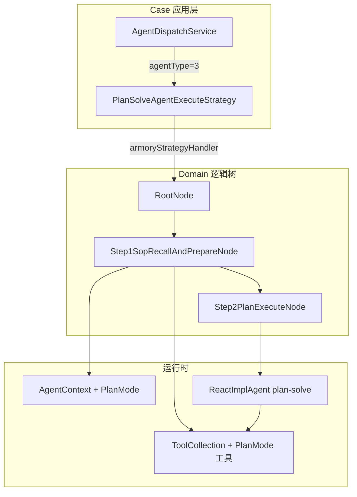
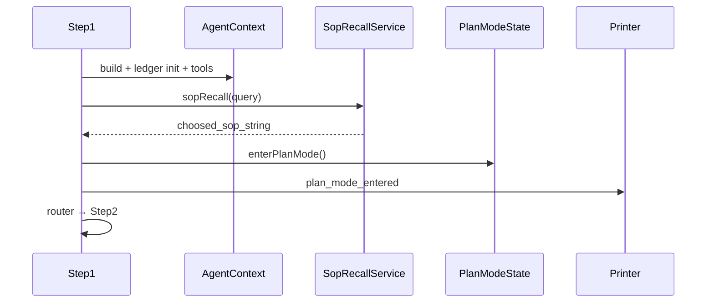
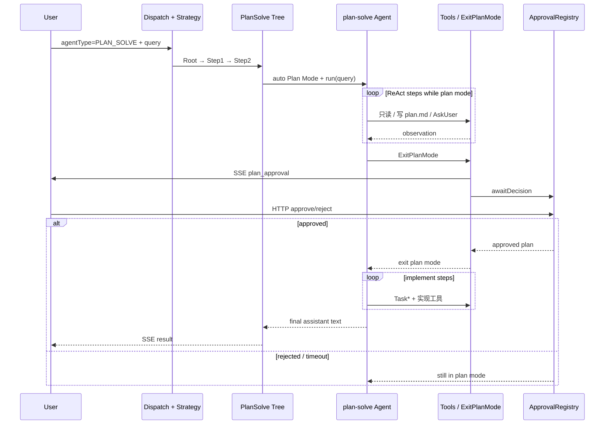

Plan-Execute（工程内统一命名为 **PlanSolve**）是 AI4S-agent 面向复杂任务的「先规划、等人批、再实现」执行范式。与 [ReAct 执行链路](12-react-zhi-xing-lian-lu) 的即时 think-act 不同，PlanSolve 在请求入口即进入 Plan Mode：未获用户批准前禁止业务写操作，计划就绪后通过 ExitPlanMode 挂起等待，批准后才进入实现与终答。本页聚焦主执行链路、Plan Mode 门禁、审批协议与终答收口，不展开动态 Replan 与多工具并发调度细节（见 [混合模式与动态 Replan](14-hun-he-mo-shi-yu-dong-tai-replan)、[多工具并发调度](15-duo-gong-ju-bing-fa-diao-du)）。

## 何时选择 PlanSolve

`AgentType.PLAN_SOLVE` 的枚举值为 **3**。应用层 `AgentDispatchService` 按 `agentType` 选择策略 Bean：`PLAN_SOLVE → planSolveAgentExecuteStrategy`；未识别时默认回落 ReAct。

| 维度 | PlanSolve | ReAct |
|------|-----------|-------|
| 入口 agentType | `3`（PLAN_SOLVE） | `5`（REACT） |
| 入口是否 Plan Mode | **自动进入** | 需主动 EnterPlanMode |
| 未批准前写操作 | 仅允许 `.ai4s/plan.md` | 无硬门禁 |
| 主循环形态 | 单主代理 ReactImplAgent | ReactImplAgent |
| 终答信号 | 无 tool_calls 的 assistant 文本 | 同左 |
| 账本 entryAgent | `plan_solve` | `react` |

Sources: [AgentType.java](AI4S-agent-domain/src/main/java/org/wwz/ai/domain/agent/runtime/enums/AgentType.java#L6-L11)、[AgentDispatchService.java](AI4S-agent-case/src/main/java/org/wwz/ai/application/agent/dispatch/AgentDispatchService.java#L26-L48)、[ExecutionLedgerConstants.java](AI4S-agent-domain/src/main/java/org/wwz/ai/domain/agent/ledger/model/ExecutionLedgerConstants.java#L25-L26)

## 总体架构：从策略到逻辑树

PlanSolve 采用与 ReAct 同构的 **策略 + 多线程逻辑树** 分层：case 层负责策略选择与流式输出，domain 层负责运行时内核。



应用策略在执行前会 **enrich working memory**（优先工作记忆投影，冷启动回退 ledger hydrate，再按需压缩），并注册 `ActiveAgentRunRegistry` 以支持用户停止。成功路径由 Step2 收口；取消/异常路径在策略层统一 `finishRun`。

Sources: [PlanSolveAgentExecuteStrategy.java](AI4S-agent-case/src/main/java/org/wwz/ai/application/agent/execute/planexecute/PlanSolveAgentExecuteStrategy.java#L43-L108)、[DefaultPlanSolveAgentExecuteStrategyFactory.java](AI4S-agent-domain/src/main/java/org/wwz/ai/domain/agent/service/execute/planexecute/step/factory/DefaultPlanSolveAgentExecuteStrategyFactory.java#L18-L52)、[RootNode.java](AI4S-agent-domain/src/main/java/org/wwz/ai/domain/agent/service/execute/planexecute/step/RootNode.java#L14-L32)

## 逻辑树两步：准备与执行

### Step1：SOP 召回 + 上下文与 Plan Mode 准备

Step1 完成一次请求的运行时装配，核心动作可概括为：

1. 构建 `AgentContext`（requestId/sessionId、query、工作区、工作记忆、执行账本、runtimeDependencies 等）
2. 物化会话文件、hydrate 工作区读状态
3. `ExecutionLedgerRunSupport.initializeRun(..., ENTRY_AGENT_PLAN_SOLVE)`
4. `agentToolCollectionFactory.buildForPlanSolve(...)` 装配工具集
5. SOP 语义召回，将结果注入 `sopPrompt` 的 `{{sop}}`
6. **自动进入 Plan Mode**（`enterPlanModeForPlanSolve`），SSE 推送 `plan_mode_entered`

自动进入 Plan Mode 时会解析计划路径提示（默认相对路径 `.ai4s/plan.md`），并通过 printer 下发 `mode / planFilePath / autoEntered=true / reason=PLAN_SOLVE_ENTRY`。



Sources: [Step1SopRecallAndPrepareNode.java](AI4S-agent-domain/src/main/java/org/wwz/ai/domain/agent/service/execute/planexecute/step/Step1SopRecallAndPrepareNode.java#L72-L174)、[PlanModeState.java](AI4S-agent-domain/src/main/java/org/wwz/ai/domain/agent/runtime/planmode/PlanModeState.java#L16-L67)、[PlanArtifactStore.java](AI4S-agent-domain/src/main/java/org/wwz/ai/domain/agent/runtime/planmode/PlanArtifactStore.java#L14-L41)

### Step2：单主代理 ReAct 循环（当前主路径）

**架构演进要点**：主路径 **不再** 外层循环 `PlanningAgent → ExecutorAgent → SummaryAgent`，改为单一 `ReactImplAgent`（命名 `plan-solve`），复用 ReAct 的 system 固定 + messages append-only 循环。并行 Executor 路径仅保留给历史单测/兼容，主路径不调用。

Step2 流程：

1. `createPlanSolvePlanner`：new ReactImplAgent，叠加 PlanSolve 编排约定 + Plan Mode 指引
2. 可选覆盖 `plannerMaxSteps` 与 `plannerModelName`
3. `planner.run(query)` 进入 BaseAgent 主循环
4. `resolveFinalAnswer` 提取「无 tool_calls 的最后一条 assistant 文本」
5. `sendFinalResult` 解析任务摘要与产物，SSE `result`，ledger `STATUS_SUCCESS`
6. 持久化 working memory delta 与 workspace read-state

| 配置项 | 作用 | 来源 |
|--------|------|------|
| `plannerMaxSteps` | 主代理最大步数 | AI4SConfig |
| `plannerModelName` | 规划/主代理模型 | AI4SConfig |
| 编排 marker | `PLAN_SOLVE_ORCHESTRATION_V2` | PlanSolvePrompt |
| Plan Mode marker | `PLAN_MODE_INSTRUCTIONS_V2` | PlanModePromptInjector |

Sources: [Step2PlanExecuteNode.java](AI4S-agent-domain/src/main/java/org/wwz/ai/domain/agent/service/execute/planexecute/step/Step2PlanExecuteNode.java#L47-L171)、[PlanSolvePrompt.java](AI4S-agent-domain/src/main/java/org/wwz/ai/domain/agent/runtime/prompt/PlanSolvePrompt.java#L7-L40)、[PlanModePromptInjector.java](AI4S-agent-domain/src/main/java/org/wwz/ai/domain/agent/runtime/planmode/PlanModePromptInjector.java#L154-L156)

## Plan Mode：硬只读与人批闸门

### 状态机

`PlanModeState` 维护三种模式：`default` / `plan` / `acceptEdits`。关键字段包括 `planContent`、`planFilePath`、`exitPendingApproval`、`pendingPlanContent`，以及 step 附件节流计数。

```mermaid
stateDiagram-v2
  [*] --> default
  default --> plan: enterPlanMode<br/>(PlanSolve 自动 / EnterPlanMode)
  plan --> plan: 只读探索 + 写 plan.md
  plan --> Waiting: ExitPlanMode<br/>requestExitWithPlan
  Waiting --> plan: reject / timeout
  Waiting --> default: approve<br/>exitPlanMode
  default --> [*]: 实现 + 终答
```

Sources: [PlanModeState.java](AI4S-agent-domain/src/main/java/org/wwz/ai/domain/agent/runtime/planmode/PlanModeState.java#L18-L123)

### 提示注入与步进提醒

- **进入时**：`ensurePlanSolveWithPlanModeGuidance` = 编排约定 + Plan Mode 硬只读全文
- **每步前**（`BaseAgent.run`）：`PlanModePromptInjector.injectStepReminders` 按约 5 步节流注入 full/sparse 提醒；退出后注入 `plan_mode_exit` 附件，提示可用 TaskCreate/TodoWrite 再实现

Sources: [BaseAgent.java](AI4S-agent-domain/src/main/java/org/wwz/ai/domain/agent/runtime/agent/BaseAgent.java#L115-L125)、[PlanModePromptInjector.java](AI4S-agent-domain/src/main/java/org/wwz/ai/domain/agent/runtime/planmode/PlanModePromptInjector.java#L26-L132)

### 工具门禁（PlanModeToolPolicy）

在 `BaseAgent.executeToolInternal` 中，工具真正执行前调用 `PlanModeToolPolicy.denyReason`。Plan Mode 下：

| 类别 | 示例 | 行为 |
|------|------|------|
| 始终允许 | Enter/ExitPlanMode、Task*、TodoWrite、AskUserQuestion、workspace_read/list/glob/grep、deep_search、WebFetch、AgentDispatch | 放行 |
| 条件允许 | workspace_write/edit | **仅** 路径为 `.ai4s/plan.md` |
| 禁止 | code_interpreter、report_tool、docgen 族、file_tool、canvas 写、image_generation 等 | 返回 `PLAN_MODE_DENY` |
| 未知/MCP | 名称含 write/edit/delete/exec/run_command | 禁止 |

Sources: [PlanModeToolPolicy.java](AI4S-agent-domain/src/main/java/org/wwz/ai/domain/agent/runtime/planmode/PlanModeToolPolicy.java#L15-L105)、[BaseAgent.java](AI4S-agent-domain/src/main/java/org/wwz/ai/domain/agent/runtime/agent/BaseAgent.java#L448-L456)

### 计划落盘

`PlanArtifactStore` 将会话计划写到 `{workspaceRoot}/.ai4s/plan.md`，作为 plan 期唯一允许修改的业务旁路文件。

Sources: [PlanArtifactStore.java](AI4S-agent-domain/src/main/java/org/wwz/ai/domain/agent/runtime/planmode/PlanArtifactStore.java#L20-L60)

## ExitPlanMode 与用户批准协议

`ExitPlanModeTool` 对标「不自批」：

1. 校验当前在 plan mode
2. 解析计划正文：参数 `plan` → 磁盘 plan.md → state.planContent
3. 写回 plan 文件，`requestExitWithPlan`
4. `PendingPlanApprovalRegistry.create`，SSE 推送 `plan_approval` 卡片
5. 工具线程 `awaitDecision`（默认超时 **30 分钟**）
6. **批准**：可带 `editedPlanContent`，`exitPlanMode`，返回 Approved Plan 工具结果
7. **拒绝/超时**：留在 plan mode，可修订后再次 Exit

独立 HTTP 接口（与主对话 SSE 解耦）：

| 方法 | 路径 | 作用 |
|------|------|------|
| POST | `/api/agent/plan-approval/approve` | 批准（可编辑计划） |
| POST | `/api/agent/plan-approval/reject` | 拒绝并附反馈 |
| GET | `/api/agent/plan-approval/pending?sessionId=` | 列出会话挂起项 |
| POST | `/api/agent/plan-approval/cancel` | 取消挂起 |

Sources: [ExitPlanModeTool.java](AI4S-agent-domain/src/main/java/org/wwz/ai/domain/agent/runtime/tool/common/planmode/ExitPlanModeTool.java#L22-L191)、[PendingPlanApprovalRegistry.java](AI4S-agent-domain/src/main/java/org/wwz/ai/domain/agent/runtime/planmode/PendingPlanApprovalRegistry.java#L19-L161)、[AgentPlanApprovalController.java](AI4S-agent-trigger/src/main/java/org/wwz/ai/trigger/http/agent/AgentPlanApprovalController.java#L19-L110)、[PlanApprovalApplicationService.java](AI4S-agent-case/src/main/java/org/wwz/ai/application/agent/planmode/PlanApprovalApplicationService.java#L17-L69)

## 工具装配（PlanSolve 特有挂载）

`AgentToolCollectionFactory.buildForPlanSolve` 与 React 共用主体能力清单，额外注册 **Task / Plan Mode** 工具族（dataAgent 输出风格除外）：

- TaskCreate / TaskGet / TaskUpdate / TaskList / TaskStop / TodoWrite
- EnterPlanMode / ExitPlanMode / AskUserQuestion
- AgentDispatchTool（同步子代理；plan 期子代理应偏向 Explore 只读）

Skill 是否挂载由 `SkillRuntimeOptions.isPlanSolveEnabled()` 控制。

Sources: [AgentToolCollectionFactory.java](AI4S-agent-domain/src/main/java/org/wwz/ai/domain/agent/runtime/tool/factory/AgentToolCollectionFactory.java#L105-L110)、[AgentToolCollectionFactory.java](AI4S-agent-domain/src/main/java/org/wwz/ai/domain/agent/runtime/tool/factory/AgentToolCollectionFactory.java#L280-L320)、[TaskToolNames.java](AI4S-agent-domain/src/main/java/org/wwz/ai/domain/agent/runtime/tool/common/planmode/TaskToolNames.java#L7-L22)

## 主循环与终答语义

### ReactImplAgent 在 PlanSolve 中的行为

主代理继承 ReAct 骨架：`step() = think() → act()`。

- **think**：`askTool` + ToolChoice.AUTO；有 tool_calls 时记录过程思考
- **act**：无 tool_calls → `AgentState.FINISHED`，返回最后一条 assistant 文本作为终答候选；有 tool_calls → 执行工具并写 observation

PlanSolve 与 ReAct 共享该结束信号：**纯文本 assistant 轮 = 用户终答**。

Sources: [ReactImplAgent.java](AI4S-agent-domain/src/main/java/org/wwz/ai/domain/agent/runtime/agent/ReactImplAgent.java#L110-L200)、[Step2PlanExecuteNode.java](AI4S-agent-domain/src/main/java/org/wwz/ai/domain/agent/service/execute/planexecute/step/Step2PlanExecuteNode.java#L154-L194)

### 终答解析与 result 打包

`resolveFinalAnswer` 优先从 memory 逆序找「无 toolCalls 的 ASSISTANT 文本」；否则在 FINISHED 且 runResult 像用户面向文本时回退 runResult；再否则给出兜底提示。`sanitizeUserFacingText` 会剥离 `Finish[...]` 包装。

`sendFinalResult` 经 `TaskSummaryArtifactProtocol.parse` 得到 `taskSummary` 与 `fileList`，printer 发送 `result`，并 `finishRun(STATUS_SUCCESS, taskSummary)`。

Sources: [Step2PlanExecuteNode.java](AI4S-agent-domain/src/main/java/org/wwz/ai/domain/agent/service/execute/planexecute/step/Step2PlanExecuteNode.java#L125-L230)

## 遗留组件：PlanningAgent / PlanningTool / 并行 Executor

当前主路径不依赖下列组件，但代码仍保留，理解仓库考古与兼容测试时有用：

| 组件 | 历史职责 | 现状 |
|------|----------|------|
| PlanningAgent | think 调 planning 工具，act 下发 currentStep | 主路径不再 new；DynamicContext.planning 已 deprecated |
| PlanningTool + PlanLifecycleService | create/update/mark_step/finish，自动推进步骤 | 仍可用于兼容 replan 语义 |
| Plan DTO | title/steps/stepStatus/notes | 结构化计划快照与账本输出 |
| ExecutorAgent + executeParallelTasks | 按任务 fork 并行执行 | 仅兼容单测；默认并行度 2 |

`PlanLifecycleService` 在 create 时激活首个 not_started 为 in_progress；mark_step 完成当前步后自动推进或 autoFinished；update 冻结已完成前缀仅替换剩余步骤。

Sources: [PlanningAgent.java](AI4S-agent-domain/src/main/java/org/wwz/ai/domain/agent/runtime/agent/PlanningAgent.java#L39-L140)、[PlanningTool.java](AI4S-agent-domain/src/main/java/org/wwz/ai/domain/agent/runtime/tool/common/PlanningTool.java#L20-L225)、[PlanLifecycleService.java](AI4S-agent-domain/src/main/java/org/wwz/ai/domain/agent/runtime/tool/common/planning/PlanLifecycleService.java#L13-L115)、[Plan.java](AI4S-agent-domain/src/main/java/org/wwz/ai/domain/agent/runtime/dto/Plan.java#L18-L178)、[Step2PlanExecuteNode.java](AI4S-agent-domain/src/main/java/org/wwz/ai/domain/agent/service/execute/planexecute/step/Step2PlanExecuteNode.java#L268-L360)

## 端到端时序（推荐心智模型）



Sources: [PlanSolveAgentExecuteStrategy.java](AI4S-agent-case/src/main/java/org/wwz/ai/application/agent/execute/planexecute/PlanSolveAgentExecuteStrategy.java#L43-L88)、[Step1SopRecallAndPrepareNode.java](AI4S-agent-domain/src/main/java/org/wwz/ai/domain/agent/service/execute/planexecute/step/Step1SopRecallAndPrepareNode.java#L111-L153)、[ExitPlanModeTool.java](AI4S-agent-domain/src/main/java/org/wwz/ai/domain/agent/runtime/tool/common/planmode/ExitPlanModeTool.java#L118-L191)、[Step2PlanExecuteNode.java](AI4S-agent-domain/src/main/java/org/wwz/ai/domain/agent/service/execute/planexecute/step/Step2PlanExecuteNode.java#L79-L98)

## 与相邻能力的边界

- **ReAct**：同一 ReactImplAgent 内核，但无自动 Plan Mode / 人批闸门；见 [ReAct 执行链路](12-react-zhi-xing-lian-lu)
- **混合模式与动态 Replan**：规划中途改计划、close_update 兼容顺推等；见 [混合模式与动态 Replan](14-hun-he-mo-shi-yu-dong-tai-replan)
- **多工具并发**：BaseAgent 批量 tool 并发与历史 planSolve 并行任务；见 [多工具并发调度](15-duo-gong-ju-bing-fa-diao-du)
- **SOP 召回**：Step1 注入；细节见 [SOP 语义召回](25-sop-yu-yi-zhao-hui)
- **执行账本**：`entryAgent=plan_solve`；见 [执行账本与历史回放](26-zhi-xing-zhang-ben-yu-li-shi-hui-fang)
- **SSE 渲染**：`plan_mode_entered` / `plan_approval` / `result`；见 [SSE 流式对话与结果渲染](27-sse-liu-shi-dui-hua-yu-jie-guo-xuan-ran)

## 小结

PlanSolve 的现代主路径可压缩为三句话：

1. **入口即 Plan Mode**：Step1 自动只读闸门，计划只能写到 `.ai4s/plan.md`
2. **单主代理 ReAct**：Step2 用 `ReactImplAgent(plan-solve)` 完成探索、人批、实现与终答
3. **ExitPlanMode 不自批**：SSE 卡片 + HTTP 批准，工具线程挂起等待，批准后才允许业务写工具

阅读建议：先对照本页时序图走通主路径，再进入 [混合模式与动态 Replan](14-hun-he-mo-shi-yu-dong-tai-replan) 理解遗留 Planning 语义，最后结合 [SSE 流式对话与结果渲染](27-sse-liu-shi-dui-hua-yu-jie-guo-xuan-ran) 看前端如何消费 plan_approval 与 result。