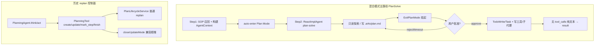
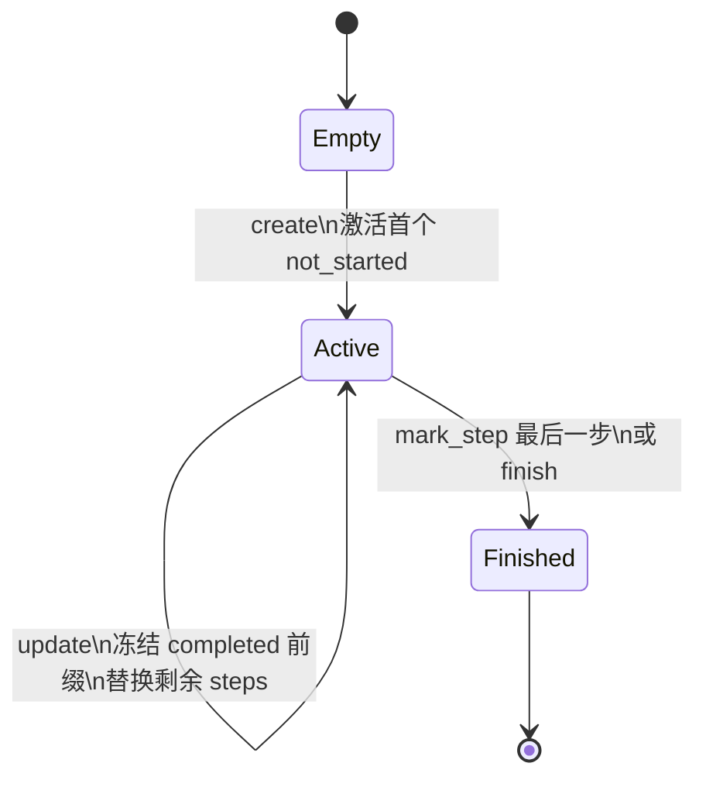

本页聚焦 AI4S-agent **PlanSolve 执行内核**中的「混合模式」与「动态 Replan」：前者描述主路径如何把 **Plan Mode（人审计划）** 与 **ReAct 单主代理** 合成为可落地的 plan-execute 形态；后者描述历史 **PlanningAgent + PlanningTool** 体系中的 **普通 replan / 关闭更新（兼容顺推）** 两套计划生命周期语义、防重派约束，以及它们与现行主路径的边界关系。配套的纯 ReAct 循环与完整 Plan-Execute 外环分别见 [ReAct 执行链路](12-react-zhi-xing-lian-lu)、[Plan-Execute 执行链路](13-plan-execute-zhi-xing-lian-lu)。

## 概念定位：为何需要「混合」

AI4S 里的 plan-execute 并不是单一算法。运行时同时存在两套可观测、可测试的计划控制面：

| 维度 | 现行主路径（混合） | 历史/兼容路径（PlanningAgent） |
|------|-------------------|-------------------------------|
| 编排主体 | 单 `ReactImplAgent`（命名 `plan-solve`） | `PlanningAgent` 外环 + 可选 `ExecutorAgent` |
| 计划载体 | `.ai4s/plan.md` + Session Todo / Task 列表 | 内存 `Plan` + `planning` 工具 command |
| 人审 | `ExitPlanMode` 挂起等待 approve/reject | 无内建人审；靠 LLM 自主 create/update |
| 动态重排 | 批准前改 plan 文件；批准后 TodoWrite/TaskUpdate | `PlanLifecycleService.update` 冻结已完成前缀 |
| 主路径状态 | `Step2PlanExecuteNode` 已切到单 ReAct | 代码与单测仍完整保留，供 replan 语义回归 |

Sources: [Step2PlanExecuteNode.java](AI4S-agent-domain/src/main/java/org/wwz/ai/domain/agent/service/execute/planexecute/step/Step2PlanExecuteNode.java#L47-L54)
Sources: [PlanningAgent.java](AI4S-agent-domain/src/main/java/org/wwz/ai/domain/agent/runtime/agent/PlanningAgent.java#L39-L90)
Sources: [PlanSolvePrompt.java](AI4S-agent-domain/src/main/java/org/wwz/ai/domain/agent/runtime/prompt/PlanSolvePrompt.java#L1-L24)

**混合模式的工程含义**：入口仍走 PlanSolve 策略树（Step1 准备 → Step2 执行），但 Step2 不再 `new PlanningAgent / ExecutorAgent / SummaryAgent` 外循环，而是把「先规划、等人批、再实现、最后无 tool 文本终答」全部压进 **一个 ReAct 主代理 + Plan Mode 状态机 + 工具门禁**。旧的 ordinary replan 生命周期作为 **可验证的计划状态机** 与兼容配置继续存在，不参与主路径调度。



Sources: [Step1SopRecallAndPrepareNode.java](AI4S-agent-domain/src/main/java/org/wwz/ai/domain/agent/service/execute/planexecute/step/Step1SopRecallAndPrepareNode.java#L111-L154)
Sources: [Step2PlanExecuteNode.java](AI4S-agent-domain/src/main/java/org/wwz/ai/domain/agent/service/execute/planexecute/step/Step2PlanExecuteNode.java#L78-L123)

## 混合模式主路径：Plan Mode × 单主代理 ReAct

### 入口自动进入 Plan Mode

PlanSolve 在 Step1 完成 SOP 召回与工具装载后，**每个请求默认 auto-enter plan mode**：写入 `PlanModeState`、解析计划文件路径，并通过 SSE 推送 `plan_mode_entered`（`autoEntered=true`，`reason=PLAN_SOLVE_ENTRY`）。未批准前，系统语义是「硬只读 + 仅可写计划文件」。

Sources: [Step1SopRecallAndPrepareNode.java](AI4S-agent-domain/src/main/java/org/wwz/ai/domain/agent/service/execute/planexecute/step/Step1SopRecallAndPrepareNode.java#L111-L154)
Sources: [PlanModeState.java](AI4S-agent-domain/src/main/java/org/wwz/ai/domain/agent/runtime/planmode/PlanModeState.java#L16-L67)

### Step2 构造 plan-solve 主代理

`createPlanSolvePlanner` 复用 `ReactImplAgent` 的 think/act 循环，并叠加三层约束：

1. **编排约定**：`PlanSolvePrompt.ORCHESTRATION`（`PLAN_SOLVE_ORCHESTRATION_V2`）— 先规划、等人批、再实现与最终回复；
2. **Plan Mode 指引**：`PlanModePromptInjector.ensurePlanSolveWithPlanModeGuidance` + `applyIfPlanMode` — 硬只读、只写 `.ai4s/plan.md`、禁止自批；
3. **模型与步数**：优先使用 `AI4SConfig.plannerModelName` / `plannerMaxSteps`，与纯 ReAct 的 react 配置解耦。

Sources: [Step2PlanExecuteNode.java](AI4S-agent-domain/src/main/java/org/wwz/ai/domain/agent/service/execute/planexecute/step/Step2PlanExecuteNode.java#L101-L123)
Sources: [PlanSolvePrompt.java](AI4S-agent-domain/src/main/java/org/wwz/ai/domain/agent/runtime/prompt/PlanSolvePrompt.java#L7-L40)
Sources: [PlanModePromptInjector.java](AI4S-agent-domain/src/main/java/org/wwz/ai/domain/agent/runtime/planmode/PlanModePromptInjector.java#L26-L62)
Sources: [PlanModePromptInjector.java](AI4S-agent-domain/src/main/java/org/wwz/ai/domain/agent/runtime/planmode/PlanModePromptInjector.java#L154-L156)

### 工具门禁：运行时强制只读边界

提示词约束之外，`PlanModeToolPolicy` 在执行层再挡一层：

- **始终允许**：Enter/Exit PlanMode、Task/Todo 系列、AskUserQuestion、Agent 调度、workspace 只读、deep_search、WebFetch、skill 等；
- **写路径例外**：`workspace_write` / `workspace_edit` 仅当 path 落在 `.ai4s/plan.md`；
- **变异工具一律拒绝**：code_interpreter、report/document 生成、canvas、image_generation、data_analysis 等；
- **启发式**：未知/MCP 工具名含 write/edit/delete/exec/run_command 时拒绝。

Sources: [PlanModeToolPolicy.java](AI4S-agent-domain/src/main/java/org/wwz/ai/domain/agent/runtime/planmode/PlanModeToolPolicy.java#L15-L105)

### 人审与「计划重写」闭环

| 阶段 | 行为 | 状态变化 |
|------|------|----------|
| 探索 | 只读工具 / Explore 子代理 | 仍 `mode=plan` |
| 写计划 | 仅 `.ai4s/plan.md` | `planContent` / `planFilePath` 更新 |
| ExitPlanMode | SSE `plan_approval`，工具线程 await | `exitPendingApproval=true` |
| 批准 | 可接受编辑后的 plan 正文 | `exitPlanMode()` 恢复 prePlanMode，注入 exit 提醒 |
| 拒绝/超时 | 仍停留 plan mode | clear pending；模型可改计划再 Exit |

批准后系统提示要求用 **TaskCreate / TodoWrite** 跟踪多步，再落地实现；这是混合模式中「动态任务清单」相对旧 `planning.update` 的主路径替代物。

Sources: [ExitPlanModeTool.java](AI4S-agent-domain/src/main/java/org/wwz/ai/domain/agent/runtime/tool/common/planmode/ExitPlanModeTool.java#L22-L191)
Sources: [TodoWriteTool.java](AI4S-agent-domain/src/main/java/org/wwz/ai/domain/agent/runtime/tool/common/planmode/TodoWriteTool.java#L18-L105)
Sources: [PlanModePromptInjector.java](AI4S-agent-domain/src/main/java/org/wwz/ai/domain/agent/runtime/planmode/PlanModePromptInjector.java#L56-L152)

### 终答契约（与纯 ReAct 对齐）

主路径结束条件与 ReAct 一致：**本轮无 `tool_calls` 的 assistant 纯文本即用户终答**。`resolveFinalAnswer` 自后向前扫描 memory，跳过带 tool_calls 的 assistant；若仅有工具过程文本，则回退为失败提示，避免把工具 observation 误当用户回复。

Sources: [Step2PlanExecuteNode.java](AI4S-agent-domain/src/main/java/org/wwz/ai/domain/agent/service/execute/planexecute/step/Step2PlanExecuteNode.java#L154-L228)
Sources: [ReactImplAgent.java](AI4S-agent-domain/src/main/java/org/wwz/ai/domain/agent/runtime/agent/ReactImplAgent.java#L188-L196)
Sources: [PlanSolveStep2ReactPathTest.java](AI4S-agent-app/src/test/java/org/wwz/ai/test/domain/PlanSolveStep2ReactPathTest.java#L28-L66)

## 动态 Replan：普通 replan 状态机

当讨论「动态 Replan」时，代码中的 **权威实现** 是 `PlanLifecycleService`（类注释明确为「普通 replan 生命周期服务」），经 `PlanningTool` 暴露 `create | update | mark_step | finish` 四条 command。它与混合主路径解耦，但定义了可回归的 replan 不变量。

Sources: [PlanLifecycleService.java](AI4S-agent-domain/src/main/java/org/wwz/ai/domain/agent/runtime/tool/common/planning/PlanLifecycleService.java#L9-L12)
Sources: [PlanningTool.java](AI4S-agent-domain/src/main/java/org/wwz/ai/domain/agent/runtime/tool/common/PlanningTool.java#L28-L34)

### Plan 数据模型

`Plan` 维护并行三元组：`steps`、`stepStatus`、`notes`。状态枚举为 `not_started | in_progress | completed | blocked`。**当前可执行步骤**定义为唯一的 `in_progress` 项（`getCurrentStep` / `getCurrentStepIndex`）。

Sources: [Plan.java](AI4S-agent-domain/src/main/java/org/wwz/ai/domain/agent/runtime/dto/Plan.java#L18-L156)
Sources: [PlanningTool.java](AI4S-agent-domain/src/main/java/org/wwz/ai/domain/agent/runtime/tool/common/PlanningTool.java#L108-L114)

### 四条 command 语义



| Command | 核心规则 | 自动副作用 |
|---------|----------|------------|
| **create** | steps 非空且不可 blank；同一工具实例只允许一个 plan | `activateFirstNotStarted` → 首步 `in_progress`，`autoAdvanced=true` |
| **update** | 必须已有 plan；`steps` 表示**剩余待执行列表** | 统计 **completed 前缀长度** 并冻结；拼接新 steps 为 `not_started`；再 `ensureExecutable` |
| **mark_step** | completed 步冻结不可回改；**仅当前 in_progress 可标 completed** | 全部完成 → `autoFinished`；否则激活下一条 `not_started` |
| **finish** | 可对 null plan 幂等为空 plan | 所有 step 强制 `completed`，`autoFinished=true` |

Sources: [PlanLifecycleService.java](AI4S-agent-domain/src/main/java/org/wwz/ai/domain/agent/runtime/tool/common/planning/PlanLifecycleService.java#L20-L136)
Sources: [PlanLifecycleServiceTest.java](AI4S-agent-app/src/test/java/org/wwz/ai/test/domain/PlanLifecycleServiceTest.java#L24-L103)

### update 即「动态 replan」的核心操作

普通 replan 下的 update **不是**全量覆盖：

1. `countCompletedPrefix` 只吃连续的 completed 前缀（中间若未完成则前缀在此截断）；
2. 前缀步骤文本/状态/notes 原样保留；
3. 参数 `steps` 整体作为**新的未完成尾巴**，状态重置为 `not_started`；
4. `ensureExecutable` 保证必有一个 `in_progress`，否则 fail-fast（例如全是 completed/blocked 且无 not_started）。

回归用例 `shouldFreezeCompletedPrefixWhenUpdatingRemainingSteps` 明确：完成「步骤一」后 update 为 `["新步骤A","新步骤B"]`，得到 `["步骤一","新步骤A","新步骤B"]` 且状态 `completed, in_progress, not_started`。

Sources: [PlanLifecycleService.java](AI4S-agent-domain/src/main/java/org/wwz/ai/domain/agent/runtime/tool/common/planning/PlanLifecycleService.java#L30-L66)
Sources: [PlanLifecycleServiceTest.java](AI4S-agent-app/src/test/java/org/wwz/ai/test/domain/PlanLifecycleServiceTest.java#L44-L58)

### PlanningAgent 调度：think → act → 单次 dispatch

在 ordinary replan（`isColseUpdate=false`）下：

- **think**：调用 LLM + 仅 `planning` 工具，流式类型 `plan_thought`，同一 planner round 用 planning toolInvocationId 作为 `plannerRoundId`；
- **act**：执行 toolCalls 后，若 plan 已存在则 `getNextTask()`：全部 completed → 返回 `"finish"` 并 `AgentState.FINISHED`；否则下发 **当前 in_progress 全文**（可按 `<sep>` 切成多条 `task` SSE），并设置 `lastDispatchedTask`。

**防重派不变量**：若 `lastDispatchedTask` 与当前 `currentStep` 相同且计划未再次变异，`act()` 抛出 `current task already dispatched; planning must mutate plan before redispatch`。这保证外层循环不会在未 mark_step/update 时重复执行同一任务——动态 replan 的调度安全网。

Sources: [PlanningAgent.java](AI4S-agent-domain/src/main/java/org/wwz/ai/domain/agent/runtime/agent/PlanningAgent.java#L74-L90)
Sources: [PlanningAgent.java](AI4S-agent-domain/src/main/java/org/wwz/ai/domain/agent/runtime/agent/PlanningAgent.java#L151-L224)
Sources: [PlanningAgent.java](AI4S-agent-domain/src/main/java/org/wwz/ai/domain/agent/runtime/agent/PlanningAgent.java#L236-L318)
Sources: [PlanningAgentTest.java](AI4S-agent-app/src/test/java/org/wwz/ai/test/domain/PlanningAgentTest.java#L44-L141)

端到端 ordinary replan 轨迹（单测 `shouldDriveOrdinaryReplanFromCreateToFinish`）：

```
create(步骤一,步骤二) → act=步骤一
mark_step(0,completed) + update(新步骤A,新步骤B) → act=新步骤A
mark_step(1,completed) → act=新步骤B
mark_step(2,completed) → act=finish
```

Sources: [PlanningAgentTest.java](AI4S-agent-app/src/test/java/org/wwz/ai/test/domain/PlanningAgentTest.java#L44-L91)

### 结构化输出与账本

每次 command 生成 `PlanningToolOutput`：`beforePlan` / `afterPlan` 深拷贝快照、`currentStep(Index)`、`autoAdvanced` / `autoFinished`。便于执行账本回放真实进度，而不是只剩首轮 create 快照。

Sources: [PlanningTool.java](AI4S-agent-domain/src/main/java/org/wwz/ai/domain/agent/runtime/tool/common/PlanningTool.java#L154-L174)
Sources: [PlanLifecycleResult.java](AI4S-agent-domain/src/main/java/org/wwz/ai/domain/agent/runtime/tool/common/planning/PlanLifecycleResult.java#L16-L44)

## 关闭更新模式：兼容顺推（非动态 replan）

配置 `AI4SConfig.planningCloseUpdate == "1"` 时，`PlanningAgent.isColseUpdate=true`，`PlanningTool.closeUpdateMode=true`，进入 **固定计划顺推**，刻意关闭「每轮 LLM 重写计划」：

| 对比项 | 普通 replan | 关闭更新（兼容） |
|--------|-------------|------------------|
| think | 每轮 LLM 决策 planning command | plan 已存在时 **不调 LLM**，`recordCompatPlanningAdvance` |
| update | 冻结前缀 + 替换尾巴 | `Plan.update` 按索引对齐保状态，再 `ensureExecutable` |
| mark_step | 仅当前步可 completed + 自动推进 | 直接 `updateStepStatus`；completed 后 `ensureExecutable` |
| 推进事实 | 模型显式 mark_step | `advanceCompatPlanAndCapture` 合成 mark_step 账本记录 |
| 适用 | 执行中发现偏差需改后续步骤 | 计划一次定稿、逐步机械执行 |

兼容路径仍写入 ledger（内部 planning toolCallId 形如 `compat-planning-{requestId}-{step}`），保证历史回放能看到真实推进，而非永远停在 create 初态。

Sources: [PlanningAgent.java](AI4S-agent-domain/src/main/java/org/wwz/ai/domain/agent/runtime/agent/PlanningAgent.java#L74-L135)
Sources: [PlanningAgent.java](AI4S-agent-domain/src/main/java/org/wwz/ai/domain/agent/runtime/agent/PlanningAgent.java#L155-L161)
Sources: [PlanningAgent.java](AI4S-agent-domain/src/main/java/org/wwz/ai/domain/agent/runtime/agent/PlanningAgent.java#L396-L476)
Sources: [PlanningTool.java](AI4S-agent-domain/src/main/java/org/wwz/ai/domain/agent/runtime/tool/common/PlanningTool.java#L168-L291)
Sources: [PlanningAgentTest.java](AI4S-agent-app/src/test/java/org/wwz/ai/test/domain/PlanningAgentTest.java#L169-L191)

## 模式对照与选型

| 场景 | 推荐路径 | 动态能力 |
|------|----------|----------|
| 复杂交付、需人审方案 | **混合主路径** PlanSolve + Plan Mode | 批准前改 plan 文件；批准后 Todo/Task 清单 |
| 自动化流水线、计划一次定稿 | PlanningAgent + `planningCloseUpdate=1` | 无 replan，仅顺推 |
| 执行中根据 observation 改后续步骤 | PlanningAgent ordinary replan（`planningCloseUpdate≠1`） | `update` 冻结前缀 + 防重派 |
| 简单问答/工具链 | 纯 [ReAct 执行链路](12-react-zhi-xing-lian-lu) | 无计划状态机 |

**边界声明（避免与邻页重叠）**：并行子任务 batch、Executor 合并记忆等 helper 仍留在 `Step2PlanExecuteNode` 底部并标 `@Deprecated`，主路径不再调用；其并发语义见 [多工具并发调度](15-duo-gong-ju-bing-fa-diao-du)。SOP 召回细节见 [SOP 语义召回](25-sop-yu-yi-zhao-hui)。

Sources: [Step2PlanExecuteNode.java](AI4S-agent-domain/src/main/java/org/wwz/ai/domain/agent/service/execute/planexecute/step/Step2PlanExecuteNode.java#L263-L318)

## 实现检查清单（高级读者）

1. **主路径是否 auto-enter plan mode**：Step1 `enterPlanModeForPlanSolve` + Step2 prompt 注入；缺一则只有软约束无硬门禁。
2. **replan 更新语义**：`update.steps` = 剩余步骤，不是全量 steps；已完成前缀不可被 update 抹掉。
3. **completed 冻结**：普通 replan 禁止把已 completed 改回其他状态；禁止完成非当前步。
4. **dispatch 一次原则**：同一 `currentStep` 在无 plan mutation 时不得二次 `act` 下发。
5. **close_update 账本**：兼容顺推必须走 `advanceCompatPlanAndCapture`，否则回放丢失进度。
6. **终答**：仅无 tool_calls 的 assistant 文本可进 `result`；混合主路径与 ReAct 同契约。

Sources: [PlanLifecycleService.java](AI4S-agent-domain/src/main/java/org/wwz/ai/domain/agent/runtime/tool/common/planning/PlanLifecycleService.java#L68-L101)
Sources: [PlanningAgentTest.java](AI4S-agent-app/src/test/java/org/wwz/ai/test/domain/PlanningAgentTest.java#L122-L141)
Sources: [PlanSolveStep2ReactPathTest.java](AI4S-agent-app/src/test/java/org/wwz/ai/test/domain/PlanSolveStep2ReactPathTest.java#L39-L56)

## 延伸阅读

- 单代理 think/act 与无 tool 终答：[ReAct 执行链路](12-react-zhi-xing-lian-lu)
- PlanSolve 策略树与 SOP 准备全景：[Plan-Execute 执行链路](13-plan-execute-zhi-xing-lian-lu)
- 并行任务 batch 与工具并发：[多工具并发调度](15-duo-gong-ju-bing-fa-diao-du)
- 计划/工具调用的可回放事实：[执行账本与历史回放](26-zhi-xing-zhang-ben-yu-li-shi-hui-fang)
