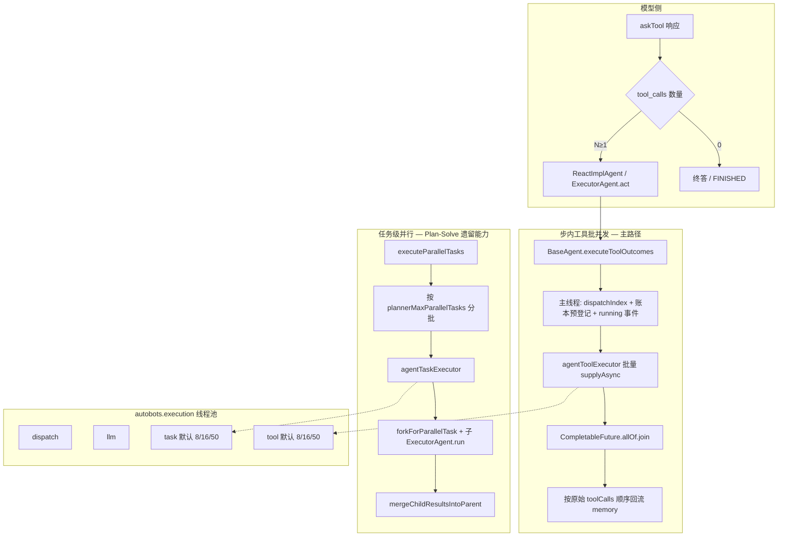
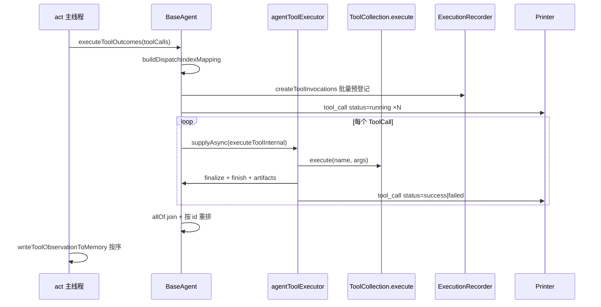
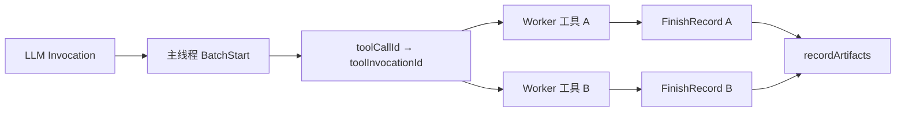
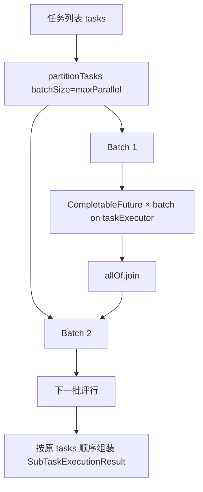

AI4S-agent 在一次 ReAct 步骤里若拿到 **多个 tool_calls**，不会串行排队，而是在受控线程池上 **批量并发执行**，并在账本、SSE 与记忆回流上保持 **可复现的顺序语义**。本页聚焦两层并发：步内工具批并发（主路径）与 Plan-Solve 遗留的任务级并行（分批限流），以及它们如何与 `parallel_tool_calls`、执行器池、ThreadLocal 产物上下文协同。

## 问题边界：模型并行 vs 运行时并行

多工具并发在本系统里拆成两段契约：

| 层级 | 决策者 | 关键能力 | 默认行为 |
|------|--------|----------|----------|
| **模型侧** | LLM / 网关 | 一次响应产出多个 tool call | 由 `extParams.parallel_tool_calls` 映射到 OpenAI Options |
| **运行时侧** | `BaseAgent` | 真正执行工具、写账本、推 SSE | 始终由 Agent 调度；Spring AI **关闭**内部自动执行 |
| **任务侧（遗留）** | Plan-Solve 节点 | 多子任务分批并行 | `plannerMaxParallelTasks` 限流 + `taskExecutor` |

模型侧只决定「这一步要不要同时给出多个工具调用」；真正的吞吐与隔离由运行时 `executeToolOutcomes` 与专用线程池完成。Spring AI 仅负责产出 tool calls，`internalToolExecutionEnabled(false)` 强制执行权回到 Agent。

Sources: [OpenAiChatOptionsFactory.java](AI4S-agent-domain/src/main/java/org/wwz/ai/domain/agent/runtime/llm/OpenAiChatOptionsFactory.java#L37-L57)
Sources: [OpenAiChatOptionsFactory.java](AI4S-agent-domain/src/main/java/org/wwz/ai/domain/agent/runtime/llm/OpenAiChatOptionsFactory.java#L107-L110)
Sources: [OpenAiChatOptionsFactoryTest.java](AI4S-agent-app/src/test/java/org/wwz/ai/test/spring/ai/OpenAiChatOptionsFactoryTest.java#L26-L46)

## 架构总览：两层并发与四池执行器

主链路命名执行器由 `AgentExecutorConfiguration` 装配：`agentDispatchExecutor`、`agentLlmExecutor`、`agentTaskExecutor`、`agentToolExecutor`。工具批并发绑定 **tool** 池；任务级并行绑定 **task** 池。`AI4SRuntimeDependencies` 以 typed bundle 注入，domain 不直接碰 Spring 容器。

Sources: [AgentExecutorNames.java](AI4S-agent-types/src/main/java/org/wwz/ai/types/agent/config/AgentExecutorNames.java#L6-L12)
Sources: [AgentExecutorConfiguration.java](AI4S-agent-app/src/main/java/org/wwz/ai/config/AgentExecutorConfiguration.java#L24-L42)
Sources: [AgentExecutorProperties.java](AI4S-agent-types/src/main/java/org/wwz/ai/types/agent/config/AgentExecutorProperties.java#L16-L79)
Sources: [AI4SRuntimeDependencies.java](AI4S-agent-domain/src/main/java/org/wwz/ai/domain/agent/runtime/AI4SRuntimeDependencies.java#L45-L95)

## 主路径：步内多 tool_call 批并发

### 入口：act() 一次提交整批

`ReactImplAgent` 与 `ExecutorAgent` 在 `act()` 中若 `toolCalls` 非空，统一调用父类 `executeToolOutcomes(toolCalls)`，再 **在主线程** 按原始列表顺序写 observation、推 `tool_result`（部分自带 SSE 的工具会跳过二次推送）。

Sources: [ReactImplAgent.java](AI4S-agent-domain/src/main/java/org/wwz/ai/domain/agent/runtime/agent/ReactImplAgent.java#L188-L220)
Sources: [ExecutorAgent.java](AI4S-agent-domain/src/main/java/org/wwz/ai/domain/agent/runtime/agent/ExecutorAgent.java#L121-L155)

### executeToolOutcomes：并行执行 + 顺序回流

核心算法固定为四段：

1. **主线程预热**：`buildDispatchIndexMapping`（从 1 递增）、`ensureToolInvocationIds` / 账本批量 `createToolInvocations`、全量 `emitToolCallRunningEvents`。
2. **并行体**：对每个 `ToolCall` 使用 `AgentExecutorSupport.supplyAsync(toolExecutor, "toolBatch", …)`；结果写入 `ConcurrentHashMap`；在 worker 内完成 `finalizeToolExecutionOutcome`、`finishToolInvocation`、`recordToolArtifacts`、终态 SSE。
3. **汇合**：`CompletableFuture.allOf(...).join()` 阻塞到整批结束。
4. **有序视图**：再按 **原始 `commands` 顺序** 装入 `LinkedHashMap`，保证后续 memory 与聚合结果稳定。

单工具路径 `executeToolOutcome` 复用同一套内部执行与账本逻辑，但不走批并行。

| 关注点 | 实现选择 | 效果 |
|--------|----------|------|
| 结果容器 | `ConcurrentHashMap` | 多 worker 无锁写 |
| 对外顺序 | join 后按 `commands` 重建 `LinkedHashMap` | 与 LLM 给出的 tool_call 顺序一致 |
| dispatchIndex | 并行前一次性编号 | 运行中/终态/账本共用同一序号 |
| 拒绝策略 | `AgentExecutorSupport` 捕获 `RejectedExecutionException` | 统一为「系统繁忙」语义 |
| 缺省执行器 | `resolveToolExecutor()` 回退 `Runnable::run` | 无依赖时退化为同步，便于测试 |

Sources: [BaseAgent.java](AI4S-agent-domain/src/main/java/org/wwz/ai/domain/agent/runtime/agent/BaseAgent.java)（`executeToolOutcomes` / `buildDispatchIndexMapping` / `resolveToolExecutor`）
Sources: [AgentExecutorSupport.java](AI4S-agent-domain/src/main/java/org/wwz/ai/domain/agent/runtime/executor/AgentExecutorSupport.java#L21-L43)

### 单工具内部：取消、Plan 门禁与产物 ThreadLocal

`executeToolInternal` 在 worker 线程中执行，关键隔离点是：

- **取消**：`context.isRunCancelled()` 时短路失败，observation 为「用户已停止」。
- **Plan Mode 门禁**：`PlanModeToolPolicy.denyReason` 在真正 `availableTools.execute` 前拦截写业务类工具。
- **产物上下文**：`bindCurrentToolArtifactSource` / `clearCurrentToolArtifactSource` 使用 **ThreadLocal**，保证并发工具各自登记 artifact 时不串源。
- **结果归一化**：`ToolResultPayload` / 字符串 / 对象统一成 `ToolExecutionOutcome`（success/failure + llmObservation + structuredOutput）。

`ToolCollection.execute` 本身仍是同步路由（本地 `BaseTool` 或 MCP），并发粒度在 **调用次数** 上，而不是工具实现内部再开池（除非工具自身异步）。

Sources: [BaseAgent.java](AI4S-agent-domain/src/main/java/org/wwz/ai/domain/agent/runtime/agent/BaseAgent.java)（`executeToolInternal`）
Sources: [ToolCollection.java](AI4S-agent-domain/src/main/java/org/wwz/ai/domain/agent/runtime/tool/ToolCollection.java#L141-L175)
Sources: [AgentContext.java](AI4S-agent-domain/src/main/java/org/wwz/ai/domain/agent/runtime/agent/AgentContext.java)（`bindCurrentToolArtifactSource` / `requireCurrentToolArtifactSource`）

## 顺序与可观测：dispatchIndex · 账本 · SSE

批并发的难点不在「能不能同时跑」，而在 **前端卡片、执行账本、记忆三者顺序一致**。

### 1. dispatchIndex

并行前按 tool_call 列表顺序赋 `1..N`。running 与 finished 事件都携带同一 `dispatchIndex`；前端可用同一 `messageId=toolCallId` 原位覆盖 running 卡片。

### 2. 账本批量预登记

`preRegisterToolInvocations` 在主线程构造 `ToolInvocationBatchStartRecord`：每个 Item 含 `toolCallId`、`dispatchIndex`、`toolName`、`toolProvider`、`inputJson`、`startedAt`，并绑定当前 `llmInvocationId` / `agentName` / `stepNo`。worker 完成后再 `finishToolInvocation` 写终态与 observation。

### 3. SSE payload 字段

`tool_call` 事件核心字段：`status`（running/success/failed）、`toolName`、`toolCallId`、`toolProvider`、`dispatchIndex`、`toolInvocationId`、`input`、`summary`、`isFinal`、可选 `errorMsg`。`printer.send(toolCallId, "tool_call", payload, isFinal)` 以 toolCallId 作 messageId，支持原位更新。

### 4. 记忆回流仍在主线程

并行只负责产出 `Map<toolCallId, ToolExecutionOutcome>`；`act()` 再按 **原始 toolCalls 顺序** 调用 `writeToolObservationToMemory`。function_call 模式追加 `tool` 角色消息；struct_parse 则拼到最后一条 assistant 内容。这样 LLM 下一轮看到的 tool 结果顺序与模型发出的 call 顺序一致。

Sources: [ToolInvocationBatchStartRecord.java](AI4S-agent-domain/src/main/java/org/wwz/ai/domain/agent/ledger/model/ToolInvocationBatchStartRecord.java#L18-L52)
Sources: [ToolInvocationFinishRecord.java](AI4S-agent-domain/src/main/java/org/wwz/ai/domain/agent/ledger/model/ToolInvocationFinishRecord.java#L15-L38)
Sources: [BaseAgent.java](AI4S-agent-domain/src/main/java/org/wwz/ai/domain/agent/runtime/agent/BaseAgent.java)（`emitToolCallEvent` / `preRegisterToolInvocations` / `writeToolObservationToMemory`）

## 并发安全：共享上下文如何不互相踩踏

| 共享对象 | 并发策略 | 说明 |
|----------|----------|------|
| **结果 Map** | `ConcurrentHashMap` | 按 toolCallId 写 outcome |
| **toolInvocation 映射** | `ConcurrentMap` in `AgentRunState` | 主线程 `bindToolInvocationIds` 后 worker 只读 resolve |
| **执行位置 / 当前 LLM** | `ThreadLocal` in `AgentRunState` | 兼容 PlanSolve 多 executor 线程内视图 |
| **当前工具产物源** | `ThreadLocal<ToolArtifactSource>` | 每 worker 独立 bind/clear |
| **产物登记簿** | `ToolArtifactRegistry` 方法级 `synchronized` | 多工具同时 `registerGeneratedFile` 安全 |
| **productFiles 列表** | registry 内同步维护兼容视图 | 去重后写入 |
| **ToolCollection.currentTask** | 文档中标注非并发安全 | 任务级 fork 时更应依赖子 context，而非共享可变 task 字段 |

`AgentRunState` 注释明确：需兼容 PlanSolve 并发 executor，因此 agent / step / llm invocation 采用线程内视图；toolCallId 映射则用全局 `ConcurrentHashMap`，供同 run 下所有线程解析账本 ID。

Sources: [AgentRunState.java](AI4S-agent-domain/src/main/java/org/wwz/ai/domain/agent/ledger/model/AgentRunState.java#L12-L99)
Sources: [ToolArtifactRegistry.java](AI4S-agent-domain/src/main/java/org/wwz/ai/domain/agent/runtime/artifact/ToolArtifactRegistry.java#L15-L76)
Sources: [ToolCollection.java](AI4S-agent-domain/src/main/java/org/wwz/ai/domain/agent/runtime/tool/ToolCollection.java#L76-L81)

## 线程池与背压

### 默认容量

| 池 | Bean 名 | core | max | queue | 前缀 | 默认拒绝 |
|----|---------|------|-----|-------|------|----------|
| dispatch | `agentDispatchExecutor` | 16 | 32 | 200 | `agent-dispatch-` | AbortPolicy |
| llm | `agentLlmExecutor` | 16 | 32 | 100 | `agent-llm-` | AbortPolicy |
| **tool** | `agentToolExecutor` | **8** | **16** | **50** | `agent-tool-` | AbortPolicy |
| **task** | `agentTaskExecutor` | **8** | **16** | **50** | `agent-task-` | AbortPolicy |

配置前缀：`autobots.execution.tool.*` / `autobots.execution.task.*`。Abort 时 `AgentExecutorSupport` 抛出 `AgentExecutorBusyException`（文案含「系统繁忙，请稍后重试」），避免无界排队拖垮 JVM。

`AgentExecutorConfiguration` 还将 tool 池的 `ThreadPoolExecutor` 暴露为 legacy armory 使用的 `threadPoolExecutor` Bean，避免匿名线程池漂移。

Sources: [AgentExecutorProperties.java](AI4S-agent-types/src/main/java/org/wwz/ai/types/agent/config/AgentExecutorProperties.java#L29-L79)
Sources: [AgentExecutorConfiguration.java](AI4S-agent-app/src/main/java/org/wwz/ai/config/AgentExecutorConfiguration.java#L39-L88)
Sources: [AgentExecutorSupport.java](AI4S-agent-domain/src/main/java/org/wwz/ai/domain/agent/runtime/executor/AgentExecutorSupport.java#L16-L53)

### 与 ThreadUtil 的关系

`ThreadUtil` 是历史通用池（SynchronousQueue + 静默拒绝），**主链路多工具并发不走它**。生产路径应只依赖 `AI4SRuntimeDependencies.toolExecutor` / `taskExecutor`。

Sources: [ThreadUtil.java](AI4S-agent-domain/src/main/java/org/wwz/ai/domain/agent/runtime/util/ThreadUtil.java#L7-L30)

## 第二层：Plan-Solve 任务级并行（遗留编排能力）

当前 PlanSolve **主路径**已收敛为单 `ReactImplAgent` 循环（工具批并发即上文主路径）。`Step2PlanExecuteNode` 仍保留 `executeParallelTasks` 等 protected 能力，供历史/测试与嵌套 hardening 场景使用。

### 分批限流算法

- 默认 `DEFAULT_PLANNER_MAX_PARALLEL_TASKS = 2`；可被 `AI4SConfig.plannerMaxParallelTasks` 覆盖（≤0 时回退默认）。
- 每一批内用 `AgentExecutorSupport.supplyAsync(..., "planSolveExecutorTask", ...)`。
- 子任务：`parentContext.forkForParallelTask(task)` → `buildForParallelTask` 重建工具集并恢复 task-scoped 状态 → 新 `ExecutorAgent` 拷贝父 memory 后 `run(task)`。
- 回流：`memoryIncrementMessages` 合并进父 memory；`reduceParentState` 聚合 ERROR / IDLE / FINISHED。

`forkForParallelTask` 共享：`requestId/sessionId`、`printer`、`runtimeDependencies`、`toolArtifactRegistry`、`executionRecorder`、`agentRunState`；**隔离**：`task` 文本、**新的** `ThreadLocal` 产物 holder、文件列表拷贝。这使嵌套「任务并行 × 工具批并行」时，账本 run 仍是同一条，而工具源绑定不串线。

Sources: [Step2PlanExecuteNode.java](AI4S-agent-domain/src/main/java/org/wwz/ai/domain/agent/service/execute/planexecute/step/Step2PlanExecuteNode.java#L55-L56)
Sources: [Step2PlanExecuteNode.java](AI4S-agent-domain/src/main/java/org/wwz/ai/domain/agent/service/execute/planexecute/step/Step2PlanExecuteNode.java)（`executeParallelTasks` / `executeSingleParallelTask` / `partitionTasks`）
Sources: [AgentContext.java](AI4S-agent-domain/src/main/java/org/wwz/ai/domain/agent/runtime/agent/AgentContext.java)（`forkForParallelTask`）
Sources: [AgentToolCollectionFactory.java](AI4S-agent-domain/src/main/java/org/wwz/ai/domain/agent/runtime/tool/factory/AgentToolCollectionFactory.java)（`buildForParallelTask`）
Sources: [SubTaskExecutionResult.java](AI4S-agent-domain/src/main/java/org/wwz/ai/domain/agent/runtime/dto/SubTaskExecutionResult.java#L12-L41)

集成测试用 `parallel_artifact_tool`（可 sleep / fail）验证：同一步多 tool 并发、产物按 toolCallId 绑定、嵌套任务并行下账本一致。

Sources: [PlanSolveExecutionLedgerIntegrationTest.java](AI4S-agent-app/src/test/java/org/wwz/ai/test/domain/PlanSolveExecutionLedgerIntegrationTest.java)（`parallel_artifact_tool` / `executeTools` 双 tool 场景）

## 模式对比与工程取舍

| 维度 | 步内工具批并发 | 任务级并行（遗留） |
|------|----------------|--------------------|
| 触发 | 单轮 LLM 返回多个 tool_calls | 显式任务列表 + `executeParallelTasks` |
| 执行器 | `toolExecutor` | `taskExecutor` |
| 限流 | 池 core/max/queue | 额外 `plannerMaxParallelTasks` 分批 |
| 上下文 | 同一 AgentContext | fork 子 context + 独立 ExecutorAgent |
| 记忆 | 主线程按序写 tool messages | 合并 child memory 增量 |
| 主路径 | ReAct / Executor / 现行 PlanSolve | 节点内 protected API，测试与 hardening |

**设计原则可概括为**：

1. **模型可并行、执行必受控** — 关闭 Spring AI 内部 tool execution。
2. **并行跑、顺序收** — worker 无序完成，对外顺序由原始列表与 dispatchIndex 锚定。
3. **账本先占坑再跑** — 主线程 batch start，避免并发 finish 抢 ID。
4. **ThreadLocal 管「当前」** — 工具源与执行位置；共享结构用 Concurrent / synchronized。
5. **拒绝即显式失败** — AbortPolicy + Busy 异常，不做无限缓冲。

## 配置与调优要点

| 配置项 | 作用 | 调优提示 |
|--------|------|----------|
| `llm.*.extParams.parallel_tool_calls` | 请求模型允许/禁止并行 tool calls | 网关不支持时关掉，避免协议错误 |
| `autobots.execution.tool.*` | 步内批并发容量 | I/O 型工具可略增 max；CPU/沙箱型保持保守 |
| `autobots.execution.task.*` | 任务级并行容量 | 与 `plannerMaxParallelTasks` 联动，避免任务×工具双重放大 |
| `ai4sConfig.plannerMaxParallelTasks` | 每批并行子任务数 | 默认 2；嵌套工具并发时更忌过大 |
| 拒绝策略 | 默认 Abort | 可改 CallerRuns（回压到调用线程，延迟升高） |

**常见风险**：同一批工具若共享非线程安全状态（例如未隔离的工作区写路径、全局可变 `currentTask`），会在并发下出现竞态——产物与账本层已加固，业务工具实现仍需无状态或按 `toolCallId` / session 隔离。

## 与相邻主题的边界

- 工具清单与产物协议见 [工具集合与产物登记](16-gong-ju-ji-he-yu-chan-wu-deng-ji)。
- ReAct think→act 单步语义见 [ReAct 执行链路](12-react-zhi-xing-lian-lu)。
- Plan-Solve 主循环与 replan 见 [Plan-Execute 执行链路](13-plan-execute-zhi-xing-lian-lu)、[混合模式与动态 Replan](14-hun-he-mo-shi-yu-dong-tai-replan)。
- 账本回放与 toolInvocation 投影见 [执行账本与历史回放](26-zhi-xing-zhang-ben-yu-li-shi-hui-fang)。
- 前端 running/success 卡片与 SSE 见 [SSE 流式对话与结果渲染](27-sse-liu-shi-dui-hua-yu-jie-guo-xuan-ran)。

**本页结论**：多工具并发调度的「正确性」= 受控线程池上的批并行 + 主线程顺序回流 + 账本/SSE 的 dispatchIndex 锚定 + ThreadLocal/并发集合对共享上下文的隔离。吞吐由 tool/task 池与（遗留）任务分批共同背压，而不是无界 fire-and-forget。