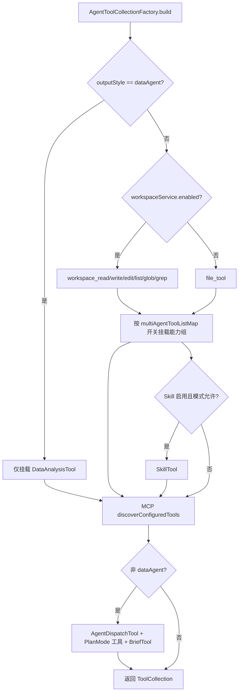
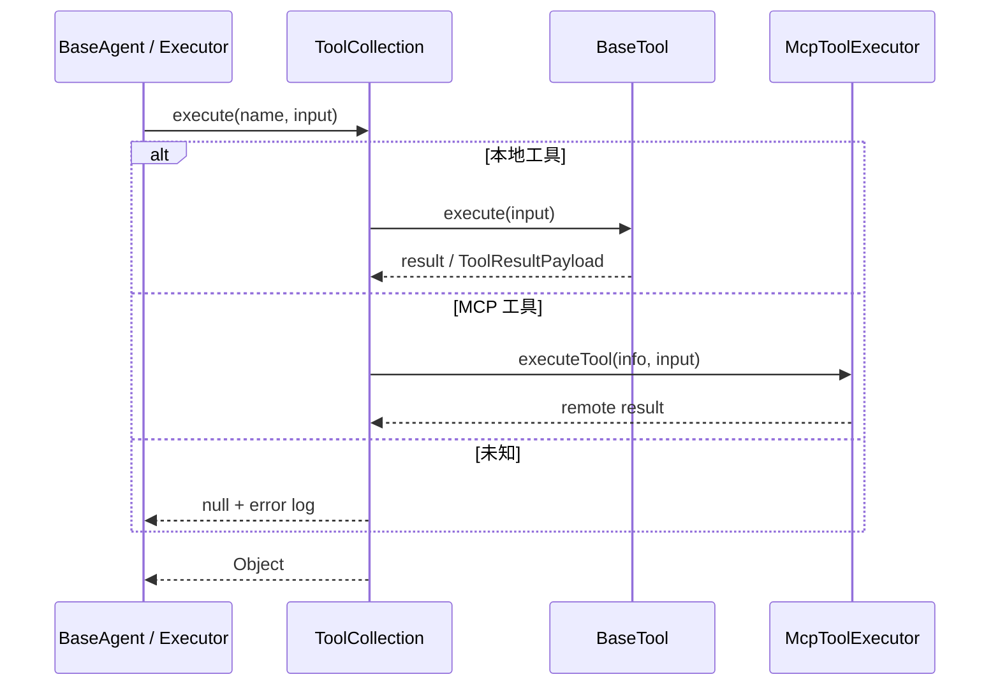
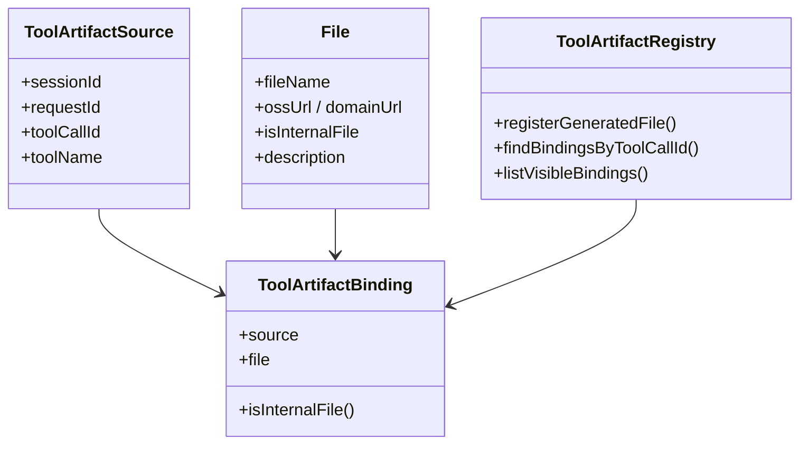
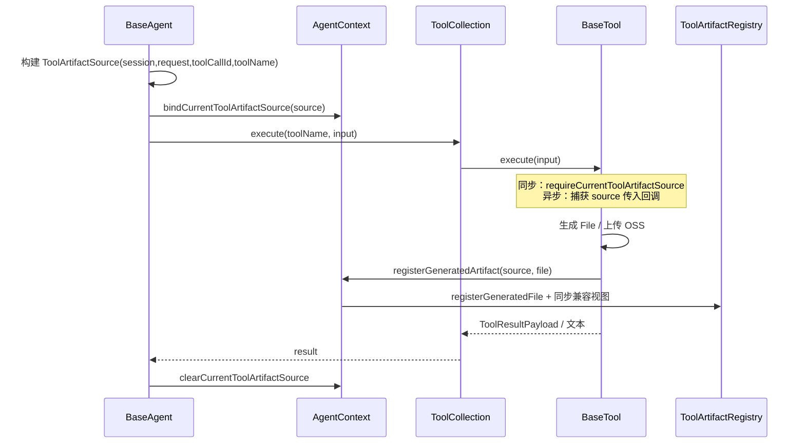

工具集合与产物登记是 AI4S Agent 执行内核的能力底座：前者决定一次 run 里 **LLM 能看到并调用哪些动作**，后者保证 **工具产出的文件可追溯、可回放、可进入总结上下文**。两者通过 `AgentContext` 串成统一闭环——工具在集合中被装配与调度，产物在登记簿中按 `toolCallId` 绑定来源。

本文聚焦 **装配策略、工具分类、执行入口、产物登记协议**；具体工具的深层实现（DeepSearch 链路、沙箱执行、Report 多格式生成、MCP/Skill 协议）分别见后续专页。

## 核心对象与职责边界

运行时存在四类关键对象，职责严格分层，避免“工具实现里顺手改全局文件列表”造成的并发与归属混乱。

| 对象 | 位置 | 职责 |
|------|------|------|
| `BaseTool` | 工具契约 | 统一 `getName` / `getDescription` / `toParams` / `execute` |
| `ToolCollection` | 请求级容器 | 持有本地工具 Map + MCP 工具 Map，提供统一 `execute` |
| `AgentToolCollectionFactory` | 装配工厂 | 按模式/配置/开关拼装一套工具集合 |
| `ToolArtifactRegistry` | 产物登记簿 | 以 binding 为唯一事实源，同步兼容视图 `productFiles` / `taskProductFiles` |

`BaseTool` 是所有本地工具的最小契约：名称是集合内的唯一键，参数 schema 以 `Map` 形式交给 LLM function calling，`execute` 接收已解析的入参对象。

Sources: [BaseTool.java](AI4S-agent-domain/src/main/java/org/wwz/ai/domain/agent/runtime/tool/BaseTool.java#L1-L16)

`ToolCollection` 同时管理两类工具：**本地 BaseTool** 与 **远程 McpToolInfo**。执行时优先查本地 `toolMap`，未命中再走 `mcpToolMap` + `McpToolExecutor`；额外维护「工具名 → 数字员工」映射，用于前端展示归属。

Sources: [ToolCollection.java](AI4S-agent-domain/src/main/java/org/wwz/ai/domain/agent/runtime/tool/ToolCollection.java#L39-L175)

## 工具集合装配流水线

ReAct 与 Plan-Execute 共用同一工厂，避免节点层重复拼装。入口分为：

- `buildForReact` — ReAct 主路径
- `buildForPlanSolve` — 规划执行路径
- `buildForParallelTask` — 并行子任务：基于 PlanSolve 构建，并 **恢复父集合的任务级状态快照**

Sources: [AgentToolCollectionFactory.java](AI4S-agent-domain/src/main/java/org/wwz/ai/domain/agent/runtime/tool/factory/AgentToolCollectionFactory.java#L104-L120)

装配决策可概括为下图：

**默认能力开关** 来自 `AI4SConfig.multiAgentToolListMap["default"]`，缺省串为：

`search,web_fetch,web_search,code,code_execution,report,docgen,docread,dataprep,canvas,multimodalagent,image_generation,data_analysis`

配置项是 **能力组别名**（如 `docgen` 一次挂载 8 个文档生成工具），而非单个工具名。

Sources: [AgentToolCollectionFactory.java](AI4S-agent-domain/src/main/java/org/wwz/ai/domain/agent/runtime/tool/factory/AgentToolCollectionFactory.java#L122-L148)

## 工具分类总览

下表按装配维度列出默认能力组与代表性工具名（`getName()` 返回值）。MCP 工具名由远端服务声明，不在此表硬编码。

| 能力组 / 开关 | 工具名（示例） | 作用摘要 | 典型是否登记文件产物 |
|---------------|----------------|----------|----------------------|
| workspace 开启 | `workspace_read` 等 6 个 | 会话 cwd 读写/检索，对齐 Read/Write/Edit 语义 | 写路径经 `WorkspaceFileRegistration` 登记 |
| workspace 关闭 | `file_tool` | 上传/下载 OSS 文件 | upload 时登记 |
| `code` | CodeInterpreter 工具名 | 远程代码解释器 | 是 |
| `code_execution` | `code_execution` | 直接代码执行 | 是 |
| `search` | `deep_search` | 深度检索 + 中间/最终结果落盘 | 是（常经 FileTool 上传） |
| `web_fetch` / `web_search` | WebFetch / WebSearch | 抓取与检索网页 | 视实现 |
| `report` | `report_tool` | HTML/Markdown 等报告 | 是 |
| `docgen` | document/slides/excel/… | 多格式文档生成 | 是（`AbstractDocGenTool`） |
| `docread` | csv/excel/pdf/word/ocr… | 多格式文档解析 | 可登记中间产物 |
| `dataprep` | aggregate/clean/merge/… | 数据准备与 SQL | 视实现 |
| `canvas` / genui | canvas_publish、emit_ui_* 等 | 画布与 GenUI 发布 | 是 |
| `image_generation` | ImageGeneration | 图像生成 | 是 |
| `multimodalagent` | MultiModalAgent | 多模态子流程 | 是 |
| `data_analysis` | DataAnalysis | 数据分析 | 是 |
| dataAgent 模式 | 仅 DataAnalysis | 数据分析专用精简集合 | 是 |
| 始终（非 dataAgent） | Task* / Enter|ExitPlanMode / AskUser / Brief | 计划模式与任务列表 | 计划文件走 PlanArtifactStore |
| Skill 条件挂载 | SkillTool | 技能目录/脚本能力入口 | 视脚本 |
| MCP 发现 | 远端工具名 | 远程 MCP 协议工具 | 由执行器决定 |
| 子智能体 | AgentDispatch | 同步派发子 Agent | 共享父级登记簿 |

Sources: [AgentToolCollectionFactory.java](AI4S-agent-domain/src/main/java/org/wwz/ai/domain/agent/runtime/tool/factory/AgentToolCollectionFactory.java#L129-L320)

### Workspace 与 FileTool 互斥

Workspace 启用时，Agent **面向 LLM 暴露 cwd 系工具**，`file_tool` 退化为内部适配（例如 DeepSearch 落盘仍可内部调用 `FileTool.uploadFile`），避免两套文件语义同时出现在 function schema 中。

Sources: [AgentToolCollectionFactory.java](AI4S-agent-domain/src/main/java/org/wwz/ai/domain/agent/runtime/tool/factory/AgentToolCollectionFactory.java#L134-L141)

### Plan Mode 与 Brief

非 `dataAgent` 场景固定挂载：`TaskCreate` / `TaskGet` / `TaskUpdate` / `TaskList` / `TodoWrite` / `TaskStop` / `EnterPlanMode` / `ExitPlanMode`，以及可选的 `AskUserQuestion` 与 `BriefTool`。这些工具管理的是 **任务列表与计划审批状态**，与文件产物登记簿正交，但 ExitPlanMode 仍可读取当前 `ToolArtifactSource` 以补齐事件关联字段。

Sources: [AgentToolCollectionFactory.java](AI4S-agent-domain/src/main/java/org/wwz/ai/domain/agent/runtime/tool/factory/AgentToolCollectionFactory.java#L305-L360)

### Skill 与 MCP 的附加条件

- **Skill**：`SkillRegistry` 启用且非空，并按 `SkillAttachScope` 检查 `reactEnabled` / `planSolveEnabled`；当前只挂载 `SkillTool`（路径浏览并入 workspace，不再单独挂 script_runner）。
- **MCP**：`mcpToolExecutor.discoverConfiguredTools()` 结果批量 `addMcpTool`；失败只记日志，不阻断本地工具集合。

Sources: [AgentToolCollectionFactory.java](AI4S-agent-domain/src/main/java/org/wwz/ai/domain/agent/runtime/tool/factory/AgentToolCollectionFactory.java#L286-L490)

## 统一执行入口

`ToolCollection.execute(name, toolInput)` 是 Agent 侧唯一调度入口：

1. `toolMap` 命中 → `BaseTool.execute`
2. 否则 `mcpToolMap` 命中 → `McpToolExecutor.executeTool`
3. 否则记 error 并返回 `null`

Sources: [ToolCollection.java](AI4S-agent-domain/src/main/java/org/wwz/ai/domain/agent/runtime/tool/ToolCollection.java#L140-L175)

## 产物登记：唯一事实源协议

### 为什么需要登记簿

历史上文件列表散落在 `productFiles`（会话级）与 `taskProductFiles`（任务级）。并发工具、子 Agent、异步 SSE 回调会让「谁产生了哪个文件」难以还原。`ToolArtifactRegistry` 明确：**binding 列表是唯一可信数据源**，两个 List 只是兼容视图。

Sources: [ToolArtifactRegistry.java](AI4S-agent-domain/src/main/java/org/wwz/ai/domain/agent/runtime/artifact/ToolArtifactRegistry.java#L11-L53)

### 三元组模型

- **`ToolArtifactSource`**：单次工具调用的不可变快照；创建后不改，可跨线程传递（异步流回调必须显式捕获）。
- **`File`**：运行时文件 DTO，`isInternalFile=true` 表示不对用户任务产物可见。
- **`ToolArtifactBinding`**：source + file 的显式绑定。

Sources: [ToolArtifactSource.java](AI4S-agent-domain/src/main/java/org/wwz/ai/domain/agent/runtime/artifact/ToolArtifactSource.java#L1-L17) · [ToolArtifactBinding.java](AI4S-agent-domain/src/main/java/org/wwz/ai/domain/agent/runtime/artifact/ToolArtifactBinding.java#L1-L19) · [File.java](AI4S-agent-domain/src/main/java/org/wwz/ai/domain/agent/runtime/dto/File.java#L1-L22)

### AgentContext 上的登记 API

上下文默认内嵌一个 `ToolArtifactRegistry`，并用 `ThreadLocal<ToolArtifactSource>` 绑定「当前线程正在执行的工具调用」。对外方法：

| 方法 | 行为 |
|------|------|
| `bindCurrentToolArtifactSource` / `clear…` | 工具执行前后挂/清 ThreadLocal |
| `requireCurrentToolArtifactSource(toolName)` | 同步工具强制取源；缺失抛 `IllegalStateException` |
| `registerGeneratedArtifact(source, file)` | 写入 registry，并同步 `productFiles` / 非内部的 `taskProductFiles` |
| `getArtifactBindingsByToolCallId` | 按调用 ID 反查 |
| `getVisibleArtifactBindings` / `getVisibleArtifactFiles` | 过滤 `isInternalFile` |

Sources: [AgentContext.java](AI4S-agent-domain/src/main/java/org/wwz/ai/domain/agent/runtime/agent/AgentContext.java#L198-L400)

### 去重与可见性

`registerGeneratedFile` 对 binding 按 **toolCallId + toolName + fileName + fileUrl + internal 标志** 去重；可见绑定过滤 `isInternalFile`。内部文件（如 DeepSearch 中间 search 结果）进入 `productFiles` 供后续工具引用，但 **不进入** `taskProductFiles`，避免污染任务级对外产物。

Sources: [ToolArtifactRegistry.java](AI4S-agent-domain/src/main/java/org/wwz/ai/domain/agent/runtime/artifact/ToolArtifactRegistry.java#L28-L120)

### 格式化与总结注入

`ToolArtifactFormatter` 生成两种文本：

- 工具 observation 侧的「关联文件」摘要（`artifactKey = toolCallId::fileName`）
- Summary 阶段上下文行（含 toolName、fileUrl 等）

URL 解析优先级：`originOssUrl` → `originDomainUrl` → `ossUrl` → `domainUrl`。

Sources: [ToolArtifactFormatter.java](AI4S-agent-domain/src/main/java/org/wwz/ai/domain/agent/runtime/artifact/ToolArtifactFormatter.java#L13-L110)

## 端到端：从工具调用到产物落账

**同步工具**（如 `file_tool` upload）在 `execute` 内 `requireCurrentToolArtifactSource` 后立即登记。  
**流式/异步工具**（如 `report_tool`、`deep_search`）必须在 `execute` 阶段捕获 source，并传入回调线程；SSE final 事件里再 `registerGeneratedArtifact`，避免 ThreadLocal 跨线程丢失。

典型登记点示例：

- `ReportTool`：final 响应中的 `fileInfo` 逐条构建 `File` 并登记。
- `FileTool`：upload 成功后登记；DeepSearch 等内部调用可指定 `isInternalFile`。
- `AbstractDocGenTool` / `AbstractDocReadTool`：解析返回文件数组后批量 `registerFiles`。

Sources: [ReportTool.java](AI4S-agent-domain/src/main/java/org/wwz/ai/domain/agent/runtime/tool/common/ReportTool.java#L99-L175) · [FileTool.java](AI4S-agent-domain/src/main/java/org/wwz/ai/domain/agent/runtime/tool/common/FileTool.java#L85-L192) · [DeepSearchTool.java](AI4S-agent-domain/src/main/java/org/wwz/ai/domain/agent/runtime/tool/common/DeepSearchTool.java#L114-L250)

## 并发、子 Agent 与兼容视图

| 场景 | 策略 |
|------|------|
| 并行子任务 `forkForParallelTask` | **共享** 同一 `toolArtifactRegistry` 与 run 账本；复制 `productFiles`/`taskProductFiles` 兼容视图；**新建** ThreadLocal holder |
| 子 Agent `SubAgentContextFactory` | 继承父级 `toolArtifactRegistry`，保证子调用产物归入同一请求登记簿 |
| 并行 Task 工具集合 | `buildForParallelTask` 恢复父 `ToolCollection` 的任务级快照（数字员工等） |

Sources: [AgentContext.java](AI4S-agent-domain/src/main/java/org/wwz/ai/domain/agent/runtime/agent/AgentContext.java#L420-L460) · [AgentToolCollectionFactory.java](AI4S-agent-domain/src/main/java/org/wwz/ai/domain/agent/runtime/tool/factory/AgentToolCollectionFactory.java#L112-L120)

## 与执行账本的衔接（边界说明）

运行期登记簿解决 **一次 request 内** 的归属；持久化侧由 ledger 的 `ArtifactRecord` 承接（`runId` / `toolCallId` / `artifactRole` / `visibility` / `sourceType` 等）。工具结构化输出（`ReportToolOutput`、`FileToolOutput` 等）经 `ToolResultPayload` 进入账本，供历史回放 projector 使用。详细读写与回放见 [执行账本与历史回放](26-zhi-xing-zhang-ben-yu-li-shi-hui-fang)。

Sources: [ArtifactRecord.java](AI4S-agent-domain/src/main/java/org/wwz/ai/domain/agent/ledger/entity/ArtifactRecord.java#L10-L74)

## 设计要点小结

1. **装配集中化**：所有 PlanSolve / ReAct 工具集经 `AgentToolCollectionFactory`，配置驱动能力组，特殊模式（dataAgent、workspace、Skill）显式分支。  
2. **执行统一化**：本地与 MCP 共用 `ToolCollection.execute`，数字员工映射只影响展示。  
3. **产物来源单一化**：`ToolArtifactRegistry` 为唯一事实源；兼容 List 只读同步；内部文件与可见产物分离。  
4. **来源可跨线程**：`ToolArtifactSource` 不可变 + 同步 ThreadLocal / 异步显式传递，杜绝归属漂移。  
5. **扩展点清晰**：新增本地工具 = 实现 `BaseTool` + 工厂条件 `addTool` + 产出文件时调用 `registerGeneratedArtifact`；MCP/Skill 走各自注册表。

## 延伸阅读

- 检索与抓取细节：[DeepSearch 与 WebFetch](17-deepsearch-yu-webfetch)
- 代码执行与沙箱：[CodeInterpreter 与沙箱执行](18-codeinterpreter-yu-sha-xiang-zhi-xing)
- 报告多格式：[Report 与多格式产物生成](19-report-yu-duo-ge-shi-chan-wu-sheng-cheng)
- MCP 协议：[MCP 注册与协议适配](20-mcp-zhu-ce-yu-xie-yi-gua-pei)
- Skill 与脚本：[Skill 体系与脚本运行](21-skill-ti-xi-yu-jiao-ben-yun-xing)
- 工作区文件生命周期：[会话工作区与文件复用](22-hui-hua-gong-zuo-qu-yu-wen-jian-fu-yong)
- 账本持久化与回放：[执行账本与历史回放](26-zhi-xing-zhang-ben-yu-li-shi-hui-fang)