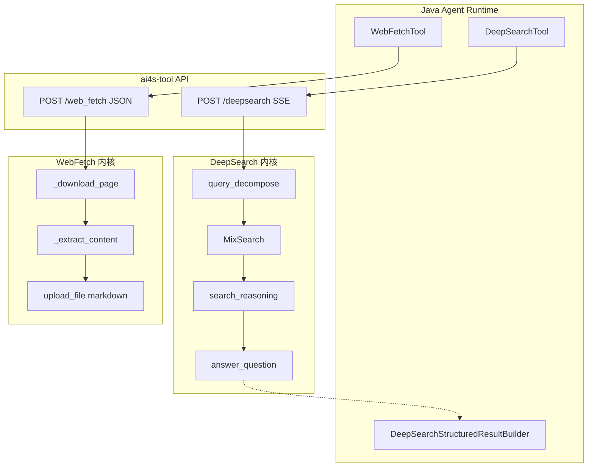
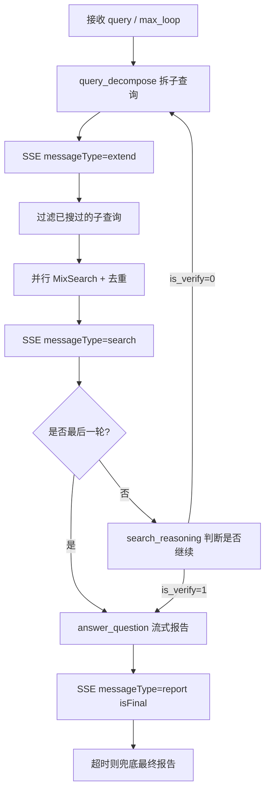
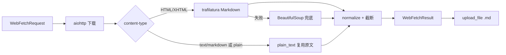

DeepSearch 与 WebFetch 是 AI4S-agent 对外网信息获取的两条互补能力：前者做**多引擎、多轮、可推理的深度检索并生成带引用报告**；后者做**单 URL 精准抓取并落盘 Markdown 正文**。两者均由 Java Agent 工具层发起，经 HTTP/SSE 调用 Python `ai4s-tool` 运行时完成实际检索与抽取，再把结构化结果与文件产物回灌到工作区与执行账本。

本文聚焦这两条链路的职责边界、端到端流程、引擎选型、SSE 事件协议与关键配置，不展开通用工具注册体系或其它工具实现。

## 能力定位与职责边界

**DeepSearch** 面向“开放问题需要跨源综合回答”的场景：先把用户问题拆成多个可检索子查询，再并发调用若干搜索引擎，抓取网页正文、去重累计，必要时多轮补搜，最后基于累计材料流式生成中文报告。它返回的是**过程事件 + 最终报告**，过程中会暴露子查询与命中文档摘要，便于前端渲染检索进度。

**WebFetch** 面向“已知具体 URL，需要完整正文”的场景：下载单个页面，优先用 trafilatura 提取 Markdown 正文，失败则回退 BeautifulSoup；完整正文上传为 `.md` 附件，同时向模型返回可截断的内联正文。它返回的是**一次性 JSON + 文件产物**，不走多轮推理。

| 维度 | DeepSearch | WebFetch |
|------|------------|----------|
| 输入 | 自然语言 query | 单个 http(s) URL |
| 核心目标 | 多源检索 + 综合报告 | 单页正文提取 |
| 通信方式 | SSE 流式 | 同步 JSON |
| 产物 | 过程 docs + 最终 answer | 内联 content + 完整 Markdown 文件 |
| 多轮推理 | 支持 max_loop | 无 |
| 默认超时 | 总超时 1200s | 单次下载 30s（5–300 可配） |

Sources: [deepsearch.py](ai4s-tool/ai4s_tool/tool/deepsearch.py#L1-L36), [web_fetcher.py](ai4s-tool/ai4s_tool/tool/web_fetcher.py#L1-L72), [tool.py](ai4s-tool/ai4s_tool/api/tool.py#L368-L420)

## 整体架构关系

从调用链看，Agent 执行内核在工具调用阶段选中 `deep_search` 或 `web_fetch` 后，由 Java 侧工具类组装请求并调用 Python `/v1/tool/deepsearch` 或 `/v1/tool/web_fetch`。DeepSearch 再下沉到 `search_component` 子模块完成拆解、混合检索、推理与回答；WebFetch 则由 `WebFetcher` 独立完成下载与抽取，并通过文件服务登记 Markdown 产物。

上图强调两点：DeepSearch 是**闭环多阶段流水线**；WebFetch 是**线性抓取落盘**。Java 侧对 DeepSearch 还有结构化结果构建与账本投影，用于历史回放与前端阶段展示。

Sources: [tool.py](ai4s-tool/ai4s_tool/api/tool.py#L1-L56), [tool.py](ai4s-tool/ai4s_tool/api/tool.py#L368-L420), [deepsearch.py](ai4s-tool/ai4s_tool/tool/deepsearch.py#L14-L36)

## DeepSearch 主循环

`DeepSearch.run` 以 `max_loop` 控制最大检索轮次，默认总超时 `DEEPSEARCH_TOTAL_TIMEOUT_SECONDS=1200`。每一轮都按同一骨架推进，直到达到轮次上限或推理判定“材料已足够”。

关键实现细节如下。

**查询拆解**分两步 LLM 调用：先用 think 模型产出“为何还要继续搜”的草稿，再用 decompose 模型按 Markdown 列表生成不超过 `QUERY_DECOMPOSE_MAX_SIZE` 的子查询。解析规则是匹配每行 `- 子查询`。

**并行检索**通过线程池（`SEARCH_THREAD_NUM`，默认 5）为每个子查询跑一次 `MixSearch.search_and_dedup`，再在跨查询结果上按 content 去重。累计文档写入 `current_docs`，已搜子查询写入 `searched_queries`，避免重复劳动。

**推理闸门**调用 `search_reasoning`：模型输出 JSON（经 `json_repair` 修复），解析 `is_answer` 为 `is_verify`。为 1 则结束循环；为 0 则进入下一轮。注意：当前主循环在继续搜时仍对**原始 query** 再次拆解，而不是直接消费 `rewrite_query` 字段——`rewrite_query` 主要用于评估解释与提示词语境。

**最终回答**把累计文档格式化为带编号的 HTML（`文档编号〔i〕`），按模型上下文长度约 80% 截断后交给 `answer_question` 流式生成。流式模式下按 `stream_mode.token` 批量推送 `messageType=report` 的 answer 片段，最后再推 `isFinal=true`。

Sources: [deepsearch.py](ai4s-tool/ai4s_tool/tool/deepsearch.py#L68-L267), [query_process.py](ai4s-tool/ai4s_tool/tool/search_component/query_process.py#L22-L72), [reasoning.py](ai4s-tool/ai4s_tool/tool/search_component/reasoning.py#L19-L61), [answer.py](ai4s-tool/ai4s_tool/tool/search_component/answer.py#L18-L42)

## 混合检索引擎 MixSearch

`MixSearch` 在一次查询中可并发启用多引擎，再统一走 `SearchBase.parser` 补全正文并按 content 去重。DeepSearch 默认把 `use_jina_reader=False` 绑进 partial，即**深度搜索默认直连抓取页面**，只有显式开启时才走 Jina Reader。

| 引擎键 | 实现类 | 主要配置 | 结果字段映射 |
|--------|--------|----------|--------------|
| `ddg` | `DDGSearch` | `DDG_REGION` / `DDG_SAFESEARCH` | body/snippet → content，href → link |
| `bing` | `BingSearch` | `BING_SEARCH_URL` / `BING_SEARCH_API_KEY` | snippet/name/url |
| `jina` | `JinaSearch` | `JINA_SEARCH_URL` / `JINA_SEARCH_API_KEY` | content/title/url 或 gateway 的 search_result |
| `sogou` | `SogouSearch` | `SOGOU_SEARCH_URL` / `SOGOU_SEARCH_API_KEY` | 复用 Jina 网关协议形态 |
| `serp` | `SerperSearch` | `SERPER_SEARCH_URL` / `SERPER_SEARCH_API_KEY` | organic 列表的 snippet/title/link |
| `exa` | `ExaSearch` | `EXA_SEARCH_URL` / `EXA_API_KEY` | text/extract + score 元数据 |

引擎选择优先级：构造参数 `engines` → 环境变量 `USE_SEARCH_ENGINE`（逗号分隔）→ 最终兜底 `["ddg"]`。单引擎失败被 `search_and_dedup` 捕获后降级为空列表，**不会中断整次混合检索**。

正文解析策略：

1. 可选 Jina Reader（`https://r.jina.ai/`，可带 `JINA_API_KEY`）
2. 直连 HTTP 下载，限制 content-type，BeautifulSoup 抽文本
3. 单 URL 抓取超时默认 `SEARCH_PARSER_TIMEOUT=15`，避免墙外站点拖死整轮

统一文档模型是 `Doc`：`doc_type=web_page`，含 title/link/content/data，支持 `to_html`（喂给 LLM）与 `to_dict(truncate_len)`（SSE 摘要，默认 `SINGLE_PAGE_MAX_SIZE`）。

Sources: [search_engine.py](ai4s-tool/ai4s_tool/tool/search_component/search_engine.py#L38-L465), [deepsearch.py](ai4s-tool/ai4s_tool/tool/deepsearch.py#L37-L63), [document.py](ai4s-tool/ai4s_tool/model/document.py#L1-L70), [test_deepsearch_engine_selection.py](ai4s-tool/tests/test_deepsearch_engine_selection.py#L1-L25)

## DeepSearch 请求协议与 SSE 事件

Python 协议模型 `DeepSearchRequest` 定义：

| 字段 | 别名 | 默认 | 说明 |
|------|------|------|------|
| `request_id` | — | 必填 | 请求/会话关联 ID |
| `query` | — | 必填 | 搜索问题 |
| `max_loop` | `maxLoop` | 1 | 最大检索轮次 |
| `search_engines` | — | `[]` | 引擎列表；空则读环境变量 |
| `stream` | — | true | 是否流式 |
| `stream_mode` | `streamMode` | `StreamMode()` | token 批量等流控 |

API 端点 `POST /deepsearch` 懒加载 `DeepSearch`，将 `run` 的每个 JSON 字符串包装为 SSE `data`，结束时发送 `[DONE]`，并每 15 秒 ping heartbeat。

流式消息的 `messageType` 三态：

| messageType | 时机 | 主要载荷 |
|-------------|------|----------|
| `extend` | 子查询刚生成 | `searchResult.query` = 子查询列表，docs 先占位空数组 |
| `search` | 检索完成 | `searchResult.docs` 为各子查询对应 Doc 摘要（截断 content） |
| `report` | 生成答案中/结束 | `answer` 文本；最终事件 `isFinal=true` |

超时路径不会抛给客户端裸异常，而是 yield 一条 `isFinal=true` 的 report，内容为“深度搜索超时，已返回当前可用结果……”，保证 Agent 侧仍能收尾。

Sources: [protocal.py](ai4s-tool/ai4s_tool/model/protocal.py#L116-L126), [tool.py](ai4s-tool/ai4s_tool/api/tool.py#L368-L386), [deepsearch.py](ai4s-tool/ai4s_tool/tool/deepsearch.py#L100-L230)

## DeepSearch Prompt 与模型配置

Prompt 资源在 `deepsearch.yaml`，由 `get_prompt("deepsearch")` 加载，四类核心模板：

- **query_decompose_think_prompt**：强制认定材料不足，输出以“需要进一步检索”收束的思考草稿
- **query_decompose_prompt**：把思考结果转成多样化、中文优先、数量受限的检索列表
- **reasoning_prompt**：评估相关性/准确性/完整性/可操作性，输出 `is_answer` / `rewrite_query` / `reason`
- **answer_prompt**：要求中文、仅基于知识库、带 `[[编号]](链接)` 引用、报告不少于 `SEARCH_ANSWER_LENGTH` 字

LLM 网关通过 `resolve_openai_compat_env("DEEPSEARCH")` 解析：优先 `DEEPSEARCH_BASE_URL` / `DEEPSEARCH_API_KEY`，空白时回退 `OPENAI_*`。拆解、推理、回答三条链路均转发该配置，测试用例覆盖了“专用网关优先”和“空白回退”两条路径。

常用环境变量：

| 变量 | 作用 | 典型默认 |
|------|------|----------|
| `USE_SEARCH_ENGINE` | 默认引擎集合 | `ddg` |
| `QUERY_DECOMPOSE_*` | 拆解模型与子查询上限 | 模型=DEFAULT，max=2 |
| `SEARCH_REASONING_MODEL` | 是否继续搜 | DEFAULT_MODEL |
| `SEARCH_ANSWER_MODEL` / `SEARCH_ANSWER_LENGTH` | 报告模型与字数 | 10000 |
| `SEARCH_COUNT` / `SEARCH_THREAD_NUM` | 每引擎条数 / 并行度 | 10 / 5 |
| `DEEPSEARCH_TOTAL_TIMEOUT_SECONDS` | 整次硬超时 | 1200 |
| `SINGLE_PAGE_MAX_SIZE` | SSE 文档 content 截断 | 模板中为 6 字量级配置，代码默认回退 200 |

Sources: [deepsearch.yaml](ai4s-tool/ai4s_tool/prompt/deepsearch.yaml#L1-L180), [.env_template](ai4s-tool/.env_template#L29-L72), [test_deepsearch_llm_config.py](ai4s-tool/tests/test_deepsearch_llm_config.py#L1-L120)

## WebFetch 抓取与抽取流水线

`WebFetcher.fetch` 固定四步：下载 → 按 content-type 分流提取 → 生成文件名 → 内联截断。

**下载约束**：User-Agent 为 `AI4SToolWebFetch/1.0`；仅允许 HTML、Markdown、纯文本；空正文或非支持类型直接 `ValueError`。

**标题与元数据**：优先 `og:title`，其次 HTML title / h1；metadata 含 description 与 `og:site_name`。标题缺失时用 URL path slug 或 host 兜底。

**双通道内容**：

- `full_content`：完整正文，用于上传 Markdown 文件
- `inline_content`：受 `WEB_FETCH_INLINE_CHAR_LIMIT`（默认 12000）限制；超长追加“内容已截断，完整正文请查看附件文件。”

**文件名**：清洗 Windows 非法字符，截断到 80 字符，后缀固定 `.md`。

Sources: [web_fetcher.py](ai4s-tool/ai4s_tool/tool/web_fetcher.py#L74-L271), [test_web_fetcher.py](ai4s-tool/tests/test_web_fetcher.py#L1-L110)

## WebFetch API 与校验

`WebFetchRequest` 强制：

- `requestId` 非空
- `url` 非空且仅 `http://` 或 `https://`
- `timeoutSeconds` 范围 5–300，默认 30

端点 `POST /web_fetch` 行为：

1. 成功：`code=200`，`data` 来自 `to_response_data()`（title / finalUrl / content / contentFormat / wordCount / truncated / contentSource / metadata），`fileInfo` 为上传结果
2. 业务拒绝（如 PDF、空正文）：HTTP 400 + `message`
3. 未预期异常：HTTP 502

与 DeepSearch 不同，WebFetch **不走 SSE**，适合 Agent 在已知链接后“读全文”的同步工具调用；完整正文通过文件服务进入会话工作区，后续可被 Report、CodeInterpreter 或工作区阅读工具复用。

Sources: [protocal.py](ai4s-tool/ai4s_tool/model/protocal.py#L129-L154), [tool.py](ai4s-tool/ai4s_tool/api/tool.py#L390-L420), [test_web_fetch_api.py](ai4s-tool/tests/test_web_fetch_api.py#L1-L80)

## Java 侧接入与结构化落账

域模块中，DeepSearch / WebFetch 以独立工具类存在于运行时工具包：

- `DeepSearchTool`：封装对 Python SSE 端点的调用，对接 Agent 工具协议
- `WebFetchTool`：封装单页抓取的 HTTP 调用与产物登记
- `DeepSearchStructuredResultBuilder`：把流式阶段事件规整为可持久化结构
- 账本侧有 `DeepSearchToolOutput`、`DeepSearchStage`、`DeepSearchDoc`、`DeepSearchQueryResult` 以及 `DeepSearchToolInvocationProjector`，用于执行账本写入与历史回放投影
- 基础设施有 `ToolOutputDeepSearchPO` / `IToolOutputDeepSearchDao` 对应持久化表

Java DTO `DeepSearchRequest` 与 Python 协议对齐（query、maxLoop、引擎等），响应侧有 `DeepSearchrResponse` / `SearchrResponse` 承接过程与终态。前端可通过 SSE 对话链路渲染 extend/search/report 三阶段；历史回放则依赖 projector 把工具调用还原为可视化检索过程。

这些 Java 工件说明：DeepSearch 不只是“远程搜一下”，而是被纳入**工具调用账本、结构化输出、回放投影**的一等公民；WebFetch 更偏文件型产物工具，结果以正文 + Markdown 附件形式进入工作区。

Sources: 目录与类清单见 `AI4S-agent-domain/.../tool/common/DeepSearchTool.java`、`WebFetchTool.java`、`DeepSearchStructuredResultBuilder.java`，以及 `ledger/model/tooloutput/DeepSearch*` 与 `infrastructure/dao/po/ToolOutputDeepSearchPO.java`

## 二者如何配合使用

在真实 Agent 任务中，典型组合模式是：

1. **先 DeepSearch 广搜**：得到带引用的综合报告与命中链接列表
2. **再 WebFetch 深读**：对关键 URL 抓完整正文，落盘到会话工作区
3. **后处理**：用 Report / 文档生成 / 代码解释器继续加工

DeepSearch 的 SSE docs 里 content 往往被截断（控制上下文与前端包体），因此当模型需要“某篇文章的完整论述”时，应转调 WebFetch，而不是指望 DeepSearch 的 search 事件携带全文。反过来，已知单一权威链接时，直接 WebFetch 比开一轮 DeepSearch 更省延迟与费用。

Sources: [deepsearch.py](ai4s-tool/ai4s_tool/tool/deepsearch.py#L130-L145), [web_fetcher.py](ai4s-tool/ai4s_tool/tool/web_fetcher.py#L84-L105), [tool.py](ai4s-tool/ai4s_tool/api/tool.py#L390-L407)

## 配置清单与排障要点

**最小可运行 DeepSearch**：配置通用或专用 LLM 网关，保证 `USE_SEARCH_ENGINE=ddg` 且 `ddgs` 库可用；其它商业引擎 URL/Key 可按需追加。

**WebFetch 常见失败**：

| 现象 | 原因 | 处理 |
|------|------|------|
| 400 仅支持 HTML/Markdown/纯文本 | 目标是 PDF/图片等二进制 | 改用文档阅读类工具，而非 web_fetch |
| 400 网页正文提取失败 | 页面反爬或结构极差 | 换源 URL，或检查网络可达性 |
| 内联 content 被截断 | 超过 inline limit | 读 `fileInfo` 中的完整 Markdown |
| 502 | 下游网络/未捕获异常 | 查 Python 日志中的 `web_fetch request failed unexpectedly` |

**DeepSearch 常见失败**：

| 现象 | 原因 | 处理 |
|------|------|------|
| 只有 ddg 结果 | 其它引擎 URL 未配或无效 | 检查对应 `*_SEARCH_URL` / API Key |
| 很快结束且材料薄 | `max_loop=1` 且未再推理 | 提高 `maxLoop` |
| 最终超时兜底文案 | 总时长超过 1200s | 调高 `DEEPSEARCH_TOTAL_TIMEOUT_SECONDS` 或减少引擎/轮次 |
| 子查询为空 | decompose 输出未按 `- ` 列表 | 检查拆解模型与 prompt 加载 |

Sources: [.env_template](ai4s-tool/.env_template#L29-L72), [deepsearch.py](ai4s-tool/ai4s_tool/tool/deepsearch.py#L220-L240), [web_fetcher.py](ai4s-tool/ai4s_tool/tool/web_fetcher.py#L107-L124), [test_web_fetch_api.py](ai4s-tool/tests/test_web_fetch_api.py#L60-L78)

## 小结

DeepSearch 把“拆问 → 多引擎并发检索 → 质量推理 → 带引用报告”固化成可观测的 SSE 流水线；WebFetch 把“单页下载 → 稳健正文提取 → 双通道返回（内联 + 附件）”固化成同步工具。二者共用 Python 工具运行时与文件服务，但在通信形态、超时策略与产物形态上刻意分离，使 Agent 既能做广域调研，也能对关键链接精读落盘。

继续阅读：

- 工具如何挂到 Agent 与产物如何登记： [工具集合与产物登记](16-gong-ju-ji-he-yu-chan-wu-deng-ji)
- 检索结果进入沙箱二次计算： [CodeInterpreter 与沙箱执行](18-codeinterpreter-yu-sha-xiang-zhi-xing)
- 报告类产物生成： [Report 与多格式产物生成](19-report-yu-duo-ge-shi-chan-wu-sheng-cheng)
- 会话文件如何复用 WebFetch 落盘结果： [会话工作区与文件复用](22-hui-hua-gong-zuo-qu-yu-wen-jian-fu-yong)
- DeepSearch 阶段如何被账本回放： [执行账本与历史回放](26-zhi-xing-zhang-ben-yu-li-shi-hui-fang)