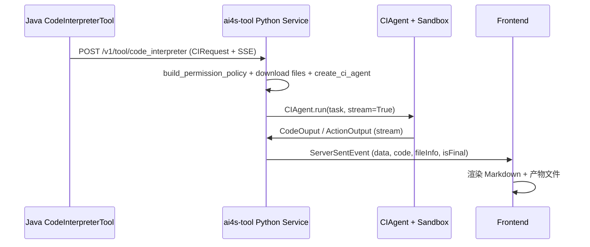

本页详细说明 AI4S-agent 中 CodeInterpreter 工具与 Python 沙箱执行机制的设计原理、权限策略、流式执行流程、产物管理以及安全防护实现。内容针对中级开发者，帮助理解如何安全地在代码解释器中执行用户提交的 Python 代码，同时支持文件 I/O 操作、产物上传和流式结果推送。

## 整体架构与执行链路

CodeInterpreter 作为核心工具，负责将用户任务转换为 Python 代码执行，并将结果以 Markdown 形式返回给前端。执行流程分为 Java 端调用（CodeInterpreterTool）与 Python 端（code_interpreter.py + CIAgent + PythonSandboxExecutor）两个阶段。

Java 端通过 AI4SConfig 注入的 `/v1/tool/code_interpreter` SSE 端点发起流式请求，Python 端通过 CIRequest 接收参数（含 permission_profile、stream_mode 等），驱动 smolagents CodeAgent + PythonInterpreterTool 执行。

Mermaid 流程图如下：



## 权限策略与沙箱执行

权限策略分为 `analysis`（默认，仅允许读输入文件 + 写 output/ 目录）和 `workspace`（额外允许工作区内路径读写）两种。策略通过 CodeInterpreterPermissionPolicy 快照实现不可变。

执行前静态校验（AST 分析）禁止以下操作：
- 导入 ctypes/os/pickle/shutil/subprocess/xlrd 等高风险模块
- 调用 eval/exec/__import__/compile 等动态函数
- 删除/重命名/覆盖输入文件等破坏性操作

运行时 I/O 守卫（runtime guard）对 open/pandas/read_csv 等调用进行二次路径校验，防止静态分析遗漏的路径逃逸。沙箱通过 PythonSandboxExecutor 启动隔离进程（python_sandbox_runner.py），使用 CREATE_NEW_PROCESS_GROUP（Windows）或 start_new_session（Linux）隔离子进程。

Sources: [ai4s-tool/ai4s_tool/tool/code_interpreter_policy.py](ai4s-tool/ai4s_tool/tool/code_interpreter_policy.py#L1-L761)
Sources: [ai4s-tool/ai4s_tool/tool/python_sandbox_executor.py](ai4s-tool/ai4s_tool/tool/python_sandbox_executor.py#L1-L183)
Sources: [ai4s-tool/ai4s_tool/tool/code_interpreter_runtime_guard.py](ai4s-tool/ai4s_tool/tool/code_interpreter_runtime_guard.py#L1-L393)

## 流式执行与产物管理

CIAgent 集成 smolagents CodeAgent，执行 ReAct 循环（Thought/Code/Observation）。每步生成 CodeOuput（含代码、思考、执行日志、产物文件），最终 ActionOutput 作为最终答案。

产物管理：
- 输入文件自动下载到临时工作区
- 执行后沙箱捕获 stdout/stderr + 增量文件
- 产物通过 upload_file 上传到文件服务，返回 fileInfo（fileName, ossUrl, domainUrl, fileSize）
- Markdown 产物自动落盘为 markdown 文件

流式模式下通过 ServerSentEvent 推送增量 data/code/fileInfo，UI 实时渲染。

Sources: [ai4s-tool/ai4s_tool/tool/code_interpreter.py](ai4s-tool/ai4s_tool/tool/code_interpreter.py#L1-L527)
Sources: [ai4s-tool/ai4s_tool/tool/ci_agent.py](ai4s-tool/ai4s_tool/tool/ci_agent.py#L1-L458)
Sources: [ai4s-tool/ai4s_tool/model/protocal.py](ai4s-tool/ai4s_tool/model/protocal.py#L1-L120)

## 配置与集成

Java 侧通过 AI4SConfig 配置 codeInterpreterUrl（默认为 http://ai4s-tool）以及 codeAgentDesc/codeAgentParams。Python 侧通过 .env_template 配置 CODE_INTEPRETER_MODEL、OPENAI_BASE_URL 等 LLM 接入信息。

前端调用示例：
```json
{
  "requestId": "session-xxx",
  "task": "用 pandas 读取 sales.csv 并生成月度销售报表",
  "fileNames": ["sales.csv"],
  "permissionProfile": "analysis",
  "stream": true,
  "streamMode": {"mode": "general"}
}
```

Sources: [AI4S-agent-domain/src/main/java/org/wwz/ai/domain/agent/ai4s/config/AI4SConfig.java](AI4S-agent-domain/src/main/java/org/wwz/ai/domain/agent/ai4s/config/AI4SConfig.java)
Sources: [ai4s-tool/ai4s_tool/tool/code_interpreter.py](ai4s-tool/ai4s_tool/tool/code_interpreter.py#L47-L72)
Sources: [ai4s-tool/.env_template](ai4s-tool/.env_template)

## 常见问题与故障排除

- **权限拒绝**：使用 resolve_input_path/build_output_path 辅助函数，避免直接使用 pathlib/pandas 路径。
- **超时/内存不足**：调大 timeout_seconds 或增加 memory_bytes。
- **产物未上传**：确保代码中调用 print() 记录关键中间结果，避免文件保存描述干扰观察。
- **Windows 下绘图后端**：代码中显式 `matplotlib.use('Agg')`。

参考其他相关文档：
- [分层架构与模块职责](9-fen-ceng-jia-gou-yu-mo-kuai-zhi-ze)
- [Python 工具运行时启动](5-python-gong-ju-yun-xing-shi-qi-dong)