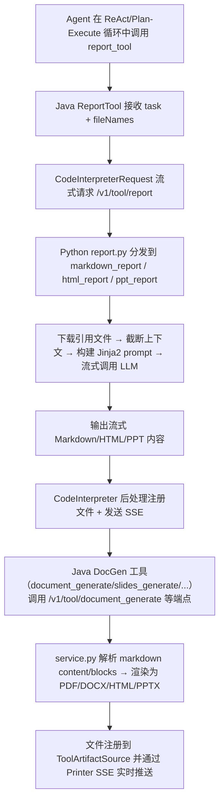

**

# Report 与多格式产物生成

Report 与多格式产物生成模块是 AI4S-agent 的核心能力之一，它通过统一的 `report_tool` 和一整套 DocGen 工具，为用户提供从 Markdown/HTML 基础报告到 PPTX 幻灯片、PDF 文档、DOCX 文档、Excel 表格及自定义模板的全链路、多格式产物生成能力。核心设计目标是让 Agent 在 ReAct/Plan-Execute 循环中能无缝生成结构化、高质量、可下载的交付物（如代码审计报告、研究分析报告、PPT 演示材料），并通过文件注册机制与 SSE 流式渲染实时展示。

## 工具架构与执行流转

整个 Report 体系由两层构成：Java 侧的 `ReportTool` 与一组抽象 DocGen 工具，以及 Python 侧的 `ai4s_tool/tool/report.py`（专为 report_tool 提供流式 Markdown/HTML/PPT 渲染）与 `ai4s_tool/tool/docgen/service.py`（通用文档/幻灯片/表格/检查表生成引擎）。

**Mermaid 执行流转图**：



## 多格式产物生成能力详解

### 1. report_tool（核心报告生成器）

```java
// AI4S-agent-domain/src/main/java/org/wwz/ai/domain/agent/runtime/tool/common/ReportTool.java#L35-L67
public class ReportTool implements BaseTool {
    // ...
    public String getDescription() { /* 支持 AI4SConfig 动态描述 */ }
    public Map<String, Object> toParams() { /* task + fileDescription + fileName + fileType */ }
    public Object execute(...) { /* 构建 CodeInterpreterRequest → 流式调用 CodeAgent */ }
}
```

- **支持格式**：markdown, html, ppt（最终输出 HTML 格式 PPT）
- **输入**：task（必填）、fileDescription、fileName、fileType（可选，默认 markdown）
- **输出**：通过 CodeInterpreter 流式返回 HTML/Markdown 片段，最终注册为文件

### 2. DocGen 工具集

```java
// AI4S-agent-domain/src/main/java/org/wwz/ai/domain/agent/runtime/tool/common/docgen/...
public class DocumentGenerateTool extends AbstractDocGenTool {
    protected String endpointPath() { return "/v1/tool/document_generate"; }
    // 支持 PDF/DOCX/HTML/Markdown
}
public class SlidesGenerateTool extends AbstractDocGenTool {
    protected String endpointPath() { return "/v1/tool/slides_generate"; }
    // 支持 PPTX
}
```

其他工具包括：
- ExcelGeneratorTool、ChecklistGenerateTool、ChartGeneratorTool、TemplateFillerTool、ThemeDesignerTool

**参数对比表**：

| 工具名称              | 主要输出格式 | 核心输入项               | 适用场景                     |
|-----------------------|-------------|--------------------------|------------------------------|
| document_generate     | PDF/DOCX/HTML/MD | content/blocks + title  | 审计报告、分析报告、模板文档 |
| slides_generate       | PPTX        | slides list + title      | 演示文稿、汇报材料            |
| excel_generate        | Excel       | sheet spec               | 数据报表、财务报表            |
| checklist_generate    | PDF/DOCX/HTML/JSON | items + groups        | 任务清单、验收标准            |
| chart_generator       | PDF/DOCX/HTML | chart JSON fence         | 技术图表、流程图              |
| template_filler       | 任意         | template + variables     | 自定义报告模板填充            |
| theme_designer        | 主题文件    | theme name + config      | 统一报告风格                  |

**Sources: [AI4S-agent-domain/src/main/java/org/wwz/ai/domain/agent/runtime/tool/common/ReportTool.java](AI4S-agent-domain/src/main/java/org/wwz/ai/domain/agent/runtime/tool/common/ReportTool.java#L35-L67)**

**Sources: [ai4s-tool/ai4s_tool/tool/report.py](ai4s-tool/ai4s_tool/tool/report.py#L24-L44)**

**Sources: [AI4S-agent-domain/src/main/java/org/wwz/ai/domain/agent/runtime/tool/common/docgen/DocumentGenerateTool.java](AI4S-agent-domain/src/main/java/org/wwz/ai/domain/agent/runtime/tool/common/docgen/DocumentGenerateTool.java#L11-L37)**

**Sources: [ai4s-tool/ai4s_tool/tool/docgen/service.py](ai4s-tool/ai4s_tool/tool/docgen/service.py#L63-L140)**

## prompt 与模板体系

- `ai4s-tool/ai4s_tool/prompt/report.yaml` 包含 `ppt_prompt`、`markdown_prompt`、`html_prompt`、`fix_html_prompt` 等专有模板
- DocGen 引擎支持 Markdown front-matter（title, theme, cover, toc 等）与 ```chart/```metrics/```checklist fence
- 模板系统通过 `ai4s_tool/docgen/templates.py` 动态加载与保存自定义模板

**Sources: [ai4s-tool/ai4s_tool/prompt/report.yaml](ai4s-tool/ai4s_tool/prompt/report.yaml#L2-L115)**

## 产物登记与文件注册机制

成功生成后，Python 端通过 `upload_file_by_path` + `resolve_output_path` 写入 `skilloutput/docgen/{session-id}/`，Java 端通过 `AbstractDocGenTool.registerFiles` 与 `agentContext.registerGeneratedArtifact` 完成文件到 ToolArtifactSource 的注册，随后通过 SSE 实时推送给前端 UI。

**Sources: [ai4s-tool/ai4s_tool/tool/docgen/service.py](ai4s-tool/ai4s_tool/tool/docgen/service.py#L42-L60)**

**Sources: [AI4S-agent-domain/src/main/java/org/wwz/ai/domain/agent/runtime/tool/common/docgen/AbstractDocGenTool.java](AI4S-agent-domain/src/main/java/org/wwz/ai/domain/agent/runtime/tool/common/docgen/AbstractDocGenTool.java#L100-L136)**

## 配置与最佳实践

- 在 `ai4s-tool/.env_template` 中配置 `REPORT_MODEL`、`AI4S_DOCGEN_OUTPUT_DIR`
- Java 侧通过 `AI4SConfig` 动态调整 `report_tool` 的描述与参数
- 推荐阅读顺序：先从 `report_tool` 开始，再探索 DocGen 工具集以获得更专业的 PDF/PPTX 产出

[Report 与多格式产物生成](19-report-yu-duo-ge-shi-chan-wu-sheng-cheng)
