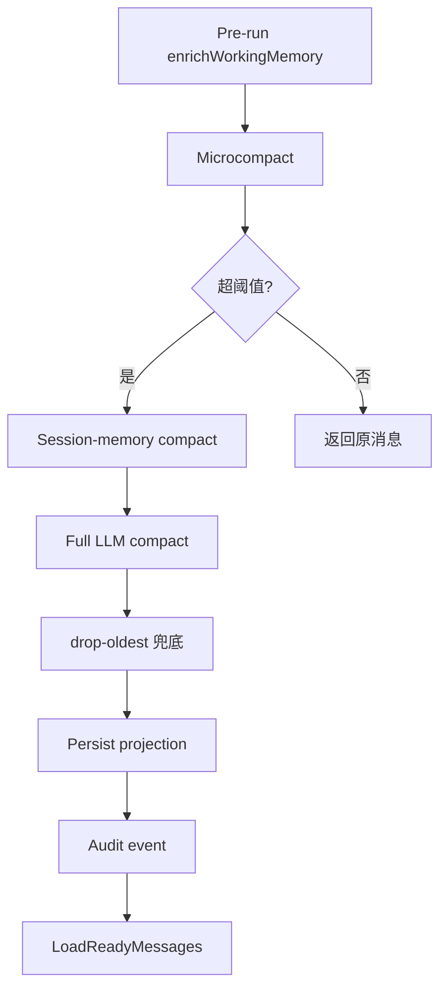
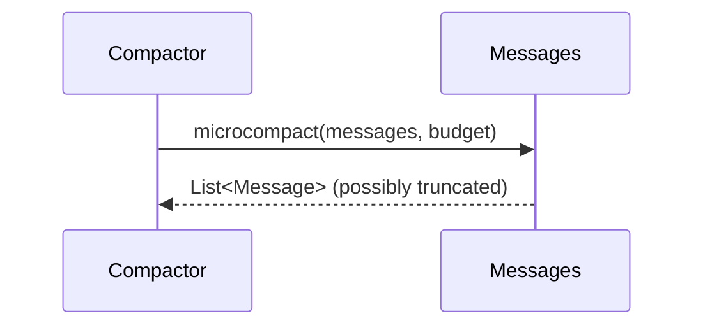

**

# 工作记忆压缩与上下文管理

本页详细阐述 AI4S-agent 的**工作记忆压缩与上下文管理**核心机制。系统通过分层压缩（microcompact → session-memory compact → full LLM compact → drop-oldest）和投影表（working_memory_*）实现上下文长时记忆保存与高效加载，平衡 token 消耗与上下文保真度，同时支持 prompt-cache 友好模式。所有操作均记录于 `ai_agent_working_memory_compaction` 审计表。

## 核心架构与压缩流水线

工作记忆压缩采用分层策略，仅在超阈值时触发，避免不必要的 LLM 调用。整个过程由 `SessionContextCompactionServiceImpl` 驱动，核心组件包括 `WorkingMemoryCompactor`、`CompactionBudget`、`SessionWorkingMemoryService` 和 `WorkingMemoryProjector`。

Mermaid 流程图如下：

**Sources: [WorkingMemoryCompactor.java](AI4S-agent-domain/src/main/java/org/wwz/ai/domain/agent/memory/WorkingMemoryCompactor.java#L1-L429)**

## 压缩算法详解

### 1. Microcompact 阶段
清掉较早的 TOOL 结果正文，保留最近 N 条完整 tool result，并对长文本进行截断。保留 tool-safe 切片。

**Sources: [WorkingMemoryCompactor.java](AI4S-agent-domain/src/main/java/org/wwz/ai/domain/agent/memory/WorkingMemoryCompactor.java#L45-L105)**

### 2. Session-memory Compact
优先使用已有的 session notes + recent tail，避免重复 LLM 摘要。

**Sources: [WorkingMemoryCompactor.java](AI4S-agent-domain/src/main/java/org/wwz/ai/domain/agent/memory/WorkingMemoryCompactor.java#L111-L141)**

### 3. Full LLM Compact
使用 `CompactionPrompt` 引导 LLM 生成结构化摘要（<analysis> + 
），注入压缩后消息。

**Sources: [CompactionPrompt.java](AI4S-agent-domain/src/main/java/org/wwz/ai/domain/agent/memory/CompactionPrompt.java#L1-L140)**

### 4. Drop-oldest 兜底
最保守策略，从最旧侧切片，确保至少保留 1 条且 tool-safe。

**Sources: [WorkingMemoryCompactor.java](AI4S-agent-domain/src/main/java/org/wwz/ai/domain/agent/memory/WorkingMemoryCompactor.java#L164-L200)**

**Sources: [CompactionBudget.java](AI4S-agent-domain/src/main/java/org/wwz/ai/domain/agent/memory/CompactionBudget.java#L1-L73)**

## 上下文管理与投影

### Load / Hydrate 流程
- `SessionContextMemoryServiceImpl.hydrateWorkingMessages` 从 `ai_agent_working_memory_turn` + `ai_agent_working_memory_message` 投影为 `List<Message>`
- 优先使用 `loadReadyMessages`（排除当前 requestId），支持 prompt-cache

**Sources: [SessionContextMemoryServiceImpl.java](AI4S-agent-infrastructure/src/main/java/org/wwz/ai/infrastructure/ai4s/service/impl/SessionContextMemoryServiceImpl.java#L88-L93)**

**Sources: [SessionWorkingMemoryServiceImpl.java](AI4S-agent-infrastructure/src/main/java/org/wwz/ai/infrastructure/ai4s/service/impl/SessionWorkingMemoryServiceImpl.java#L39-L77)**

### WorkingMemoryMessage / WorkingMemoryTurn 实体

| 实体 | 主要字段 | 作用 |
|------|----------|------|
| WorkingMemoryMessage | sessionId, requestId, role, content, toolCallsJson | 压缩后消息投影 |
| WorkingMemoryTurn | turnSeq, status(READY/INVALID), tokenEstimate | 轮次元数据 |

**Sources: [WorkingMemoryMessage.java](AI4S-agent-domain/src/main/java/org/wwz/ai/domain/agent/memory/WorkingMemoryMessage.java#L13-L37)**

**Sources: [WorkingMemoryTurn.java](AI4S-agent-domain/src/main/java/org/wwz/ai/domain/agent/memory/WorkingMemoryTurn.java#L18-L38)**

### Compaction Event 审计

每次有效压缩写入 `ai_agent_working_memory_compaction` 表，记录 before/after tokens、strategy、summaryText。

**Sources: [WorkingMemoryCompactionEvent.java](AI4S-agent-domain/src/main/java/org/wwz/ai/domain/agent/memory/WorkingMemoryCompactionEvent.java#L18-L40)**

## 集成与配置

- **触发时机**：pre-run enrichWorkingMemory + mid-run LLM call 前
- **配置项**（`autobots.autoagent.compaction.*`）：enabled / llm-enabled / micro-enabled / session-memory-enabled / threshold 等
- **审计**：`IWorkingMemoryCompactionDao` 记录压缩事件
- **fallback**：压缩失败时降级为 drop-oldest

**Sources: [SessionContextCompactionServiceImpl.java](AI4S-agent-infrastructure/src/main/java/org/wwz/ai/infrastructure/ai4s/service/impl/SessionContextCompactionServiceImpl.java#L124-L200)**

## 最佳实践与注意事项

- 压缩后注入的 `This session is being continued...` 消息保持 prompt cache 友好
- 保留 tool result 完整性：永不拆开 tool_use/tool_result 切片
- 监控 consecutiveFailures 防止循环压缩
- 建议结合 MRAG / SOP 提高摘要质量

**Sources: [WorkingMemoryCompactor.java](AI4S-agent-domain/src/main/java/org/wwz/ai/domain/agent/memory/WorkingMemoryCompactor.java#L35-L40)**

## Next Steps

- 深入了解 [会话工作区与文件复用](22-hui-hua-gong-zuo-qu-yu-wen-jian-fu-yong)
- 探索 [MRAG 混合检索与重排](24-mrag-hun-he-jian-suo-yu-zhong-pai)
- 查看 [执行账本与历史回放](26-zhi-xing-zhang-ben-yu-li-shi-hui-fang)
