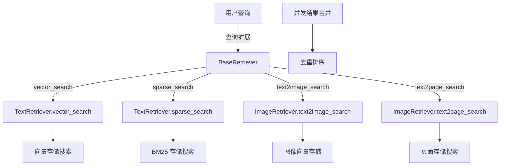
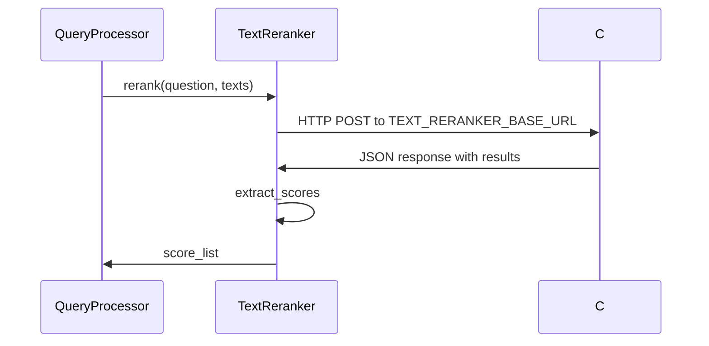

MRAG 混合检索与重排是 AI4S-Agent 核心记忆机制，融合文本向量、BM25 稀疏以及跨模态图像/页面检索，并通过 Cross-encoder API 实现结果重排序。模块覆盖从查询预处理、并发召回、去重排序到持久化存储的全流程，服务于 ReAct/Plan-Execute 执行链路与多轮对话上下文管理。

## 混合检索门面

BaseRetriever 提供统一入口，负责文本向量召回、BM25 稀疏召回以及可选的多模态图像检索。所有召回并发执行于 ThreadPoolExecutor，查询维度对齐后合并结果。

Sources: [retriever.py](ai4s-tool/ai4s_tool/tool/mrag/retrieval/retriever.py#L28-L63)

## 文本检索器实现

TextRetriever 封装稠密向量与稀疏 BM25 召回，支持 kb_id 过滤与 score_threshold 参数。向量通过 embedding_model.encode_text_batch 生成，稀疏向量由 BM25 模型提供。

Sources: [text_retriever.py](ai4s-tool/ai4s_tool/tool/mrag/retrieval/text_retriever.py#L27-L65)

## 跨模态检索器实现

ImageRetriever 提供 text2image_search 与 text2page_search 功能，通过图像向量索引实现视觉内容召回。BaseRetriever 仅在 runtime_mode 中启用 multimodal_image_index 时注册图像路径。

Sources: [retriever.py](ai4s-tool/ai4s_tool/tool/mrag/retrieval/retriever.py#L48-L55)

## 混合检索融合逻辑

检索结果以查询列表形式返回，每个查询对应多个文档片段。并发执行确保低延迟，合并后按原始查询顺序重新组织，准备进入重排序阶段。

Sources: [retriever.py](ai4s-tool/ai4s_tool/tool/mrag/retrieval/retriever.py#L56-L63)

## 文本重排器实现

TextReranker 抽象定义 rerank 接口，APITextReranker 通过 HTTP 调用外部服务（TEXT_RERANKER_BASE_URL）获取 relevance_score。支持文档长度裁剪、top_n 配置与结果兼容性提取。

Sources: [text_reranker.py](ai4s-tool/ai4s_tool/tool/mrag/rerank/text_reranker.py#L28-L122)

## 重排融合策略

重排器接收原始检索结果，生成 relevance_score 列表并覆盖原始分数。分数用于最终排序与截断，输出结构兼容 API 返回格式。

Sources: [text_reranker.py](ai4s-tool/ai4s_tool/tool/mrag/rerank/text_reranker.py#L109-L122)

## 查询处理器集成

QueryProcessor 负责意图识别、查询扩展与工具选择（文本检索工具），调用 BaseRetriever 完成混合召回后触发 rerank，生成上下文用于后续生成步骤。

Sources: [query_processor.py](ai4s-tool/ai4s_tool/tool/mrag/query/query_processor.py#L45-L189)

## 评估与测试覆盖

MRAG 模块包含专用测试包括 rerank 评估、文档路由、图像检索器以及历史持久化，覆盖召回质量、并发安全与跨模态场景。

Sources: [test_mrag_rerank.py](ai4s-tool/tests/test_mrag_rerank.py#L1-L150)

## 环境配置与性能调优

通过环境变量控制阈值（RETRIEVAL_TEXT_THRESHOLD）、rerank 类型（TEXT_RERANKER_TYPE）与超时。性能关键在于并发线程池大小与文档长度裁剪策略。

Sources: [text_reranker.py](ai4s-tool/ai4s_tool/tool/mrag/rerank/text_reranker.py#L44-L47)