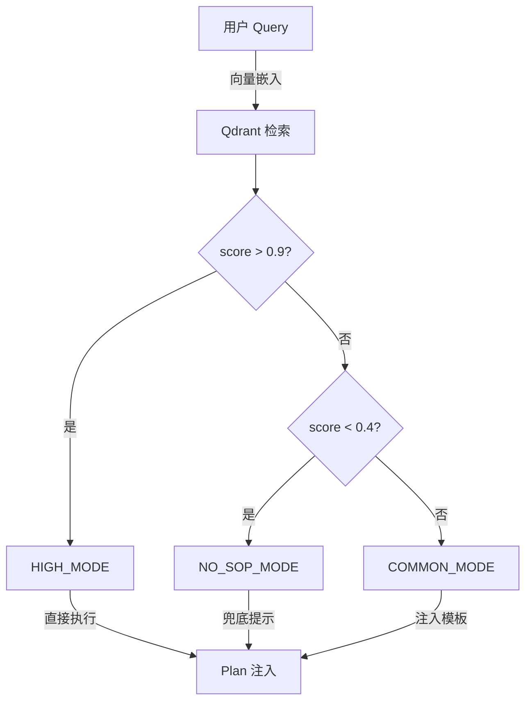

SOP 语义召回是 Plan-Execute 执行链路中步骤1的核心机制，通过向量检索与重排技术从维护的 SOP 知识库中快速精准召回最相关的标准作业程序，为后续规划注入可执行的执行流程模板。

## 核心架构

SOP 语义召回采用双向量存储（name + sop_string）+ Qdrant 向量库 + rerank 重排的混合方案，确保高精度与低延迟。

Sources: [ai4s-tool/ai4s_tool/tool/plan_sop.py#L116-L119](ai4s-tool/ai4s_tool/tool/plan_sop.py#L116-L119)
Sources: [ai4s-tool/ai4s_tool/tool/plan_sop.py#L149-L163](ai4s-tool/ai4s_tool/tool/plan_sop.py#L149-L163)
Sources: [ai4s-tool/ai4s_tool/tool/sop_workspace.py#L129-L130](ai4s-tool/ai4s_tool/tool/sop_workspace.py#L129-L130)

## 召回流程

1. **请求解析**：接收 `requestId` 与 `query`
2. **向量检索**：根据 `vector_type`（name/sop_string）在 Qdrant 中检索 top-N SOP
3. **去重与排序**：按 score 降序去重
4. **模式判定**：
   - HIGH_MODE：score > 0.9，直接执行
   - COMMON_MODE：0.4 ≤ score ≤ 0.9，注入提示模板
   - NO_SOP_MODE：score < 0.2，使用兜底提示
5. **提示注入**：将选中的 SOP 文本注入 `sopPrompt` 模板

Sources: [ai4s-tool/ai4s_tool/tool/plan_sop.py#L172-L173](ai4s-tool/ai4s_tool/tool/plan_sop.py#L172-L173)
Sources: [ai4s-tool/ai4s_tool/tool/plan_sop.py#L178-L184](ai4s-tool/ai4s_tool/tool/plan_sop.py#L178-L184)
Sources: [ai4s-tool/ai4s_tool/tool/plan_sop.py#L176-L177](ai4s-tool/ai4s_tool/tool/plan_sop.py#L176-L177)

## 模式定义



Sources: [ai4s-tool/ai4s_tool/tool/plan_sop.py#L148](ai4s-tool/ai4s_tool/tool/plan_sop.py#L148)

## 提示模板

```yaml
# ai4s-tool/ai4s_tool/prompt/plan_sop.yaml
high_mode_prompt: |
  以下是提供给你的标准作业程序SOP...你必须调用工具，严格生成如SOP所示的计划列表...
common_mode_prompt: |
  以下是提供给你的标准作业程序SOP...参考提供的{{sop_length}}个SOP...
no_sop_mode_prompt: |
  你有丰富的世界知识...必须生成一个计划...
```

Sources: [ai4s-tool/ai4s_tool/prompt/plan_sop.yaml](ai4s-tool/ai4s_tool/prompt/plan_sop.yaml)

## Java 侧集成

Java 侧通过 `SopRecallService` 调用 `/v1/tool/sopRecall` 端点，接收 `SopRecallResponse` 并注入 `agentContext.sopPrompt`。

Sources: [AI4S-agent-domain/src/main/java/org/wwz/ai/domain/agent/rag/SopRecallService.java#L34-L69](AI4S-agent-domain/src/main/java/org/wwz/ai/domain/agent/rag/SopRecallService.java#L34-L69)
Sources: [AI4S-agent-domain/src/main/java/org/wwz/ai/domain/agent/runtime/dto/SopRecallResponse.java#L16-L28](AI4S-agent-domain/src/main/java/org/wwz/ai/domain/agent/runtime/dto/SopRecallResponse.java#L16-L28)
Sources: [AI4S-agent-domain/src/main/java/org/wwz/ai/domain/agent/service/execute/planexecute/step/Step1SopRecallAndPrepareNode.java#L159-L170](AI4S-agent-domain/src/main/java/org/wwz/ai/domain/agent/service/execute/planexecute/step/Step1SopRecallAndPrepareNode.java#L159-L170)

## 工作台 API

SOP 工作台提供 `/list` `/get` `/upsert` `/delete` `/status` `/recall_test` 等 CRUD 接口，底层依赖 `SopWorkspaceService` 与 Qdrant。

Sources: [ai4s-tool/ai4s_tool/api/sop.py#L80-L154](ai4s-tool/ai4s_tool/api/sop.py#L80-L154)
Sources: [ai4s-tool/ai4s_tool/tool/sop_workspace.py#L130-L131](ai4s-tool/ai4s_tool/tool/sop_workspace.py#L130-L131)
Sources: [ai4s-tool/ai4s_tool/tool/sop_workspace.py#L178-L191](ai4s-tool/ai4s_tool/tool/sop_workspace.py#L178-L191)

## 前端工作台

UI 提供 `WorkspaceSop` 页面，支持 SOP 增删改查与语义测试，调用 `/v1/sop/*` 端点。

Sources: [ui/src/pages/WorkspaceSop/index.tsx](ui/src/pages/WorkspaceSop/index.tsx)
Sources: [ui/src/pages/WorkspaceSop/types.ts](ui/src/pages/WorkspaceSop/types.ts)
Sources: [ui/src/services/sopWorkspace.ts#L146-L152](ui/src/services/sopWorkspace.ts#L146-L152)

## 配置项

| 配置项                  | 默认值           | 说明                              |
|-------------------------|------------------|----------------------------------|
| SOP_QDRANT_ENABLE       | true            | 是否开启 Qdrant 向量召回         |
| SOP_COLLECTION_NAME     | sop_plan        | Qdrant 集合名称                  |
| SOP_BGE_RERANK_URL      | -               | 重排服务 URL                     |
| MAX_RECALL_SOP_NUMBER   | 5               | 单次召回数量上限                 |
| DEFAULT_HIGH...         | 0.9             | 高相关模式阈值                   |

Sources: [ai4s-tool/ai4s_tool/tool/plan_sop.py#L32-L42](ai4s-tool/ai4s_tool/tool/plan_sop.py#L32-L42)
Sources: [ai4s-tool/ai4s_tool/tool/plan_sop.py#L129-L130](ai4s-tool/ai4s_tool/tool/plan_sop.py#L129-L130)

## 最佳实践

1. **SOP 管理**：通过工作台创建高质量标准化作业程序，存储于 Qdrant 双向量
2. **语义召回**：自然语言 query 自动匹配最相关 SOP 流程
3. **Plan 注入**：注入后，PlanSolve 步骤可严格遵循选中的 SOP 执行
4. **测试**：使用 `/recall_test` 端点验证召回效果

Sources: [ai4s-tool/ai4s_tool/tool/plan_sop.py#L148](ai4s-tool/ai4s_tool/tool/plan_sop.py#L148)
Sources: [ai4s-tool/ai4s_tool/tool/sop_workspace.py#L130](ai4s-tool/ai4s_tool/tool/sop_workspace.py#L130)
Sources: [ai4s-tool/ai4s_tool/api/sop.py#L146-L154](ai4s-tool/ai4s_tool/api/sop.py#L146-L154)

## 下一步

- [SOP 工作台页面](28-gong-zuo-qu-ye-mian-yu-chan-wu-yu-lan)
- [Plan-Execute 执行链路](13-plan-execute-zhi-xing-lian-lu)
- [MRAG 混合检索](24-mrag-hun-he-jian-suo-yu-zhong-pai)