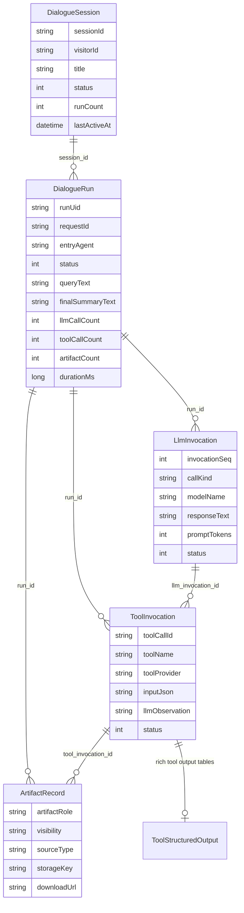
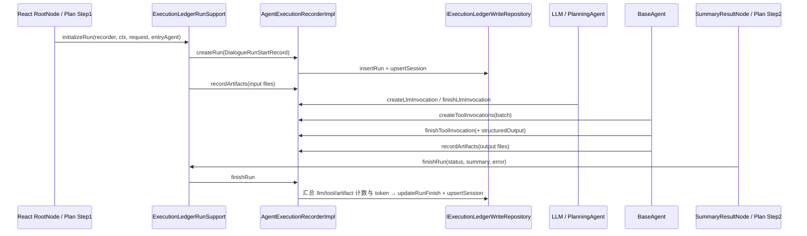
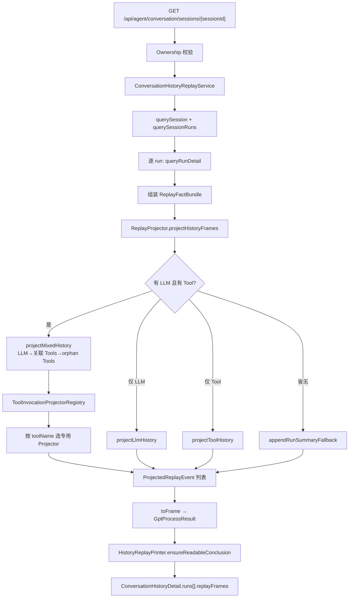
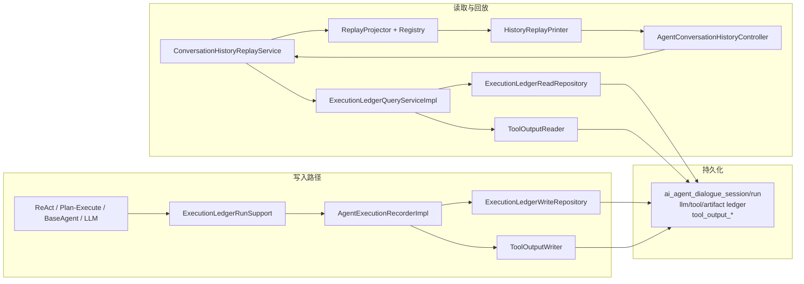

执行账本（Execution Ledger）是 AI4S-agent 的**可观测事实层**：它把一次对话执行拆成 Session → Run → LLM 调用 → 工具调用 → 产物 五层结构化记录，并在历史恢复时通过 **ReplayProjector** 把这些事实投影成与实时 SSE **同构**的 `GptProcessResult` 帧。本页聚焦账本写入契约、持久化模型、查询聚合与历史回放投影，不涉及工作记忆压缩、SSE 前端渲染或工具本身的业务语义（这些分别见相邻目录页）。

## 子域定位与设计原则

`org.wwz.ai.domain.agent.ledger` 被明确声明为 Agent ledger 子域：负责执行账本、历史回放与 tool-output 聚合语义，**不直接暴露 DAO 细节**。领域层通过读写仓储端口（`IExecutionLedgerWriteRepository` / `IExecutionLedgerReadRepository`）与基础设施解耦，写入入口统一收敛到 `AgentExecutionRecorder`，查询入口收敛到 `ExecutionLedgerQueryService`，回放入口收敛到 `ConversationHistoryReplayService` + `ReplayProjector`。

Sources: [package-info.java](AI4S-agent-domain/src/main/java/org/wwz/ai/domain/agent/ledger/package-info.java#L1-L5)

设计上有三条贯穿始终的原则：

1. **Fail-open 写入**：账本失败不能拖垮主执行链路。`AgentExecutionRecorderImpl` 统一吞异常、打日志并累计内存指标，调用点无需散落 try/catch。
2. **事实与投影分离**：账本只存可验证事实（run / llm / tool / artifact / structured output）；UI 事件形态由 `ReplayProjector` 与工具专用 projector 生成。
3. **实时与历史同构**：`ReplayProjector.projectFrame` 注释明确——实时与历史共用同一套 frame 组装逻辑，前端只消费一种 `eventData` 协议。

Sources: [AgentExecutionRecorderImpl.java](AI4S-agent-domain/src/main/java/org/wwz/ai/domain/agent/ledger/impl/AgentExecutionRecorderImpl.java#L37-L44) · [ReplayProjector.java](AI4S-agent-domain/src/main/java/org/wwz/ai/domain/agent/ledger/replay/ReplayProjector.java#L23-L86)

## 账本层级模型



### Session：会话头

`DialogueSession` 是会话级执行摘要，维护标题、最新 request、最新摘要、run 计数与活跃时间。它不是事件流，而是 **session 头表**，由 `createRun` / `finishRun` 通过 `upsertSession` 增量维护。

Sources: [DialogueSession.java](AI4S-agent-domain/src/main/java/org/wwz/ai/domain/agent/ledger/entity/DialogueSession.java#L10-L50)

### Run：单次请求总账

`DialogueRun` 是最小回放单元。`runUid` 首期直接复用 `requestId`；`entryAgent` 区分入口链（`react` / `plan_solve`）；结束时汇总 LLM/工具/产物计数与 token 总量。

Sources: [DialogueRun.java](AI4S-agent-domain/src/main/java/org/wwz/ai/domain/agent/ledger/entity/DialogueRun.java#L10-L83)

### LLM / Tool / Artifact：细粒度事实

| 实体 | 关键字段 | 语义 |
|------|----------|------|
| `LlmInvocation` | `invocationSeq`, `callKind`, `responseText`, token 明细, `promptPayloadJson`, cache 观测 | 单次模型调用；`callKind` 区分 ask / askTool / 内部调用 |
| `ToolInvocation` | `toolCallId`, `llmInvocationId`, `dispatchIndex`, `inputJson`, `llmObservation` | 单次工具调用；可挂回来源 LLM |
| `ArtifactRecord` | `artifactRole`, `visibility`, `sourceType`, `storageKey` | 输入/输出文件归属；可挂 toolInvocation |

Sources: [LlmInvocation.java](AI4S-agent-domain/src/main/java/org/wwz/ai/domain/agent/ledger/entity/LlmInvocation.java#L10-L130) · [ToolInvocation.java](AI4S-agent-domain/src/main/java/org/wwz/ai/domain/agent/ledger/entity/ToolInvocation.java#L10-L71) · [ArtifactRecord.java](AI4S-agent-domain/src/main/java/org/wwz/ai/domain/agent/ledger/entity/ArtifactRecord.java#L10-L74)

### 状态与分类常量

`ExecutionLedgerConstants` 统一定义状态码、入口 agent、调用种类、产物角色与可见性。历史回放依赖这些常量过滤内部调用、判定模式与产物可见范围。

| 类别 | 取值 | 用途 |
|------|------|------|
| 状态 | `0 RUNNING / 1 SUCCESS / 2 FAILED / 3 TIMEOUT / 4 STOPPED` | run / llm / tool 统一状态 |
| 入口 | `react` / `plan_solve` | 历史模式恢复（深度思考 vs 深度研究） |
| callKind | `ask` / `askTool` / `internalDigitalEmployee` / `internalCompact` | 后两者不进入 UI 回放主语义 |
| 产物 | `input`/`output` · `visible`/`internal` · `user_upload`/`tool_output` | 归属与可见性过滤 |
| 工具提供方 | `local` / `mcp` | 工具来源标记 |

Sources: [ExecutionLedgerConstants.java](AI4S-agent-domain/src/main/java/org/wwz/ai/domain/agent/ledger/model/ExecutionLedgerConstants.java#L8-L48)

## 写入契约与生命周期

### 统一写入接口

`AgentExecutionRecorder` 定义七类写操作，覆盖 run / llm / tool / artifact 的全生命周期：

```text
createRun → createLlmInvocation → createToolInvocations
         → finishToolInvocation (+ structured output)
         → finishLlmInvocation
         → recordArtifacts
         → finishRun
```

Sources: [AgentExecutionRecorder.java](AI4S-agent-domain/src/main/java/org/wwz/ai/domain/agent/ledger/AgentExecutionRecorder.java#L14-L34)

### Run 启动与结束收口

`ExecutionLedgerRunSupport` 是运行态辅助层，避免 ReAct 与 Plan-Execute 两条链路重复实现 run 生命周期：

- **`initializeRun`**：`createRun` → `agentContext.activateLedgerRun(runId, requestId)` → 登记用户上传输入产物（`artifactRole=input`, `sourceType=user_upload`）。
- **`finishRun`**：在存在 active ledger run 时写入终态；成功态带 `finalSummaryText`，失败态带 `errorCode` / `errorMsg`。

Sources: [ExecutionLedgerRunSupport.java](AI4S-agent-domain/src/main/java/org/wwz/ai/domain/agent/ledger/ExecutionLedgerRunSupport.java#L18-L69)

### 执行链路挂载点



具体挂载：

| 时机 | 调用点 | entryAgent / 说明 |
|------|--------|------------------|
| Run 启动 | `react/step/RootNode` · `planexecute/step/Step1SopRecallAndPrepareNode` | `ENTRY_AGENT_REACT` / `ENTRY_AGENT_PLAN_SOLVE` |
| LLM 记账 | `runtime/llm/LLM.java` · `PlanningAgent` | `createLlmInvocation` / `finishLlmInvocation` |
| 工具记账 | `BaseAgent` · `PlanningAgent` | 批量 `createToolInvocations`，完成后 `finishToolInvocation` |
| 产物登记 | `BaseAgent` · `ExecutionLedgerRunSupport` · 图片生成持久化服务 | 输入/输出 artifact |
| Run 结束 | `react/step/SummaryResultNode` · `planexecute/step/Step2PlanExecuteNode` | success / failed / timeout 等 |

Sources: [RootNode.java](AI4S-agent-domain/src/main/java/org/wwz/ai/domain/agent/service/execute/react/step/RootNode.java#L93-L98) · [SummaryResultNode.java](AI4S-agent-domain/src/main/java/org/wwz/ai/domain/agent/service/execute/react/step/SummaryResultNode.java#L80-L87) · [AgentExecutionRecorderImpl.java](AI4S-agent-domain/src/main/java/org/wwz/ai/domain/agent/ledger/impl/AgentExecutionRecorderImpl.java#L54-L147)

### createRun / finishRun 内部语义

`createRun` 在 `requestId` 合法时插入 `STATUS_RUNNING` 的 run，并用用户问题截断为 session 标题，同步 upsert session 头（runCount / finishedRunCount / failedRunCount / lastActiveAt）。

`finishRun` 不信任调用方上报的计数：它按 `requestId` 回查 run，再查询该 run 下全部 llm / tool / artifact，**重算** `llmCallCount`、`toolCallCount`、`artifactCount` 与 token 汇总，再 `updateRunFinish` 并刷新 session 头。这保证账本终态与事实表一致。

Sources: [AgentExecutionRecorderImpl.java](AI4S-agent-domain/src/main/java/org/wwz/ai/domain/agent/ledger/impl/AgentExecutionRecorderImpl.java#L54-L147)

### 工具完成与 rich output

`finishToolInvocation` 更新工具调用终态后，若存在 `structuredOutput`，会通过 `ToolOutputWriter` 写入独立输出表。`ToolOutputNames.RICH_TOOL_NAMES` 定义需要结构化输出表的工具集合（deep_search、file_tool、code_interpreter、report_tool、planning、canvas_publish、emit_ui_*、data_analysis、multimodal、image_generation、script_runner）。

`ToolOutputWriterImpl` 按 toolName switch 到对应 DAO；默认 fail-open，`writeOrThrow` 供需要强一致的场景；`DuplicateKeyException` 在非 strict 模式下被忽略，保证幂等重试安全。

Sources: [ToolOutputNames.java](AI4S-agent-domain/src/main/java/org/wwz/ai/domain/agent/ledger/model/tooloutput/ToolOutputNames.java#L9-L48) · [ToolOutputWriterImpl.java](AI4S-agent-infrastructure/src/main/java/org/wwz/ai/infrastructure/tooloutput/ToolOutputWriterImpl.java#L43-L112) · [ToolInvocationFinishRecord.java](AI4S-agent-domain/src/main/java/org/wwz/ai/domain/agent/ledger/model/ToolInvocationFinishRecord.java#L14-L41)

## 持久化适配

领域端口到基础设施的映射清晰：

| 端口方法族 | 实现 | 底层 DAO / 表 |
|------------|------|----------------|
| run insert/finish/query | `ExecutionLedgerWriteRepository` / `ReadRepository` | `IDialogueRunLedgerDao` → `ai_agent_dialogue_run` |
| session upsert/query | 同上 | `IDialogueSessionLedgerDao` → `ai_agent_dialogue_session` |
| llm / tool / artifact | 同上 | 对应 `*LedgerDao` |
| rich tool output | `ToolOutputWriterImpl` / `ToolOutputReaderImpl` | 按工具拆分的 `IToolOutput*Dao` |

Session upsert 使用 `ON DUPLICATE KEY UPDATE`：`visitor_id` 仅在原值为空时回填，其余头字段覆盖更新，避免匿名会话后续绑定被冲掉。

Run 查询约定：

- 单 request：`queryByRequestId`（回放 / 明细）
- 会话全量：`queryBySessionId` 按 `create_time ASC`（历史时间线）
- 最近 N 条：`queryRecentBySessionId` 按 `create_time DESC`（摘要列表）

Sources: [ExecutionLedgerWriteRepository.java](AI4S-agent-infrastructure/src/main/java/org/wwz/ai/infrastructure/adapter/repository/ExecutionLedgerWriteRepository.java#L21-L103) · [ExecutionLedgerReadRepository.java](AI4S-agent-infrastructure/src/main/java/org/wwz/ai/infrastructure/adapter/repository/ExecutionLedgerReadRepository.java#L22-L98) · [dialogue_run_ledger_mapper.xml](AI4S-agent-app/src/main/resources/mybatis/mapper/dialogue_run_ledger_mapper.xml#L55-L113) · [dialogue_session_ledger_mapper.xml](AI4S-agent-app/src/main/resources/mybatis/mapper/dialogue_session_ledger_mapper.xml#L41-L109)

## 查询聚合

`ExecutionLedgerQueryService` 暴露内部查询契约；实现类把 entity 投影为 View，并在工具视图上挂接 structured output。

**`queryRunDetail(requestId)`** 是回放的最小事实装配：

1. 按 requestId 查 run
2. 按 runId 拉 llm / tool / artifact
3. 组装 `ExecutionRunDetail{run, llmInvocations, toolInvocations, artifacts}`
4. 工具视图通过 `ToolOutputReader` enrich structured output，并按 toolInvocationId 归组 artifact 计数

**会话列表路径**额外做了性能优化：`attachArtifactSummaries` 用 `queryArtifactsByRunIds` 批量补齐 run 视图上的 `artifactSummaries`，避免 controller / UI 二次扫表。limit 统一归一：默认 20、上限 100。

Sources: [ExecutionLedgerQueryService.java](AI4S-agent-domain/src/main/java/org/wwz/ai/domain/agent/ledger/ExecutionLedgerQueryService.java#L10-L30) · [ExecutionLedgerQueryServiceImpl.java](AI4S-agent-domain/src/main/java/org/wwz/ai/domain/agent/ledger/impl/ExecutionLedgerQueryServiceImpl.java#L28-L143) · [ExecutionRunDetail.java](AI4S-agent-domain/src/main/java/org/wwz/ai/domain/agent/ledger/model/ExecutionRunDetail.java#L10-L26) · [ToolInvocationView.java](AI4S-agent-domain/src/main/java/org/wwz/ai/domain/agent/ledger/model/ToolInvocationView.java#L14-L66)

## 历史回放投影

### 端到端回放流



Sources: [ConversationHistoryReplayService.java](AI4S-agent-domain/src/main/java/org/wwz/ai/domain/agent/ledger/replay/ConversationHistoryReplayService.java#L25-L92) · [ReplayProjector.java](AI4S-agent-domain/src/main/java/org/wwz/ai/domain/agent/ledger/replay/ReplayProjector.java#L23-L75)

### ReplayFactBundle：最小事实包

回放只依赖四类视图：`DialogueRunView` + `LlmInvocationView[]` + `ToolInvocationView[]` + `ArtifactView[]`。这使 projector 与存储解耦，也便于测试用 fixture 直接驱动投影。

Sources: [ReplayFactBundle.java](AI4S-agent-domain/src/main/java/org/wwz/ai/domain/agent/ledger/model/replay/ReplayFactBundle.java#L16-L36)

### ReplayProjector：顺序与归组

`ReplayProjector` 只负责**遍历顺序与 artifact 归组**，工具解析全部委托给 registry：

1. **混合路径**（最常见）：按 `invocationSeq` 排序 LLM；把 tool 按 `llmInvocationId` 分组；有 `responseText` 的 LLM 先投影为 thought/result 事件，再投影其关联 tools；`llmInvocationId == null` 的 orphan tools 最后补齐。
2. **跳过内部 LLM**：`internalDigitalEmployee` 与 `internalCompact` 不投影，避免污染 thought 时间线与 PlanSolve plannerRounds。
3. **tool_thought 任务组复用**：若当前 LLM messageType 为 `tool_thought`，后续关联工具 `reuseCurrentTaskGroup=true`，保证「先思考、后工具」紧邻展示。
4. **run summary fallback**：若事件流缺少可读结论，用 `finalSummaryText` 追加 result 事件。

`ProjectedReplayEvent` 是投影中间态：`taskId` / `taskOrder` / `messageId` / `messageType` / `messageOrder` / `resultMap` / `artifactRefs`，再由 `toFrame` 包成前端可消费的 `GptProcessResult`。

Sources: [ReplayProjector.java](AI4S-agent-domain/src/main/java/org/wwz/ai/domain/agent/ledger/replay/ReplayProjector.java#L32-L170) · [ProjectedReplayEvent.java](AI4S-agent-domain/src/main/java/org/wwz/ai/domain/agent/ledger/model/replay/ProjectedReplayEvent.java#L12-L29)

### 工具专用 Projector 注册表

`ToolInvocationProjectorRegistry` 按 `toolName` 命中第一个 `supports` 的 projector，否则走 `DefaultToolInvocationProjector`。默认每个 invocation **独立 renewTaskId**；`planning` 支持 planner 任务组语义；与 thought 绑定时可复用当前任务组。

装配在 `ReplayProjectorAutoConfiguration`：为 file / planning / deep_search / code_interpreter / report / canvas / genui / data_analysis / multimodal / image / script_runner / default 注册 Bean，再组装 `ReplayProjector`、`HistoryReplayPrinter`、`ConversationHistoryReplayService`。

| Projector | 工具名 | 投影重点 |
|-----------|--------|----------|
| `DeepSearchToolInvocationProjector` | deep_search | stages / 文档摘要 |
| `CodeInterpreterToolInvocationProjector` | code_interpreter | code / output / explain |
| `ReportToolInvocationProjector` | report_tool | fileType / content（驱动 outputStyle） |
| `PlanningToolInvocationProjector` | planning | plan 结构与 round |
| `FileToolInvocationProjector` | file_tool | 文件命令与链接 |
| `ImageGenerationToolInvocationProjector` | image_generation_tool | prompt / 批量图 |
| `DefaultToolInvocationProjector` | 其余 | 通用 tool_result |

`AbstractToolInvocationProjector` 提供公共能力：解析 inputJson、构建 artifactRefs、把 typed `fileRefs` 与 artifact 账本稳定链接合并（补 download/preview，标记 missing）。

Sources: [ToolInvocationProjectorRegistry.java](AI4S-agent-domain/src/main/java/org/wwz/ai/domain/agent/ledger/replay/projector/ToolInvocationProjectorRegistry.java#L11-L51) · [ReplayProjectorAutoConfiguration.java](AI4S-agent-app/src/main/java/org/wwz/ai/config/ai4s/ReplayProjectorAutoConfiguration.java#L27-L125) · [AbstractToolInvocationProjector.java](AI4S-agent-domain/src/main/java/org/wwz/ai/domain/agent/ledger/replay/projector/impl/AbstractToolInvocationProjector.java#L19-L176)

### 结论可读性与总结协议

`HistoryReplayPrinter.ensureReadableConclusion`：若 replay frames 中已有 `messageType=result|task_summary`，直接返回；否则用 run 的 `finalSummaryText` 构造 fallback 结论帧。

`SummaryReplayResultResolver` 解析账本中保存的 **summary + `$$$` + artifactKey 列表**协议（与实时 Summary 发送一致）：

1. 若总结点名了文件 → 只回放这些文件
2. 若未点名或匹配失败，但存在可见 output 产物 → 回退为全部可见产物（逆序，贴近实时行为）

可见产物过滤条件：`artifactRole=output` 且 `visibility=visible` 且具备 `toolCallId` + `fileName`。

Sources: [HistoryReplayPrinter.java](AI4S-agent-domain/src/main/java/org/wwz/ai/domain/agent/ledger/replay/HistoryReplayPrinter.java#L14-L88) · [SummaryReplayResultResolver.java](AI4S-agent-domain/src/main/java/org/wwz/ai/domain/agent/ledger/replay/SummaryReplayResultResolver.java#L17-L74)

### 历史模式快照（前端输入栏恢复）

`ConversationHistoryReplayService` 在聚合详情时恢复 `outputStyle` 与 `deepThink`：

1. `entry_agent=plan_solve` → deepThink=true；`react` → deepThink=false
2. 结构化输出样式优先级：**rich tool 强类型（尤其 ReportToolOutput.fileType） → replay frame 的 messageType → 产物文件后缀**
3. 拿不到细粒度信息时至少回落为 `docs`，**禁止错误回落成 chat**，避免前端输入栏切回聊天态

Sources: [ConversationHistoryReplayService.java](AI4S-agent-domain/src/main/java/org/wwz/ai/domain/agent/ledger/replay/ConversationHistoryReplayService.java#L94-L148)

## 对外 HTTP 契约

`AgentConversationHistoryController` 暴露会话历史恢复接口，并强制 visitor 所有权校验。

| 方法 | 路径 | 行为 |
|------|------|------|
| GET | `/api/agent/conversation/sessions?limit=` | 当前 visitor 最近会话列表（默认 20） |
| GET | `/api/agent/conversation/sessions/{sessionId}` | 会话详情 + 各 run 的 `replayFrames` |

状态对外统一映射为可读标签：`SUCCESS / FAILED / TIMEOUT / STOPPED / RUNNING`，避免前端与调试工具各自维护枚举。详情 VO 直接携带 `GptProcessResult` 列表作为 `replayFrames`，前端可按实时流同一套渲染器消费。

Sources: [AgentConversationHistoryController.java](AI4S-agent-trigger/src/main/java/org/wwz/ai/trigger/http/agent/AgentConversationHistoryController.java#L27-L155) · [ConversationHistoryDetail.java](AI4S-agent-domain/src/main/java/org/wwz/ai/domain/agent/ledger/model/ConversationHistoryDetail.java#L14-L69)

## 组件协作总览



## 实现要点与边界

**Fail-open 不等于丢语义**：写入失败返回 `null` / 静默跳过，但成功路径会严格重算 run 汇总；调试时可依赖 Recorder 内的 success/failure/duration 内存计数器与 error 日志。

**Run 是回放原子**：历史详情严格以 run 为最小单元——先 `queryRunDetail`，再共享 projector 产出 frames。跨 run 的会话级「故事线」由前端按 `runs[]` 顺序拼接。

**内部调用隔离**：压缩摘要（`internalCompact`）与 digital employee 内部 ask 写入账本供可观测，但不进入 UI 回放，避免污染用户可见 thought。

**与相邻能力的边界**：

- 工作记忆压缩与上下文裁剪 → [工作记忆压缩与上下文管理](23-gong-zuo-ji-yi-ya-suo-yu-shang-xia-wen-guan-li)
- 实时 SSE 帧推送与前端渲染 → [SSE 流式对话与结果渲染](27-sse-liu-shi-dui-hua-yu-jie-guo-xuan-ran)
- 工作区产物预览 → [工作区页面与产物预览](28-gong-zuo-qu-ye-mian-yu-chan-wu-yu-lan)
- 工具业务语义本身 → [工具集合与产物登记](16-gong-ju-ji-he-yu-chan-wu-deng-ji) 及各工具专页

## 阅读建议

若要沿「写 → 存 → 读 → 投影」完整走通一次：从 `ExecutionLedgerRunSupport.initializeRun` 进入，对照 `AgentExecutionRecorderImpl` 的 create/finish 族，再看 `ExecutionLedgerQueryServiceImpl.queryRunDetail`，最后用 `ReplayProjector.projectMixedHistory` + 某个 rich tool projector 验证 frames 是否与实时 `eventData` 同构。集成测试集中在 `AI4S-agent-app` 的 `*ExecutionLedger*`、`ReplayProjector*`、`ConversationHistory*` 测试类，可作回归锚点。

下一页可接 [SSE 流式对话与结果渲染](27-sse-liu-shi-dui-hua-yu-jie-guo-xuan-ran)，对照实时推送与历史回放如何共享同一帧协议。