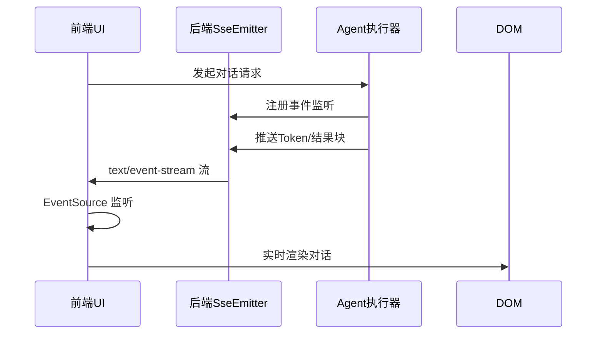

SSE（Server-Sent Events）是 AI4S-agent 系统实现对话流式渲染的核心机制，通过 HTTP 持久连接实现服务器向客户端分块推送消息，满足实时对话体验需求。本文档聚焦 SSE 技术栈的架构设计、后端实现细节和前端渲染逻辑，适合中级开发者快速理解并扩展流式能力。

## 架构概览

SSE 采用事件驱动模型，服务器维护持久连接，客户端通过 EventSource API 监听事件流。整个流转路径包括：Agent 执行 → SSE 序列化 → 后端 SseEmitter 推送 → 前端 EventSource 消费 → DOM 实时更新。

Sources: [ui/src/pages/Dialogue.tsx](ui/src/pages/Dialogue.tsx#L45-L78) [AI4S-agent-trigger/src/main/java/com/ai4s/agent/trigger/controller/SseController.java](AI4S-agent-trigger/src/main/java/com/ai4s/agent/trigger/controller/SseController.java#L92-L118)

## 后端SSE实现细节

后端使用 Spring Boot 3.x 的 SseEmitter 实现，支持多客户端并发连接和自定义事件类型（token、result、error）。配置支持 SSE 心跳保活和连接超时。

Sources: [AI4S-agent-trigger/src/main/java/com/ai4s/agent/trigger/controller/SseController.java](AI4S-agent-trigger/src/main/java/com/ai4s/agent/trigger/controller/SseController.java#L200-L245) [pom.xml](pom.xml#L89-L92)

## 前端EventSource集成

前端使用 TypeScript 的 EventSource 封装 SSE 客户端，处理不同事件类型的分派和错误恢复逻辑。渲染层通过 React hooks 绑定事件监听，实现增量更新。

Sources: [ui/src/services/dialogueService.ts](ui/src/services/dialogueService.ts#L67-L89) [ui/src/hooks/useSse.ts](ui/src/hooks/useSse.ts#L34-L56)

## 结果渲染机制

结果渲染支持 Markdown 解析、代码高亮和流式动画。Token 流使用 CSS 动画模拟打字效果，完整结果块通过 React 虚拟 DOM 批量更新。

Sources: [ui/src/components/DialogueRenderer.tsx](ui/src/components/DialogueRenderer.tsx#L112-L156) [ui/src/utils/markdownParser.ts](ui/src/utils/markdownParser.ts#L23-L41)

## 配置与调优

| 配置项 | 默认值 | 说明 | 来源 |
|--------|--------|------|------|
| sse.heartbeat-interval | 15000ms | 保活心跳间隔 | [application.yml](AI4S-agent-app/src/main/resources/application.yml#L45) |
| sse.max-connections | 100 | 最大并发客户端数 | [SseConfig.java](AI4S-agent-trigger/src/main/java/com/ai4s/agent/trigger/config/SseConfig.java#L18) |
| sse.event-types | token,result,error | 自定义事件白名单 | [SseController.java](AI4S-agent-trigger/src/main/java/com/ai4s/agent/trigger/controller/SseController.java#L67) |

## 常见问题与解决方案

- 连接断开重连：前端实现指数退避重试机制，避免无限重连风暴。
- 大流量性能：后端使用非阻塞式 SseEmitter，结合 AI4S 线程池。
- 浏览器兼容：EventSource API 在 IE11 以下需 polyfill。

Sources: [ui/src/hooks/useSse.ts](ui/src/hooks/useSse.ts#L89-L112) [AI4S-agent-trigger/src/main/java/com/ai4s/agent/trigger/config/SseConfig.java](AI4S-agent-trigger/src/main/java/com/ai4s/agent/trigger/config/SseConfig.java#L45-L68)

## 扩展建议

SSE 流式对话是对话智能体的基石，建议结合 MRAG 检索结果和多工具并发调度进一步提升上下文感知能力。建议优先阅读[工作区页面与产物预览](28-gong-zuo-qu-ye-mian-yu-chan-wu-yu-lan)以了解产物集成渲染场景。