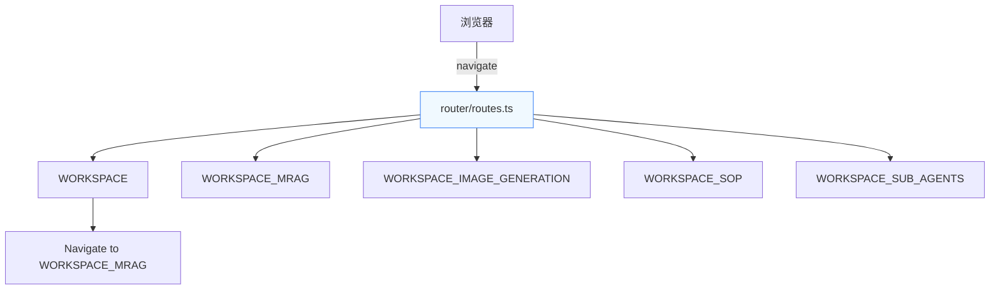
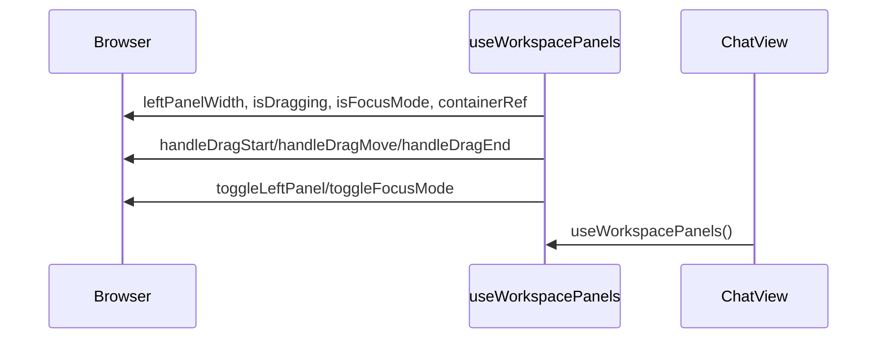
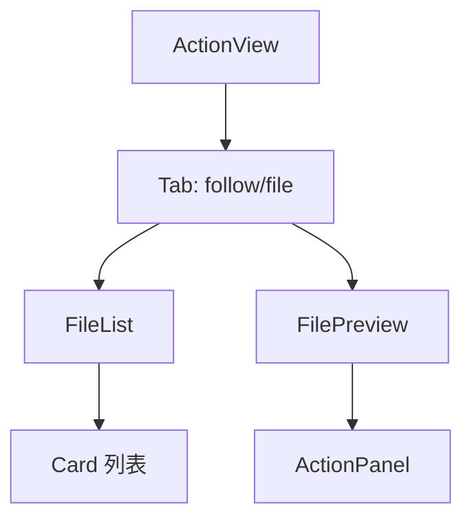
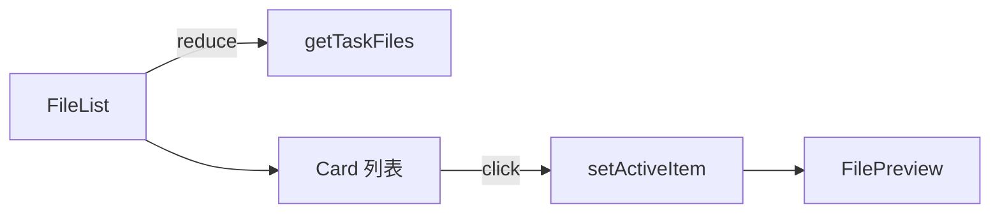
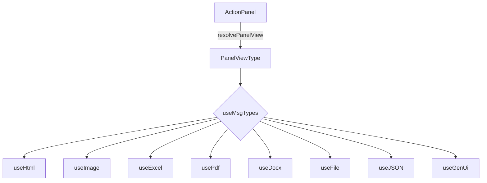
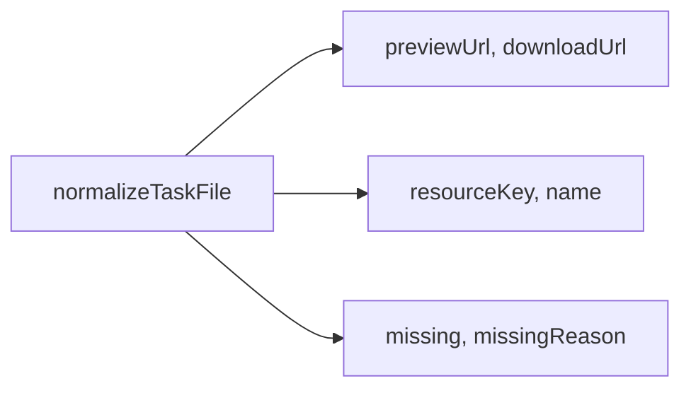

工作区页面是 AI4S Agent 核心交互界面，负责将智能体执行过程中的任务输出（对话列表、任务列表、产物文件）渲染成可交互的预览区域。产物预览模块实现了多格式文件（文本、图片、PDF、Excel、Word、HTML、PPT 等）的智能展示，支持文件列表切换、动态跟进、焦点模式、拖拽调整布局，以及下载/复制等操作。本页面详细阐述工作区页面的路由、组件结构、状态管理、产物类型映射和渲染机制，为中级开发者提供完整的技术脉络。

## 路由配置与工作区入口

工作区页面由 React Router 管理，`/workspace` 作为主入口被重定向到 MRAG 子工作台。核心路由配置定义了多工具工作区（MRAG、图片生成、SOP、子 Agent 等）的统一入口。

Sources: [routes.ts](ui/src/router/routes.ts#L1-L11)  
Sources: [index.tsx](ui/src/router/index.tsx#L52-L63)

## 工作区面板组件：useWorkspacePanels

`useWorkspacePanels` 提供统一的左右面板布局状态管理，支持拖拽调整、折叠、专注模式（focus mode）切换和右侧工作区折叠逻辑。左侧为聊天对话区，右侧为产物预览区。

Sources: [useWorkspacePanels.ts](ui/src/components/ChatView/useWorkspacePanels.ts#L12-L102)

## ActionView 组件：产物预览主容器

`ActionView` 是工作区产物的核心渲染容器，负责 Tab 切换（动态 / 文件）、文件列表视图和实时跟进视图的切换。使用 `useSafeState` 管理当前文件和激活的 ActionView 类型。

Sources: [ActionView.tsx](ui/src/components/ActionView/ActionView.tsx#L46-L88)  
Sources: [ActionView.tsx](ui/src/components/ActionView/ActionView.tsx#L198-L200)

## 文件列表与详情渲染：FileList

`FileList` 组件负责展示任务生成的所有产物文件，支持按类型图标分类、点击切换详情视图。支持图片、PDF、Word、Excel 等文件的原生预览渲染器。

Sources: [FileList.tsx](ui/src/components/ActionView/FileList.tsx#L77-L200)

## 产物类型渲染器：ActionPanel 与 panelResolver

`ActionPanel` 根据 `useMsgTypes` 返回的 `msgTypes` 分支渲染不同产物：
- `html` / `ppt` → HTMLRenderer
- `image` → ImageRenderer
- `excel` / `csv` → TableRenderer
- `pdf` → PdfRenderer
- `docx` / `legacy-doc` → WordRenderer
- `code` / `markdown` → MarkdownRenderer
- `json` → JsonViewer
- `ui_tree` → GenUiInline

Sources: [panelResolver.ts](ui/src/components/ActionPanel/panelResolver.ts#L101-L243)  
Sources: [useMsgTypes.ts](ui/src/components/ActionPanel/useMsgTypes.ts#L55-L125)  
Sources: [ActionPanel.tsx](ui/src/components/ActionPanel/ActionPanel.tsx#L102-L200)

## 产物文件规范化：taskArtifacts.ts

统一产物文件的 URL、类型、缺失状态处理，避免不同来源（artifactRefs、fileInfo、resultMap）的数据结构差异。

Sources: [taskArtifacts.ts](ui/src/utils/taskArtifacts.ts#L106-L200)

## 常量与配置：constants.ts

`actionViewOptions` 控制 Tab 选项，`defaultActiveActionView` 设置初始跟随模式。支持的数据分析模式（dataAgent）与多 Agent 模式（deepThink）在 ChatView 中独立渲染。

Sources: [constants.ts](ui/src/utils/constants.ts#L27-L39)

## 产物预览流程总结

1. ChatView 接收任务列表 → taskList
2. ActionView 激活文件 Tab 或跟进 Tab
3. FileList 渲染文件卡片列表
4. 点击卡片 → setActiveItem → FilePreview 显示对应渲染器
5. ActionPanel 完成最终渲染

Sources: [ChatView.tsx](ui/src/components/ChatView/index.tsx#L200-L300)  
Sources: [ChatView.tsx](ui/src/components/ChatView/index.tsx#L380-L390)

## 交互模式支持

- **跟随模式**（follow）：实时更新预览
- **文件模式**（file）：手动切换文件详情
- **专注模式**（focus）：隐藏聊天区，全屏工作区
- **拖拽调整**：左右面板宽度可调节（24%~56%）

Sources: [useWorkspacePanels.ts](ui/src/components/ChatView/useWorkspacePanels.ts#L67-L100)

## 产物预览限制与注意事项

- 二进制文件不支持文本复制
- PDF/Word 使用专用渲染器，避免 iframe 安全问题
- 文件缺失时显示友好提示
- 数据分析模式（dataAgent）不使用 ActionView 面板