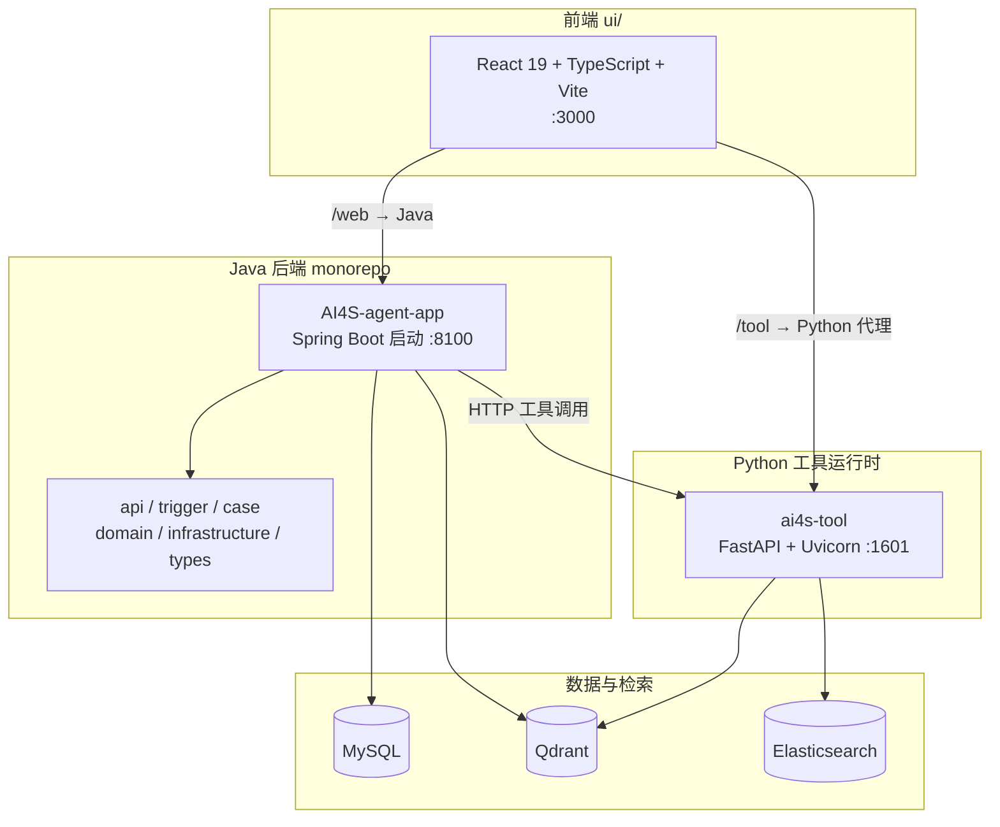
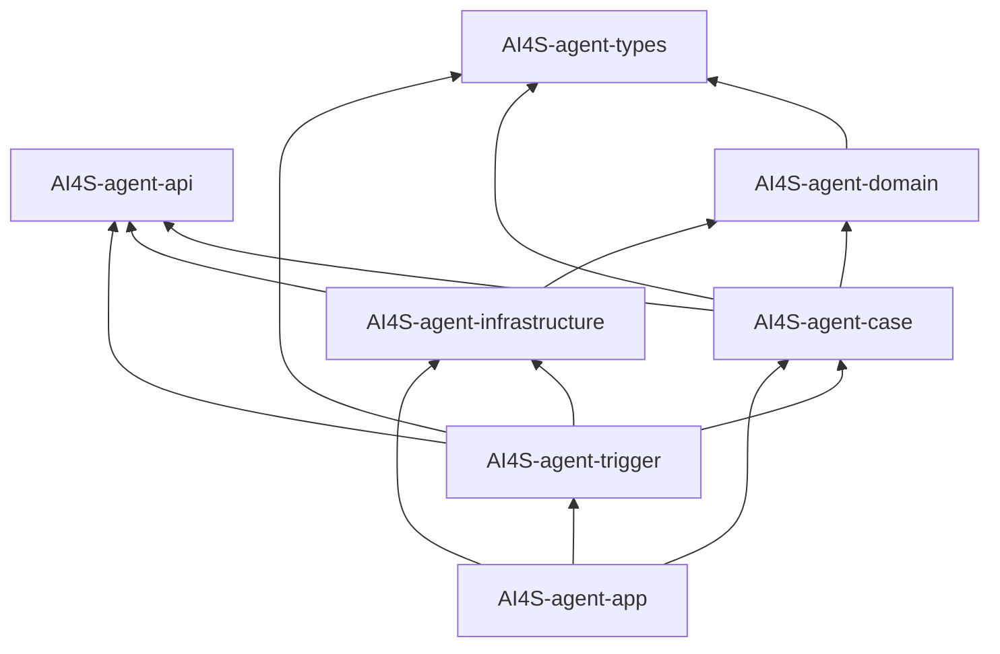
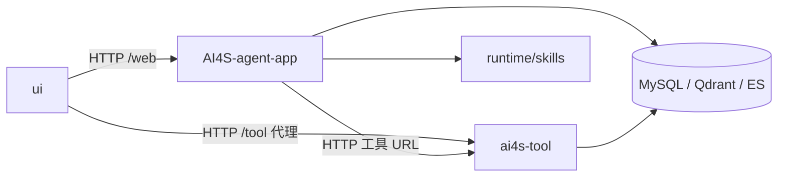

本文梳理 **AI4S-agent** 仓库的运行时组成、核心技术选型，以及 Java 多模块之间的依赖方向。阅读后你能回答三个问题：系统由哪几块构成、每块用了什么技术、模块之间谁依赖谁。更细的启动步骤请见后续环境文档；分层职责见 [分层架构与模块职责](9-fen-ceng-jia-gou-yu-mo-kuai-zhi-ze)。

## 一、仓库全景：三端一体

AI4S-agent 是一个 **monorepo**。本地同时存在三条可独立启动的运行时，再通过 HTTP / SSE 协作：

| 运行时 | 目录 | 默认端口 | 角色 |
|--------|------|----------|------|
| Java 后端 | `AI4S-agent-*` + 根 `pom.xml` | **8100** | Agent 编排、会话、账本、MCP、领域逻辑 |
| Python 工具运行时 | `ai4s-tool/` | **1601** | DeepSearch、CodeInterpreter、MRAG、Report 等重工具 |
| 前端 UI | `ui/` | **3000** | 对话界面、SSE 消费、工作区预览 |

Sources: [application-dev.yml](AI4S-agent-app/src/main/resources/application-dev.yml)（`server.port: 8100` 与 `*_url: http://127.0.0.1:1601`）、[server.py](ai4s-tool/server.py)（默认 `--port 1601`）、[vite.config.ts](ui/vite.config.ts)（`port: 3000`）

三端协作关系可用下图理解（关注依赖与协议，不展开执行细节）：



Sources: [README.md](README.md)（技术栈与架构说明）、[vite.config.ts](ui/vite.config.ts)（`/web` 与 `/tool` 代理）、[application-dev.yml](AI4S-agent-app/src/main/resources/application-dev.yml)（`code_interpreter_url` / `deep_search_url` 等指向 `1601`）

## 二、核心技术栈一览

根 README 将选型概括为：**Java 17、Spring Boot 3、Spring AI、MyBatis、OkHttp SSE；数据层 MySQL + Qdrant；前端 React 19 + TypeScript + Vite + Ant Design**。下表按运行时展开，便于对照依赖文件。

Sources: [README.md](README.md)

### 2.1 Java 后端

| 类别 | 技术 | 版本锚点（以仓库为准） | 用途 |
|------|------|------------------------|------|
| 语言 / 构建 | Java、Maven | **Java 17** | 多模块聚合构建 |
| 应用框架 | Spring Boot | **3.4.3**（parent） | Web、配置、装配 |
| AI 框架 | Spring AI BOM | **1.1.4** | OpenAI 兼容模型、MCP Client、向量与文档读取 |
| 模型接入 | spring-ai-starter-model-openai、spring-ai-ollama | 由 BOM 管理 | 对话模型 / 本地 Ollama embedding |
| MCP | spring-ai-starter-mcp-client-webflux | 由 BOM 管理 | MCP 客户端（WebFlux） |
| 持久化 | MyBatis、MyBatis-Plus、MySQL Connector | 3.0.4 / **3.5.14** / **8.0.28** | 业务库与账本 |
| 连接池 | HikariCP | Spring Boot 默认 | MySQL 连接池 |
| 辅助库 | Fastjson、Guava、Commons Lang3、JWT | 见根 `dependencyManagement` | JSON、集合、鉴权相关 |
| HTTP / SSE | OkHttp、okhttp-sse | **4.9.3**（domain / infrastructure） | 远端工具流式调用 |
| 检索客户端 | Qdrant client、ES High Level Client | **1.10.0** / **7.6.2**（domain） | 向量与全文相关能力 |
| 设计框架 | xfg-wrench-bom | **3.0.0** | 通用设计模式 starter |
| PDF 导出 | OpenPDF | **1.3.39**（domain） | GenUI 等 PDF 产物 |

Sources: [pom.xml](pom.xml#L34-L138)、[AI4S-agent-app/pom.xml](AI4S-agent-app/pom.xml)、[AI4S-agent-domain/pom.xml](AI4S-agent-domain/pom.xml)

### 2.2 Python 工具运行时（ai4s-tool）

| 类别 | 技术 | 说明 |
|------|------|------|
| 语言 | Python **≥3.11,<4.0**（仓库 `.python-version` 为 3.11） | 工具侧运行时 |
| Web | FastAPI、Uvicorn、sse-starlette | HTTP API 与 SSE |
| LLM 编排 | litellm、openai、smolagents | 模型调用与轻量 agent 能力 |
| 检索 | qdrant-client、elasticsearch、fastembed、jieba | 向量 / 全文 / 嵌入 |
| 文档与数据 | pandas、openpyxl、pymupdf、pdfplumber、python-docx、python-pptx、reportlab | 表格、PDF、Office、报告 |
| 抓取 | crawl4ai、trafilatura、beautifulsoup4、ddgs | 网页与搜索 |
| 可视化 | matplotlib、plotly、altair、seaborn | 图表与分析产物 |

Sources: [pyproject.toml](ai4s-tool/pyproject.toml)、[ai4s-tool/.python-version](ai4s-tool/.python-version)、[server.py](ai4s-tool/server.py)

### 2.3 前端 UI

| 类别 | 技术 | 说明 |
|------|------|------|
| 框架 | React **19**、TypeScript **~5.7** | 组件与类型 |
| 构建 | Vite **6**、@vitejs/plugin-react | 开发与生产构建 |
| UI | Ant Design **5**、Radix UI、Tailwind **4**、lucide-react | 组件与样式 |
| 流式 | @microsoft/fetch-event-source、ai | SSE / 流式对话 |
| 内容渲染 | react-markdown、shiki、mermaid、echarts | Markdown、代码高亮、图、图表 |
| 状态与工具 | ahooks、axios、zod、dayjs | 请求、校验、日期 |

Sources: [ui/package.json](ui/package.json)、[ui/vite.config.ts](ui/vite.config.ts)

### 2.4 数据与外部能力（配置视角）

开发配置中，Java 侧默认依赖：

- **MySQL**：业务与问数数据源（Hikari）
- **Qdrant**：向量检索（`data-agent.qdrantConfig`）
- **Elasticsearch**：检索相关（`data-agent.es-config`）
- **OpenAI 兼容 / Ollama**：模型与 embedding 端点
- **ai4s-tool HTTP**：`code_interpreter_url`、`deep_search_url`、`web_fetch_url`、`knowledge_url`、`data_analysis_url` 等统一指向工具运行时

Sources: [application-dev.yml](AI4S-agent-app/src/main/resources/application-dev.yml)、[application.yml](AI4S-agent-app/src/main/resources/application.yml)

> 具体密钥、云实例地址属于部署环境，不应写进文档正文；本地启动时按 [Java 后端启动与配置](4-java-hou-duan-qi-dong-yu-pei-zhi) 与 [Python 工具运行时启动](5-python-gong-ju-yun-xing-shi-qi-dong) 配置即可。

## 三、Java 多模块地图

根 `pom.xml` 以 `packaging=pom` 聚合 **7 个模块**（可选 profile 还可纳入 MCP 子工程，源码存在时才激活）：

```tex
AI4S-agent/                         # 根聚合
├── AI4S-agent-types                # 基础类型 / 异常 / 配置名
├── AI4S-agent-api                  # 对外 API 契约与 DTO
├── AI4S-agent-domain               # Agent 运行时、账本、工具、RAG 等领域核心
├── AI4S-agent-case                 # 应用编排（策略、任务、装配）
├── AI4S-agent-infrastructure       # DAO、Gateway、远端适配
├── AI4S-agent-trigger              # HTTP / SSE / Job 入口
└── AI4S-agent-app                  # Spring Boot 启动与自动配置
```

Sources: [pom.xml](pom.xml#L10-L18)、[README.md](README.md)（项目结构说明）

### 3.1 模块职责（依赖视角的一句话）

| 模块 | 依赖谁（内部） | 一句话职责 |
|------|----------------|------------|
| **types** | 无内部模块 | 公共类型、异常、执行器配置名等底层共享物 |
| **api** | 无内部模块 | 服务接口与 DTO 契约，供 trigger / case / infrastructure 共用 |
| **domain** | types | Agent 内核、工具集合、MCP/Skill、账本、记忆、RAG 等领域逻辑 |
| **case** | api、domain、types | 执行策略（ReAct / PlanSolve / Flow）、任务与能力装配编排 |
| **infrastructure** | domain、api | 仓储、DAO、OkHttp 远端适配、文件与图像网关 |
| **trigger** | api、case、types、infrastructure | Controller / SSE / Job，把外部协议转成应用调用 |
| **app** | case、trigger、infrastructure | 唯一可执行 JAR 入口与 Spring 配置装配 |

Sources: [AI4S-agent-types/pom.xml](AI4S-agent-types/pom.xml)、[AI4S-agent-api/pom.xml](AI4S-agent-api/pom.xml)、[AI4S-agent-domain/pom.xml](AI4S-agent-domain/pom.xml)、[AI4S-agent-case/pom.xml](AI4S-agent-case/pom.xml)、[AI4S-agent-infrastructure/pom.xml](AI4S-agent-infrastructure/pom.xml)、[AI4S-agent-trigger/pom.xml](AI4S-agent-trigger/pom.xml)、[AI4S-agent-app/pom.xml](AI4S-agent-app/pom.xml)

### 3.2 模块依赖图（Maven 声明）

依赖方向遵循 **入口 → 编排 → 领域 → 类型**，基础设施向领域实现仓储，**禁止** domain 反向依赖 infrastructure（领域通过接口由 infra 实现）。



Sources: 各模块 [pom.xml](AI4S-agent-case/pom.xml) 中的 `cn.bugstack.ai` 依赖声明；app 注释写明「启动依赖 trigger→domain, infrastructure」见 [AI4S-agent-app/pom.xml](AI4S-agent-app/pom.xml)

### 3.3 关键第三方依赖落点（谁“带进来”）

| 依赖簇 | 主要落在 | 说明 |
|--------|----------|------|
| Spring Web / Boot Web | app、trigger、types | 入口与启动装配 |
| Spring AI（OpenAI / MCP / Tika / Vector） | **domain**、**app** | 领域内核与启动侧模型装配 |
| MyBatis / MyBatis-Plus / MySQL | **app**、**infrastructure** | 启动数据源 + DAO 实现 |
| OkHttp / SSE | **domain**、**infrastructure** | 工具调用与远端流式适配 |
| Qdrant / ES / Calcite / ClickHouse JDBC | **domain** | 检索与数据相关领域能力 |
| xfg-wrench design-framework | **domain** | 设计模式框架 |
| jakarta.validation / spring-webmvc | **api** | 契约层校验与 MVC 注解类型 |

Sources: [AI4S-agent-domain/pom.xml](AI4S-agent-domain/pom.xml)、[AI4S-agent-app/pom.xml](AI4S-agent-app/pom.xml)、[AI4S-agent-infrastructure/pom.xml](AI4S-agent-infrastructure/pom.xml)、[AI4S-agent-api/pom.xml](AI4S-agent-api/pom.xml)

## 四、非 Java 目录如何接入依赖关系

这三块 **不在** 根 Maven `modules` 中，但运行时与 Java 强耦合：

```tex
AI4S-agent/
├── ai4s-tool/          # Python FastAPI 工具服务（被 Java autobots.autoagent.*_url 调用）
├── ui/                    # 前端；开发态代理 /web → Java、/tool → ai4s-tool
├── runtime/skills/        # Skill 脚本与资源（Java skill.directories 指向）
└── assets/                # 文档与展示资源（不参与运行时依赖图）
```

**依赖方向（运行时）：**

1. **UI → Java**：业务 API、SSE 对话
2. **UI → ai4s-tool**：部分工具代理（Vite `/tool`）
3. **Java → ai4s-tool**：CodeInterpreter、DeepSearch、WebFetch、MRAG、数据分析等
4. **Java → runtime/skills**：Skill 发现与脚本执行（配置项 `autobots.autoagent.skill.directories`）
5. **两端 → MySQL / Qdrant / ES**：持久化与检索（Java 为主配置入口；Python 侧亦持有检索客户端库）

Sources: [pom.xml](pom.xml#L10-L18)（仅列 7 个 Java 模块）、[application.yml](AI4S-agent-app/src/main/resources/application.yml)（`web_fetch_url`、`workspace.root-template`、`skill.directories`）、[vite.config.ts](ui/vite.config.ts)、[application-dev.yml](AI4S-agent-app/src/main/resources/application-dev.yml)



## 五、版本与构建约定（初学者速查）

| 项 | 约定 |
|----|------|
| 坐标 | `groupId=cn.bugstack.ai`，版本 `1.0-SNAPSHOT` |
| 父工程 | `spring-boot-starter-parent` **3.4.3** |
| BOM 导入 | `spring-ai-bom` **1.1.4**、`xfg-wrench-bom` **3.0.0** |
| 编译 | `maven.compiler.source/target=17` |
| 可执行入口 | `AI4S-agent-app`，`mainClass=org.wwz.ai.Application` |
| Maven Profile | 默认 `dev`；另有 `test` / `prod`；`with-mcp-server-csdn` 在 MCP 子模块存在时可选纳入 |
| 前端脚本 | `pnpm`/`npm`：`dev` / `build` / `test`（见 `ui/package.json`） |
| Python 管理 | `uv` + `pyproject.toml` / `uv.lock` |

Sources: [pom.xml](pom.xml)、[AI4S-agent-app/pom.xml](AI4S-agent-app/pom.xml)、[ui/package.json](ui/package.json)、[ai4s-tool/pyproject.toml](ai4s-tool/pyproject.toml)

## 六、如何读懂依赖：给初学者的三条原则

**1. 先找“入口模块”**
- 后端从 **app** 看起：它把 trigger、case、infrastructure 打成一个可运行 JAR。
- 前端从 **ui/package.json + vite.config.ts** 看代理目标。
- 工具从 **ai4s-tool/server.py + pyproject.toml** 看端口与库。

**2. 再画“内部依赖箭头”**
Java 内部只允许 **trigger/case → domain → types** 与 **infra → domain** 这类向下依赖；改领域逻辑优先落在 `domain`，改表结构与外部 HTTP 适配优先落在 `infrastructure`。

**3. 最后对照“运行时 URL”**
Java 配置里大量 `*_url: http://127.0.0.1:1601` 表示：**领域工具能力在进程外**。本地若只起 Java 不起 Python，搜索/代码解释/MRAG 等会失败——这是架构选择，不是偶然配置。

Sources: [AI4S-agent-app/pom.xml](AI4S-agent-app/pom.xml)、[application-dev.yml](AI4S-agent-app/src/main/resources/application-dev.yml)、[server.py](ai4s-tool/server.py)

## 七、下一步阅读

按「先能跑起来、再理解分层」建议：

1. [Java 后端启动与配置](4-java-hou-duan-qi-dong-yu-pei-zhi) — 端口、数据源、模型与 profile
2. [Python 工具运行时启动](5-python-gong-ju-yun-xing-shi-qi-dong) — ai4s-tool 依赖安装与 1601 服务
3. [前端 UI 启动与联调](6-qian-duan-ui-qi-dong-yu-lian-diao) — Vite 代理与三端联调
4. [分层架构与模块职责](9-fen-ceng-jia-gou-yu-mo-kuai-zhi-ze) — 在依赖图之上深入包结构与职责边界

若你已完成环境搭建，可直接进入 [首个复杂任务对话](7-shou-ge-fu-za-ren-wu-dui-hua) 验证整条依赖链是否打通。
