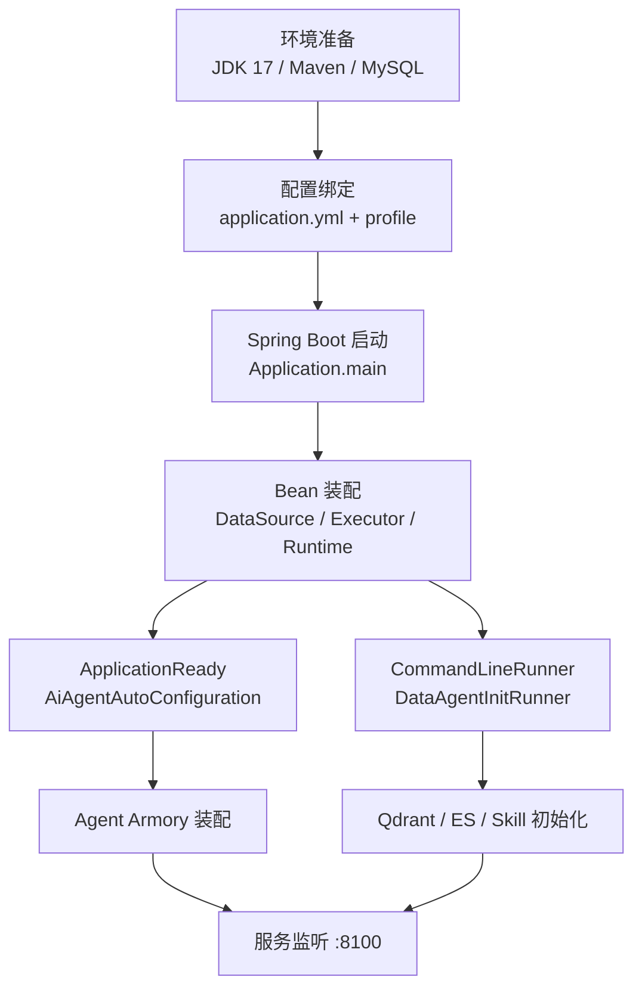
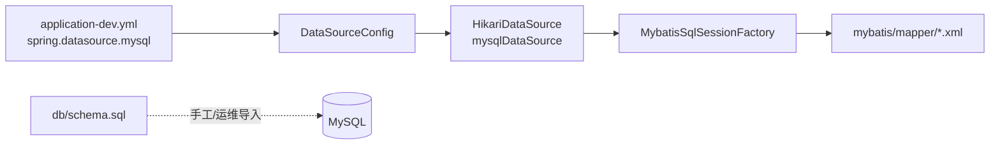
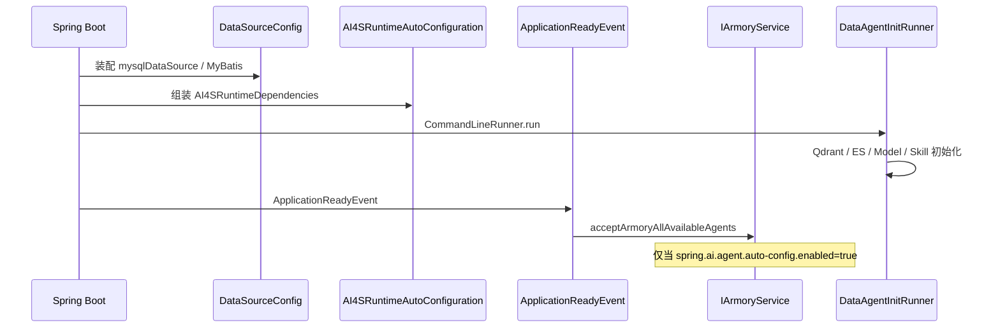

本文聚焦 **AI4S-agent** 的 Java 后端如何完成环境准备、配置绑定与启动装配，帮助中级开发者在本机或联调环境中快速拉起 `AI4S-agent-app`，并理解配置与运行时组件之间的对应关系。完整系统能力与模块依赖请先阅读 [技术栈与模块依赖](3-ji-zhu-zhan-yu-mo-kuai-yi-lai)；工具侧与前端联调分别见 [Python 工具运行时启动](5-python-gong-ju-yun-xing-shi-qi-dong) 与 [前端 UI 启动与联调](6-qian-duan-ui-qi-dong-yu-lian-diao)。

## 启动架构总览

Java 后端的启动入口位于 `AI4S-agent-app` 模块。该模块以 Spring Boot 3 为运行时，聚合 `trigger`（HTTP/SSE 入口）、`case`（编排）、`domain`（领域内核）与 `infrastructure`（持久化与外部适配），并在应用就绪后完成 Agent 自动装配、DataAgent 能力探测、Skill 注册等初始化动作。



Sources: [Application.java](AI4S-agent-app/src/main/java/org/wwz/ai/Application.java#L1-L16), [AiAgentAutoConfiguration.java](AI4S-agent-app/src/main/java/org/wwz/ai/config/AiAgentAutoConfiguration.java#L1-L53), [DataAgentInitRunner.java](AI4S-agent-app/src/main/java/org/wwz/ai/config/ai4s/DataAgentInitRunner.java#L1-L80)

## 环境与依赖前提

启动前需确认以下本地或容器环境就绪。核心技术栈为 **Java 17**、**Spring Boot 3.4.3**、**Spring AI 1.1.4**、**MyBatis-Plus** 与 **MySQL 8**。

| 依赖项 | 建议版本 / 约定 | 作用 |
|--------|-----------------|------|
| JDK | 17 | 编译与运行时 |
| Maven | 3.8+ | 多模块构建 |
| MySQL | 8.0.x | 业务主库与执行账本 |
| ai4s-tool | 本机 `1601` | DeepSearch / CodeInterpreter 等远程工具 |
| LLM API Key | 兼容 OpenAI 协议 | 主对话与工具推理 |

根 `pom.xml` 通过 `dependencyManagement` 统一管理模块版本与 Spring AI BOM，默认激活 `dev` profile。

Sources: [pom.xml](pom.xml#L34-L40), [pom.xml](pom.xml#L56-L60), [pom.xml](pom.xml#L200-L210)

## 启动入口与模块装配

启动类 `org.wwz.ai.Application` 使用 `@SpringBootApplication` 与 `@EnableTransactionManagement`，由 Spring Boot 负责组件扫描与事务启用。`AI4S-agent-app` 的 `pom.xml` 声明对 `case`、`trigger`、`infrastructure` 的依赖，并指定 `spring-boot-maven-plugin` 的 `mainClass` 为 `org.wwz.ai.Application`。

本地推荐两种启动方式：

1. **IDE 直接运行**：打开 `Application`，Active profiles 设为 `dev`。
2. **Maven 打包运行**：

```bash
mvn -pl AI4S-agent-app -am clean package -DskipTests
java -jar AI4S-agent-app/target/AI4S-agent-app.jar --spring.profiles.active=dev
```

Sources: [Application.java](AI4S-agent-app/src/main/java/org/wwz/ai/Application.java#L8-L15), [pom.xml](AI4S-agent-app/pom.xml#L170-L180)

## Profile 与配置文件层级

配置采用 **基础配置 + Profile 覆盖** 模式：

| 文件 | 作用 | 典型场景 |
|------|------|----------|
| `application.yml` | 全局默认、workspace、skill、compaction、访客 Cookie | 所有环境共享 |
| `application-dev.yml` | 端口、数据源、LLM、工具 URL、Agent Prompt | 本地开发主配置 |
| `application-test.yml` | 关闭数据源自动装配，弱化外部依赖 | 单测 / 无库探针 |
| `application-prod.yml` | 生产转发头、Cookie 安全、允许源 | 生产部署 |

默认 `spring.profiles.active: dev`，服务端口在 dev 中为 **8100**。

Sources: [application.yml](AI4S-agent-app/src/main/resources/application.yml#L1-L12), [application-dev.yml](AI4S-agent-app/src/main/resources/application-dev.yml#L1-L5), [application-test.yml](AI4S-agent-app/src/main/resources/application-test.yml#L1-L30)

## 数据库准备与数据源装配

业务主库默认连接 `jdbc:mysql://127.0.0.1:3306/ai-agent-station`。`DataSourceConfig` 在非 `test` profile 且显式配置了 `spring.datasource.mysql.*` 时装配 HikariCP 与 MyBatis-Plus `SqlSessionFactory`。



关键约定：

- **逻辑删除字段** `yn`：删除值 `0`，未删除值 `1`。
- **执行账本主路径**：`ai_agent_dialogue_session` / `ai_agent_dialogue_run` / `ai_agent_llm_invocation` / `ai_agent_tool_invocation` / `ai_agent_artifact` 等，由 `schema.sql` 定义。
- **运维初始化脚本**：`docs/dev-ops/mysql/sql/ai-agent-station-study.sql` 提供完整库表与种子数据；`docker-compose-environment.yml` 可一键起 MySQL（宿主机端口映射 `13306`）。
- 应用内 `spring.sql.init.mode: never`，**不会**在启动时自动执行 schema，需预先建库导表。

Sources: [DataSourceConfig.java](AI4S-agent-app/src/main/java/org/wwz/ai/config/DataSourceConfig.java#L26-L120), [application-dev.yml](AI4S-agent-app/src/main/resources/application-dev.yml#L22-L50), [schema.sql](AI4S-agent-app/src/main/resources/db/schema.sql#L1-L35), [docker-compose-environment.yml](docs/dev-ops/docker-compose-environment.yml#L1-L30)

## 关键运行时配置说明

### 服务与上传

| 配置项 | 默认值（dev） | 说明 |
|--------|---------------|------|
| `server.port` | `8100` | HTTP 监听端口 |
| `spring.servlet.multipart.max-file-size` | `200MB` | 单文件上限 |
| `spring.servlet.multipart.max-request-size` | `300MB` | 单次请求合计上限 |

Sources: [application-dev.yml](AI4S-agent-app/src/main/resources/application-dev.yml#L1-L20)

### LLM 与默认模型

dev 配置同时提供 `spring.ai.openai` 与 `llm.default` / `llm.settings` 两套入口。主 Agent 默认模型名为 `grok-4.5`，`max_tokens` 等参数可在 `llm.settings` JSON 中按模型覆盖。

Sources: [application-dev.yml](AI4S-agent-app/src/main/resources/application-dev.yml#L75-L110)

### 远程工具 URL（对接 ai4s-tool）

Java 侧将多数重工具以 HTTP 子智能体方式挂载到本机 `1601`：

| 配置键 | 默认 | 对应能力 |
|--------|------|----------|
| `autobots.autoagent.code_interpreter_url` | `http://127.0.0.1:1601` | CodeInterpreter |
| `autobots.autoagent.deep_search_url` | `http://127.0.0.1:1601` | DeepSearch |
| `autobots.autoagent.web_fetch_url` | `http://127.0.0.1:1601` | WebFetch |
| `autobots.autoagent.multimodalagent_url` | `http://127.0.0.1:1601` | 多模态检索 |
| `autobots.autoagent.data_analysis_url` | `http://127.0.0.1:1601` | 数据分析 |
| `autobots.autoagent.knowledge_url` | `http://127.0.0.1:1601` | 知识服务 |

启动完整链路前应先保证 [Python 工具运行时启动](5-python-gong-ju-yun-xing-shi-qi-dong) 已就绪，否则工具调用会超时或失败。

Sources: [application-dev.yml](AI4S-agent-app/src/main/resources/application-dev.yml#L1-L50), [application.yml](AI4S-agent-app/src/main/resources/application.yml#L35-L45)

### 会话工作区（Workspace）

`autobots.autoagent.workspace` 控制会话级 cwd：

- `enabled: true` 时启用 workspace 工具，并在可见工具中下线旧 `file_tool`。
- `root-template` 默认 `{repoRoot}/ai4s-tool/skilloutput/{sessionId}`，**不要**依赖 Spring 展开的 `${user.dir}`，避免启动 cwd 错位。

Sources: [application.yml](AI4S-agent-app/src/main/resources/application.yml#L40-L55), [AiAgentWorkspaceProperties.java](AI4S-agent-app/src/main/java/org/wwz/ai/config/AiAgentWorkspaceProperties.java#L1-L35)

### Skill 与记忆压缩

| 配置前缀 | 关键项 | 说明 |
|----------|--------|------|
| `autobots.autoagent.skill` | `enabled`、`directories` | Skill 开关与目录（默认 `runtime/skills`） |
| `autobots.autoagent.compaction` | `enabled`、`llm-enabled`、`buffer-tokens` | 工作记忆压缩阈值与策略 |

Sources: [application.yml](AI4S-agent-app/src/main/resources/application.yml#L55-L95)

### DataAgent（问数 / 检索）

`autobots.data-agent` 管理独立问数数据源、ES 与 Qdrant。dev 中默认启用云端 ES/Qdrant 示例配置；本地可改为 `enable: false` 做降级启动。`DataAgentInitRunner` 在启动时探测向量代理健康度、创建 collection / 索引，失败时非强制刷新场景下会 **降级关闭** 对应能力而不阻断主服务。

Sources: [DataAgentInitRunner.java](AI4S-agent-app/src/main/java/org/wwz/ai/config/ai4s/DataAgentInitRunner.java#L50-L150), [application-dev.yml](AI4S-agent-app/src/main/resources/application-dev.yml#L1-L50)

## 执行器与线程池装配

Agent 主链路使用专用执行器，避免与业务线程池互相挤占：

| Bean 名称 | 默认 core/max/queue | 用途 |
|-----------|---------------------|------|
| `agent-dispatch` | 16 / 32 / 200 | 请求分发 |
| `agent-llm` | 16 / 32 / 100 | LLM 调用 |
| `agent-task` | 8 / 16 / 50 | 任务编排 |
| `agent-tool` | 8 / 16 / 50 | 工具并发 |
| heartbeat scheduler | poolSize 2 | SSE 心跳 |

配置前缀为 `autobots.execution`，由 `AgentExecutorConfiguration` 绑定 `AgentExecutorProperties`。另有遗留 `thread.pool.executor.config`（`legacyThreadPoolExecutor`）供旧 armory 链路使用。

Sources: [AgentExecutorConfiguration.java](AI4S-agent-app/src/main/java/org/wwz/ai/config/AgentExecutorConfiguration.java#L1-L85), [AgentExecutorProperties.java](AI4S-agent-types/src/main/java/org/wwz/ai/types/agent/config/AgentExecutorProperties.java#L1-L100), [ThreadPoolConfig.java](AI4S-agent-app/src/main/java/org/wwz/ai/config/ThreadPoolConfig.java#L1-L50)

## 启动后自动初始化流程



- **`AiAgentAutoConfiguration`**：监听 `ApplicationReadyEvent`，在 `spring.ai.agent.auto-config.enabled=true` 时触发 case 层 `IArmoryService` 完成可用 Agent 装配。
- **`AI4SRuntimeAutoConfiguration`**：把 LLM 解析器、MCP 执行器、远程 HTTP/流式端口、工具执行器等组装为 domain 可消费的 `AI4SRuntimeDependencies`。
- **`DataAgentInitRunner`**：初始化问数 schema（H2 场景）、Qdrant collection、ES 列值索引、ChatModel 元数据与 Skill 注册表。

Sources: [AiAgentAutoConfiguration.java](AI4S-agent-app/src/main/java/org/wwz/ai/config/AiAgentAutoConfiguration.java#L22-L50), [AI4SRuntimeAutoConfiguration.java](AI4S-agent-app/src/main/java/org/wwz/ai/config/ai4s/AI4SRuntimeAutoConfiguration.java#L1-L70), [DataAgentInitRunner.java](AI4S-agent-app/src/main/java/org/wwz/ai/config/ai4s/DataAgentInitRunner.java#L48-L80)

## 日志与运行产物

日志由 `logback-spring.xml` 管理：

- 控制台与异步文件同时输出，INFO 写入 `./data/log/log_info.log`，WARN+ 写入 `./data/log/log_error.log`。
- 按日滚动，单文件 100MB，INFO 保留 15 天 / 10GB，ERROR 保留 7 天 / 5GB。
- MCP SSE 传输层 logger 收敛为 ERROR，减少主动断流时的刷屏告警。

Sources: [logback-spring.xml](AI4S-agent-app/src/main/resources/logback-spring.xml#L1-L120)

## 推荐启动步骤（本地 dev）

1. **准备 MySQL**：创建库 `ai-agent-station`（或使用 docker-compose 起库后调整 URL 端口），导入 `docs/dev-ops/mysql/sql/` 或执行 `schema.sql` 及相关 migration。
2. **核对密钥与 URL**：在 `application-dev.yml` 中替换 `llm.default.apikey`、`spring.ai.openai.api-key`、搜索引擎 key、Qdrant/ES 凭据为你自己的环境值；勿将生产密钥提交仓库。
3. **启动 ai4s-tool**（可选但推荐）：保证 `127.0.0.1:1601` 可用，详见 [Python 工具运行时启动](5-python-gong-ju-yun-xing-shi-qi-dong)。
4. **编译并启动 Java 后端**：

```bash
mvn -pl AI4S-agent-app -am clean package -DskipTests
java -jar AI4S-agent-app/target/AI4S-agent-app.jar --spring.profiles.active=dev
```

5. **健康检查**：访问 `http://127.0.0.1:8100` 相关 HTTP 接口；观察控制台是否出现 “AI Agent 自动装配完成” 与 data-agent / skill 初始化日志。
6. **联调前端**：将 UI 代理指向 `8100`，参见 [前端 UI 启动与联调](6-qian-duan-ui-qi-dong-yu-lian-diao)。

Sources: [application-dev.yml](AI4S-agent-app/src/main/resources/application-dev.yml#L1-L40), [pom.xml](AI4S-agent-app/pom.xml#L170-L180)

## 常见问题排查

| 现象 | 可能原因 | 处理建议 |
|------|----------|----------|
| 启动报数据源占位符缺失 | 未激活 dev 或未配置 `spring.datasource.mysql.*` | 使用 `dev` profile，补全 URL/用户名 |
| test 环境仍尝试连库 | 误启用了 `DataSourceConfig` | test profile 会排除数据源装配，确认 active profiles |
| 工具调用全部超时 | ai4s-tool 未启动 | 先起 Python 运行时，检查 1601 |
| Qdrant/ES 报错但服务仍起 | 非 force-refresh 降级 | 检查 `force-refresh` 与向量代理健康度 |
| 工作区文件路径错乱 | `root-template` 使用了错误 cwd | 使用 `{repoRoot}/ai4s-tool/skilloutput/{sessionId}` |
| 上传失败 413 | 文件超限 | 调整 `multipart.max-file-size` |
| Agent 未自动装配 | `auto-config.enabled=false` | dev 默认 true，test 默认 false |

Sources: [DataSourceConfig.java](AI4S-agent-app/src/main/java/org/wwz/ai/config/DataSourceConfig.java#L95-L120), [application-test.yml](AI4S-agent-app/src/main/resources/application-test.yml#L14-L30), [DataAgentInitRunner.java](AI4S-agent-app/src/main/java/org/wwz/ai/config/ai4s/DataAgentInitRunner.java#L130-L160)

## 生产启动提示

生产 profile 启用 `forward-headers-strategy: framework` 以配合 Nginx，Cookie 设为 `secure: true`，并通过 `PUBLIC_ORIGIN` 收紧 `allowed-origins`。仓库以根目录 `Dockerfile`、`docker-compose.yml` 和 `docker/nginx.conf` 作为统一容器部署入口，`AI4S-agent-app/build.sh` 仅负责调用 Compose 构建镜像。

Sources: [application-prod.yml](AI4S-agent-app/src/main/resources/application-prod.yml#L1-L40), [docker-compose.yml](docker-compose.yml#L1-L114), [build.sh](AI4S-agent-app/build.sh#L1-L15)

## 下一步阅读

完成本页启动后，建议按以下路径继续：

1. [Python 工具运行时启动](5-python-gong-ju-yun-xing-shi-qi-dong) — 拉起 DeepSearch / CodeInterpreter 等能力  
2. [前端 UI 启动与联调](6-qian-duan-ui-qi-dong-yu-lian-diao) — 打通 SSE 对话  
3. [首个复杂任务对话](7-shou-ge-fu-za-ren-wu-dui-hua) — 验证端到端执行  
4. [分层架构与模块职责](9-fen-ceng-jia-gou-yu-mo-kuai-zhi-ze) — 深入理解 app 装配边界
