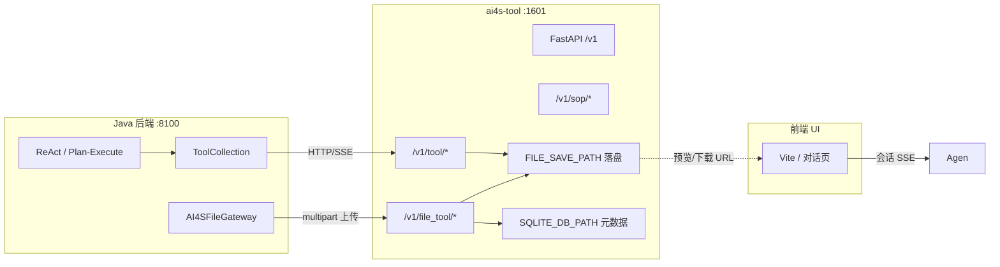
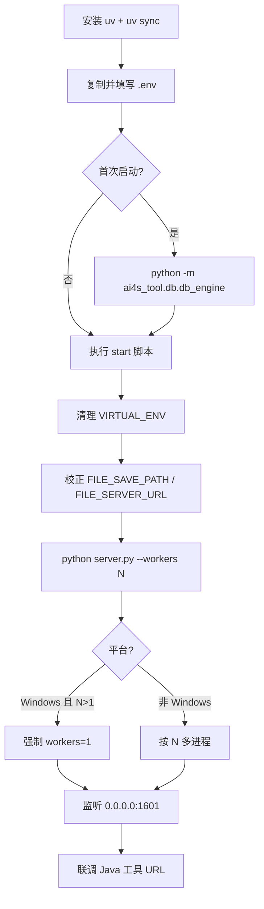
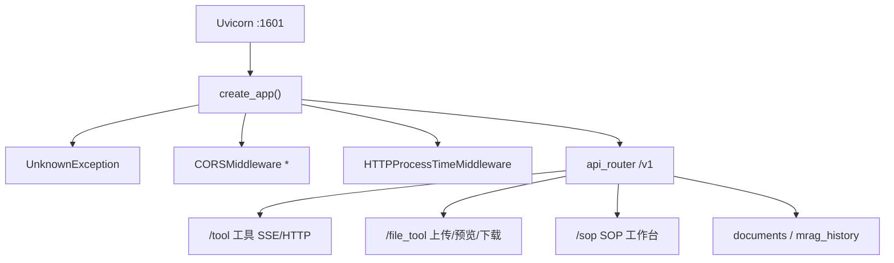

本文面向中级开发者，聚焦 monorepo 中 **`ai4s-tool`** 这一 Python 工具运行时的安装、配置、启动与联调验收。它以 FastAPI + Uvicorn 对外提供 **HTTP/SSE 工具能力** 与 **文件服务**，默认监听 **`0.0.0.0:1601`**，是 Java Agent 主链路调用 CodeInterpreter、DeepSearch、WebFetch、Report、MRAG 等能力的统一出口。完成本页后，你应能在本机独立拉起 Python 侧服务，并与 Java 配置中的 `http://127.0.0.1:1601` 对齐。

Sources: [README.md](ai4s-tool/README.md#L1-L55) · [server.py](ai4s-tool/server.py#L76-L132) · [application-dev.yml](AI4S-agent-app/src/main/resources/application-dev.yml#L241-L258)

## 在整体部署中的位置

AI4S-agent 本地联调通常由三块组成：**Java 后端**、**Python 工具运行时（本页）**、**前端 UI**。Python 侧不负责会话编排与 ReAct/Plan-Execute 决策，只承接 Java 通过 HTTP/SSE 下发的工具调用，并把产物元数据与可访问 URL 回写给主链路。

建议按目录顺序阅读：先完成 [Java 后端启动与配置](4-java-hou-duan-qi-dong-yu-pei-zhi)，再完成本页，最后进入 [前端 UI 启动与联调](6-qian-duan-ui-qi-dong-yu-lian-diao)。能力细节见 [CodeInterpreter 与沙箱执行](18-codeinterpreter-yu-sha-xiang-zhi-xing)、[DeepSearch 与 WebFetch](17-deepsearch-yu-webfetch)、[工具集合与产物登记](16-gong-ju-ji-he-yu-chan-wu-deng-ji)。



Sources: [application.yml](AI4S-agent-app/src/main/resources/application.yml#L29-L46) · [AI4SFileGateway.java](AI4S-agent-infrastructure/src/main/java/org/wwz/ai/infrastructure/gateway/AI4SFileGateway.java#L46-L118) · [api/__init__.py](ai4s-tool/ai4s_tool/api/__init__.py#L1-L24)

## 模块结构一览

`ai4s-tool` 是独立 Python 项目（`requires-python = ">=3.11,<4.0"`，仓库锁定 `.python-version` 为 **3.11**）。核心入口与包布局如下。

| 路径 | 职责 |
|------|------|
| `server.py` | FastAPI 工厂、中间件、Uvicorn 启动参数 |
| `start.sh` / `start.ps1` | 清理外部 venv、加载 `.env`、校正文件路径、启动进程 |
| `ai4s_tool/api/` | 路由聚合：`tool`、`file_manage`、`sop`、MRAG |
| `ai4s_tool/tool/` | 工具实现（CI、DeepSearch、Report、沙箱、docgen 等） |
| `ai4s_tool/db/` | SQLite 引擎与文件元数据表 |
| `.env_template` | 环境变量模板（LLM、检索、落盘、MRAG 等） |
| `skilloutput/` / `file_db_dir/` | 本地产物落盘目录（由 `FILE_SAVE_PATH` 决定） |

```tex
ai4s-tool/
├── server.py                 # Uvicorn 入口，默认 :1601
├── start.sh / start.ps1      # 推荐启动脚本
├── pyproject.toml / uv.lock  # 依赖与锁文件
├── .env_template → .env      # 运行配置
├── ai4s_tool/
│   ├── api/                  # FastAPI 路由
│   ├── tool/                 # 工具执行逻辑
│   ├── db/                   # SQLite + 文件元数据
│   ├── model/ prompt/ util/
│   └── docgen/
├── tests/                    # 单元与冒烟测试
└── skilloutput/               # 启动脚本默认落盘目录
```

Sources: [README.md](ai4s-tool/README.md#L5-L18) · [pyproject.toml](ai4s-tool/pyproject.toml#L1-L8) · [.python-version](ai4s-tool/.python-version#L1-L1)

## 启动前准备

### 1. 运行时与包管理器

本项目使用 **`uv`** 管理虚拟环境与依赖，要求 **Python ≥ 3.11**。在 monorepo 根目录进入 `ai4s-tool` 后执行：

```bash
pip install uv
cd ai4s-tool
uv sync
```

Linux / macOS 可 `source .venv/bin/activate`；Windows 下推荐后续直接使用 `start.ps1`（脚本会显式调用 `.venv\Scripts\python.exe`，无需依赖当前 shell 的激活状态）。

Sources: [README.md](ai4s-tool/README.md#L20-L28) · [start.ps1](ai4s-tool/start.ps1#L3-L25)

### 2. 环境变量：从模板生成 `.env`

```bash
cp .env_template .env
# Windows: copy .env_template .env
```

**最小可跑通对话工具链路**时，优先核对下表；其余 MRAG / TableRAG / OCR 等可按场景增量补齐。

| 变量 | 作用 | 启动注意 |
|------|------|----------|
| `OPENAI_API_KEY` / `OPENAI_BASE_URL` | 通用 LLM 网关；Python 侧会拼 `/v1/chat/completions` | 与 Java `llm.default` 网关策略保持一致 |
| `DEFAULT_MODEL` | 多处任务模型回退源 | 模板默认 `gpt-5.2` |
| `DASHSCOPE_API_KEY` | Embedding / VLM / Rerank 等共用 | MRAG 开启时必填 |
| `FILE_SAVE_PATH` | **本地落盘目录** | 启动脚本可默认到 `skilloutput` |
| `FILE_SERVER_URL` | **HTTP 文件服务基址** | 必须是 `http(s)://...`，默认 `http://127.0.0.1:1601/v1/file_tool` |
| `SQLITE_DB_PATH` | 文件元数据库 | 默认 `autobots.db` |
| `USE_SEARCH_ENGINE` | DeepSearch 搜索提供方 | 默认 `ddg` |
| `DEEPSEARCH_BASE_URL` / `DEEPSEARCH_API_KEY` | DeepSearch 独立 LLM | 留空回退到 OpenAI 配置 |
| `MINERU_API_KEY` 等 | PDF 解析 / OCR | 文档理解场景需要 |

**关键约束**：`FILE_SAVE_PATH` 与 `FILE_SERVER_URL` 语义不同——前者是磁盘目录，后者是前端/Java 可访问的 HTTP 前缀。若把 `FILE_SERVER_URL` 配成本地路径，预览与下载 URL 会失效。

Sources: [.env_template](ai4s-tool/.env_template#L1-L45) · [README.md](ai4s-tool/README.md#L46-L55) · [file_table_op.py](ai4s-tool/ai4s_tool/db/file_table_op.py#L199-L208)

### 3. 首次初始化 SQLite 元数据库

文件服务元数据落在 `SQLITE_DB_PATH`（默认 `autobots.db`）。**仅首次**需要建表：

```bash
cd ai4s-tool
python -m ai4s_tool.db.db_engine
```

该模块使用 SQLModel 元数据 `create_all`（幂等），并注册 `FileInfo` 表；运行期读写走 `sqlite+aiosqlite` 异步引擎。

Sources: [README.md](ai4s-tool/README.md#L30-L37) · [db_engine.py](ai4s-tool/ai4s_tool/db/db_engine.py#L22-L54)

## 推荐启动流程



### Linux / macOS

```bash
cd ai4s-tool
./start.sh
```

`start.sh` 行为要点：

1. `unset VIRTUAL_ENV`，避免外部项目污染解释器
2. 激活本地 `.venv`
3. 若存在 `.env` 则 `source` 注入
4. 设置 `ENV=prod`、`PYTHONIOENCODING=utf-8`、`SKILL_PYTHON_BIN`
5. 空缺时把 `FILE_SAVE_PATH` 落到 `$(pwd)/skilloutput`，并把非法/缺失的 `FILE_SERVER_URL` 纠正为 `http://127.0.0.1:1601/v1/file_tool`
6. `python server.py --workers "${AI4S_TOOL_WORKERS:-5}"`

Sources: [start.sh](ai4s-tool/start.sh#L1-L38) · [README.md](ai4s-tool/README.md#L39-L45)

### Windows（推荐）

```powershell
cd ai4s-tool
.\start.ps1
```

`start.ps1` 在 Windows 上额外做了稳定性加固：

| 行为 | 说明 |
|------|------|
| 强制本地解释器 | 使用 `.venv\Scripts\python.exe`，缺失则直接报错提示先 `uv sync` |
| 默认单 worker | `AI4S_TOOL_WORKERS` 未设时为 **1**（与 Uvicorn 在 Win 上的限制一致） |
| 端口占用检测 | 监听 **1601**；若已是本服务同 worker 配置则友好退出，否则抛错 |
| stderr 处理 | 关闭 PowerShell 对 native command stderr 的误判，避免 Uvicorn 日志被当成失败 |

Sources: [start.ps1](ai4s-tool/start.ps1#L1-L97) · [README.md](ai4s-tool/README.md#L47-L55)

### 直接调用 server.py（不推荐日常使用）

```bash
# 可能触发 VIRTUAL_ENV 路径不匹配 warning
uv run python server.py
```

启动脚本的价值正在于**清洗环境并统一文件 URL 语义**；日常联调应优先 `start.sh` / `start.ps1`。

Sources: [README.md](ai4s-tool/README.md#L57-L61)

## 进程模型与服务入口

`server.py` 使用 `OptionParser` 解析启动参数，默认值如下。

| 参数 | 默认 | 说明 |
|------|------|------|
| `--host` | `0.0.0.0` | 绑定地址 |
| `--port` | `1601` | 与 Java / 前端约定端口 |
| `--workers` | `5` | 多进程数；**Windows 强制为 1** |
| `ENV` | 脚本设为 `prod` | `ENV=local` 时开启 reload，并与 multi-worker 互斥 |

应用工厂 `create_app()` 注册：

- 中间件：`UnknownException`、全开 CORS、`HTTPProcessTimeMiddleware`（生成 request_id、写入 `X-Process-Time`）
- 路由：`api_router`，统一前缀 **`/v1`**



Sources: [server.py](ai4s-tool/server.py#L50-L132) · [middleware_util.py](ai4s-tool/ai4s_tool/util/middleware_util.py#L28-L69) · [api/__init__.py](ai4s-tool/ai4s_tool/api/__init__.py#L16-L24)

## 对外 API 能力面（启动后可见）

工具路由文档字符串汇总了 Java 侧主要调用入口（均挂在 `/v1/tool` 下），文件与 SOP 为并列前缀。

| 前缀 | 代表能力 | 调用方 |
|------|----------|--------|
| `/v1/tool/code_interpreter` | 代码解释器 SSE | `CodeInterpreterTool` |
| `/v1/tool/report` | 报告生成 | `ReportTool`（基址复用 `code_interpreter_url`） |
| `/v1/tool/deepsearch` | 深度搜索 SSE | DeepSearch 工具 |
| `/v1/tool/web_fetch` | 单 URL 抓取 | WebFetch 工具 |
| `/v1/tool/mragQuery` 等 | 多模态检索 | MRAG 相关 |
| `/v1/tool/embedding/text` | 文本向量代理 | Java `embeddingUrl` |
| `/v1/file_tool/*` | 上传、登记、预览、下载 | `AI4SFileGateway`、前端预览 |
| `/v1/sop/*` | SOP list/get/upsert/delete/status/recall_test | SOP 工作台 |

文件服务关键端点：

- `POST /v1/file_tool/upload_file_data`：multipart 二进制上传（Java 对话附件转发）
- `GET /v1/file_tool/preview/{request_id}/{file_name}` / `download/...`：预览与下载
- 预览/下载 URL 由 `FILE_SERVER_URL` 拼接生成

Sources: [tool.py](ai4s-tool/ai4s_tool/api/tool.py#L1-L13) · [file_manage.py](ai4s-tool/ai4s_tool/api/file_manage.py#L1-L175) · [sop.py](ai4s-tool/ai4s_tool/api/sop.py#L1-L14) · [AI4SFileGateway.java](AI4S-agent-infrastructure/src/main/java/org/wwz/ai/infrastructure/gateway/AI4SFileGateway.java#L114-L118)

## 与 Java 后端的配置对齐

Java 在 `application-dev.yml` 中将多条工具基址指向同一 Python 实例：

| Java 配置项 | 典型本地值 | 用途 |
|-------------|------------|------|
| `autobots.autoagent.code_interpreter_url` | `http://127.0.0.1:1601` | CI / Report / 文件上传基址 |
| `autobots.autoagent.deep_search_url` | `http://127.0.0.1:1601` | DeepSearch |
| `autobots.autoagent.web_fetch_url` | `http://127.0.0.1:1601` | WebFetch |
| `autobots.autoagent.multimodalagent_url` | `http://127.0.0.1:1601` | 多模态 Agent |
| `autobots.autoagent.knowledge_url` | `http://127.0.0.1:1601` | 知识/MRAG |
| `autobots.autoagent.data_analysis_url` | `http://127.0.0.1:1601` | 数据分析 |
| 相关 `agent-url` / `embeddingUrl` | `http://127.0.0.1:1601`（及 `/v1/tool/embedding/text`） | 检索与嵌入 |

工作区目录与 Python 落盘约定对齐：

```yaml
# application.yml
autobots.autoagent.workspace.root-template: "{repoRoot}/ai4s-tool/skilloutput/{sessionId}"
```

启动脚本默认 `FILE_SAVE_PATH=.../skilloutput`，因此 **会话 cwd、工具产物、文件服务** 落在同一目录树下，避免跨盘符或错误 cwd 导致的「有文件但预览 404」。

Sources: [application-dev.yml](AI4S-agent-app/src/main/resources/application-dev.yml#L241-L258) · [application.yml](AI4S-agent-app/src/main/resources/application.yml#L41-L46) · [CodeInterpreterTool.java](AI4S-agent-domain/src/main/java/org/wwz/ai/domain/agent/runtime/tool/common/CodeInterpreterTool.java#L100-L101) · [ReportTool.java](AI4S-agent-domain/src/main/java/org/wwz/ai/domain/agent/runtime/tool/common/ReportTool.java#L117-L117) · [AI4SConfig.java](AI4S-agent-domain/src/main/java/org/wwz/ai/domain/agent/ai4s/config/AI4SConfig.java#L241-L247)

## 启动验收清单

按下列顺序做冒烟，可快速确认运行时可用：

1. **进程与端口**：控制台出现 `AI4S Tool` Figlet logo 与 `Start params`；`1601` 处于 Listen。
2. **文件语义**：`FILE_SAVE_PATH` 目录已创建；`FILE_SERVER_URL` 以 `http://` 开头。
3. **上传通路**（Java 已启动时）：对话附件上传应打到
   `{code_interpreter_url}/v1/file_tool/upload_file_data`。
4. **工具通路**：触发一次 code_interpreter / web_fetch，Java 日志中应出现
   `.../v1/tool/code_interpreter` 或对应路径的 SSE 打开记录。
5. **日志**：默认写入 `logs/server.log`（可用 `LOG_PATH` 覆盖），请求耗时见响应头 `X-Process-Time`。

Sources: [server.py](ai4s-tool/server.py#L38-L47) · [server.py](ai4s-tool/server.py#L76-L85) · [AI4SFileGateway.java](AI4S-agent-infrastructure/src/main/java/org/wwz/ai/infrastructure/gateway/AI4SFileGateway.java#L54-L57) · [middleware_util.py](ai4s-tool/ai4s_tool/util/middleware_util.py#L60-L69)

## 常见问题排查

| 现象 | 可能原因 | 处理 |
|------|----------|------|
| `VIRTUAL_ENV does not match ... .venv` | shell 残留其他项目 venv | 用 `start.ps1`/`start.sh`，或手动取消 `VIRTUAL_ENV` |
| `Missing local virtual environment` | 未 `uv sync` | 在 `ai4s-tool` 执行 `uv sync` |
| `Port 1601 is already in use` | 旧进程占用 | 关闭旧窗口/进程；脚本识别同配置服务会直接提示已在运行 |
| Windows 多 worker 异常 / WinError 10022 | Uvicorn multiprocess 在 Win 不支持 | `server.py` 已强制 `workers=1`；`start.ps1` 默认 1 |
| 前端能出文件名但无法预览 | `FILE_SERVER_URL` 配成了磁盘路径 | 改回 `http://127.0.0.1:1601/v1/file_tool` |
| Java 报 `code_interpreter_url 未配置` | 后端 YAML 缺基址 | 在 `application-*.yml` 补齐 `http://127.0.0.1:1601` |
| 工具 500 / LLM 鉴权失败 | `.env` 密钥或 Base URL 错误 | 核对 `OPENAI_*`、`DASHSCOPE_*`、DeepSearch 覆盖项 |
| 首次文件 API 异常 | 未建表 | 执行 `python -m ai4s_tool.db.db_engine` |

Sources: [README.md](ai4s-tool/README.md#L57-L66) · [start.ps1](ai4s-tool/start.ps1#L23-L77) · [server.py](ai4s-tool/server.py#L89-L96) · [AI4SFileGateway.java](AI4S-agent-infrastructure/src/main/java/org/wwz/ai/infrastructure/gateway/AI4SFileGateway.java#L54-L56)

## 运维向参数速查

| 变量 / 参数 | 默认倾向 | 说明 |
|-------------|----------|------|
| `AI4S_TOOL_WORKERS` | Linux 5 / Windows 1 | 传给 `server.py --workers` |
| `ENV` | 脚本：`prod` | `local` 开启 reload |
| `SKILL_PYTHON_BIN` | 项目 `.venv` 的 python | Skill/脚本子进程解释器 |
| `LOG_PATH` | `logs/server.log` | loguru 滚动 200MB |
| `timeout_keep_alive` 等 | `99999` | 适配长耗时 SSE 工具 |

Sources: [start.sh](ai4s-tool/start.sh#L17-L37) · [start.ps1](ai4s-tool/start.ps1#L7-L37) · [server.py](ai4s-tool/server.py#L44-L47) · [server.py](ai4s-tool/server.py#L101-L131)

## 下一步

- Python 运行时就绪后，启动前端并做端到端联调：[前端 UI 启动与联调](6-qian-duan-ui-qi-dong-yu-lian-diao)
- 用真实任务验证工具编排：[首个复杂任务对话](7-shou-ge-fu-za-ren-wu-dui-hua)
- 深入单工具语义与产物协议：[CodeInterpreter 与沙箱执行](18-codeinterpreter-yu-sha-xiang-zhi-xing)、[DeepSearch 与 WebFetch](17-deepsearch-yu-webfetch)、[会话工作区与文件复用](22-hui-hua-gong-zuo-qu-yu-wen-jian-fu-yong)
