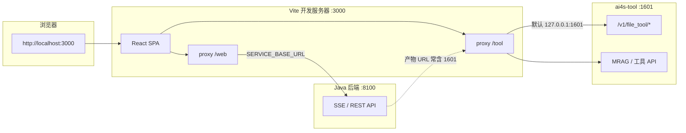
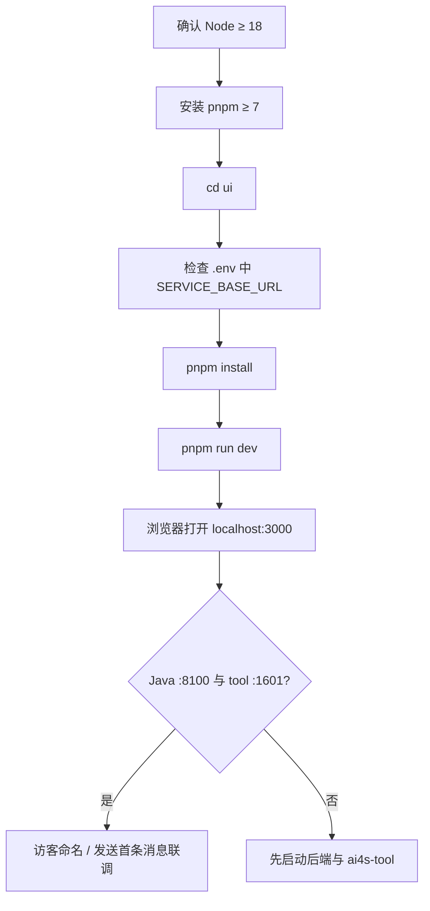
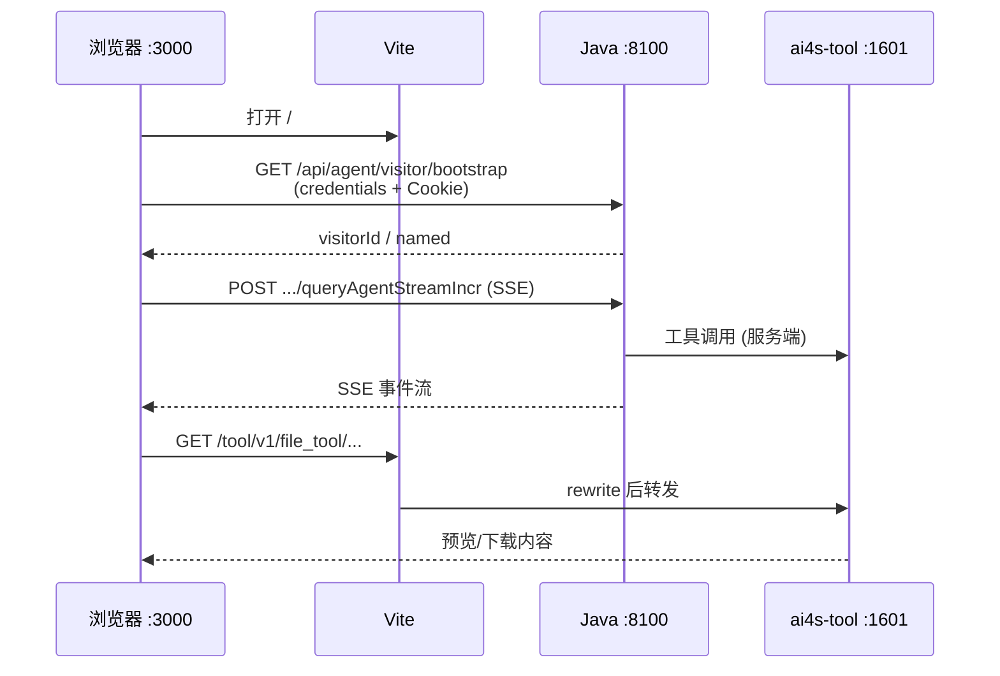

本文面向初学者，说明 monorepo 中 **`ui/`** 前端如何安装依赖、配置环境、启动开发服务器，并与 Java 后端、`ai4s-tool` 完成本地联调。前端基于 **React 19 + TypeScript + Vite**，默认监听 **`0.0.0.0:3000`**，通过开发态代理分别访问 Java（会话 / SSE）与 Python 工具（文件预览 / MRAG 等）。

建议按目录顺序先完成 [Java 后端启动与配置](4-java-hou-duan-qi-dong-yu-pei-zhi) 与 [Python 工具运行时启动](5-python-gong-ju-yun-xing-shi-qi-dong)，再回到本页拉起 UI。更深入的 SSE 渲染与工作区交互见 [SSE 流式对话与结果渲染](27-sse-liu-shi-dui-hua-yu-jie-guo-xuan-ran)、[工作区页面与产物预览](28-gong-zuo-qu-ye-mian-yu-chan-wu-yu-lan)。

Sources: [README.md](ui/README.md#L1-L28) · [vite.config.ts](ui/vite.config.ts#L38-L55) · [package.json](ui/package.json#L1-L13)

## 在整体部署中的位置

本地联调由三块组成：**前端 UI（本页）**、**Java 后端 :8100**、**Python 工具运行时 :1601**。浏览器只直接访问前端；开发服务器把 `/web` 转发到 Java，把 `/tool` 转发到 ai4s-tool，避免跨域与 Cookie 主机名不一致。



| 运行时 | 默认端口 | 前端如何触达 |
|--------|----------|--------------|
| 前端 UI | **3000** | 浏览器直接打开 |
| Java 后端 | **8100** | `SERVICE_BASE_URL` + 开发态 `/web` 代理；axios / SSE 也会直连解析后的基址 |
| ai4s-tool | **1601** | 开发态 `/tool/*` 代理；预览链接会被改写到当前前端 origin 下的 `/tool` |

Sources: [vite.config.ts](ui/vite.config.ts#L38-L55) · [toolProxy.ts](ui/toolProxy.ts#L11-L52) · [fileUrl.ts](ui/src/utils/fileUrl.ts#L3-L44)

## 技术栈与目录结构

### 核心技术

| 类别 | 选型 | 说明 |
|------|------|------|
| 框架 | React **19**、TypeScript **~5.7** | 组件与类型 |
| 构建 | Vite **6** | 开发 HMR、生产构建 |
| UI | Ant Design **5**、Tailwind **4**、Radix / lucide | 组件与样式 |
| 路由 | react-router-dom **7** | 懒加载页面 |
| 请求 | axios、`@microsoft/fetch-event-source` | REST + SSE |
| 渲染 | react-markdown、mermaid、echarts、shiki | 对话与产物展示 |

Sources: [package.json](ui/package.json#L14-L67) · [CLAUDE.md](ui/CLAUDE.md#L146-L176)

### 源码布局（启动相关）

```text
ui/
├── .env / .env.production     # 后端与工具基址
├── package.json / pnpm-lock   # 脚本与依赖锁
├── start.sh                   # 检查 Node/pnpm 后安装并 dev
├── vite.config.ts             # 端口、别名、代理、define
├── toolProxy.ts               # /tool 代理目标与 path rewrite
├── index.html                 # 挂载 #root
└── src/
    ├── main.tsx / App.tsx     # 入口与 Ant Design 中文配置
    ├── router/                # 路由表
    ├── pages/                 # Home、工作区、精选对话等
    ├── services/              # REST API 封装
    ├── utils/
    │   ├── request.ts         # axios 实例
    │   ├── querySSE.ts        # 主对话 SSE
    │   ├── origin.ts          # 回环主机对齐
    │   └── fileUrl.ts         # 工具预览 URL 改写
    └── components/            # ChatView 等对话组件
```

Sources: [CLAUDE.md](ui/CLAUDE.md#L16-L93) · [main.tsx](ui/src/main.tsx#L1-L15) · [App.tsx](ui/src/App.tsx#L1-L16)

## 启动前准备

### 1. 运行时与包管理器

| 依赖 | 要求 | 说明 |
|------|------|------|
| Node.js | **≥ 18** | `start.sh` 会校验主版本 |
| pnpm | **≥ 7**（脚本示例安装 `pnpm@7.33.1`） | 推荐；也可用 npm，但仓库以 pnpm 锁文件为主 |

在 monorepo 中进入前端目录：

```bash
cd ui
```

Sources: [start.sh](ui/start.sh#L4-L25) · [README.md](ui/README.md#L15-L28) · [CLAUDE.md](ui/CLAUDE.md#L148-L168)

### 2. 环境变量：`.env`

本地开发使用 `ui/.env`。Vite 通过 `loadEnv` 读取，并注入到开发服务器代理与编译期常量。

| 变量 | 本地默认 / 示例 | 作用 |
|------|-----------------|------|
| `SERVICE_BASE_URL` | `http://127.0.0.1:8100` | Java 后端基址；代理 `/web` 的 target，并作为 `define` 常量给 axios / SSE |
| `AI4S_TOOL_BASE_URL` | 可空 | 为空时 `/tool` 默认代理到 `http://127.0.0.1:1601` |
| `VITE_Mrag_TOOL_URL` | 生产示例见 `.env.production` | 生产侧 MRAG 工具基址；本地通常依赖 `/tool` 同源代理 |

```bash
# ui/.env（仓库已提供最小配置）
SERVICE_BASE_URL="http://127.0.0.1:8100"
```

生产文件 `.env.production` 会把 `SERVICE_BASE_URL` 置空（同源访问），并把工具指到反代路径，避免浏览器打到访问者本机的 `127.0.0.1`。

Sources: [.env](ui/.env#L1-L2) · [.env.production](ui/.env.production#L1-L6) · [vite.config.ts](ui/vite.config.ts#L7-L55)

### 3. 后端与工具是否就绪

完整对话链路需要：

1. **Java** 已在 **8100** 监听（访客 Cookie 白名单含 `http://localhost:3000` / `http://127.0.0.1:3000`）。
2. **ai4s-tool** 已在 **1601** 监听（预览、下载、MRAG 工作区依赖 `/tool` 代理）。

仅打开欢迎页可以先起 UI；发送任务、上传文件、预览产物则必须三端齐全。

Sources: [application.yml](AI4S-agent-app/src/main/resources/application.yml#L17-L28) · [toolProxy.ts](ui/toolProxy.ts#L11-L21)

## 推荐启动流程



### 方式一：手动（跨平台，推荐理解）

```bash
cd ui
pnpm install
# 可选国内镜像：pnpm i --registry=https://registry.npmmirror.com
pnpm run dev
```

成功后控制台由 Vite 提示本地地址；配置中 `host: '0.0.0.0'`、`port: 3000`，局域网其它设备也可访问。

Sources: [README.md](ui/README.md#L15-L36) · [package.json](ui/package.json#L6-L12) · [vite.config.ts](ui/vite.config.ts#L38-L42)

### 方式二：`start.sh`（Linux / macOS / Git Bash）

```bash
cd ui
./start.sh
```

脚本会：校验 Node 主版本 ≥ 18 → 无 pnpm 则全局安装 `pnpm@7.33.1` → 校验 pnpm ≥ 7 → 用 npmmirror 安装依赖 → `pnpm run dev`。

Sources: [start.sh](ui/start.sh#L1-L27)

### 常用脚本

| 命令 | 作用 |
|------|------|
| `pnpm dev` | 启动开发服务器（`vite`） |
| `pnpm build` | `tsc -b` + 生产构建 |
| `pnpm preview` | 预览生产包 |
| `pnpm test` | Vitest 单测（含 proxy / origin / fileUrl） |
| `pnpm lint` / `pnpm fix` | ESLint 检查与自动修复 |

Sources: [package.json](ui/package.json#L6-L12) · [CONTRIBUTING.md](ui/CONTRIBUTING.md#L14-L24)

## 开发代理与请求路径

### Vite 代理规则

`vite.config.ts` 在 `server.proxy` 中声明两条链路：

| 前端路径 | 目标 | 行为 |
|----------|------|------|
| `/web` | `env.SERVICE_BASE_URL`（如 `http://127.0.0.1:8100`） | `changeOrigin: true`，原样转发 |
| `/tool` | `createToolProxyConfig(AI4S_TOOL_BASE_URL)` | 默认 target `http://127.0.0.1:1601`，去掉 `/tool` 前缀再转发；若配置了带 path 的基址则保留该 path |

`define` 会把 `SERVICE_BASE_URL`、`AI4S_TOOL_BASE_URL` 序列化进前端代码，供运行时读取（不是 `import.meta.env.VITE_*` 形式）。

Sources: [vite.config.ts](ui/vite.config.ts#L43-L55) · [toolProxy.ts](ui/toolProxy.ts#L38-L52) · [toolProxy.test.ts](ui/toolProxy.test.ts#L5-L22)

### HTTP 与 SSE 如何拼 URL

- **axios**（`src/utils/request.ts`）：`baseURL = resolveServiceBaseUrl(SERVICE_BASE_URL)`，`withCredentials: true`，请求头带 `X-Device-Id`。业务路径多为 `/api/agent/...` 或历史 `/web/api/...`。
- **主对话 SSE**（`src/utils/querySSE.ts`）：默认  
  `{resolveServiceBaseUrl(SERVICE_BASE_URL)}/web/api/v1/gpt/queryAgentStreamIncr`，`credentials: 'include'`，同样带设备头。

`resolveServiceBaseUrl` 的作用：当页面主机是 `localhost` 而配置写的是 `127.0.0.1`（或反过来）时，**把回环主机名改成与当前页面一致**，避免 Cookie 因主机名不同而丢失。

Sources: [request.ts](ui/src/utils/request.ts#L6-L25) · [querySSE.ts](ui/src/utils/querySSE.ts#L6-L18) · [origin.ts](ui/src/utils/origin.ts#L1-L29) · [origin.test.ts](ui/src/utils/origin.test.ts#L10-L18)

### 工具预览 URL 改写

Agent 返回的文件地址经常是 `http://127.0.0.1:1601/v1/file_tool/...`。浏览器若直接打开该地址，会绕过 Vite 代理，也可能与前端 origin 不一致。`normalizeFileUrlForBrowser` 会把 loopback / 1601 端口的链接改写为：

```text
http://localhost:3000/tool/v1/file_tool/preview/req/demo.html
```

再由 `/tool` 代理到 ai4s-tool。

Sources: [fileUrl.ts](ui/src/utils/fileUrl.ts#L18-L120) · [fileUrl.test.ts](ui/src/utils/fileUrl.test.ts#L10-L22)

## 应用入口与主要路由

启动链路：`index.html` → `main.tsx` 挂载 `App` → Ant Design 中文 `ConfigProvider` + `RouterProvider`。

| 路径常量 | URL | 页面职责 |
|----------|-----|----------|
| `HOME` | `/` | 主对话（访客门禁、侧栏、ChatView） |
| `FEATURED_CONVERSATIONS` | `/featured-conversations` | 精选对话列表 |
| `FEATURED_CONVERSATION_DETAIL` | `/featured-conversations/:featuredId` | 精选详情 |
| `WORKSPACE` | `/workspace` | 重定向到 MRAG 工作区 |
| `WORKSPACE_MRAG` | `/workspace/mrag` | 多模态检索工作区 |
| `WORKSPACE_IMAGE_GENERATION` | `/workspace/image-generation` | 图像生成工作区 |
| `WORKSPACE_SOP` | `/workspace/sop` | SOP 工作区 |
| `WORKSPACE_SUB_AGENTS` | `/workspace/sub-agents` | 子智能体管理 |
| `NOT_FOUND` | `*` | 404 |

Sources: [index.html](ui/index.html#L1-L12) · [main.tsx](ui/src/main.tsx#L1-L15) · [App.tsx](ui/src/App.tsx#L8-L14) · [routes.ts](ui/src/router/routes.ts#L1-L11) · [router/index.tsx](ui/src/router/index.tsx#L22-L102)

会话 ID 存在 `sessionStorage` 键 `ai4s.sessionId`；设备标识当前为轻量常量 `device-default`，供上传与 SSE 兼容头使用。

Sources: [utils.ts](ui/src/utils/utils.ts#L138-L182) · [agentConversation.ts](ui/src/services/agentConversation.ts#L3-L20)

## 联调验收清单

按下列顺序自检，可快速确认「前端是否真正连上后端与工具」。



| 步骤 | 期望结果 | 失败时先看 |
|------|----------|------------|
| 打开 `http://localhost:3000` | 欢迎页 / 访客引导渲染 | 端口占用、`pnpm dev` 是否在跑 |
| 访客 bootstrap / 命名 | 可进入工作区，Cookie 保留 | `SERVICE_BASE_URL`、Java 是否 8100、是否混用 localhost 与 127.0.0.1 |
| 发送一条简单消息 | SSE 持续推送，对话区更新 | Java 日志、SSE URL、网络面板是否 4xx/5xx |
| 触发工具并出现文件 | 工作区可预览，URL 形如 `...:3000/tool/...` | ai4s-tool 1601、`/tool` 代理、FILE_SERVER_URL |
| 打开 MRAG / 图像 / SOP 页 | 页面加载且接口走工具或 Java | 对应后端能力与路由懒加载报错 |

关键 API 示例（经 axios baseURL）：

- 访客：`/api/agent/visitor/bootstrap`、`/api/agent/visitor/naming`
- 会话列表：`/api/agent/conversation/sessions`
- 停跑：`/api/agent/run/stop`
- 上传：`/api/agent/file/upload`
- SSE：`/web/api/v1/gpt/queryAgentStreamIncr`

Sources: [agentConversation.ts](ui/src/services/agentConversation.ts#L90-L111) · [agentRun.ts](ui/src/services/agentRun.ts#L3-L8) · [agentFile.ts](ui/src/services/agentFile.ts#L15-L29) · [querySSE.ts](ui/src/utils/querySSE.ts#L10-L18)

## 常见问题排查

| 现象 | 可能原因 | 处理建议 |
|------|----------|----------|
| 页面空白 / Root not found | `index.html` 未加载 `main.tsx` | 确认用 Vite 开发服而非直接打开文件 |
| 接口全部失败、CORS 或未登录 | 后端未起、基址错误、Cookie 主机不一致 | 对齐 `localhost` 与 `127.0.0.1`；确认 Java `allowed-origins` 含前端 origin |
| SSE 立刻断开 | 8100 不可达或路径错误 | 检查 Network 中 SSE 请求 URL 与后端日志 |
| 预览 404 / 打不开 | 仍指向 `:1601` 或 tool 未启动 | 确认链接被改写到 `/tool`，且 ai4s-tool 正常 |
| 改 `.env` 不生效 | Vite 未重启 | 修改 env 后重新 `pnpm dev` |
| Windows 上 `start.sh` 不便 | Shell 差异 | 直接使用 `pnpm install` + `pnpm run dev` |
| 端口 3000 被占用 | 其它进程占用 | 结束占用进程或临时改 `vite.config.ts` 的 `server.port` |

后端访客 Cookie 配置示例（需与前端 origin 匹配）：

```yaml
autobots.execution.visitor-cookie:
  allowed-origins:
    - http://localhost:3000
    - http://127.0.0.1:3000
```

Sources: [application.yml](AI4S-agent-app/src/main/resources/application.yml#L17-L28) · [origin.ts](ui/src/utils/origin.ts#L1-L29) · [request.ts](ui/src/utils/request.ts#L56-L84)

## 生产构建提示（可选）

本地联调以 `pnpm dev` 为主。需要验证产物时：

```bash
pnpm build    # 输出到 ui/dist
pnpm preview  # 本地预览构建结果
```

生产环境通常：

- `SERVICE_BASE_URL` 为空 → 浏览器走**当前站点同源**；
- 工具走网关反代的 `/tool`（见 `.env.production` 中的 `AI4S_TOOL_BASE_URL`）。

这与开发态「Vite 代理到 127.0.0.1」不同，部署时需由 Nginx / 网关完成等价转发。

Sources: [.env.production](ui/.env.production#L1-L6) · [vite.config.ts](ui/vite.config.ts#L56-L60) · [package.json](ui/package.json#L8-L12)

## 下一步

三端都起来之后，建议：

1. 在首页完成访客命名，发送第一条复杂任务 → [首个复杂任务对话](7-shou-ge-fu-za-ren-wu-dui-hua)
2. 浏览典型场景与产物形态 → [典型场景速览](8-dian-xing-chang-jing-su-lan)
3. 理解请求如何进入 Agent 内核 → [端到端请求流转](10-duan-dao-duan-qing-qiu-liu-zhuan)
4. 深入前端流式与工作区 → [SSE 流式对话与结果渲染](27-sse-liu-shi-dui-hua-yu-jie-guo-xuan-ran)、[工作区页面与产物预览](28-gong-zuo-qu-ye-mian-yu-chan-wu-yu-lan)

若后端或工具尚未配置，请先回到 [Java 后端启动与配置](4-java-hou-duan-qi-dong-yu-pei-zhi) 与 [Python 工具运行时启动](5-python-gong-ju-yun-xing-shi-qi-dong)。