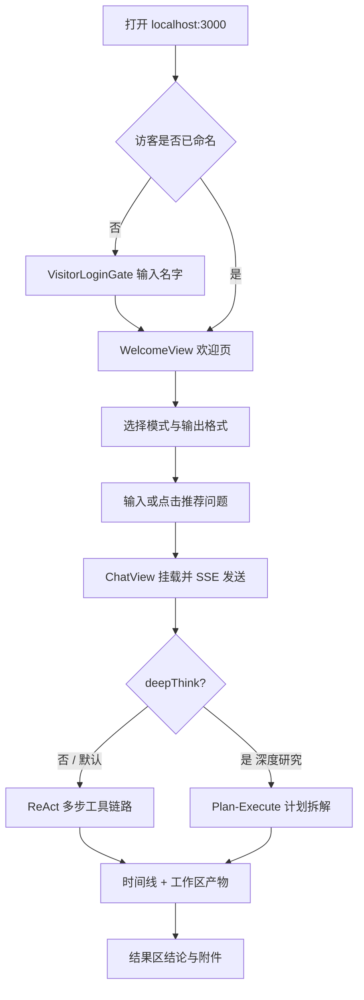
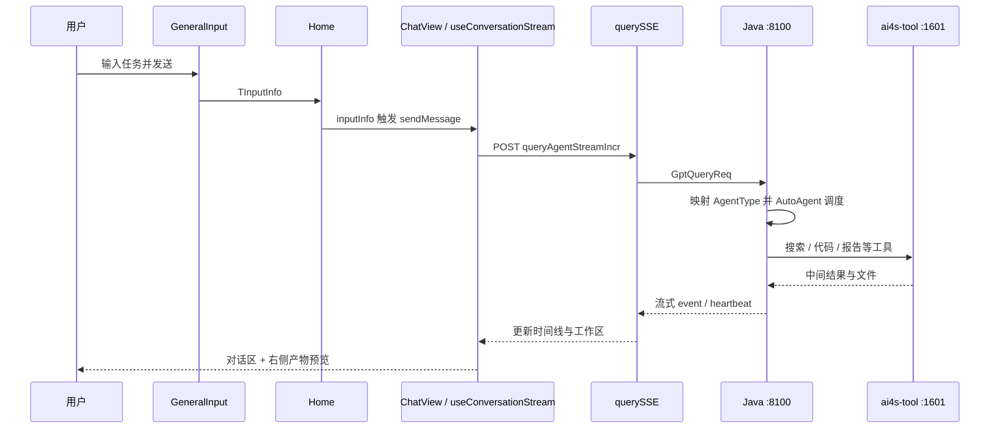

本页面向已经完成本地联调的初学者，带你从打开工作台开始，发出**第一条复杂任务**，并看懂执行过程中的计划、工具时间线与产物工作区。内容只覆盖「怎么发、发什么、看到什么、如何解读」，不展开后端内核与 SSE 协议细节——那些属于后续 Deep Dive 页面。

前置建议：先完成 [Java 后端启动与配置](4-java-hou-duan-qi-dong-yu-pei-zhi)、[Python 工具运行时启动](5-python-gong-ju-yun-xing-shi-qi-dong)、[前端 UI 启动与联调](6-qian-duan-ui-qi-dong-yu-lian-diao)，确认浏览器可访问 `http://localhost:3000`，Java 在 `:8100`、ai4s-tool 在 `:1601`。

## 你将完成什么

一次完整的「首个复杂任务」体验，通常包含四步：

1. **进入工作台**：访客命名通过后看到欢迎页。
2. **选定执行模式与交付物**：深度思考 / 深度研究 + HTML / 文档 / PPT 等。
3. **发送一条可拆解的任务**：系统流式返回思考、工具调用与最终结论。
4. **在对话区与右侧工作区查看产物**：报告、搜索结果、图片、表格等可预览与下载。

Sources: [VisitorLoginGate.tsx](ui/src/pages/Home/VisitorLoginGate.tsx#L40-L156) · [WelcomeView.tsx](ui/src/pages/Home/WelcomeView.tsx#L25-L154) · [index.tsx](ui/src/pages/Home/index.tsx#L780-L860)

## 第 1 步：进入工作台

首次打开前端时，Home 会先做访客 bootstrap。若尚未命名，会进入「你好，探索者」命名页：输入名字后点 **进入工作台**（或回车）。命名成功后才会加载最近会话、角色库与精品对话卡片。

命名页只做身份门槛，不发送任务；命名完成后才会进入真正的对话壳层。

Sources: [VisitorLoginGate.tsx](ui/src/pages/Home/VisitorLoginGate.tsx#L40-L151) · [index.tsx](ui/src/pages/Home/index.tsx#L270-L310) · [index.tsx](ui/src/pages/Home/index.tsx#L500-L520)

## 第 2 步：认识欢迎页与推荐问题

命名通过后，若当前会话还没有消息，会渲染 `WelcomeView`：中央输入框、模式相关的推荐问题，以及「精品对话」案例卡片。

欢迎页推荐问题按产品类型切换；通用任务 / 网页 / 文档 / PPT 等共用同一批调研类问题，例如：

| 推荐文案（节选） | 适合用来验证 |
|------------------|--------------|
| 输出一份 2026 年中国企业级 RAG 市场的行业研究报告 | 深度检索 + 报告生成 |
| 对比 Codex 与 Claude Code 的产品定位… | 竞品拆解 + 结构化输出 |
| 拆解 3 款主流多智能体协作平台… | 多源搜索 + 对比报告 |
| 简要对比 Qdrant、Milvus、Pinecone… | 较短链路的研究任务 |

点击推荐问题等价于把该文案填入输入并触发发送流程；也可以自己在输入框写任务。

Sources: [WelcomeView.tsx](ui/src/pages/Home/WelcomeView.tsx#L46-L154) · [constants.ts](ui/src/utils/constants.ts#L46-L70) · [index.tsx](ui/src/pages/Home/index.tsx#L590-L600)

## 第 3 步：选对模式——这是「复杂任务」的关键开关

输入区 `GeneralInput` 把能力收敛成 **模式** 与 **交付物格式**。对首个复杂任务，请优先理解下表：

| 界面概念 | 关键取值 | 请求里变成什么 | 后端大致走哪条链路 |
|----------|----------|----------------|--------------------|
| **快速** | `quick` | `outputStyle=chat`，`deepThink=false` | 聊天 / WORKFLOW，偏即时问答 |
| **深度思考** | `think` | 非 chat 的 `outputStyle`，`deepThink=false` | **ReAct**（边想边调工具） |
| **深度研究** | `research` | 非 chat 的 `outputStyle`，`deepThink=true` | **Plan-Execute**（先计划再逐步执行） |
| **网页 / 文档 / PPT / 表格** | `html` / `docs` / `ppt` / `table` | 对应 `outputStyle` | 任务执行后按格式收口产物 |
| **数据分析** | `dataAgent` | 独立 `data/chatQuery` 流 | 数据问答链路（本页不展开） |

提交载荷由 `buildSubmitPayload` 统一组装：`research` 才会把 `deepThink` 置为 `true`；`chat` 与 `dataAgent` 强制关闭 deepThink。

**首个复杂任务建议**：选 **深度思考** 或 **深度研究**，交付物选 **网页模式（html）** 或 **文档模式（docs）**，这样更容易看到工具时间线与可下载报告。

Sources: [inputMode.ts](ui/src/components/GeneralInput/inputMode.ts#L1-L29) · [index.tsx](ui/src/components/GeneralInput/index.tsx#L77-L110) · [constants.ts](ui/src/utils/constants.ts#L72-L144) · [AgentQueryServiceImpl.java](AI4S-agent-domain/src/main/java/org/wwz/ai/domain/agent/runtime/AgentQueryServiceImpl.java#L201-L228)

## 第 4 步：发送第一条复杂任务

### 推荐示例（复制即用）

下面三条都来自项目欢迎页 / README 中的真实场景风格，适合第一次联调：

1. **行业研究（推荐首选）**  
   `输出一份 2026 年中国企业级 RAG 市场的行业研究报告`  
   建议：深度研究 + 网页模式。

2. **竞品对比**  
   `对比 Codex 与 Claude Code 的产品定位、模型底座、核心优势与典型适用场景`  
   建议：深度思考 + 文档模式。

3. **短链路调研**  
   `简要对比 Qdrant、Milvus、Pinecone 三款向量数据库的适用场景`  
   建议：深度思考 + 文档模式（耗时更短，便于确认链路通畅）。

发送后 Home 会把 `inputInfo` 写入当前会话元数据，并切换到 `ChatView`；`ChatView` 发现 `message` 非空即调用 `sendMessage`（或 dataAgent 专用流）。

Sources: [constants.ts](ui/src/utils/constants.ts#L46-L55) · [index.tsx](ui/src/pages/Home/index.tsx#L520-L560) · [index.tsx](ui/src/components/ChatView/index.tsx#L278-L295)

### 请求如何离开浏览器

`useConversationStream.sendMessage` 会：

1. 生成本轮 `requestId`，在会话里追加一条 `loading` 的聊天项；
2. 用 `buildAgentStreamRequest` 组装 body：`sessionId`、`requestId`、`query`、`deepThink`（0/1）、`outputStyle`、可选 `sessionFiles` / `aiAgentId`；
3. 通过 `querySSE` POST 到 **`/web/api/v1/gpt/queryAgentStreamIncr`**（开发态经 Vite 代理到 Java `:8100`）。

Sources: [useConversationStream.ts](ui/src/components/ChatView/useConversationStream.ts#L389-L470) · [agentRequest.ts](ui/src/utils/agentRequest.ts#L53-L80) · [querySSE.ts](ui/src/utils/querySSE.ts#L7-L66) · [AI4SController.java](AI4S-agent-trigger/src/main/java/org/wwz/ai/trigger/http/ai4s/AI4SController.java#L148-L157)

### 后端如何决定「复杂任务」走哪条策略

`AgentQueryServiceImpl.buildAgentRequest` 把前端字段翻译成 `agentType`：

| 前端条件 | agentType | 调度策略 Bean |
|----------|-----------|---------------|
| `outputStyle=chat` | WORKFLOW (2) | `flowAgentExecuteStrategy` |
| `deepThink` 为空或 0，且非 chat | **REACT (5)** | `reactAgentExecuteStrategy` |
| `deepThink=1` | **PLAN_SOLVE (3)** | `planSolveAgentExecuteStrategy` |

因此：你在输入区选 **深度思考** → 典型 ReAct 工具循环；选 **深度研究** → 典型 Plan-Execute（计划 → 逐步执行 → 汇总）。调度入口见 `AgentDispatchService`。

Sources: [AgentQueryServiceImpl.java](AI4S-agent-domain/src/main/java/org/wwz/ai/domain/agent/runtime/AgentQueryServiceImpl.java#L201-L228) · [AgentDispatchService.java](AI4S-agent-case/src/main/java/org/wwz/ai/application/agent/dispatch/AgentDispatchService.java#L26-L49) · [AgentType.java](AI4S-agent-domain/src/main/java/org/wwz/ai/domain/agent/runtime/enums/AgentType.java#L6-L30)

## 第 5 步：读懂界面上的执行过程

复杂任务一旦开始，界面从「单栏欢迎」变为「对话 +（可选）右侧智能体工作区」。

### 左侧对话区：你在看什么

`Dialogue` 按消息结构渲染：

| 区域 | 含义 | 初学者关注点 |
|------|------|--------------|
| 用户气泡 | 你的原始问题 | 确认本轮 query 是否正确 |
| 运行状态条 | RUNNING / SUCCESS / FAILED 等 | 任务是否仍在进行 |
| 思考 / 计划 | Plan-Solve 下的 plan_thought 与步骤 | 深度研究时先看计划是否合理 |
| 时间线 Timeline | 工具调用、子智能体、搜索阶段等 | 点开某一项可驱动右侧工作区 |
| 结果区 | `task_summary` / conclusion | 最终文字结论与附件列表 |

深度研究会话标题旁会出现 **「深度研究」** 标记；时间线里常见 `deep_search`、报告生成、文件附件等任务行，点击后右侧会跟随预览。

Sources: [index.tsx](ui/src/components/Dialogue/index.tsx#L91-L200) · [Timeline.tsx](ui/src/components/Dialogue/Timeline.tsx#L45-L200) · [index.tsx](ui/src/components/ChatView/index.tsx#L470-L520)

### 右侧工作区：动态与文件

当存在 plan 或可渲染任务时，`showAction` 为真，进入左右分栏：

- **动态**：跟随当前 / 流式任务，按类型渲染 HTML、Markdown、搜索列表、图片、表格等（`resolvePanelView`）。
- **文件**：会话级产物列表，支持预览与下载；文件 URL 会经前端改写，走 `/tool` 代理访问 ai4s-tool。

你也可以折叠某一侧、进入专注模式，或拖拽中间分隔条调整宽度——这些只影响观察，不改变后端执行。

Sources: [ActionView.tsx](ui/src/components/ActionView/ActionView.tsx#L46-L200) · [panelResolver.ts](ui/src/components/ActionPanel/panelResolver.ts#L95-L199) · [index.tsx](ui/src/components/ChatView/index.tsx#L540-L700)

### 流式过程中的状态语义（简表）

| 现象 | 通常含义 |
|------|----------|
| 输入框旁 busy、可点停止 | 本轮 `loading=true`，可调用 stop API |
| 心跳后 tip 文案变化 | 连接仍活，前端根据 plan/工具刷新「运行提示」 |
| 时间线某工具转圈 | 该工具 `isFinal` 尚未为真 |
| 结果区出现附件芯片 | 工具产物已登记，可点进工作区预览 |
| 状态 FAILED + 错误总结 | 守卫错误或角色不可用等，见 `applyGuardError` |

Sources: [useConversationStream.ts](ui/src/components/ChatView/useConversationStream.ts#L209-L244) · [useConversationStream.ts](ui/src/components/ChatView/useConversationStream.ts#L540-L750)

## 第 6 步：一次「最小成功」验收清单

按顺序自检，全部打勾即说明首个复杂任务链路打通：

| # | 检查项 | 通过标准 |
|---|--------|----------|
| 1 | 三端在线 | UI 3000、Java 8100、tool 1601 |
| 2 | 访客命名 | 进入欢迎页而非一直卡在 bootstrap |
| 3 | 模式选择 | 深度思考或深度研究 + html/docs |
| 4 | 发送成功 | 出现用户气泡，会话标题变为问题摘要 |
| 5 | 流式推进 | 时间线出现工具/计划，而非长期空白 |
| 6 | 产物可见 | 右侧动态或文件 Tab 能打开 HTML/Markdown 等 |
| 7 | 收尾 | 运行状态 SUCCESS，结果区有结论或附件 |

若第 4 步失败：回到 [前端 UI 启动与联调](6-qian-duan-ui-qi-dong-yu-lian-diao) 检查 `SERVICE_BASE_URL` 与 `/web` 代理。  
若第 5 步只有文字没有工具：确认未误选「快速」聊天模式。  
若第 6 步预览 404：确认 ai4s-tool 已启动且 `/tool` 代理正常。

Sources: [querySSE.ts](ui/src/utils/querySSE.ts#L7-L20) · [AgentQueryServiceImpl.java](AI4S-agent-domain/src/main/java/org/wwz/ai/domain/agent/runtime/AgentQueryServiceImpl.java#L201-L228) · [taskArtifacts.ts](ui/src/utils/taskArtifacts.ts#L56-L112)

## 可选：停止本轮与重新生成

- **停止**：任务进行中，输入区停止回调会调用 `agentRunApi.stop({ sessionId, requestId })`，本地将 metrics 标为 `STOPPED`。
- **重新生成**：消息工具栏可对上一轮 `query` 再次 `sendMessage`，沿用当前会话的 `productType` / `deepThink` / 角色。

Sources: [useConversationStream.ts](ui/src/components/ChatView/useConversationStream.ts#L752-L820)

## 练习：从「能跑」到「会选」

完成一次验收后，建议用同一问题各跑一遍 **深度思考** 与 **深度研究**，对比：

| 对比维度 | 深度思考（ReAct） | 深度研究（Plan-Execute） |
|----------|-------------------|---------------------------|
| 首屏体感 | 较快进入工具调用 | 常先出计划与多轮 plan_thought |
| 适合问题 | 步骤不固定、探索型 | 步骤清晰、需按计划交付 |
| 界面线索 | 时间线工具串 | 计划步骤 + 版本切换（多轮 replan） |

更细的模式差异见 [ReAct 执行链路](12-react-zhi-xing-lian-lu) 与 [Plan-Execute 执行链路](13-plan-execute-zhi-xing-lian-lu)；更多业务样例见下一页 [典型场景速览](8-dian-xing-chang-jing-su-lan)。

Sources: [agentMode.ts](ui/src/utils/agentMode.ts#L1-L47) · [index.tsx](ui/src/components/Dialogue/index.tsx#L91-L140)

## 本页边界与阅读路径

本页**不**展开：分层架构实现、SSE 事件字段全集、工具内部算法、MRAG/SOP 配置——它们分别属于 Deep Dive 目录。

建议阅读顺序：

1. 本页完成首发任务与验收  
2. [典型场景速览](8-dian-xing-chang-jing-su-lan) — 对照 README 中的截图与场景选下一题  
3. [端到端请求流转](10-duan-dao-duan-qing-qiu-liu-zhuan) — 把本页体验映射到分层调用  
4. [SSE 流式对话与结果渲染](27-sse-liu-shi-dui-hua-yu-jie-guo-xuan-ran) / [工作区页面与产物预览](28-gong-zuo-qu-ye-mian-yu-chan-wu-yu-lan) — 深入前端渲染