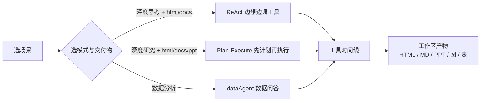
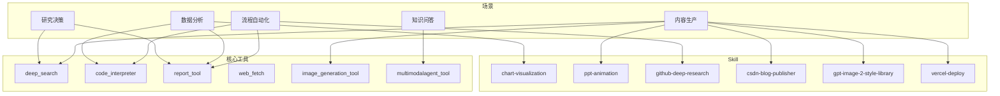

本页是 [首个复杂任务对话](7-shou-ge-fu-za-ren-wu-dui-hua) 之后的「场景地图」：用可复制的任务文案、推荐模式与能力组合，帮你在本地工作台快速验证 **研究决策、数据分析、内容生产、知识问答、流程自动化** 五类真实链路。内容只覆盖「跑什么场景、怎么配模式、会用到哪些工具/Skill、产物长什么样」，不展开 ReAct/Plan-Execute 内核与工具协议细节。

前置建议：三端已联调（UI `:3000`、Java `:8100`、ai4s-tool `:1601`），并完成至少一次成功的复杂任务发送。若尚未完成，请先回到 [首个复杂任务对话](7-shou-ge-fu-za-ren-wu-dui-hua)。

Sources: [README.md](README.md#L1-L63) · [constants.ts](ui/src/utils/constants.ts#L47-L126) · [7-shou-ge-fu-za-ren-wu-dui-hua.md](.zread/wiki/drafts/7-shou-ge-fu-za-ren-wu-dui-hua.md#L1-L20)

## 如何用本页做场景实验

一次「典型场景」实验可以按下面四步走，和欢迎页推荐问题、输入区模式开关完全对齐：

1. **选场景类型**（研究 / 数据 / 内容 / 知识 / 自动化）。
2. **选模式**：深度思考（ReAct）或深度研究（Plan-Execute）；交付物选网页 / 文档 / PPT / 表格，或数据分析入口。
3. **复制示例文案**（或点欢迎页推荐问题），发送后观察时间线与右侧工作区。
4. **对照本页「能力组合」**，确认是否出现预期工具（如 `deep_search`、`code_interpreter`、`report_tool`）与产物格式。

模式到请求字段的映射很简单：`research` 才会把 `deepThink` 置为 `true`；`chat` / `dataAgent` 强制关闭深度研究。交付物 `html` / `docs` / `ppt` / `table` 会原样进入 `outputStyle`，影响报告收口形态。

Sources: [inputMode.ts](ui/src/components/GeneralInput/inputMode.ts#L5-L29) · [constants.ts](ui/src/utils/constants.ts#L72-L126) · [AgentToolCollectionFactory.java](AI4S-agent-domain/src/main/java/org/wwz/ai/domain/agent/runtime/tool/factory/AgentToolCollectionFactory.java#L105-L160)

### 场景 × 模式速查

| 场景类型 | 推荐模式 | 推荐交付物 | 你更该观察什么 |
|----------|----------|------------|----------------|
| 研究与决策 | 深度研究 | 网页 / 文档 | 计划步骤 + 多轮搜索 + 最终报告 |
| 竞品 / 短链路调研 | 深度思考 | 文档 | 工具循环与对比表 |
| 数据分析 | 数据分析 或 深度思考 | 表格 / 网页 | 代码执行、图表、CSV/HTML |
| 内容生产（图 / PPT / 博客） | 深度思考 | 网页 / PPT / 文档 | 图片、翻页 HTML、Markdown 草稿 |
| 知识库问答 | 深度思考 | 文档 / 聊天 | 多模态检索命中与引用 |
| 开源项目评估 | 深度研究 | 文档 / 网页 | GitHub Skill + 结构化研报 |

Sources: [README.md](README.md#L24-L63) · [constants.ts](ui/src/utils/constants.ts#L47-L126)

## 场景总览：能力组合地图

平台把「用户问题」拆成可编排链路：默认工具集合包含搜索、抓取、代码、报告、文档读写、多模态检索、图片生成等；Skill 目录再叠加图表、PPT 动画、GitHub 深研、CSDN 发布、Vercel 部署等专项能力。

默认装配列表（配置可覆盖）大致包含：`search`、`web_fetch`、`web_search`、`code`、`report`、`docgen`、`docread`、`dataprep`、`canvas`、`multimodalagent`、`image_generation`、`data_analysis` 等；`dataAgent` 输出样式下则优先挂数据分析工具。

Sources: [AgentToolCollectionFactory.java](AI4S-agent-domain/src/main/java/org/wwz/ai/domain/agent/runtime/tool/factory/AgentToolCollectionFactory.java#L123-L160) · [README.md](README.md#L24-L63) · [SKILL.md](runtime/skills/github-deep-research/SKILL.md#L1-L20)

## 场景一：研究与决策类

这类任务的共同特征是 **多源信息 → 结构化对比 → 可交付报告**。欢迎页推荐问题里大量属于这一类，例如 RAG 行业报告、多智能体平台拆解、Codex 与 Claude Code 对比。

### 能力与链路

| 子场景 | 怎么跑的 | 核心能力 |
|--------|----------|----------|
| 技术选型决策报告 | 深度搜索多源信息 → 对比 → 结构化报告 | DeepSearch + Report + 可选 SOP 约束 |
| 竞品分析 | 搜公开信息 → 抽指标 → 表/图对比 | Search + CodeInterpreter + Chart Skill |
| 投资 / 行业研究 | 子问题拆解 → 多轮检索 → 交叉验证 → 研报 | Plan-Execute + DeepSearch / MRAG + Report |

DeepSearch 在 Python 侧走「查询拆解 → 多引擎检索去重 → 推理是否继续 → 总结」；Java 侧 `DeepSearchTool` 以 SSE 调用 `/v1/tool/deepsearch`，超时保底约 20 分钟。Report 按 `file_type` 分发 markdown / html / ppt，并复用会话内已登记文件作素材。

Sources: [README.md](README.md#L26-L32) · [deepsearch.py](ai4s-tool/ai4s_tool/tool/deepsearch.py#L8-L35) · [DeepSearchTool.java](AI4S-agent-domain/src/main/java/org/wwz/ai/domain/agent/runtime/tool/common/DeepSearchTool.java#L38-L70) · [report.py](ai4s-tool/ai4s_tool/tool/report.py#L1-L45) · [ReportTool.java](AI4S-agent-domain/src/main/java/org/wwz/ai/domain/agent/runtime/tool/common/ReportTool.java#L31-L45)

### 可复制示例

| 任务文案 | 模式 | 交付物 | 预期产物 |
|----------|------|--------|----------|
| `输出一份 2026 年中国企业级 RAG 市场的行业研究报告` | 深度研究 | 网页 | 行业研报 HTML |
| `对比 Codex 与 Claude Code 的产品定位、模型底座、核心优势与典型适用场景` | 深度思考 / 深度研究 | 文档或网页 | 竞品对比报告 |
| `拆解 3 款主流多智能体协作平台的产品功能、定价策略与目标客户群体` | 深度研究 | PPT 或网页 | 对比拆解 PPT/HTML |
| `简要对比 Qdrant、Milvus、Pinecone 三款向量数据库的适用场景` | 深度思考 | 文档 | 短链路选型笔记 |
| `按照市场环境-竞品拆解-用户需求-机会点 的分析框架，定制一份新能源汽车行业的调研任务` | 深度研究 | 网页 | 框架化调研报告 |

仓库演示截图与在线产物可对照：`assets/readme/RAG市场研究.png`、`codex与claudecode对比.png`、`agent产品功能对比ppt图片.png` 等；README 产物表中也收录了 CodeGraph 评估、大模型选型、多智能体平台对比等 HTML/PPT 入口。

Sources: [constants.ts](ui/src/utils/constants.ts#L47-L56) · [README.md](README.md#L90-L180)

### 研究类最小观察清单

| 检查项 | 通过标准 |
|--------|----------|
| 时间线出现搜索 | 有 `deep_search` 或搜索阶段事件 |
| 深度研究有计划 | 计划区出现步骤并可推进 |
| 报告工具收口 | 出现 `report_tool` 或报告类产物 |
| 右侧可预览 | 动态/文件 Tab 能打开 HTML 或 Markdown |

更细的 DeepSearch / Report 实现见后续 [DeepSearch 与 WebFetch](17-deepsearch-yu-webfetch)、[Report 与多格式产物生成](19-report-yu-duo-ge-shi-chan-wu-sheng-cheng)。

## 场景二：数据分析与可视化类

数据分析既可走 **通用复杂任务**（上传 CSV/Excel + 深度思考），也可走前端 **数据分析** 产品类型（`dataAgent`），由工厂按 `outputStyle` 挂载 `DataAnalysisTool`。

### 能力与链路

| 子场景 | 怎么跑的 | 核心能力 |
|--------|----------|----------|
| 运营日报 / 周报 | 拉数或读文件 → 趋势分析 → 图文报告 | CodeInterpreter + Report + Chart Skill |
| 财务报表解读 | 上传 PDF → 检索相关页 → 抽取 → 摘要 | MRAG / DocRead + CodeInterpreter + Report |
| 销售综合分析 | 对销售表做聚合、TopN、趋势 | CodeInterpreter / dataAgent + 图表 |

`CodeInterpreterTool` 描述为：通过编写代码完成数据处理、分析、图表生成；请求会把当前会话 `productFiles` 文件名一并传给 Python `/v1/tool/code_interpreter`。Chart Skill 提供 26 类图表选型与 `generate.js` 出图脚本，适合在分析结论后补可视化。

Sources: [README.md](README.md#L34-L38) · [CodeInterpreterTool.java](AI4S-agent-domain/src/main/java/org/wwz/ai/domain/agent/runtime/tool/common/CodeInterpreterTool.java#L32-L67) · [AgentToolCollectionFactory.java](AI4S-agent-domain/src/main/java/org/wwz/ai/domain/agent/runtime/tool/factory/AgentToolCollectionFactory.java#L129-L136) · [SKILL.md](runtime/skills/chart-visualization/SKILL.md#L1-L40) · [constants.ts](ui/src/utils/constants.ts#L58-L65)

### 可复制示例

| 任务文案 | 入口 | 交付物建议 | 预期产物 |
|----------|------|------------|----------|
| `对销售数据进行综合分析` | 数据分析 | 表格 / 网页 | 综合销售 HTML 报告 |
| `2024年各月销量变化趋势如何？` | 数据分析 | — | 趋势结论 + 可选图 |
| `采购成本最高的前十名商品是什么？` | 数据分析 | — | TopN 表 |
| `分析产品的销售表现` | 数据分析 | 网页 | 表现拆解报告 |
| （上传销售 CSV 后）`生成客户类型贡献度与 TOP 热销产品分析报告` | 深度思考 | 网页 | 带图 HTML 报告 |

演示资源：`assets/readme/数据分析.png`、`销售报表.png`；README 产物表含「客户类型贡献度分析」「综合销售分析网页版报告」等在线样例。精品对话 demo 中也有「京东财报分析」「超市销售数据分析」卡片。

Sources: [constants.ts](ui/src/utils/constants.ts#L58-L65) · [constants.ts](ui/src/utils/constants.ts#L154-L190) · [README.md](README.md#L140-L170)

### 数据类最小观察清单

| 检查项 | 通过标准 |
|--------|----------|
| 文件进会话 | 上传表/PDF 后工作区可见 |
| 代码工具执行 | 时间线出现 `code_interpreter` 或数据分析步骤 |
| 中间输出 | 过程区有思考 / 代码 / 执行输出片段 |
| 图表或报告 | 生成图文件，或 HTML/Markdown 报告登记成功 |

沙箱与权限细节见 [CodeInterpreter 与沙箱执行](18-codeinterpreter-yu-sha-xiang-zhi-xing)。

## 场景三：内容生产类

内容生产强调 **素材搜集 + 生成 + 可选发布/部署**。工具侧有图片生成；Skill 侧有风格库、PPT 翻页动画、CSDN 发布、Vercel 部署、流程图/架构动效等。

### 能力与链路

| 子场景 | 怎么跑的 | 核心能力 |
|--------|----------|----------|
| 营销海报 | 搜特征 → 风格模板 → 文生图 / 图生图 | DeepSearch + gpt-image-2-style-library + ImageGeneration |
| PPT 自动生成 | 主题 → 素材 → 大纲 → 翻页 HTML/PPT | Search + ppt-animation / Report PPT + SOP |
| 技术博客 | 研究 → 长文 Markdown → 可选发 CSDN | DeepSearch + Report + csdn-blog-publisher |
| 前端页面 | 描述需求 → HTML/CSS → 预览部署 | 前端设计类 Skill + vercel-deploy |
| 算法 / 原理可视化 | 描述概念 → 单文件动画 HTML | flowchart / dynamic-archify |

`ImageGenerationTool` 支持 `images`（文生图）与 `edits`（图生图），可自动复用本轮上传图片；`gpt-image-2-style-library` 负责把意图收成可投产的工业级 prompt。`ppt-animation` 生成 16:9 单文件翻页 HTML；`csdn-blog-publisher` 区分「单篇全流程发布」与「系列只写稿」；`vercel-deploy` 打包上传并返回 Preview / Claim URL。

Sources: [README.md](README.md#L40-L47) · [ImageGenerationTool.java](AI4S-agent-domain/src/main/java/org/wwz/ai/domain/agent/runtime/tool/common/ImageGenerationTool.java#L26-L55) · [SKILL.md](runtime/skills/gpt-image-2-style-library/SKILL.md#L1-L40) · [SKILL.md](runtime/skills/ppt-animation/SKILL.md#L1-L40) · [SKILL.md](runtime/skills/csdn-blog-publisher/SKILL.md#L1-L30) · [SKILL.md](runtime/skills/vercel-deploy-claimable/SKILL.md#L1-L45) · [SKILL.md](runtime/skills/flowchart/SKILL.md#L1-L30)

### 可复制示例

| 任务文案 | 模式 | 交付物 | 预期产物 |
|----------|------|--------|----------|
| `为某某产品/人物生成一张营销海报，偏科技感` | 深度思考 | 网页或通用任务 | 生成图片 + 可选说明报告 |
| `用 ppt-animation 风格，做一版「多智能体协作平台对比」翻页演示` | 深度思考 | PPT | 翻页 HTML 演示 |
| `研究 Spring AI 核心概念，写一篇适合发 CSDN 的技术长文` | 深度研究 | 文档 | Markdown 博客 + 参考文献 |
| `根据需求生成一个静态介绍页并部署预览` | 深度思考 | 网页 | HTML + Preview URL |
| `用动画演示 LSTM 门控原理` | 深度思考 | 网页 | flowchart 类单文件 HTML |

演示截图：`图片展示.png`、`人物海报.png`、`生成图片+report.png`、`算法可视化.png`、`agent产品适配场景ppt图片.png`。

Sources: [README.md](README.md#L100-L160) · [SKILL.md](runtime/skills/flowchart/SKILL.md#L40-L55)

## 场景四：知识问答与检索类

知识问答依赖 **会话/用户专属知识** 与 **混合检索**，而不是只靠公网搜索。`MultiModalAgent`（工具名 `multimodalagent_tool`）面向「查询与用户相关的知识，支持文本与图像等多模态检索」，上游走 `/v1/tool/mragQuery`。

### 能力与链路

| 子场景 | 怎么跑的 | 核心能力 |
|--------|----------|----------|
| 企业知识库问答 | 提问 → 混合检索文档/图/表 → 重排 → 结构化回答 | MRAG 语义 + BM25 + 跨模态 + Rerank |
| 产品手册 / 法规 | 精确检索条款 → 引用原文 → 关联解释 | MRAG 多轮检索 + DocRead |
| 学术文献综述 | 多篇搜索 → 抽取发现 → 对比 → 综述 | Plan-Execute + Search + Report |

公开网页补强仍可用 DeepSearch / WebFetch；私有库命中应优先看多模态工具与 MRAG 工作区。完整检索与重排机制见 [MRAG 混合检索与重排](24-mrag-hun-he-jian-suo-yu-zhong-pai)。

Sources: [README.md](README.md#L49-L55) · [MultiModalAgent.java](AI4S-agent-domain/src/main/java/org/wwz/ai/domain/agent/runtime/tool/common/MultiModalAgent.java#L64-L96) · [MultiModalAgent.java](AI4S-agent-domain/src/main/java/org/wwz/ai/domain/agent/runtime/tool/common/MultiModalAgent.java#L148-L160)

### 可复制示例

| 任务文案 | 前置条件 | 模式 | 预期 |
|----------|----------|------|------|
| `根据知识库，总结我们产品的退换货政策要点并引用原文` | 已入库手册 | 深度思考 | 带引用的结构化回答 |
| `对比知识库中两版 API 文档的鉴权差异` | 多文档入库 | 深度思考 | 差异表 + 出处 |
| `围绕某主题做简要文献综述并输出 Markdown` | 可公网检索 | 深度研究 + 文档 | 综述报告 |

若未配置 `multimodalagent_url` 或知识库为空，工具会失败提示；此时可先用公网研究类场景验证主链路，再配置 MRAG。

Sources: [MultiModalAgent.java](AI4S-agent-domain/src/main/java/org/wwz/ai/domain/agent/runtime/tool/common/MultiModalAgent.java#L100-L120)

## 场景五：流程自动化类

流程自动化把 **外部系统数据 + 分析 + 报告** 串成可重复任务，典型是 GitHub 项目评估与代码辅助分析。

### 能力与链路

| 子场景 | 怎么跑的 | 核心能力 |
|--------|----------|----------|
| GitHub 项目评估 | API 拉仓库 → 多轮 web 调查 → 结构化研报 | github-deep-research + Report |
| 代码审查辅助 | 读代码 → 逻辑分析 → 检索文档 → 审查意见 | CodeInterpreter + Search + MRAG |

`github-deep-research` Skill 定义四轮流程：GitHub API → Discovery → Deep Investigation → Deep Dive，并规定 executive summary、时间线、指标表、优缺点与引用格式；脚本 `github_api.py` 支持 summary / readme / tree / issues / prs 等子命令。

Sources: [README.md](README.md#L57-L62) · [SKILL.md](runtime/skills/github-deep-research/SKILL.md#L1-L90)

### 可复制示例

| 任务文案 | 模式 | 交付物 | 预期产物 |
|----------|------|--------|----------|
| `对 github.com/某owner/某repo 做开源项目评估，输出 HTML 报告` | 深度研究 | 网页 | 含 Star/Issue/架构的评估报告 |
| `分析 browser-use 仓库代码架构并给出可读性与风险点` | 深度思考 | 文档 | 架构分析 Markdown/HTML |
| `帮我审查这段模块的异常处理是否完备（附代码或仓库路径）` | 深度思考 | 文档 | 审查意见列表 |

演示与 demo：`codegraph展示.png`、精品对话「Browser代码架构分析」；README 产物表含 CodeGraph 开源项目调查报告。

Sources: [constants.ts](ui/src/utils/constants.ts#L154-L165) · [README.md](README.md#L110-L170)

## 交付物与产物形态对照

前端产品类型决定「收口长什么样」；Report 工具在后端再按 `fileType` 生成具体文件。两者一起决定你在工作区看到的预览形态。

| 前端产品类型 | `outputStyle` | 典型场景 | 常见产物 |
|--------------|---------------|----------|----------|
| 聊天模式 | `chat` | 轻问答、角色对话 | 文本结论 |
| 数据分析 | `dataAgent` | 销售/指标问答 | 表、结论、可选图 |
| 网页模式 | `html` | 研报、旅游规划、综合分析 | HTML 报告 |
| 文档模式 | `docs` | 竞品笔记、技术博客 | Markdown |
| PPT 模式 | `ppt` | 商业化对比、汇报演示 | PPT 风格 HTML |
| 表格模式 | `table` | 指标对比、清单 | 表格化结论 |
| 通用任务 | `task`（提交时再映射） | 先办事再选表达 | 混合产物 |

Report 工厂键：`ppt` / `markdown` / `html`；HTML 还可带 `template_type`。图片、搜索结果、代码输出会先进入会话产物列表，再被报告工具下载截断后注入 prompt。

Sources: [constants.ts](ui/src/utils/constants.ts#L72-L126) · [report.py](ai4s-tool/ai4s_tool/tool/report.py#L23-L45) · [ReportTool.java](AI4S-agent-domain/src/main/java/org/wwz/ai/domain/agent/runtime/tool/common/ReportTool.java#L67-L100)

### 仓库已公开的样例产物（节选）

| 分类 | 样例 | 格式 |
|------|------|------|
| 技术评估 | CodeGraph 开源项目调查报告 | HTML |
| 模型选型 | Agent 项目大模型性价比选型决策报告 | HTML |
| 旅游决策 | 厦门情侣一日游完整规划 | HTML |
| 数据分析 | 客户类型贡献度 / 综合销售分析 | HTML |
| 竞品对比 | Codex 与 Claude Code；主流笔记软件；三款多智能体平台 | HTML / PPT |
| 技术框架 | Spring AI 框架核心概念与架构演进报告 | Markdown（仓库内） |
| 资讯 / 行业 | Linux 内核漏洞资讯；AI 发展瓶颈分析 | HTML |

Sources: [README.md](README.md#L150-L180)

## 推荐问题与欢迎页入口

欢迎页 `WelcomeView` 按产品类型切换推荐列表；通用任务 / 网页 / 文档 / PPT / 表格共用同一批调研向问题，数据分析用独立四条。点击推荐等价于填入并发送，适合作为本页场景的「一键入口」。

| 推荐文案（节选） | 对应本页场景 |
|------------------|--------------|
| 输出一份 2026 年中国企业级 RAG 市场的行业研究报告 | 研究与决策 |
| 对比 Codex 与 Claude Code… | 研究 / 竞品 |
| 拆解 3 款主流多智能体协作平台… | 研究 / PPT |
| 简要对比 Qdrant、Milvus、Pinecone… | 短链路研究 |
| 对销售数据进行综合分析 | 数据分析 |
| 资讯：Linux 内核新漏洞… / 智能体支付业务 | 资讯收集型研究 |

Sources: [constants.ts](ui/src/utils/constants.ts#L47-L71)

## 场景实验的通用验收标准

无论跑哪一类场景，都可以用同一张表做「最小成功」判定（在 [首个复杂任务对话](7-shou-ge-fu-za-ren-wu-dui-hua) 清单之上，增加场景向检查）：

| # | 检查项 | 通过标准 |
|---|--------|----------|
| 1 | 模式匹配场景 | 长研究用深度研究；短探索用深度思考；纯数分用 dataAgent |
| 2 | 工具命中 | 时间线出现本页表格中的核心工具或 Skill 脚本 |
| 3 | 中间可观察 | 搜索片段 / 代码过程 / 计划步骤至少一类可见 |
| 4 | 产物登记 | 右侧文件或动态可预览，而非仅有一句空结论 |
| 5 | 格式正确 | html→可打开页面；docs→Markdown；ppt→翻页或 PPT HTML；图→图片芯片 |
| 6 | 可复用 | 同会话追问能引用已有文件（工作区不丢产物） |

Sources: [7-shou-ge-fu-za-ren-wu-dui-hua.md](.zread/wiki/drafts/7-shou-ge-fu-za-ren-wu-dui-hua.md#L180-L220) · [ReportTool.java](AI4S-agent-domain/src/main/java/org/wwz/ai/domain/agent/runtime/tool/common/ReportTool.java#L80-L100)

## 下一步阅读

完成本页场景速览后，建议按兴趣分流：

- 想搞清请求如何进后端、如何选策略：读 [分层架构与模块职责](9-fen-ceng-jia-gou-yu-mo-kuai-zhi-ze)、[端到端请求流转](10-duan-dao-duan-qing-qiu-liu-zhuan)。
- 想对照时间线理解两种执行内核：读 [ReAct 执行链路](12-react-zhi-xing-lian-lu)、[Plan-Execute 执行链路](13-plan-execute-zhi-xing-lian-lu)。
- 想深挖本页用到的工具：读 [工具集合与产物登记](16-gong-ju-ji-he-yu-chan-wu-deng-ji)、[DeepSearch 与 WebFetch](17-deepsearch-yu-webfetch)、[CodeInterpreter 与沙箱执行](18-codeinterpreter-yu-sha-xiang-zhi-xing)、[Report 与多格式产物生成](19-report-yu-duo-ge-shi-chan-wu-sheng-cheng)、[Skill 体系与脚本运行](21-skill-ti-xi-yu-jiao-ben-yun-xing)。
- 想做知识库与工作区：读 [会话工作区与文件复用](22-hui-hua-gong-zuo-qu-yu-wen-jian-fu-yong)、[MRAG 混合检索与重排](24-mrag-hun-he-jian-suo-yu-zhong-pai)、[工作区页面与产物预览](28-gong-zuo-qu-ye-mian-yu-chan-wu-yu-lan)。

如果你还停留在「第一次发复杂任务」阶段，请先巩固 [首个复杂任务对话](7-shou-ge-fu-za-ren-wu-dui-hua)，再回来按场景表逐个点亮能力。