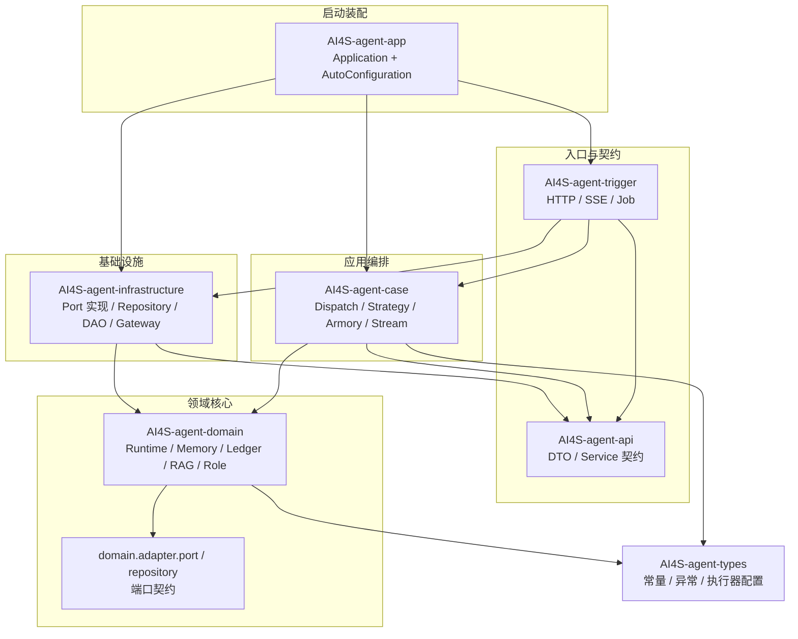
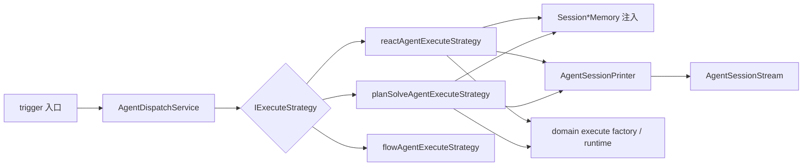
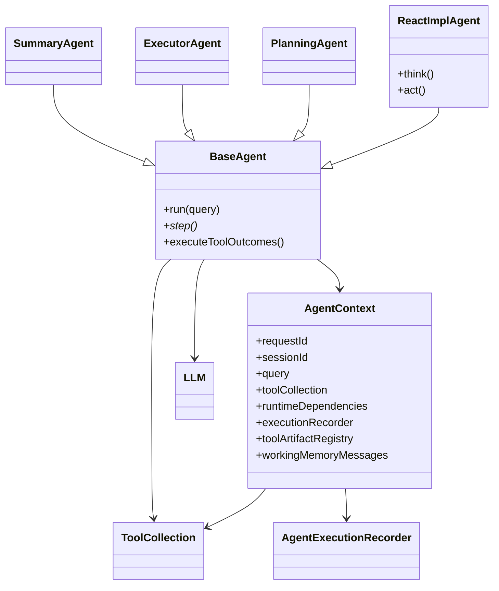
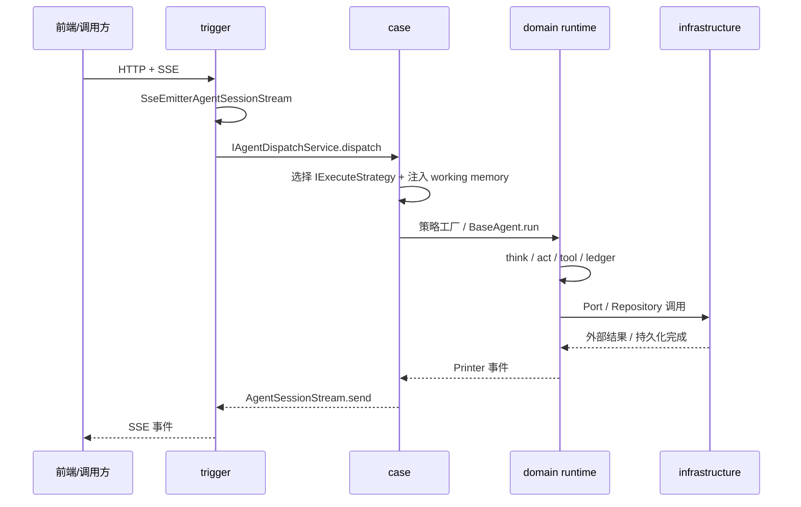

本文聚焦 AI4S-agent 的 **Maven 多模块分层** 与各模块边界：谁对外暴露契约、谁编排用例、谁承载 Agent 内核、谁适配基础设施。读完后，你应能在代码导航时快速判断“改协议去 trigger、改策略去 case、改主循环去 domain、改 SQL/HTTP 去 infrastructure”。

## 架构总览：分层与依赖方向

AI4S-agent 后端以 DDD 分层思想拆成 7 个 Maven 模块，再由 `AI4S-agent-app` 作为 Spring Boot 启动与 Bean 装配入口。根 `pom.xml` 以 `packaging=pom` 聚合这些模块，并统一 Java 17 与 Spring Boot 3.4.3 基线。

Sources: [pom.xml](pom.xml#L10-L18)

**依赖方向是架构的第一约束**：下层不得依赖上层；跨层协作优先走接口/端口，而不是直接引用实现类。

从上图可见：`trigger` 把外部协议翻译成应用层调用；`case` 选择执行策略并适配流式输出；`domain` 持有 Agent 运行时语义与端口声明；`infrastructure` 实现端口并落库/出站；`app` 只做启动时机与依赖注入，不写业务编排。

Sources: [AI4S-agent-app/pom.xml](AI4S-agent-app/pom.xml#L140-L151) · [AI4S-agent-case/pom.xml](AI4S-agent-case/pom.xml#L25-L36) · [AI4S-agent-domain/pom.xml](AI4S-agent-domain/pom.xml#L145-L149) · [AI4S-agent-infrastructure/pom.xml](AI4S-agent-infrastructure/pom.xml#L34-L42) · [AI4S-agent-trigger/pom.xml](AI4S-agent-trigger/pom.xml#L35-L50)

## 模块职责对照表

| 模块 | 层级定位 | 主要包根 | 允许依赖 | 禁止事项 |
|------|----------|----------|----------|----------|
| `AI4S-agent-types` | 基础类型 | `org.wwz.ai.types` | 仅通用库 | 业务编排、DAO、Controller |
| `AI4S-agent-api` | 契约层 | `org.wwz.ai.api` | validation / spring-webmvc | 领域实现、持久化 |
| `AI4S-agent-trigger` | 入口适配 | `org.wwz.ai.trigger` | api / case / types / infrastructure | 直接写 Agent 主循环 |
| `AI4S-agent-case` | 应用编排 | `org.wwz.ai.application.agent` | api / domain / types | HTTP 协议细节、SQL |
| `AI4S-agent-domain` | 领域核心 | `org.wwz.ai.domain.agent` | types | 直接依赖 DAO / SSE 实现 |
| `AI4S-agent-infrastructure` | 基础设施 | `org.wwz.ai.infrastructure` | domain / api | 对外 HTTP Controller 编排 |
| `AI4S-agent-app` | 启动装配 | `org.wwz.ai` / `config` | case / trigger / infrastructure | 业务策略实现 |

Sources: [pom.xml](pom.xml#L10-L18) · [AI4S-agent-case/src/main/java/org/wwz/ai/application/agent/package-info.java](AI4S-agent-case/src/main/java/org/wwz/ai/application/agent/package-info.java#L1-L5) · [AI4S-agent-domain/src/main/java/org/wwz/ai/domain/agent/adapter/package-info.java](AI4S-agent-domain/src/main/java/org/wwz/ai/domain/agent/adapter/package-info.java#L1-L4)

## AI4S-agent-types：横切基础类型

`types` 是最底层共享模块，集中放置全局常量、统一响应码、业务/应用异常，以及 Agent 执行器命名与配置属性。它不表达业务用例，只提供各层可安全复用的“词汇表”。

Sources: [AI4S-agent-types/pom.xml](AI4S-agent-types/pom.xml#L1-L40)

典型内容包括：

- `Constants`：通用分隔符等常量
- `ResponseCode`：统一响应码枚举
- `AppException` / `BizException`：异常基线
- `AgentExecutorNames`：`dispatch` / `llm` / `task` / `tool` / `heartbeat` 等命名执行器常量
- `AgentExecutorProperties`、`VisitorRequestContext`：执行器与访客上下文配置

Sources: [AI4S-agent-types/src/main/java/org/wwz/ai/types/common/Constants.java](AI4S-agent-types/src/main/java/org/wwz/ai/types/common/Constants.java#L1-L7) · [AI4S-agent-types/src/main/java/org/wwz/ai/types/enums/ResponseCode.java](AI4S-agent-types/src/main/java/org/wwz/ai/types/enums/ResponseCode.java#L1-L22) · [AI4S-agent-types/src/main/java/org/wwz/ai/types/agent/config/AgentExecutorNames.java](AI4S-agent-types/src/main/java/org/wwz/ai/types/agent/config/AgentExecutorNames.java#L1-L17)

**设计意图**：把“所有模块都要用、但不是业务语义”的内容下沉到 `types`，避免 domain/case 为了共享一个字符串常量互相反向依赖。

## AI4S-agent-api：对外契约与 DTO

`api` 定义服务接口与请求/响应 DTO，是后台管理与部分业务入口的契约面。模块依赖刻意保持轻量：Lombok、Jakarta Validation、Spring WebMVC 与 Tomcat API，不引入 domain/infrastructure。

Sources: [AI4S-agent-api/pom.xml](AI4S-agent-api/pom.xml#L14-L32) · [AI4S-agent-api/src/main/java/org/wwz/ai/api/package-info.java](AI4S-agent-api/src/main/java/org/wwz/ai/api/package-info.java#L1-L4)

核心接口族大致分为：

| 契约接口 | 职责摘要 |
|----------|----------|
| `IAiAgentService` | 智能体/API 装配与可用 Agent 查询 |
| `IAiClient*AdminService` | Client / Model / Prompt / Advisor / RAG 等后台管理 |
| `IAiClientToolMcpAdminService` | MCP 配置管理 |
| `IAdminUserAdminService` 等 | 管理端用户与统计 |

Sources: [AI4S-agent-api/src/main/java/org/wwz/ai/api/IAiAgentService.java](AI4S-agent-api/src/main/java/org/wwz/ai/api/IAiAgentService.java#L14-L35)

DTO 目录承载 `AutoAgentRequestDTO`、`ArmoryAgentRequestDTO`、各类 Admin Request/Response，以及统一 `response.Response`。**契约层的价值**在于：Controller 与实现解耦，后台能力可被 trigger 实现、被 app 装配，而不把领域对象直接暴露给 HTTP 边界。

Sources: [AI4S-agent-api/src/main/java/org/wwz/ai/api/dto](AI4S-agent-api/src/main/java/org/wwz/ai/api/dto)

## AI4S-agent-trigger：入口适配层

`trigger` 负责把外部世界（HTTP、SSE、定时任务）翻译成应用层可理解的调用。包结构按入口形态划分：`http`、`job`、`listener`、`config`。

Sources: [AI4S-agent-trigger/pom.xml](AI4S-agent-trigger/pom.xml#L14-L50) · [AI4S-agent-trigger/src/main/java/org/wwz/ai/trigger/http/package-info.java](AI4S-agent-trigger/src/main/java/org/wwz/ai/trigger/http/package-info.java#L1-L4)

### HTTP 入口分区

| 子包 | 代表 Controller | 职责 |
|------|-----------------|------|
| `http.ai4s` | `AI4SController` | AutoAgent SSE 主对话、探活、增量查询 |
| `http.agent` | `AgentFileController`、`AgentConversationHistoryController`、`AgentRunController` 等 | 会话文件、历史、停止、角色库、图像生成等周边 API |
| `http.admin` | `AiClientToolMcpAdminController` 等 | 管理端 CRUD / 装配入口 |
| `http.dataagent` | DataAgent 相关入口 | 数据问答入口适配 |
| `http.visitor` | 访客相关入口 | 访客身份与会话边界 |

Sources: [AI4S-agent-trigger/src/main/java/org/wwz/ai/trigger/http/ai4s/AI4SController.java](AI4S-agent-trigger/src/main/java/org/wwz/ai/trigger/http/ai4s/AI4SController.java#L42-L120)

`AI4SController` 的职责边界非常清晰：校验/解析 `visitorId`、确保会话可访问、创建 `SseEmitter`、注册心跳与生命周期回调，然后把真正的调度交给 `IAgentDispatchService`。它不实现 ReAct/PlanSolve 主循环。

Sources: [AI4S-agent-trigger/src/main/java/org/wwz/ai/trigger/http/ai4s/AI4SController.java](AI4S-agent-trigger/src/main/java/org/wwz/ai/trigger/http/ai4s/AI4SController.java#L70-L120)

### 协议适配：SSE → 应用层流端口

`SseEmitterAgentSessionStream` 把 Spring `SseEmitter` 封装为 `AgentSessionStream`：负责 `send` / `complete` / 客户端断开检测与 abort 回调。这样 case/domain 只依赖“可写流”，不依赖 SSE API。

Sources: [AI4S-agent-trigger/src/main/java/org/wwz/ai/trigger/http/ai4s/support/SseEmitterAgentSessionStream.java](AI4S-agent-trigger/src/main/java/org/wwz/ai/trigger/http/ai4s/support/SseEmitterAgentSessionStream.java#L11-L45)

### Job 入口

`trigger.job` 提供定时任务入口（如 `AgentTaskJob`），用于调度型 Agent 任务触发，与 HTTP 入口并列，共享同一套应用编排能力。

Sources: [AI4S-agent-trigger/src/main/java/org/wwz/ai/trigger/job/package-info.java](AI4S-agent-trigger/src/main/java/org/wwz/ai/trigger/job/package-info.java#L1-L4)

## AI4S-agent-case：应用编排层

`case` 是 **用例编排 seam**。包级注释明确要求：Trigger 必须优先依赖本层，而不是直接依赖 `domain/service` 根接口。

Sources: [AI4S-agent-case/src/main/java/org/wwz/ai/application/agent/package-info.java](AI4S-agent-case/src/main/java/org/wwz/ai/application/agent/package-info.java#L1-L5)

### 核心编排能力

| 子包 | 代表类型 | 职责 |
|------|----------|------|
| `dispatch` | `AgentDispatchService` | 按 `agentType` 路由到 ReAct / PlanSolve / Flow 策略 |
| `execute.*` | `ReactAgentExecuteStrategy` 等 | 注入工作记忆、绑定取消注册、调用 domain 策略工厂 |
| `stream` | `AgentSessionStream` / `AgentSessionPrinter` | 应用层输出端口与 Printer 适配 |
| `armory` | `AgentArmoryApplicationService` | 智能体能力装配编排 |
| `task` | `AgentTaskApplicationService` | 任务编排 |
| `run` | `AgentRunStopApplicationService` | 运行停止 |
| `dataquery` / `role` / `subagent` / `visitor` 等 | 各 ApplicationService | 周边用例 seam |

Sources: [AI4S-agent-case/src/main/java/org/wwz/ai/application/agent/dispatch/AgentDispatchService.java](AI4S-agent-case/src/main/java/org/wwz/ai/application/agent/dispatch/AgentDispatchService.java#L14-L49) · [AI4S-agent-case/src/main/java/org/wwz/ai/application/agent/execute/IExecuteStrategy.java](AI4S-agent-case/src/main/java/org/wwz/ai/application/agent/execute/IExecuteStrategy.java#L1-L13)

### 调度与策略选择

`AgentDispatchService` 读取 `AgentRequest.agentType`，映射到 Spring Bean 名：

- `WORKFLOW` → `flowAgentExecuteStrategy`
- `PLAN_SOLVE` → `planSolveAgentExecuteStrategy`
- `REACT` 或缺省 → `reactAgentExecuteStrategy`

策略不存在时抛 `BizException`。这保证了“入口协议”与“执行内核”之间有稳定的应用层路由点。

Sources: [AI4S-agent-case/src/main/java/org/wwz/ai/application/agent/dispatch/AgentDispatchService.java](AI4S-agent-case/src/main/java/org/wwz/ai/application/agent/dispatch/AgentDispatchService.java#L26-L49)

### 策略实现的边界

以 `ReactAgentExecuteStrategy` 为例，case 层只做三件事：

1. **工作记忆 enrich**：从 `SessionWorkingMemoryService` 加载，必要时回退 ledger hydrate，再做上下文压缩
2. **输出适配**：用 `AgentSessionPrinter` 包装 `AgentSessionStream`
3. **调用 domain 策略工厂**：`DefaultReactAgentExecuteStrategyFactory.armoryStrategyHandler().apply(...)`，并在 finally 中结束 run 注册

真正的 think/act 主循环仍在 domain runtime。

Sources: [AI4S-agent-case/src/main/java/org/wwz/ai/application/agent/execute/react/ReactAgentExecuteStrategy.java](AI4S-agent-case/src/main/java/org/wwz/ai/application/agent/execute/react/ReactAgentExecuteStrategy.java#L25-L100)

`AgentSessionStream` 继承 domain 端口 `AgentMessageStream`，使应用层输出可被 SSE/WebSocket 等多协议复用；`AgentSessionPrinter` 则把 runtime 的 `Printer` 事件翻译为统一 `AgentResponse` 协议。

Sources: [AI4S-agent-case/src/main/java/org/wwz/ai/application/agent/stream/AgentSessionStream.java](AI4S-agent-case/src/main/java/org/wwz/ai/application/agent/stream/AgentSessionStream.java#L1-L10) · [AI4S-agent-case/src/main/java/org/wwz/ai/application/agent/stream/AgentSessionPrinter.java](AI4S-agent-case/src/main/java/org/wwz/ai/application/agent/stream/AgentSessionPrinter.java#L18-L40)

### 装配编排

`AgentArmoryApplicationService` 查询可用 Agent 与 client 流程配置，组装 `ArmoryCommandEntity`，再交给 domain 的 `DefaultArmoryStrategyFactory` 执行。app 层的自动配置只在启动时调用该应用服务，不直接拼装领域节点。

Sources: [AI4S-agent-case/src/main/java/org/wwz/ai/application/agent/armory/AgentArmoryApplicationService.java](AI4S-agent-case/src/main/java/org/wwz/ai/application/agent/armory/AgentArmoryApplicationService.java#L21-L62) · [AI4S-agent-app/src/main/java/org/wwz/ai/config/AiAgentAutoConfiguration.java](AI4S-agent-app/src/main/java/org/wwz/ai/config/AiAgentAutoConfiguration.java#L16-L48)

## AI4S-agent-domain：领域核心与运行时内核

`domain` 是 Agent 平台的语义中心。它依赖 `types` 与 Spring AI / MCP 等运行时能力库，**不依赖** case/trigger/infrastructure，从而保持领域可测试与可替换基础设施。

Sources: [AI4S-agent-domain/pom.xml](AI4S-agent-domain/pom.xml#L145-L149)

### 子域地图

| 子域包 | 包级职责（代码自述） | 关键类型 |
|--------|----------------------|----------|
| `runtime` | 运行时上下文、主循环、工具调度；不承载 HTTP/SSE | `AgentContext`、`BaseAgent`、`ReactImplAgent`、`PlanningAgent`、`ToolCollection` |
| `memory` | 会话记忆、上下文压缩、历史摘要 | `SessionWorkingMemoryService`、`SessionContextCompactionService` |
| `ledger` | 执行账本、历史回放、tool-output 聚合 | `AgentExecutionRecorder`、`ExecutionLedgerRunSupport` |
| `rag` | 知识检索、schema/table/SOP recall | `SopRecallService`、`DataAgentQueryService` |
| `role` | 角色治理与查询 | `FixRoleService` |
| `adapter.port` | 外部能力端口契约 | `RemoteHttpPort`、`FileArtifactPort`、`RemoteStreamPort` |
| `adapter.repository` | 仓储端口契约 | `IAgentRepository` 等 |
| `service` | 历史兼容目录（迁移中） | execute/armory 策略节点与工厂 |

Sources: [AI4S-agent-domain/src/main/java/org/wwz/ai/domain/agent/runtime/package-info.java](AI4S-agent-domain/src/main/java/org/wwz/ai/domain/agent/runtime/package-info.java#L1-L5) · [AI4S-agent-domain/src/main/java/org/wwz/ai/domain/agent/memory/package-info.java](AI4S-agent-domain/src/main/java/org/wwz/ai/domain/agent/memory/package-info.java#L1-L4) · [AI4S-agent-domain/src/main/java/org/wwz/ai/domain/agent/ledger/package-info.java](AI4S-agent-domain/src/main/java/org/wwz/ai/domain/agent/ledger/package-info.java#L1-L4) · [AI4S-agent-domain/src/main/java/org/wwz/ai/domain/agent/rag/package-info.java](AI4S-agent-domain/src/main/java/org/wwz/ai/domain/agent/rag/package-info.java#L1-L4) · [AI4S-agent-domain/src/main/java/org/wwz/ai/domain/agent/service/package-info.java](AI4S-agent-domain/src/main/java/org/wwz/ai/domain/agent/service/package-info.java#L1-L5)

### 运行时对象关系

`AgentContext` 是单次运行全链路数据载体：请求身份、工具集合、工作记忆、产物登记簿、账本写入器、Plan Mode / 取消状态等都挂在这里。模块间通过它传递“当前 run 的事实”，而不是到处传散装参数。

Sources: [AI4S-agent-domain/src/main/java/org/wwz/ai/domain/agent/runtime/agent/AgentContext.java](AI4S-agent-domain/src/main/java/org/wwz/ai/domain/agent/runtime/agent/AgentContext.java#L28-L60)

`BaseAgent` 固定执行骨架：初始化/预装 memory → 步进循环调用 `step()` → 统一工具执行、observation 写回、账本落库与 artifact 登记。`ReactImplAgent` 在此基础上实现 ReAct 的 `think`（LLM 选工具）与 `act`（执行工具并写 observation）。

Sources: [AI4S-agent-domain/src/main/java/org/wwz/ai/domain/agent/runtime/agent/BaseAgent.java](AI4S-agent-domain/src/main/java/org/wwz/ai/domain/agent/runtime/agent/BaseAgent.java#L40-L55) · [AI4S-agent-domain/src/main/java/org/wwz/ai/domain/agent/runtime/agent/ReactImplAgent.java](AI4S-agent-domain/src/main/java/org/wwz/ai/domain/agent/runtime/agent/ReactImplAgent.java#L1-L40)

### 端口（Port）与仓储契约

domain 通过 `adapter` 声明“需要外部世界做什么”，不声明“怎么做”：

- **Port**：远端 HTTP/SSE、文件产物、数据查询执行与元数据
- **Repository**：Agent 配置、访客、子智能体定义、执行账本读写等

包注释强制：禁止在 domain 直接暴露 DAO / Mapper / SQL。

Sources: [AI4S-agent-domain/src/main/java/org/wwz/ai/domain/agent/adapter/port/package-info.java](AI4S-agent-domain/src/main/java/org/wwz/ai/domain/agent/adapter/port/package-info.java#L1-L4) · [AI4S-agent-domain/src/main/java/org/wwz/ai/domain/agent/adapter/repository/package-info.java](AI4S-agent-domain/src/main/java/org/wwz/ai/domain/agent/adapter/repository/package-info.java#L1-L4) · [AI4S-agent-domain/src/main/java/org/wwz/ai/domain/agent/adapter/repository/IAgentRepository.java](AI4S-agent-domain/src/main/java/org/wwz/ai/domain/agent/adapter/repository/IAgentRepository.java#L9-L20)

### 工具与能力在 domain 的归属

`runtime.tool` 下包含工具集合、MCP runtime、Skill、workspace 工具，以及 DeepSearch / CodeInterpreter / Report / WebFetch 等 common 工具实现入口。它们属于 **领域可调用能力**，具体出站网络或 Python 运行时细节再通过 Port/Gateway 下沉。

Sources: [AI4S-agent-domain/src/main/java/org/wwz/ai/domain/agent/runtime/tool/common](AI4S-agent-domain/src/main/java/org/wwz/ai/domain/agent/runtime/tool/common) · [AI4S-agent-domain/src/main/java/org/wwz/ai/domain/agent/runtime/tool/factory/AgentToolCollectionFactory.java](AI4S-agent-domain/src/main/java/org/wwz/ai/domain/agent/runtime/tool/factory/AgentToolCollectionFactory.java)

> 说明：`domain.service` 目录被标注为“历史兼容、迁移中”；新的应用编排入口应落在 case。阅读旧代码时把它视为 domain 内部策略节点库，而不是新功能默认落点。

Sources: [AI4S-agent-domain/src/main/java/org/wwz/ai/domain/agent/service/package-info.java](AI4S-agent-domain/src/main/java/org/wwz/ai/domain/agent/service/package-info.java#L1-L5) · [AI4S-agent-domain/src/main/java/org/wwz/ai/domain/agent/service/execute/package-info.java](AI4S-agent-domain/src/main/java/org/wwz/ai/domain/agent/service/execute/package-info.java#L1-L4)

## AI4S-agent-infrastructure：端口实现与技术细节

`infrastructure` 实现 domain 声明的端口与仓储，并容纳 DAO、Gateway、数据源方言、工具输出读写等技术细节。它依赖 domain（实现接口）与 api（部分契约协作），是“向外连接真实世界”的适配层。

Sources: [AI4S-agent-infrastructure/pom.xml](AI4S-agent-infrastructure/pom.xml#L14-L42)

### 结构分区

| 包 | 职责 | 示例 |
|----|------|------|
| `adapter.port` | 实现 domain Port | `OkHttpRemoteHttpAdapter`、`OkHttpRemoteStreamAdapter`、`AI4SToolFileArtifactAdapter` |
| `adapter.repository` | 实现 domain Repository | `AgentRepository`、`ExecutionLedgerWriteRepository` |
| `dao` / `dao.ai4s` | MyBatis/Mapper 与账本表访问 | `IAiAgentDao`、`IDialogueRunLedgerDao`、`IToolInvocationLedgerDao` |
| `gateway` | 文件、图像等出站网关 | `AI4SFileGateway` 等 |
| `dataquery` | JDBC 目录/方言/连接 | MySQL / H2 / ClickHouse 适配 |
| `tooloutput` | 工具结构化输出读写 | `ToolOutputWriterImpl` / `ReaderImpl` |

Sources: [AI4S-agent-infrastructure/src/main/java/org/wwz/ai/infrastructure/adapter/port/package-info.java](AI4S-agent-infrastructure/src/main/java/org/wwz/ai/infrastructure/adapter/port/package-info.java#L1-L4) · [AI4S-agent-infrastructure/src/main/java/org/wwz/ai/infrastructure/adapter/repository/package-info.java](AI4S-agent-infrastructure/src/main/java/org/wwz/ai/infrastructure/adapter/repository/package-info.java#L1-L4)

`AgentRepository` 典型地展示了该层工作方式：注入多个 DAO，把 PO 组装为 domain VO（Client/Model/MCP/Prompt/Agent 等），解析 MCP 的 SSE / STDIO / Streamable HTTP 传输配置，但不向上暴露 SQL。

Sources: [AI4S-agent-infrastructure/src/main/java/org/wwz/ai/infrastructure/adapter/repository/AgentRepository.java](AI4S-agent-infrastructure/src/main/java/org/wwz/ai/infrastructure/adapter/repository/AgentRepository.java#L20-L60)

账本相关 DAO（`IDialogueRunLedgerDao`、`IToolInvocationLedgerDao`、各类 `IToolOutput*Dao`、working memory 表）支撑 domain ledger/memory 的持久化语义，形成“领域记账 + 基础设施落库”的分工。

Sources: [AI4S-agent-infrastructure/src/main/java/org/wwz/ai/infrastructure/dao/ai4s](AI4S-agent-infrastructure/src/main/java/org/wwz/ai/infrastructure/dao/ai4s)

## AI4S-agent-app：启动与运行时装配

`app` 是可运行 JAR 的入口模块。`Application` 位于 `org.wwz.ai` 包根，以便扫描到其他 module 的组件；它自身几乎不写业务逻辑。

Sources: [AI4S-agent-app/src/main/java/org/wwz/ai/package-info.java](AI4S-agent-app/src/main/java/org/wwz/ai/package-info.java#L1-L4) · [AI4S-agent-app/src/main/java/org/wwz/ai/Application.java](AI4S-agent-app/src/main/java/org/wwz/ai/Application.java#L1-L16)

### 装配职责边界

| 配置类 | 做什么 | 不做什么 |
|--------|--------|----------|
| `AiAgentAutoConfiguration` | 启动完成后调用 `IArmoryService` 装配可用 Agent | 不在 app 内拼装 armory 节点链 |
| `AI4SRuntimeAutoConfiguration` | 把 LLM/MCP/Port/Executor 组装为 `AI4SRuntimeDependencies` | 不做执行编排或 Controller 适配 |
| `AgentExecutorConfiguration` / `ThreadPoolConfig` | 命名线程池与调度器 | 不决定 ReAct/Plan 策略 |
| `AiAgentSkillAutoConfiguration` / Workspace 配置 | Skill 与工作区属性绑定 | 不实现 Skill 执行语义 |
| `ReplayProjectorAutoConfiguration` | 历史回放投影 Bean 装配 | 不实现回放业务算法主体 |

Sources: [AI4S-agent-app/src/main/java/org/wwz/ai/config/AiAgentAutoConfiguration.java](AI4S-agent-app/src/main/java/org/wwz/ai/config/AiAgentAutoConfiguration.java#L16-L30) · [AI4S-agent-app/src/main/java/org/wwz/ai/config/ai4s/AI4SRuntimeAutoConfiguration.java](AI4S-agent-app/src/main/java/org/wwz/ai/config/ai4s/AI4SRuntimeAutoConfiguration.java#L28-L40)

`AI4SRuntimeAutoConfiguration` 的关键产物是 **typed runtime bundle**：domain 的 Agent/Tool/LLM 通过 `AgentContext.runtimeDependencies` 获取协作者，禁止运行时自行回查 Spring 容器。这强化了“领域内核可注入、可测试”的边界。

Sources: [AI4S-agent-app/src/main/java/org/wwz/ai/config/ai4s/AI4SRuntimeAutoConfiguration.java](AI4S-agent-app/src/main/java/org/wwz/ai/config/ai4s/AI4SRuntimeAutoConfiguration.java#L52-L80) · [AI4S-agent-domain/src/main/java/org/wwz/ai/domain/agent/runtime/agent/AgentContext.java](AI4S-agent-domain/src/main/java/org/wwz/ai/domain/agent/runtime/agent/AgentContext.java#L108-L115)

## 跨层协作模式：Port-Adapter + 应用 Seam

把分层落到一次主对话请求上，协作模式可概括为：

三条稳定性规则贯穿代码注释与实现：

1. **协议隔离**：SSE 只存在于 trigger；domain 只认识 `Printer` / 消息流端口  
2. **用例隔离**：dispatch/execute/armory 的对外 seam 在 case  
3. **技术隔离**：SQL、OkHttp、文件存储实现只在 infrastructure  

Sources: [AI4S-agent-trigger/src/main/java/org/wwz/ai/trigger/http/ai4s/support/SseEmitterAgentSessionStream.java](AI4S-agent-trigger/src/main/java/org/wwz/ai/trigger/http/ai4s/support/SseEmitterAgentSessionStream.java#L11-L16) · [AI4S-agent-case/src/main/java/org/wwz/ai/application/agent/package-info.java](AI4S-agent-case/src/main/java/org/wwz/ai/application/agent/package-info.java#L1-L5) · [AI4S-agent-domain/src/main/java/org/wwz/ai/domain/agent/adapter/port/package-info.java](AI4S-agent-domain/src/main/java/org/wwz/ai/domain/agent/adapter/port/package-info.java#L1-L4)

## 仓库内相关但不在本分层的组件

后端分层之外，仓库还包含前端与 Python 工具运行时，它们与 Java 分层协作但 **不属于 Maven 七模块依赖图**：

| 组件 | 角色 | 与分层的关系 |
|------|------|--------------|
| `ui/` | React 前端 | 调用 trigger 暴露的 HTTP/SSE |
| `ai4s-tool/` | Python 工具运行时 | 被 domain 工具/Port 间接调用，产物经文件/网关回传 |
| `runtime/skills` | Skill 资源目录 | 由 app Skill 配置与 domain Skill 体系加载 |

若要理解完整请求链路、ReAct/Plan-Execute 细节或工具扩展，请按下方导航继续阅读。

## 分层落地检查清单

在新增功能时，可用下表快速自检落点是否正确：

| 变更类型 | 应落模块 | 反模式 |
|----------|----------|--------|
| 新增 REST/SSE 字段适配 | trigger（+ 必要时 api DTO） | 在 domain 引用 `SseEmitter` |
| 新增执行模式路由 | case `dispatch` / `execute` | 在 Controller 里 `if-else` 调 Agent |
| 修改 think/act 主循环、工具并发 | domain `runtime` | 在 infrastructure 写 Agent 逻辑 |
| 新增外部 HTTP/DB 访问 | domain 先声明 Port/Repo，infrastructure 实现 | domain 直接 new OkHttp/DAO |
| 启动时装配 Bean/线程池 | app `config` | app 编写业务策略步骤 |
| 共享异常码/执行器名 | types | 在多个模块复制常量 |

## 下一步阅读

- 想顺着一次请求把调用栈走通：阅读 [端到端请求流转](10-duan-dao-duan-qing-qiu-liu-zhuan)
- 深入 ReAct 内核：阅读 [ReAct 执行链路](12-react-zhi-xing-lian-lu)
- 深入 Plan-Execute：阅读 [Plan-Execute 执行链路](13-plan-execute-zhi-xing-lian-lu)
- 关注工具与产物：阅读 [工具集合与产物登记](16-gong-ju-ji-he-yu-chan-wu-deng-ji)
- 关注账本与回放：阅读 [执行账本与历史回放](26-zhi-xing-zhang-ben-yu-li-shi-hui-fang)
- 关注前端 SSE：阅读 [SSE 流式对话与结果渲染](27-sse-liu-shi-dui-hua-yu-jie-guo-xuan-ran)