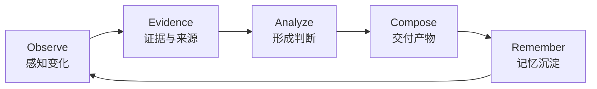
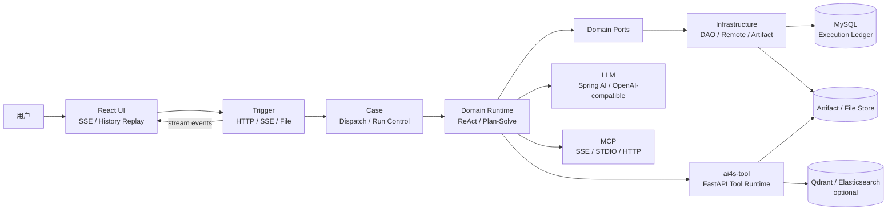

<p align="center">
  
</p>

<h1 align="center">AI4S 研判系统</h1>

<p align="center">
  <strong>让世界的变化进入你的工作流</strong>
</p>

<p align="center">
  一个面向全网研究与复杂数据分析的云端智能体，能在公开网络、YouTube、BiliBili、X、小红书、Hacker News上研究任何主题
</p>

<p align="center">
  
  
  
  
  
  
</p>

<p align="center"> ·
  <a href="#项目定位">项目定位</a> ·
  <a href="#落地案例展示">落地案例</a> ·
  <a href="#核心亮点">核心亮点</a> ·
  <a href="#系统架构">系统架构</a> ·
  <a href="#快速开始">快速开始</a> ·
  <a href="https://github.com/OWWZO/ai-agent">GitHub</a>
</p>

<p align="center"><em>工作台主页</em></p>
<p align="center">
  
</p>

<p align="center"><em>多 Agent 协作</em></p>
<p align="center">
  
</p>

<p align="center"><em>前端界面</em></p>
<p align="center">
  
</p>


- **全域采集**：调度多个智能体并行采集网页信息、Reddit 社区讨论、X 平台动态、YouTube 字幕内容、小红书互动数据，以及由真实资金与内幕信息定价的 Polymarket 预测赔率。
- **私有文档证据链**：通过多模态 RAG 解析用户私有的 PDF、Word、PPT 与图片，把公域情报与内部知识放进同一条证据链。
- **长期记忆**：沉淀偏好、关键事实与可复用流程，让下一次任务不必从头开始。
- **分析与交付**：结合 E2B 沙箱的代码执行能力与专属数据分析 Agent，完成数据清洗、交叉验证与深度分析，最终以 GenUI 交互画布和 PDF、Word、PPT、HTML 等多格式报告自动交付。

### 打破平台信息孤岛

当前主流搜索引擎与大模型均存在天然的信息边界，各大平台各自形成封闭的信息围墙，拥有独立的接口体系、鉴权机制与数据生态，没有任何一款 AI 产品能原生覆盖全部渠道：

| 产品 | 信息边界 |
| :--- | :--- |
| 谷歌搜索 | 无法穿透 Reddit 评论与 X 平台原生内容 |
| ChatGPT | 仅接入 Reddit 生态，缺失 X、TikTok 等平台数据 |
| Gemini | 可访问 YouTube 资源，却无法获取 Reddit 社区内容 |
| Claude | 原生不支持上述任一平台的实时检索 |
| Grok | 原生深度打通 X 平台实时数据，却无法原生覆盖 Reddit 等更多平台生态 |

而 AI4S 研判系统支持导入用户自定义密钥与浏览器会话凭证，打通全部平台数据源。它不止于跨平台全域检索，更能对多源信息进行交叉权重评分，过滤噪音与重复信息，精准提炼真正有价值的核心情报。

### 为何存在

AI4S 研判系统最初诞生于程序员群体的信息焦虑：在技术迭代日新月异的当下，Reddit、X 平台的极客社区始终站在行业最前沿，第一时间涌现最新的技术实践、工具拆解与方向讨论。但各大平台彼此割裂、各自形成封闭的围墙花园，零散的一手经验与技术动态散落在一座座信息孤岛上，没有单一入口可以高效聚合全域信息，我们很难及时、完整地捕捉全社区的原生技术情报，同步跟进最前沿的技术方向。

从解决自身的技术信息痛点出发，AI4S 研判系统逐步进化为一款通用全域情报工具，覆盖更多高价值决策场景：

1. **行业会议前**  
   一键梳理发言嘉宾的近期观点、公开言论与项目动态，一键聚合目标人物全平台真实动态：

   > Peter Steinberger加入OpenAI Codex团队、推动对抗Anthropic第三方智能体禁令、GitHub累计合并23个PR（合并率85%）、主导研发跨设备智能体控制系统LobsterOS。同时覆盖ClaudeCode社区热议：“自OpenClaw发布以来，业内都清楚绕开API运行迟早会被封禁”（获227赞）。

2. **出行规划前**  
   掌握目的地设施的实时运营状态与真实用户体验：

   > 鼓浪屿内厝澳老别墅片区修缮工程已启动但未对外公示、植物园南门网红扶梯扩容施工已进场、环岛路黄厝滨海观景台升级项目已获批暂未官宣；核心点位高峰平均排队时长（最美转角 72 分钟、雨林喷雾区 48 分钟）、钟鼓索道日落场一票难求引发本地游客不满、海上世界潮汐之眼摩天轮与海洋王国停业维护暂无明确复业时间。

3. **工具客观横向评测**  
   跳出过时博客的主观评价，实时拉取GitHub官方接口数据：

   > OpenClaw为执行层（35.1万Star，活跃运营）、Hermes为自优化大脑层（3.1万Star）、Paperclip为组织架构层（4.9万Star）——三者并非竞品，而是分层关系。输出并排对比表格，覆盖架构设计、内存机制、安全特性、适用场景等维度，同时收录社区高赞观点：@IMJustinBrooke评价“OpenClaw是小火龙，Hermes是喷火龙”。

4. **话题爆发前**  
   在话题达到顶峰前找到它。扫描 Reddit 分类列表、Hacker News 首页/热门故事、Digg 的 AI 1000 资讯流以及 X 平台，由智能体完成提名筛选并给出可开写的切入点：

   > 对提名内容做名称校验、垃圾信息过滤与内容价值判断，并撰写小红书/ X 平台文章的切入点。随后输出 5–10 个按热度排序的话题；每个结果都包含跨平台数据、热度标签，以及可直接执行的内容切入点。

当你和一位 企业CEO 对坐会谈时，你是否读完了他近 30 天的所有公开推文、播客实录与社区讨论？  
**AI4S 研判系统已经帮你读完了。**

### 信息来源

| 信息渠道 | 你能拿到什么 |
| :--- | :--- |
| **Reddit** | 高赞热门评论与公开社区讨论；支持 RSS 无密钥接入，提供谷歌搜索触达不到的真实用户观点与社区声量 |
| **Twitter** | 行业一线观点、专业讨论与突发动态；第一时间捕捉社区最即时的反应、争议与风向变化 |
| **YouTube** | 长视频深度解析与评论；基于完整字幕稿提炼核心观点与关键引用 |
| **Hacker News** | 全球开发者技术共识；基于积分与评论热度筛选核心议题，呈现真正的讨论焦点与技术判断 |
| **RSS** | 全球媒体与垂直站点公开订阅源，实时同步内容更新 |
| **Bilibili** | 中文视频社区的观点、字幕与反馈，捕捉本土用户真实体验与讨论风向 |
| **小红书** | 公开笔记与互动数据：种草测评、体验反馈与口碑讨论，捕捉本土消费风向与产品真实评价 |
| **雪球** | 投资社区深度讨论，实时反映市场情绪与上市公司基本面，呈现真金白银的市场判断 |
| **V2EX** | 国内开发者、创业者与技术从业者的一手交流：实战经验、行业观察与真实痛点 |
| **GitHub** | 开源全链路动态：Issue、PR、版本发布与开发者活跃度，还原技术演进的真实进度 |
| **LinkedIn** | 职场公开信息与企业官方动态：职业资料、人事变动与经营动作，捕捉企业发展的关键信号 |
| **Telegram** | 公开频道实时更新、官方公告与前沿社区讨论，跟进快速迭代的小众圈子与项目动态 |
| **Stack Exchange** | 专业问答社区的专家解答与高票方案，沉淀高频技术问题的成熟解法与实践经验 |


## 落地案例展示

*使用模型：gpt5.6-luna-high*

### 一、全网研究

#### 1. 社媒内容调研

账号拆解、爆款内容分析、数据复盘和评论区观察。  
**[查看小红书策略研究报告](https://www.owwzo.cloud/tool/v1/file_tool/preview/session-1788916247308-7652/%E5%A6%82%E4%BD%95%E5%9C%A8%E5%B0%8F%E7%BA%A2%E4%B9%A6%E5%81%9AAI%E7%9B%B8%E5%85%B3%E7%88%86%E6%AC%BE%E8%87%AA%E5%AA%92%E4%BD%93%E8%B4%A6%E5%8F%B7%E7%A0%94%E7%A9%B6%E6%8A%A5%E5%91%8A.html)**

<p align="center">
  
</p>

#### 2. 热点舆论事件分析

结合推特、YouTube、Reddit、BiliBili、小红书、微博等多方信源交叉核实、事实分档（有证据 / 单方说法 / 谣言）、时间线还原、舆论情绪分析。  
**[查看火海中的49秒的报告](https://www.owwzo.cloud/tool/v1/file_tool/preview/session-1788931844041-1436/chinagt-shanghai-fire-report/index.html)**

<p align="center">
  
</p>

#### 3. 竞品研究

功能拆解、用户口碑采集和多维度竞品对比。  
**[查看笔记软件竞品分析报告](https://www.owwzo.cloud/tool/v1/file_tool/preview/session-1788852138190-6315/index.html)**

<p align="center">
  
</p>

#### 4. 自媒体平台内容聚合

收集多个平台的旅游攻略，整理旅游路线和踩坑点。  
**[查看厦门旅游规划](https://www.owwzo.cloud/tool/v1/file_tool/preview/session-1788785646953-112/xiamen-couple-map.html)**

<p align="center">
  
</p>

### 二、数据分析

#### 1. 结构化数据分析

Text2SQL 智能取数 → CodeAct 数据分析 Agent → Canvas 画布展示。  
**[查看大模型调用数据分析报告](https://www.owwzo.cloud/tool/v1/file_tool/preview/session-1788425650341-3137/api-log-analysis/index.html)**

<p align="center">
  
  
</p>

#### 2. 量化实证研究

数据获取、清洗、分区域对比、统计检验和可视化。

<p align="center">
  
</p>

#### 3. 投研分析（金融情报调研）

财报解读、行业格局梳理、竞品对标、多源信息综合。  
**[查看特斯拉投研报告](https://www.owwzo.cloud/tool/v1/file_tool/preview/session-1788509972407-7432/tesla%E6%8A%95%E7%A0%94%E6%8A%A5%E5%91%8A_2026-09-04.html)**

<p align="center">
  
</p>

#### 4. 量化回测

策略建模 → 历史数据回测 → 参数敏感性分析 → 风险指标计算。  
**[查看双均线择时策略回测报告](https://www.owwzo.cloud/tool/v1/file_tool/preview/session-1788784594786-3975/index_23_embedded.html)**

<p align="center">
  
</p>

### 三、设计与创意

<p align="center">
  
  
</p>

### 四、功能展示

#### 1. GenUI 交互式界面

<p align="center">
  
  
  
</p>

#### 2. Human In The Loop

<p align="center">
  
  
</p>

#### 3. 深度研究 / Agentic RAG

<p align="center">
  
  
</p>

#### 4. Text2SQL 智能问数界面

<p align="center">
  
  
</p>

## 项目核心抽象



1. **感知变化**：从公开互联网、用户授权的社交来源、私有知识库和业务数据库里收集一手材料，把正在发生的变化收进同一次研究。
2. **形成判断**：经交叉核验、知识库问答、NL2SQL 问数和沙箱代码执行，把原始材料变成带出处的证据和可复查的分析结果。
3. **交付产物**：把结论交成 GenUI 画布、图表、3D 场景或 PDF / Word / PPT / HTML，来源和执行记录跟着产物一起留下。
4. **记忆沉淀**：把用户偏好、重要事实、可复用流程沉淀为长期记忆，让下一次任务从已有积累继续，而不是从头开始。


## 核心亮点

### 1. Observe：深度研究、NL2SQL 与 RAG

AI4S 研判系统将“搜索”视为一个可以继续执行的研究过程，而不是一次关键词查询。

- **DeepResearch公域信息检索**：查询拆解、多轮 `extend/search/report` 阶段、并发检索、正文抓取、去重、摘要和 SSE 流式进度，支持 DuckDuckGo、Exa、Tavily、Brave、Grok/OpenAI-compatible 等搜索引擎。
- **私域媒体检索**：接入 RSS、GitHub、Reddit、Hacker News、Stack Exchange、V2EX、Twitter、Telegram、YouTube、B站、小红书、微博、雪球等授权或公开渠道，补齐搜索引擎拿不到的社区原生内容。
- **可溯源多模态RAG**：把私有 PDF、Word、PPT、Markdown、文本、图片和网页建成知识库，作为公网检索的补充。入库时解析、OCR、caption、切分，并写入文本向量、图片向量和 BM25；提问时先做查询规划与改写，再并发走语义、关键词、图文和页面召回，经 rerank 后带着原文片段生成回答。检索轮次、命中片段和来源可追溯，支持多轮补证。
- **NL2SQL**：用自然语言直接问业务数据库。Table RAG 先召回相关表结构与列值样例（Qdrant schema + Elasticsearch 列值），再经 query 改写、列过滤和推理生成 SQL 并执行，支持结果预览与流式思考过程。

### 2. Analyze：数据、代码与安全执行

- **CodeAct 数据分析 Agent**：按「生成代码 → 执行 → 观察结果 → 修正计划」循环完成清洗、统计、计算和可视化。
- **非结构化数据分析**：把检索到的网页、文档等公开内容送进 E2B 隔离沙箱，用 Python 做抽取、清洗、统计和可视化。

### 3. Compose：GenUI、画布与文档产物

- **GenUI**：模型生成受控的 UI Tree，使用增量 JSON Patch 演进画布状态，并由 React 按白名单组件渲染。
- **可视化组件**：图表、表格、卡片、流程、时间线、表单、HTML、图片、视频和交互式内容。
- **3D 展示**：内置 Three.js 场景和 `Model3D` 组件，可展示参数化几何、GLB/GLTF 模型和可交互的 3D 结果。
- **文档生成**：支持 PDF、DOCX、PPTX、HTML、Markdown、Excel 和图表等产物。
- **支持主题模板导入**：PDF/Word/PPT/HTML 渲染器共享命名主题和自定义主题配置。Agent 只负责输出内容 JSON，让 Renderer 根据预配置主题负责字体、颜色、布局和格式转换。
- **画布发布**：可将 HTML、PDF、Word、PPT等产物发布，用户可预览、下载。

### 4. Remember：长期记忆

跨会话积累拆成三类可调用能力，而不是把全部历史塞进 prompt。

- **语义记忆**：把用户偏好、稳定事实和策展笔记写入长期记忆（`user` / `curated`），后续每一轮自动注入；任务进度和一次性结果不进记忆。
- **情景记忆**：按需检索历史会话。支持跨会话发现、会话内搜索、锚定滚动和最近会话浏览，从工作记忆投影中找回压缩前的对话细节。
- **程序性记忆沉淀**：可复用流程写入 `runtime/skills/<name>/SKILL.md`，而不是写进 memory。Agent 用 `skill_tool` 按需加载手册，用 `workspace_*` 创建或修补 skill，或通过 Skill Creator 把一类任务沉淀成可重复执行的程序性记忆。

### 5. Tool：工具、Skill 与 MCP

工具不是一次性全塞进模型上下文，而是按需发现、按层扩展。

- **ToolSearch**：MCP 工具默认延迟加载，system 里只列工具名。Agent 先用 `ToolSearch` 按关键词或 `select:name` 激活完整 schema，再调用对应 MCP 工具，避免工具膨胀挤占上下文。
- **工具生态**：
  - **内置工具**：检索（`deepsearch`、`web_fetch`、`web_search`、Reddit/X/雪球）、知识库（`mragQuery`）、问数（`table_rag`、`nl2sql`）、代码与分析（`code_interpreter`、`data_analysis`、`dataprep`）、产物（`document_generate`、`slides_generate`、`chart_generator`、`image_generation`、`canvas`）、工作区（`workspace_*`）、记忆（`memory`、`session_search`）、协作（`Agent`、Task / Plan Mode、`AskUserQuestion`）。
  - **Skill Runtime**：从 `runtime/skills/<skill-name>/` 加载 `SKILL.md`、参考资料和脚本；支持目录扫描、脚本发现、会话物化、路径防护和超时控制。内置架构图、报告页、学霸笔记、PPT、前端设计等 skill，也可自行安装。
  - **MCP**：通过 Server Descriptor、Registry 和 Executor 发现外部工具，支持 SSE、STDIO 和 Streamable HTTP
  - **远程工具运行时**：`ai4s-tool` 基于 FastAPI 承载搜索、RAG、数据处理、文件服务、文档生成和代码执行等重型能力。


### 6. 协作与控制 Multi-Agent

AI4S 研判系统支持把一个复杂目标拆给多个职责明确的 Agent，并让主 Agent 继续推进。

- **同步子 Agent**：默认等待子任务结果，适合需要即时汇总的检索、分析和验证步骤。
- **异步后台 Agent**：设置 `run_in_background=true` 后，长任务在后台运行，主对话可以继续处理其他工作。
- **任务控制**：支持查询后台任务结果、停止任务、恢复观察和向运行中的 Agent 注入指导。
- **上下文隔离**：子 Agent 可以拥有独立的工具集合、memory scope 和会话工作区，避免无关工具和上下文相互污染。
- **协作通信**：父子 Agent 通过 session 级 mailbox 传递消息

### 7. Human-in-the-loop

Agent 不必在所有步骤上自动做决定。AI4S 研判系统在执行链路中提供可恢复的人机协作节点：

```text
生成计划 -> 等待审批 -> 执行任务 -> 遇到不确定性 -> 向用户提问 -> 继续执行
```

- 计划审批：`approve`、`reject`、`resume`、`cancel`
- 用户追问：`AskUserQuestion`、回答、恢复和取消
- 运行控制：停止 Run、断线后 `follow`、运行中注入新的指导
- 前端恢复：刷新或重新连接后恢复待审批、待回答和后台运行状态

### 8. 上下文压缩

长任务和长会话会自动进入上下文治理流程：

- 跨轮对话从工作记忆投影 hydrate，保留下一轮 LLM 所需的消息结构。
- 接近上下文预算时执行摘要压缩，保护任务目标、关键早期信息和最近工具结果。
- 支持 LLM 摘要、局部压缩、失败回退和 mid-run 压缩。
- 压缩前可以触发长期记忆 flush，压缩事件和输入输出快照可审计。

## 赞助商

<details open>
<summary>点击折叠</summary>

<table>
  <tbody>
    <tr>
      <td align="center" valign="middle" width="22%">
        
      </td>
      <td valign="middle">
        <a href="https://anysearch.com">AnySearch</a> 是面向 AI Agent 的搜索基础设施，支持通用网络、垂直领域、并行批量搜索与整页内容提取，可通过 Skill 或 CLI 接入多种智能体平台，帮助 Agent 高效获取网页信息。
      </td>
    </tr>
    <tr>
      <td align="center" valign="middle" width="22%">
        
      </td>
      <td valign="middle">
        <a href="https://adversal.ai/">Adversal</a> 是面向 AI Agent 的视频智能基础设施，提供异步长视频分析 MCP 服务，可将本地视频或公开链接处理为 Markdown 笔记与关键帧，接入 Claude Code、OpenCode、Cursor 等智能体工作流。
      </td>
    </tr>
  </tbody>
</table>

</details>

## 系统架构

### 异构多服务

AI4S 研判系统把实时 Agent 编排和重型工具执行拆开：Java 负责运行时、策略、会话、HITL 和执行账本；Python 负责搜索、RAG、数据处理、文档生成和代码沙箱；React 负责流式工作台、产物预览和 GenUI 渲染。三者通过 HTTP、SSE、MCP 和文件服务协作。



### 服务职责

| 服务 / 层 | 主要职责 | 典型能力 |
| --- | --- | --- |
| React Workbench | 实时交互与结果呈现 | SSE、对话、计划、后台任务、文件预览、GenUI、3D |
| Java Agent Runtime | Agent 生命周期和任务编排 | ReAct、Plan-Solve、Memory、HITL、Ledger |
| Python Tool Runtime | 重型工具和数据计算 | DeepSearch、MRAG、NL2SQL、CodeAct、文档生成 |
| E2B / Sandbox | 代码执行隔离边界 | 持久 kernel、工作区同步、超时、权限和产物采集 |
| MySQL / Artifact Store | 执行事实与文件引用 | Run、LLM、Tool、Artifact、结构化工具输出 |
| Qdrant / Elasticsearch | 可选检索基础设施 | 向量召回、表结构检索、列值召回和重排序 |

## 快速开始

### 环境要求

- JDK 21
- Maven 3.8+
- Node.js 18+ 与 pnpm
- Python 3.11+ 与 uv
- MySQL 8
- 一个 OpenAI-compatible LLM API
- Qdrant、Elasticsearch、图像模型、搜索服务和 E2B 沙箱均为可选能力

### 1. 获取代码

```bash
git clone https://github.com/OWWZO/ai-agent.git
cd ai-agent
```

### 2. 初始化数据库

创建与开发配置一致的数据库，并导入以下脚本。也可以使用自定义数据库名，但需要同步修改 `application-dev.yml` 中的连接地址。

```bash
mysql -u root -p -e "CREATE DATABASE IF NOT EXISTS \`ai-agent-station\` CHARACTER SET utf8mb4 COLLATE utf8mb4_unicode_ci"
mysql -u root -p ai-agent-station < AI4S-agent-app/src/main/resources/db/schema.sql
mysql -u root -p ai-agent-station < AI4S-agent-app/src/main/resources/db/data.sql
```

### 3. 启动 Python Tool Runtime

`ai4s-tool` 默认监听 `1601` 端口，负责远程工具、文件服务和部分 RAG 能力。

```bash
cd ai4s-tool
uv sync
cp .env_template .env
# 编辑 .env，至少配置 OPENAI_API_KEY 与 OPENAI_BASE_URL

# 首次启动初始化文件服务 SQLite 元数据（只需执行一次）
# 默认创建 ai4s-tool/autobots.db，并建立 FileInfo 表
uv run python -m ai4s_tool.db.db_engine

./start.sh
```

Windows PowerShell：

```powershell
cd ai4s-tool
uv sync
Copy-Item .env_template .env
# 编辑 .env 后执行
# 首次启动初始化文件服务 SQLite 元数据（只需执行一次）
# 默认创建 ai4s-tool\autobots.db，并建立 FileInfo 表
uv run python -m ai4s_tool.db.db_engine
.\start.ps1
```

`SQLITE_DB_PATH` 控制文件服务元数据库位置。默认值为 `autobots.db`，相对路径相对于 `ai4s-tool` 目录。该初始化命令使用 SQLModel 的 `FileInfo` 元数据幂等建表；修改路径后，请先在当前终端设置同名环境变量再执行命令。MRAG 使用的 `SQLITE_PATH` 由对应 Store 在首次使用时自动创建表。

如需导入已有 Hyper-Extract 图谱，在仓库根目录运行：

```powershell
.\scripts\import-hyper-snapshot.ps1 -ArchivePath 'D:\path\to\Hyper-Extract.zip'
```

脚本只提取 `ZN/GW` 图谱 JSON 到 `runtime/hyper-snapshot`，不会导入压缩包里的 `.env` 或虚拟环境。Python 服务会自动读取该快照；历史快照支持图谱浏览和搜索，实时扫描任务仍需单独运行兼容的 Hyper 服务。再次导入时加 `-Replace`，旧快照会保留为带时间戳的备份。

### 4. 启动 Java Backend

在新的终端回到仓库根目录：

```bash
mvn -pl AI4S-agent-app -am package '-Dmaven.test.skip=true'
java -jar AI4S-agent-app/target/AI4S-agent-app.jar
```

Backend 默认监听 `http://127.0.0.1:8100`。健康检查：

```bash
curl http://127.0.0.1:8100/web/health
```

### 5. 启动 React 工作台

```bash
cd ui
pnpm install
pnpm dev
```

打开 [http://localhost:3000](http://localhost:3000)。本地开发环境通过 `ui/.env` 中的 `SERVICE_BASE_URL` 连接 Java Backend。

### Docker Compose 部署

仓库根目录的 `Dockerfile` 与 `docker-compose.yml` 是当前唯一的容器部署入口，包含 MySQL、Java Backend、`ai4s-tool` API/sandbox 进程和 Nginx 前端反代。

```bash
cp ai4s-tool/.env_template ai4s-tool/.env
# 编辑 ai4s-tool/.env，至少填写 MySQL 密码、OPENAI_BASE_URL 和 OPENAI_API_KEY

docker compose --env-file ai4s-tool/.env build

# 首次创建 ai4s-data 卷后初始化文件服务 SQLite 元数据
# Compose 会将 SQLITE_DB_PATH 设置为 /data/autobots.db，并写入持久化卷
docker compose --env-file ai4s-tool/.env run --rm --no-deps --entrypoint python ai4s-tool -m ai4s_tool.db.db_engine

docker compose --env-file ai4s-tool/.env up -d
```

启动后访问 [http://localhost:3000](http://localhost:3000)，探活接口为 [http://localhost:3000/web/health](http://localhost:3000/web/health)。也可以从 `AI4S-agent-app` 目录执行 `./build.sh` 构建全部镜像。

Java 生产配置模板是 [`application-prod.yml`](AI4S-agent-app/src/main/resources/application-prod.yml)，以静态配置为主，已清除真实密钥和密码；部署者需要按实际环境填写空缺凭证和地址。MySQL 初始化脚本只会在首次创建 `mysql-data` 卷时执行；修改 `schema.sql` 或 `data.sql` 后需要按实际情况迁移已有数据库。

Compose 部署时，`WORKSPACE_ROOT` 应保持为 `/data/skilloutput`，Backend 与 `ai4s-tool` 会通过 `ai4s-data` 卷共享会话工作区和文件产物。

`ai4s-data` 卷保存 Python 文件服务的 `autobots.db`、MRAG SQLite 元数据和文件产物。

### 给 Coding Agent 的部署 Prompt

```text
你是本仓库的部署代理。请先阅读 README.md、CLAUDE.md 以及相关模块说明，默认使用源码部署，不要默认使用 Docker Compose；只有用户明确要求容器部署时才切换到 Docker。开始前检查 JDK 21、Maven 3.8+、MySQL 8、Python 3.11+、uv、Node.js 18+ 和 pnpm，检查 Git 工作区并保留用户已有改动，禁止 reset、checkout 或覆盖未提交文件。按照 README 的顺序配置并启动 MySQL、ai4s-tool、AI4S-agent-app 和 ui：没有 ai4s-tool/.env 时从 ai4s-tool/.env_template 创建，但不要覆盖已有 .env；首次启动执行 `uv run python -m ai4s_tool.db.db_engine` 初始化 autobots.db；创建或确认 MySQL 数据库后导入 db/schema.sql 和 db/data.sql；使用 application-prod.yml 作为无真实凭证的部署配置，保留源码部署所需的 127.0.0.1 服务地址，不要把 application-dev.yml 中的真实密钥复制到生产配置。只使用用户明确提供的 LLM、搜索、E2B、Qdrant、ES、OCR、对象存储和登录态凭证，绝不能猜测、生成或输出这些凭证；如果缺少 MySQL 密码、LLM_BASE_URL/OPENAI_BASE_URL、OPENAI_API_KEY、模型名或其他必需配置，停止启动并列出变量名、用途和示例格式。先启动 ai4s-tool，再用 `mvn -pl AI4S-agent-app -am package '-Dmaven.test.skip=true'` 构建并启动 Java Backend，最后在 ui 执行 `pnpm install` 和 `pnpm dev`。启动后检查 ai4s-tool、`http://127.0.0.1:8100/web/health` 和 `http://localhost:3000`，失败时读取日志并修复配置后重试。只有健康检查通过、SQLite 初始化完成且没有把敏感信息写入 README、日志或 Git 跟踪文件时，才报告部署成功；最后列出实际执行命令、访问地址、数据库和 SQLite 文件位置、仍未配置的可选能力以及需要用户后续处理的事项。不要修改业务代码或删除数据，除非用户明确授权。
```

